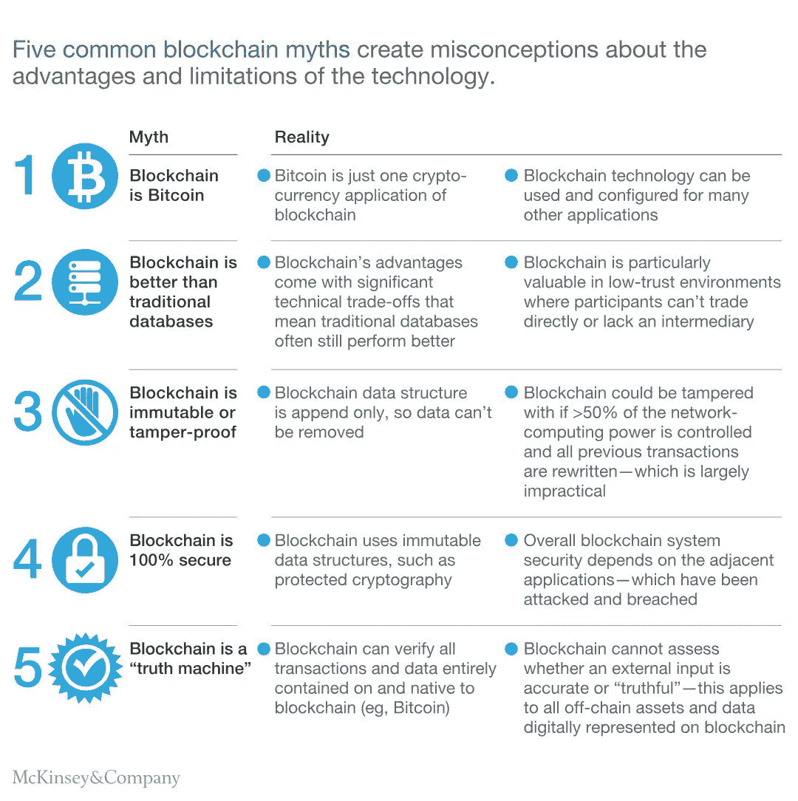

# 区块链和人工智能:这些趋势技术的未来如何？

> 原文：<https://medium.com/hackernoon/blockchain-and-ai-how-does-the-future-of-these-trending-technologies-look-f0367daa4496>

Photo by [Joshua Wilking](https://unsplash.com/photos/dcIZp8PiCNo?utm_source=unsplash&utm_medium=referral&utm_content=creditCopyText) on [Unsplash](https://unsplash.com/search/photos/technology-future?utm_source=unsplash&utm_medium=referral&utm_content=creditCopyText)

我相信我是有机会见证这一代技术进步的最幸运的人之一。一度看似不可能的想法正在变成现实，日常任务正在自动化，随着技术渗透到我们生活的各个角落，我们的日常生活变得越来越好。包括物联网、区块链和人工智能在内的突破性技术不断寻求新应用的发展。

自从我开始了解区块链，已经有一年半了。作为当今世界上最具革命性的技术之一，区块链已经在加密货币以外的多个应用领域证明了自己的成功，如供应链、医疗保健、金融科技、教育、[执法](https://finsof.net/blockchain)等。简而言之，区块链是一个分布式数据库或分类帐，它实时更新，并在任何公共或私有节点网络中共享。所有节点在任何时候都存储有一致的信息，这消除了任何类型的欺诈。

对于那些因为媒体的喧嚣和炒作而感到困惑的人来说，这里有一张由[麦肯锡](https://www.mckinsey.com)制作的惊人的信息图，它澄清了关于区块链的一些基本情况:

这是关于区块链的很多东西，现在让我们深入研究一下人工智能。人工智能在科技领域并不是一个新名字，在区块链成为焦点之前，它就已经在业内流行了。简单地说，人工智能是一种技术，它致力于使像计算机这样的机器像人一样工作或思考，并根据它们的分析做出决定。由于人工智能涉及深度学习和机器智能的方法，它在教育领域有着巨大的潜力[。](https://eaglesinvestors.com/2018/10/artificial-intelligence-education)

与人类不同，计算机没有自己的大脑，它们根据命令工作。人工智能背后的基本思想是，通过向这些机器提供庞大的数据集，为它们提供思维能力，使它们能够像人类一样执行任务，让我们的生活变得更加轻松。如果你曾经遇到过这些——Siri、谷歌助手或者 Alexa 你已经和一个人工智能遭遇过了。

区块链和人工智能都是显示出很高潜力和增长范围的技术，但实际应用仍处于起步阶段。尽管如此，结合使用这两种技术的许多用例以及可能的实现正在兴起。以下是一些最有趣的例子:

# 区块链和人工智能如何合作的 4 种方式

## 改进决策

人工智能通过让机器代表人类智能地工作，让人类的生活变得更加轻松。然而，由于该技术仍处于起步阶段，有时人工智能机器做出的决定并不完全清晰和可理解，因为它们是基于大量变量计算的。这些变量独立工作，以便根据它们从通过巨大数据集获得的信息中的学习来实现最佳结果。

人工智能的潜在应用之一是交易监控，因此，可以用于检测金融交易中欺诈的人工智能算法正在不断开发。由于这是一项要求高精度的复杂任务，因此由人工监控和审核其精度非常重要。然而，当审计过程回到人类时，数据篡改的风险很高。

这可以通过区块链解决。当区块链在这样的系统中实现时，整个审计过程变得简单多了。存储在链的每个块上的信息是绝对安全的，任何试图修改它的人都需要在整个区块链过程中进行更改，追溯到第一个块。实际上，这太复杂而无法实现，并且需要大量的计算能力。因此，数据在整个过程中将是高度安全的。

像这样的区块链和人工智能的组合系统的优点是，它给公众带来了更多的信心，因为单独的人工智能系统不太值得信任。区块链通过记录决策过程提供的透明度有助于获得急需的公众信任。

## 安全的个人体验

如今，许多企业都在处理高度敏感的个人数据，以便为客户提供最好的服务和产品。区块链技术已经证明了自己的安全性，因为它使用经过测试的加密技术来存储所有数据。因为区块链是存储敏感数据的理想选择，这些数据可以在人工智能的帮助下得到巧妙利用。

想象一个智能购物系统，为您提供与您的个性化选择相呼应的产品。此外，集成了区块链和人工智能的医疗保健系统可以根据病历和患者历史提供准确的分析。考虑到用户的隐私，新的人工智能算法正在建立，这些算法可以处理加密数据本身，因为未加密的数据很容易受到威胁。

简而言之，正如区块链用加密提供安全；人工智能有能力处理这些加密数据，并向用户提供更多隐私，以便公司使用他们的个人数据来改善他们在亚马逊和网飞等网站的体验。

## 加强经济

区块链可以帮助增加人工智能在世界上的采用，因为它提供加密货币支付，即使是没有银行账户的人也可以靠加密货币谋生。今天，许多国家都有经济壁垒，因此，他们的公民努力利用经济增长的优势。在包括技术和创造力在内的不同领域为发展而努力的人应该因为他们的才华而获得报酬。

这些为不同部门提供服务或研究的人可以以加密货币的形式赚钱，无论他们生活在哪个地区，都可以支付他们的真实价值。区块链有可能打破人工智能发展的现有障碍，以更低的成本带来更高的效率和更大的开放性。

## 提高技术效率

区块链技术无疑提供了更高水平的安全性和透明度，但为了在每个交易或区块中实现这一点，它使用了使用大量计算能力的数学计算。这方面的一个例子是挖掘(一种哈希算法)，用于挖掘流行的区块链比特币的区块。为了挖掘比特币区块链上的区块，采用了蛮力方法，这需要尝试所有字符组合，直到找到正确或可验证的组合。

尝试如此多的组合占用了大量的计算能力。由 AI 驱动的区块链可以通过使用机器学习以更好的方式解决问题来解决这个问题。有了正确的训练数据，机器学习算法在解决问题时会变得更好，因为它可以解决越来越多类似于人类的问题。

> 虽然区块链和人工智能都是单独建立的技术，但当它们结合在一起时，它们有可能超出我们的预期，并增强技术能力。作为一个团队，这些突破性的技术可以带来革命性的变化。