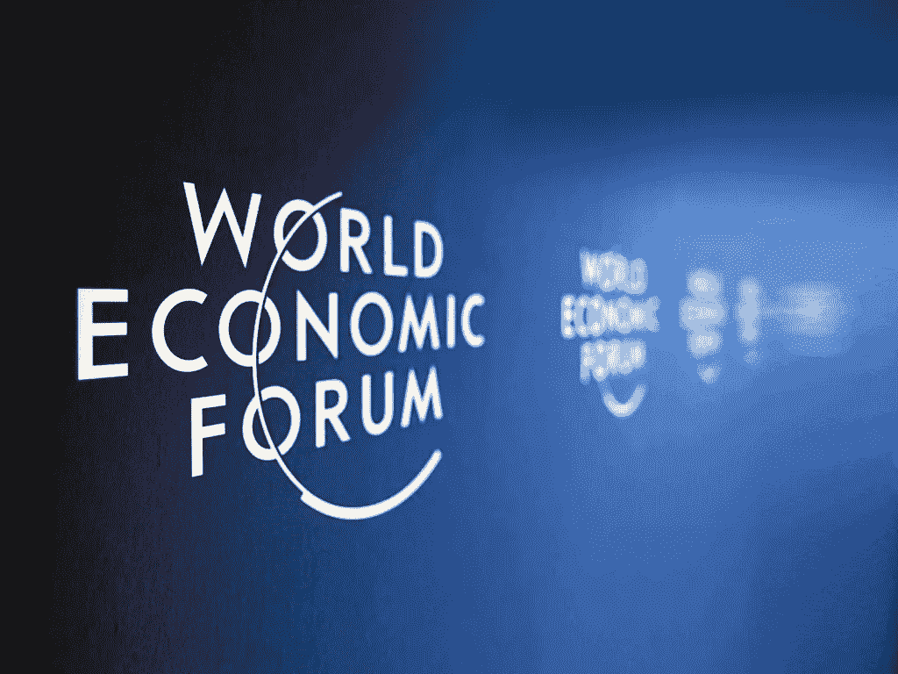
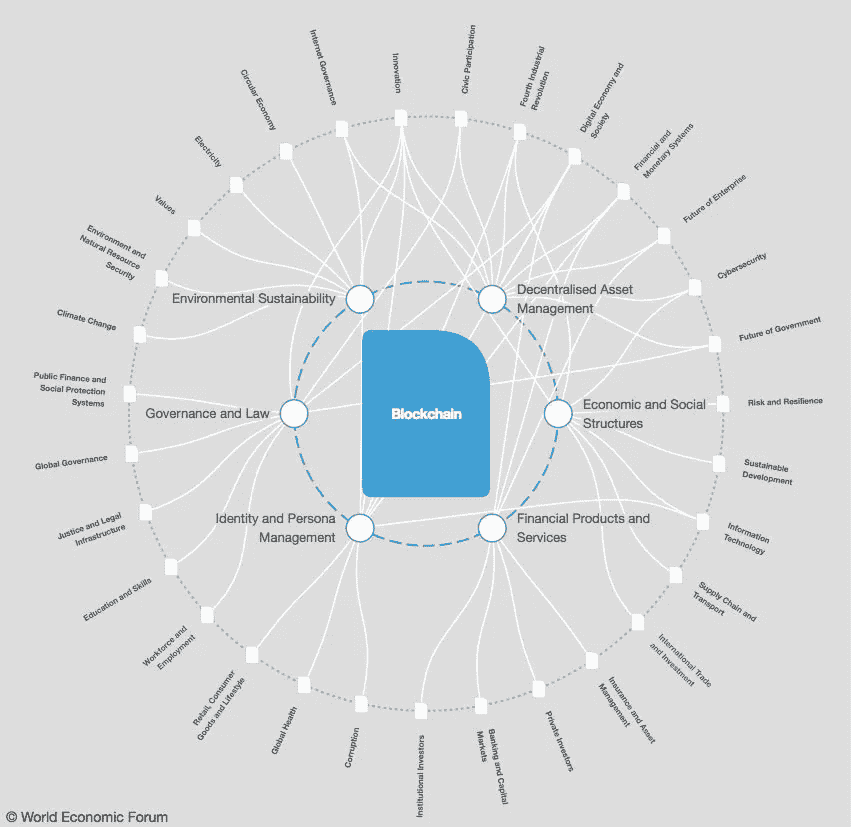

# 达沃斯的区块链和比特币

> 原文：<https://medium.com/hackernoon/blockchain-and-bitocin-at-davos-dfb5f277f39f>

## 世界领导人和首席执行官需要更加关注区块链和加密货币吗？

在瑞士达沃斯举行的第 48 届世界经济论坛年会期间，当美国消费者新闻与商业频道的玛利亚·巴蒂罗姆在一次特别采访中问及是否相信区块链[时，纳斯达克](http://www.foxbusiness.com/markets/2018/01/23/nasdaq-exploring-bitcoin-futures-but-sees-more-potential-in-blockchain-ceo-says.html)首席执行官 Adena Friedman 说道。

弗里德曼对区块链、比特币和其他加密货币进行了区分，他补充说，该交易所正处于推出比特币期货合约的“探索阶段”。

贝宝公司的首席运营官·比尔·雷迪也同意这一观点，并认为区块链技术具有更好的长期潜力，他向巴蒂罗姆解释道。

“作为一名工程师出身的人，比特币所依托的区块链技术是计算机科学的一项根本性突破，因此存在巨大的长期机会，”他说。

区块链正在达沃斯接受审查，至少有两场活动专注于区块链技术和加密货币——从一场题为“加密资产泡沫”的活动到其他几场关于数字经济和新兴技术的活动。

Friedman 所做的区分是更好理解达沃斯如何接近区块链的关键，因为大部分注意力都在比特币和其他加密货币上。

“世界上的大型金融机构正在努力应对一个加密货币困境:是袖手旁观并谴责一项许多人不信任但也害怕的技术——还是加入那些投资它的人，”[写道](https://www.ft.com/content/c0794556-ff50-11e7-9650-9c0ad2d7c5b5) [金融时报](https://medium.com/u/edb4c644ad37?source=post_page-----dfb5f277f39f--------------------------------)在一篇题为“区块链不能再被忽视”的文章中写道。

该报援引苏格兰皇家银行新兴技术主管理查德克鲁克(Richard Crook)的话称:“由于区块链的好处来自去中心化，在不改变商业模式的情况下，用一种技术取代另一种技术几乎没有意义。”

部分讨论也是关于法规的。

“我们不能否认事情正在发生变化，”荷兰国际集团首席创新官伯努瓦·勒格朗(Benoit Legrand)对英国《金融时报》表示。“未来 10 年，世界将把加密货币纳入我们的工作方式。但是需要规范。这绝对是关键。”

然而，据金融巨头称，仍有很多人保持沉默。

“瑞士联合银行(UBS)董事长阿克赛尔·韦伯在活动中表示，他的公司建议客户不要投资这些资产，”[该报报道](https://www.financemagnates.com/cryptocurrency/news/reluctant-acceptance-cryptocurrency-wef-meeting-davos/)。

诺贝尔经济学奖得主约瑟夫·斯蒂格利茨(Josef Stiglitz)似乎也不太喜欢加密货币，他警告瑞士和其他国家不要过于热情地接受加密货币，担心它们会被用于非法目的。

[在达沃斯接受彭博电视采访时，斯蒂格利茨解释说，比特币试图解决一个从未存在过的问题。](http://www.businessinsider.com/stiglitz-calls-for-regulating-bitcoin-which-he-says-would-kill-demand-2018-1)

“我们有一个很好的交易媒介，叫做美元:我们可以用它进行交易，”他说，并强调全球银行系统已经在向安全的数字支付迈进。“为什么人们想要比特币？为了保密。”

他补充说:“我的感觉是，当你对它进行监管，使你不能从事洗钱和所有这些事情时，就不会有对比特币的需求了。因此，通过监管滥用，你将监管它的存在。”

聚集在达沃斯的世界领导人表达了对区块链的兴趣。

法国总统[埃马纽埃尔·马克龙](https://medium.com/u/bb9cecbbf08d?source=post_page-----dfb5f277f39f--------------------------------)在达沃斯的演讲中虽然没有提到区块链，但明确表示“重大技术变革”是令国际社会感到恐惧的全球性挑战之一，因此需要更好的国际协调和辩论。

> 在今天的战略上，全世界都不合作！[在这个问题上，今天的全球战略是完全不合作的！]

在谈到比特币和加密货币激增带来的挑战时，Macrom 表示，当前的国际金融体系没有能力面对这些问题。

“我们必须在 20 国集团的框架内启动这一讨论，”他说，提到了 2018 年 20 国集团轮值主席国阿根廷总统毛里西奥·马克里的重要领导作用。

英国首相特里萨·梅在一次非常关注技术进步的未来及其创造的许多机会的演讲中表示，技术继续“为人类带来革命性的可能性，我们必须建立国际框架，以确保每个人都能从中受益。”

虽然从未提及区块链、比特币或加密货币，但她承认，“本周许多领导人正在为全球化、开放经济、自由贸易和技术进步辩护，同时努力确保这些对我们所有国家和所有人民公平运作。”

> 然而，对领导力的考验在于我们采取什么样的行动。

美国总统唐纳德·特朗普也参加了达沃斯世界经济论坛，他和白宫“对区块链货币和加密货币没有正式立场”，正如国土安全顾问汤姆·博塞特[在 2017 年 12 月的新闻发布会](https://www.whitehouse.gov/briefings-statements/press-briefing-on-the-attribution-of-the-wannacry-malware-attack-to-north-korea-121917/)上解释的那样，并补充说，它们显示出“巨大的希望和承诺”，但也存在“安全风险和担忧”

在达沃斯，特朗普会见了梅和以色列总理本雅明·内塔尼亚胡，据报道，他们没有讨论技术问题。

特别是内塔尼亚胡，他是区块链和比特币的大力支持者，甚至警告说[银行最终会消失](https://www.thestreet.com/story/14420899/1/bitcoin-could-make-banks-extinct-israel-pm-netanyahu-says.html)，可能是因为这项技术和加密货币的出现。

去年 12 月，他曾表示:“银行的命运是它们最终会消失吗？是的。答案是肯定的。它需要明天发生吗？还有我们需要通过比特币来做吗？这是一个问号。”