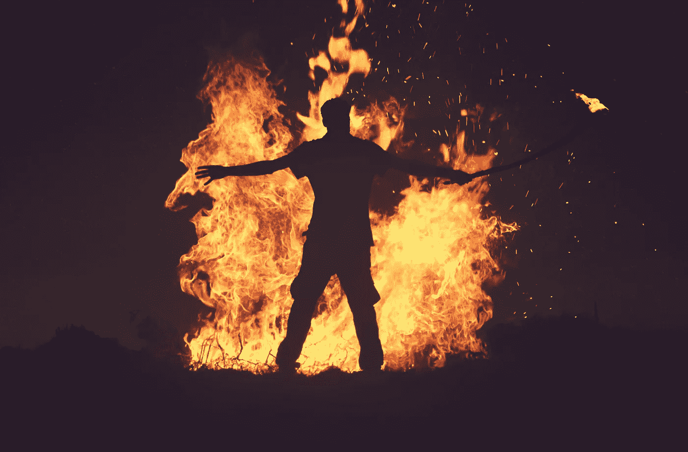
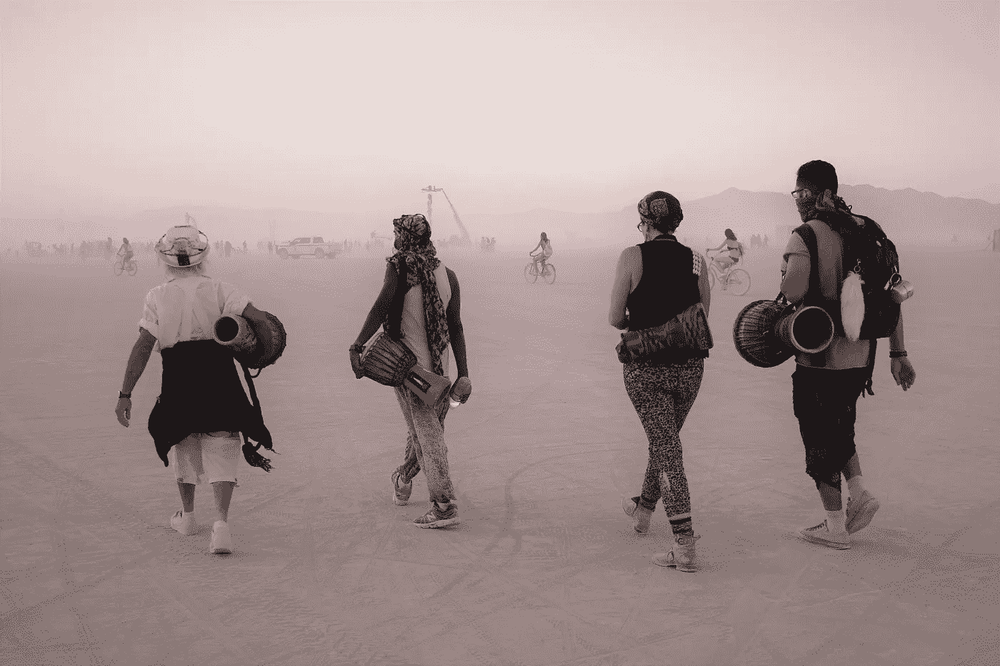

# 区块链和燃烧的人:通过社区和信任创造的催化剂

> 原文：<https://medium.com/hackernoon/blockchain-and-burning-man-catalysts-of-creativity-through-community-and-trust-eac9f0e6a804>

古印度精神文学、希腊古帕台农神庙和现代西方科技奇迹有什么共同点？当人类体验到一定程度的自由、团体感和信任感时，人类的创造力会不受限制地流动。这是共同的线索。在这篇文章中，我将描述区块链和燃烧人如何通过自由、社区和信任来培养创造力。

## 什么是区块链技术？

区块链技术实现了一个分散的点对点(P2P)网络，任何人都可以加入。每个节点，即网络上的计算机，维护分布式数据库上的全部信息，并且可以查看全部事务历史。

每个节点都有平等的权力，这导致了一个社区，而不是自上而下的命令和控制结构。在没有公共许可的区块链中，没有单一的中央管理员。

事务记录按块分组，这些块一个接一个地堆叠在其他块的顶部。强大的共识算法保护数据的神圣性。

权力下放鼓励社区精神，而透明和安全的网络有助于增进信任。难怪区块链技术正在改变世界，无论是在医疗保健领域还是在云存储领域。

## 什么是“火人节”？

拉里·哈维和约翰劳都是美国公民，他们在 1986 年创立了“火人节”。他们建造了一个 8 英尺高的男性木制雕像，并在那年的夏至在旧金山的海滩上焚烧。自发安排的活动立即吸引了一些热心者。

随着时间的推移，活动越来越多，由于法律限制在加州海滩焚烧雕像，节日转移到内华达州的黑石沙漠。从 1986 年的少数旁观者，为期一周的节日现在每年吸引来自不同背景的近 70，000 人到荒凉的沙漠。

节日志愿者完全依靠自己在沙漠中建造一座城市，安排许多艺术展览和其他文化活动。他们建造了一座巨大的雕像和一座寺庙，接待了成千上万的人，一周后他们就烧掉了雕像和寺庙。

参与者被称为“燃烧者”，认为燃烧仪式是周期性破坏和创造序列的象征，因此是神圣的。burner 社区展示了令人惊叹的社区感觉、开放性、合作性和创造性。节日过后，每个人都要清理整个地方，明年再集合，在那个荒凉的沙漠里建造他们的“黑岩城”。

这个社区已经发展了几十年，已经建立了一套 10 条规则，他们承诺遵守这些规则，但不强制执行。以下是一些规则示例:

1.  开放性；
2.  相互尊重和基于共识的社区行动:
3.  自愿努力；
4.  抵制他们节日的商业化；
5.  自力更生；
6.  自我表现；
7.  公民责任。

在他们的网站上阅读更多关于火人节的信息。

## 区块链和燃烧的人:相似之处丰富！

区块链和燃烧的人有很多相似之处。我来解释几个关键的，具体如下:

1.  崇高的目的；
2.  推动社区建设；
3.  开放性；
4.  强调自愿努力；
5.  强调“不变的核心”。

## 区块链和燃烧人都有一个崇高的目的

*“有*为什么*活着的人，几乎可以忍受任何*如何。”

这是已故德国哲学家弗里德里希·尼采的话。已故的“意义疗法”创始人、大屠杀幸存者维克多·埃米尔·弗兰克在他的著作《人类对意义的探索》中将这句话载入史册。阅读这本书，看看这些话是如何传达一个崇高目标的重要性的。

区块链爱好者希望通过该技术承诺的去中心化和不可改变的记录来更好地改变世界。在“[真实世界区块链用例— 46 个区块链应用](https://101blockchains.com/blockchain-applications/)”中了解这些令人兴奋的项目。

燃烧人社区也希望通过社区的努力和人类之间的深刻联系来改善我们生活的世界。让我们祝愿这两个社区取得成功！

## 社区的重要性

火人节是关于社区的。这个节日以及全年的筹备工作主要是在完全陌生的人之间建立联系。每个人都帮助其他“燃烧者”，尤其是如果“燃烧者”是新的。

社区完全推动了公共区块链项目，如比特币或以太坊。他们讨论各种改进建议，并以透明的方式决定未来的升级。当比特币社区实施“隔离见证”(SegWit)时，他们使用了社区方法，并达成了共识。

## 开放和友好的网络

公共区块链和燃烧人允许任何人加入。任何人都可以运行完整的比特币节点。同样，火人节对所有人开放，没有任何歧视。

公共区块链允许用户使用他们的假名。燃烧人也允许他们的“燃烧者”这样做。

## 志愿努力推动变革

在火人节，一旦你买了门票，带上露营装备，你就不用花钱了。只有一个中心机构接受他们出售的商品或服务的任何款项，而且是为了一个非常特殊的目的。社区重视礼物和志愿努力的概念。

开发人员自愿在区块链公共网站上提交所有改进建议。他们还自愿为那些改进建议进行必要的编程。例如，在以太坊区块链，ERC 20 令牌标准有一个缺陷，在某些情况下会烧毁令牌。一个以太坊开发者通过 ERC 223 自愿提出了一个解决方案。

## 核心原则是没有商量余地的

如果人的内心没有一个不变的核心，那么他就无法适应变化

这是已故美国领导力专家、著名作家斯蒂芬·R·柯维的话。点击此处，了解他对一系列不可协商的核心原则[的重视程度。成功的组织、社区和人们总是持有一套神圣的基本原则，同时他们对其他一切都持开放的态度。](https://read.amazon.in/nc/?kcrFree=only&asin=B00GOZV3TM)

火人节是一个精神节日，建立在一个人和另一个人之间无条件结合的概念上。虽然他们对谁参与持开放态度，但他们从不在核心规则上妥协，比如在广告收入上的自愿努力。

区块链社区强烈保护他们认为的技术核心，即数据的去中心化和不变性。他们审查所有改进建议，反对任何试图淡化这一核心的建议。

## 区块链和燃烧的人:需要警惕

区块链和燃烧人都有很大的前景，然而，正如已故美国历史学家威尔·杜兰特所观察到的，文明是脆弱的。建立伟大的文明需要很长的时间，但只有一代人的粗心大意才能毁掉它。在[威尔·杜兰特基金会网页](http://will-durant.com/candr.htm)中阅读更多关于杜兰特的观察。

正如加密社区所发现的，不道德的玩家正在运行骗局“初始硬币发行”(ICOs)，杜平加密投资者。我很高兴地看到，社区正在考虑改进，如 DAICO，以防止诈骗 ICO。他们必须保持警惕。

燃烧的人社区需要看看节日期间药物滥用的指控案件。此外，在 2017 年的节日中，一名参与者制服了志愿者，并跳入火中。他第二天死于严重烧伤和由此引起的心脏骤停。节日创造了强大的情绪，社区必须支持情绪动荡的参与者，以防止这种令人遗憾的生命损失。

这两项倡议都值得我们的真诚支持，我希望它们在使世界变得更美好的征途中永远保持警惕。

*原载于 2018 年 7 月 26 日*[*101blockchains.com*](https://101blockchains.com/blockchain-and-burning-man/)*。*