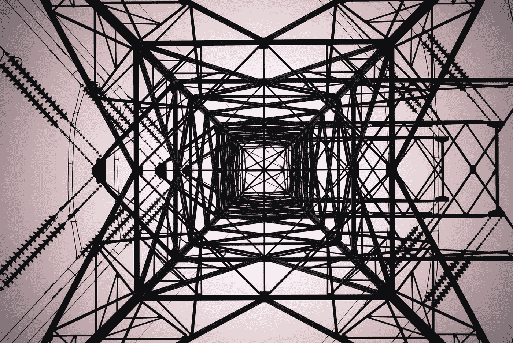
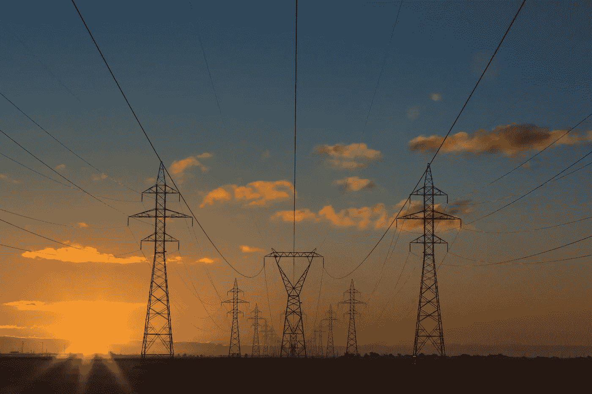
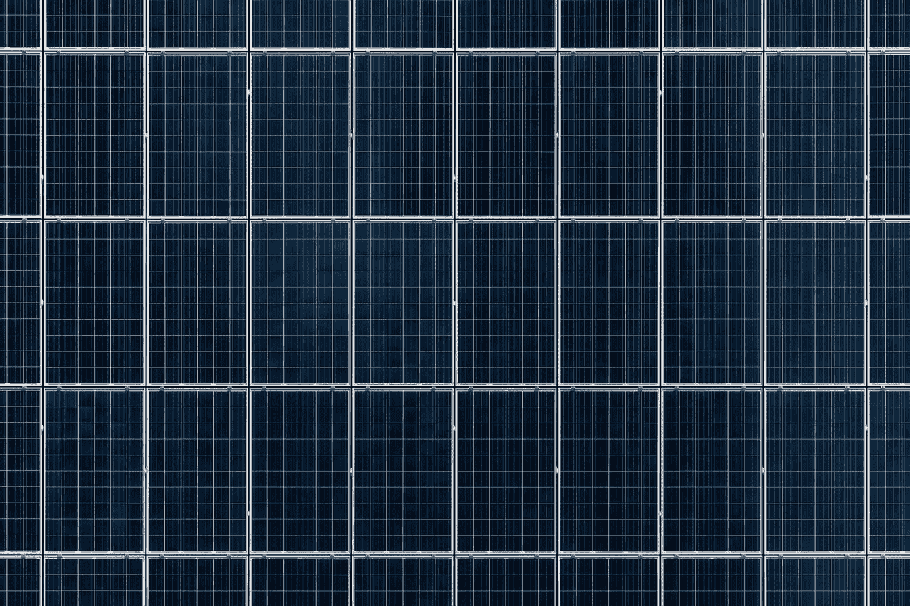

# 区块链和能源:你需要知道的一切。

> 原文：<https://medium.com/hackernoon/blockchain-and-energy-everything-you-need-to-know-2c56977614aa>

## 当前的基础设施急需创新。

Photo by [Shane Rounce](https://unsplash.com/photos/1ZZ96uESRJQ?utm_source=unsplash&utm_medium=referral&utm_content=creditCopyText)

100 多年来，我们的能源系统没有发生巨大变化。自 1882 年第一座发电站建成以来，能源一直是一条单行道。发电站通过其庞大的配电网络将能源输送给我们这些消费者。然后能源零售商向我们收费。虽然这种中央集权的制度让灯一直亮着，但我们快速发展的社会比以往任何时候都更快。是时候让我们的能源系统迎头赶上了——区块链能成为解决我们能源系统面临的重大问题的技术垫脚石吗？

# 我们当前基础设施的问题

## 1.能源效率低下

能量经过漫长的旅程到达我们这里。简单来说，就是从一个电站出发，经过复杂的配电网，最终到达我们家。这是我们日常生活中必不可少的一部分。研究表明在这个过程中会有多少问题，估计发电厂产生的 8%到 15%的电力在到达我们这里之前就损失了。这是一大笔转移到我们的能源账单上的钱，也是大量排放到我们大气中的不必要的二氧化碳。

对我们的电网来说，更糟糕的是，那些大量使用太阳能电池板为家庭供电的地区给我们当前的基础设施带来了巨大的压力。如果过多的多余能量被注入其中，就会出现所谓的“过电压”情况。这会损坏设备，导致可靠性问题，甚至引起安全问题。最糟糕的是，这减缓了可再生能源系统的采用，并导致了我们的下一个问题。

Photo by [Matthew Henry](https://unsplash.com/photos/yETqkLnhsUI?utm_source=unsplash&utm_medium=referral&utm_content=creditCopyText)

## 2.能源和我们的环境

全球能源部门对我们排放到大气中的三分之二的温室气体负责[。随着全球又一个夏季打破高温记录，能源部门必须迅速适应，以抑制排放。](https://www.iea.org/publications/freepublications/publication/WEO2015SpecialReportonEnergyandClimateChange.pdf)

我们环境的这些变化不仅仅是更热的夏天。为我们提供食物、洁净水和洁净空气的自然系统正受到威胁。这些系统的顺利运行对我们的生存至关重要。对于我们的能源系统来说，发展以应对我们面临的这些环境挑战从来没有像现在这样重要。

## 3.能量不平等

随着燃料匮乏，能源零售商的利润继续上升。以英国最大的能源零售商之一英国天然气公司为例。他们在 2017 年实现了他们[有史以来最高的利润率。然而，英国十分之一的家庭生活在燃料匮乏中。](https://robinhoodenergy.co.uk/news/big-six-energy-suppliers-profit-margins/)

这些零售商甚至不拥有任何网格基础设施。令人沮丧的是，他们只是在争夺给你发账单和监控你的电表使用情况的权利。他们是典型的“中间人”，将能源价格抬高 100%，以弥补运营公司的成本。从中赚取大量利润。

我们目前的制度不公平且效率低下。这让我们、消费者和我们的环境付出了沉重的代价。这些困难为我们提供了技术创新的火花——区块链。

# 能源创新和区块链

这项激动人心的技术希望将我们的能源系统从集中的单行道结构中转移出来。它希望将我们对发电站和能源零售商的依赖，转变为每个能源消费者都能获得的东西。

## 1.批发配电

技术正在淘汰中间商——能源零售商。区块链的一家初创公司 [Grid+](https://gridplus.io/) ，已经选择德克萨斯作为第一个推广他们技术的地方。消费者现在可以直接从电网交易和购买，使得传统的能源零售商变得没有必要。这些节省下来的成本传递给了我们，能源费用减少了 38%。

但是在需要的时候从电网买电，这不是给我们的日常生活带来了巨大的不便吗？如果你有一个可以上网的硬件设备，当你需要它的时候，它会自动购买。Grid+称之为“智能能源代理”的设备在有电池存储的家庭中变得更加令人印象深刻。它在低需求时最便宜的时候购买电力，储存在你的电池中，然后在高需求时能源昂贵的时候卖回给电网。

区块链技术现在是新的中间人，而不是渴望增加利润的传统能源零售商。

## 2.对等(P2P)能量

随着太阳能电池板的蓬勃发展，人们不再仅仅是能源消费者，他们也是生产者。作为能源的消费者和生产者，你被称为消费者。如果你的社区有多个潜在消费者，P2P 能源将会改变一切。

让我们带上简。她有一个三居室，屋顶上有太阳能电池板。她是一个消费者。通常情况下，当 Jane 的太阳能电池板有剩余能量时，它会被卖回给电网。由于这个过程中的低效率和中间商，简没有赚到多少钱。

有了 P2P 能源，简现在可以利用区块链将剩余的能源卖给她的邻居。因为区块链在这个交易中扮演了中间人的角色，所以 Jane 赚的钱比她卖回给电网的钱要多。

更好的是，邻居从简那里购买能源比从他们的能源零售商那里购买更便宜。简的邻居可以支持可再生能源，即使他们没有太阳能电池板来生产。这是一种更环保、更高效的用电方式，因为从发电站到家的过程中损耗的能量更少。

像澳大利亚的 [Power Ledger](https://www.powerledger.io/) 和纽约布鲁克林的 [LO3](https://lo3energy.com/) 这样的公司正在以这种方式连接社区——创造微型电网。除了为消费者和潜在消费者省钱之外，它们也更安全。当主电网出现问题时，微电网可以作为紧急备用。洪水、地震和飓风等自然灾害会影响集中式电网基础设施，从而导致服务中断。在这种情况下，微电网可以维持社区的运转，直到主电网恢复正常——这是自然灾害多发地区的救命稻草。

现在，这些微电网就像是我们当前电网之上的一层。但是 P2P 区块链公司预计这将会发展成更大、更分散、互联的微电网。这意味着对消费者来说更便宜的价格和更好的利润。

Photo by [Samuel Zeller](https://unsplash.com/photos/A18TFMJxzcw?utm_source=unsplash&utm_medium=referral&utm_content=creditCopyText)

# 所有这些是如何工作的？

首先，并不是每个使用这项技术的人都理解它。毕竟，有多少使用互联网或非接触式支付的人能够解释这些复杂的系统如何在幕后改善我们的生活？

简而言之，区块链是一个共享的加密账本，由计算机网络维护。这些计算机使用比特币和以太坊等加密货币验证个人用户之间的交易和数据。每个用户都可以访问分类账，没有单一的权限。

那么这一切意味着什么呢？使用区块链的全部目的是让互不信任的人安全地共享有价值的数据。通常提供这项服务的中间人被取消了。他们的利润被排除在等式之外，人们使用区块链的安全货币。此外，攻击者极难操纵区块链，因为他们使用复杂的数学和创新的软件规则。那么，这如何适用于提到的创新呢？

*   对于批发配电，使用区块链，因此能源消费者可以实时直接向电网购买和出售能源(使用 Grid+streamlined 整个流程的“智能能源代理”等技术)。
*   有了 P2P 能源，区块链就被使用，这样社区就可以在互联的微电网中连接起来，并使用这个网络在它们之间买卖当地的可再生能源。

# 我们的能源系统将走向何方？

区块链技术已经提供了批发电力分配和 P2P 能源——这两项令人兴奋的创新完全旨在彻底改变我们当前的能源系统。随着未来在望，消费者将有更便宜、更环保的能源来源选择。消费者将有机会从他们的太阳能电池板中获得更多的收入。拥有微电网的社区中的每个人都有备份，以防灾难袭击他们的主电网。

前面的路令人兴奋，但将会有许多挑战。政府监管必须快速适应这些新技术，不仅需要政治意愿，还需要人民的力量。传统能源零售商强大的游说利益很有可能阻碍进展。但是成功的小规模试验是令人鼓舞的，区块链技术一直在发展。随着技术升级以满足不仅是小社区，而是整个城市的能源需求，需要更多的创造性创新来克服这些障碍。但它就在那里，而且势头越来越大。试想一下——亚马逊是靠卖几本书起家的…

仅今年一年，区块链企业的投资就超过了 10 亿美元，几乎一半的世界顶级大学都提供区块链课程，毫无疑问，这项技术将继续存在。我们目前正在见证我们生产、分配和消耗能源的方式的巨大转变…

## 这位作者的更多阅读:

我们有一场水危机。区块链技术能拯救我们吗？

[*气候变化、区块链和巴黎协定:新的希望*](/@oliver.russellcw/climate-change-blockchain-and-the-paris-agreement-a-new-hope-558a32d7073)

## 是时候开始对话了

我想听听你的想法。让我知道你对区块链科技创新能源基础设施的看法。