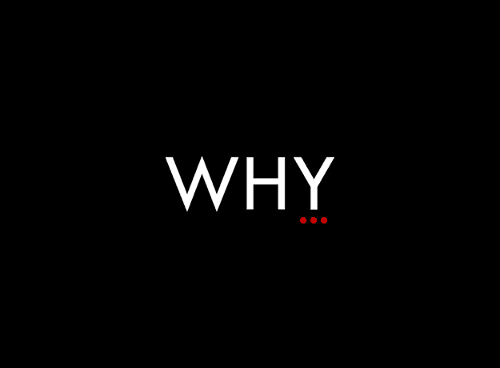
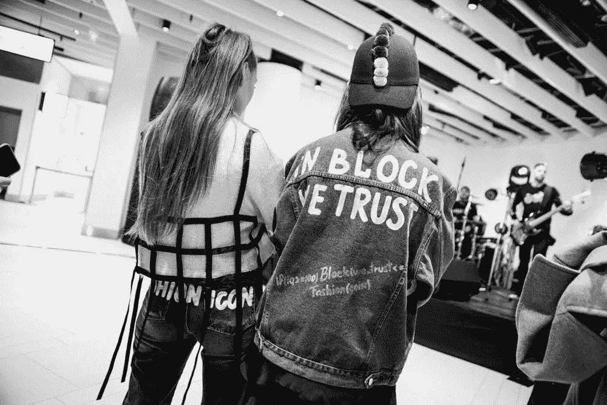
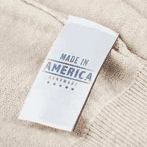
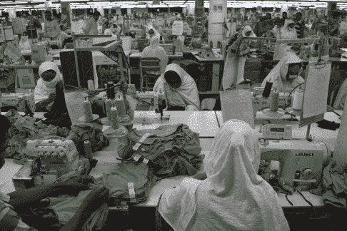
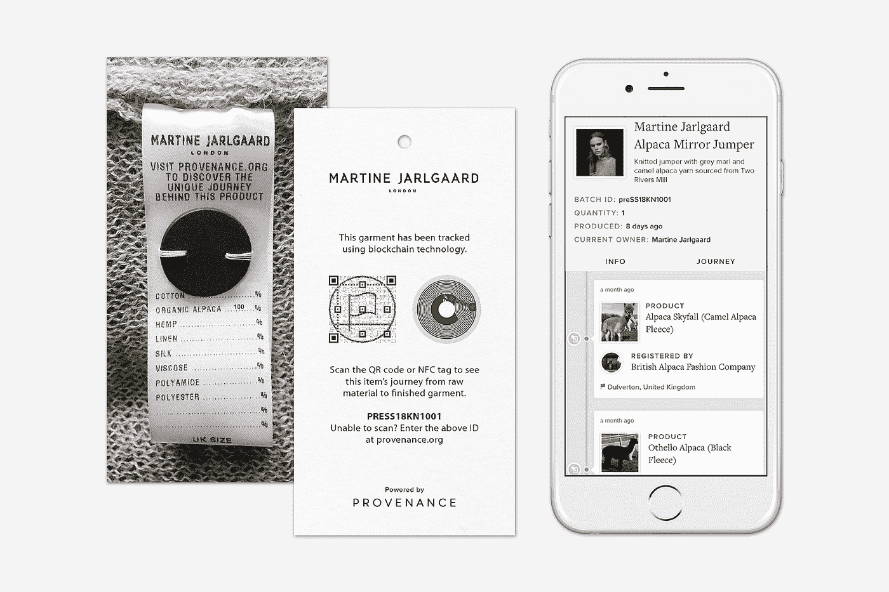

# 区块链与时尚产业

> 原文：<https://medium.com/hackernoon/blockchain-and-fashion-industry-a5076355aa41>

Source: [https://pexels.com/](https://www.pexels.com/photo/bride-decoration-fashion-flowers-265705/)

当魅力与科技相遇时，这一必然结果被世界各地的人们广泛接受，尽管科技面料会多花一点钱。

如今，大多数大品牌都在改变传统(不那么狭隘)时尚的路线，转向更前卫的时尚。最近，李维斯与谷歌合作，专门为骑自行车上下班的人推出了一款 SUPER DOPE 智能夹克。它的价格是 350 美元(当然比普通人买夹克的价格要高)，但它越来越受欢迎。您可以在旅途中听音乐、使用谷歌地图、接听电话以及在夹克上显示文字。

一定要看看这个很棒的视频，对这件夹克有更多的了解。撇开技术不谈，我必须承认这件夹克看起来很性感！

在我看来，整个文化都在改变步伐和方法，将[技术](https://hackernoon.com/tagged/technology)和相关趋势融入其中。新的生存方式是采用技术。或许这就是为什么大多数运动装备品牌(比如耐克)更像是一家科技公司，而不是一家服装公司。Nike 不断推出突破性的解决方案，采用最先进的传感器来测量进行任何活动时的心率、速度、消耗的卡路里和距离。

上述案例研究是时尚界物联网(IoT)的一个典型例子。让我们看看人工智能(AI)如何彻底改变时尚。当我走进马克&斯潘塞时，我看到了无数的选择，却不知道该何去何从。此外，FOMO 影响了我的判断。如果 M&S 在每个区域都安装了一个售货亭，顾客可以选择他们想要的布料类型、颜色、尺寸等等，售货亭会告诉顾客商店目前有什么货！这就像在手机应用程序上购物，但实际上是在商店里。这样的解决方案肯定会改变我的生活，肯定会节省大量的时间！

Source: [http://westhartfordyoga.com/](http://westhartfordyoga.com/)

这是因为**数据**是现在最理想的商业模式。未来几年将蓬勃发展的公司是那些能够重塑自我以跟上技术和社会变化的公司。

在上面提到的两个例子中，利用该技术的公司正在收集大量的数据，可以应用大数据技术来了解客户在什么时间点喜欢什么。这样的解决方案也可以帮助品牌进行库存管理。

***我还没有提到区块链的例子，因为下一节将会谈到它！***

所以现在我们知道了科技在时尚行业的真正革命性。让我们通过深入研究[区块链](https://hackernoon.com/tagged/blockchain)用例来进一步具体化这个想法。

# 时尚遇到区块链的地方…

Source: [https://fashnerd.com/](https://fashnerd.com/2018/04/blockchain-technology-fashion-tech-industry/)

## 为什么是区块链，为什么不是常规数据库？

区块链批评者喜欢用常规数据库取代区块链，即使在最完美的用例中也是如此。区块链的独特之处在于，数据一旦写入分类账，就永远无法更改。即使上帝希望它改变，它也不会改变。这意味着，在区块链世界里，没有谁比谁更强大。只有真理才会胜利。其次，它在本质上是真正去中心化和分布式的，因此每个人都可以看到到底发生了什么。没有负责共享数据的中央机构。这意味着没有人拥有这些数据。当手脏的人试图改变“事实”只是因为他们可以这样做时，这个概念是超级强大的。

## 第一个使用案例的基本原理:

区块链的新颖性源于其独特的能力，可以弥合物理世界和数字世界之间的差距(令牌化)，在区块链创建真正的数字身份。通常，加密哈希或“序列号”是可以追溯到产品的主要物理标识符。这个概念排除了伪造物品的制造，因为不能生成“伪造的”散列。*这产生了另一个用例，我们将很快讨论它。*

## 第二个用例的基本原理:

想想时尚界最著名的标签:制造于 _ _ _ _ _ _ _ _ _。谁知道标签上说的地方实际上是不是生产的地方？谁知道他们会不会只是印刷一些神奇的球来卖更多呢？*让我们看看区块链如何阻止这种事情发生！*

Source: [https://www.finder.com/](https://www.finder.com/made-in-usa-clothing)

## 第三种使用案例的基本原理:

有如此多的社会活动家团体痛斥大的时尚品牌伤害动物、环境或不道德的行为。许多消费者也对购买任何动物皮制品持谨慎态度。那么，让用户知道他们购买的产品到底来自哪里这个概念怎么样？想象一下，只要扫一扫二维码，就能获得历史出处的信息？*我们也将探索这一使用案例。*

## 第四个用例的基本原理:

Source: [https://www.scmp.com/](https://www.scmp.com/magazines/post-magazine/article/1970431/true-cost-your-cheap-clothes-slave-wages-bangladesh-factory)

 [## 你廉价衣服的真实成本:孟加拉工厂工人的奴隶工资

### 在一栋工业建筑的七楼，在一个排满衣架的办公室套间里…

www.scmp.com](https://www.scmp.com/magazines/post-magazine/article/1970431/true-cost-your-cheap-clothes-slave-wages-bangladesh-factory) 

如此多有才华的人居住在偏远的地方，制造价值巨大的复杂织物。很多时候，大的时尚品牌以很低的工资雇佣这些穷人。这实际上是以压迫的方式剥削人民。如果区块链能赋予时尚界的人们权力会怎样？服装生产迁回当地分散的中心怎么样？让我们也看看区块链慈善的一面。

# #1、#2、#3 解决方案:

2017 年，伦敦设计师 Martine Jarlgaard 与区块链公司 exhausion 合作，主动制作了前所未有的“智能标签”。消费者可以扫描衣物，查看从原材料到最终产品的生产过程中的每一步。这种透明度可能会成为消费者的一个卖点，他们越来越想知道自己的衣服是如何以及在哪里制造的。

扫描二维码后看到的内容可以在这里找到:

 [## Martine Jarlgaard 羊驼镜套头衫|出处

### 针织套头衫，采用来自 Two Rivers 纺织厂的灰色泥灰和驼色羊驼毛纱线

www.provenance.org](https://www.provenance.org/assets/0x2fb1d92d6891d7bcfeb88cd9558b86ee14703f69) 

该产品所有所有者的全部历史可以在[这里](https://www.provenance.org/assets/0x2fb1d92d6891d7bcfeb88cd9558b86ee14703f69)看到。这是在以太坊的 Kovan 测试网上运行的。在 etherscan 上，可以在[的这个](https://kovan.etherscan.io/address/0x2fb1d92d6891d7bcfeb88cd9558b86ee14703f69#internaltx)链接上看到。

[https://kovan . ethers can . io/address/0x 2 FB 1d 92d 6891d 7 BC feb 88 CD 9558 b 86 ee 14703 f 69 # internal tx](https://kovan.etherscan.io/address/0x2fb1d92d6891d7bcfeb88cd9558b86ee14703f69#internaltx)

点击查看 Martine Jarlgaard [。](http://martinejarlgaard.com/About)

 [## 关于马丁·贾尔加德

### Martine Jarlgaard 在技术、商业、时尚和艺术的交叉领域工作。她对积极变化的驱动力…

martinejarlgaard.com](http://martinejarlgaard.com/About) 

这证明了产品是真实的，它证明了它来自哪里，它提出了呈现 100%透明的服装项目的整个生命周期，而目前是 100%不透明的。

使用相同概念的一些其他相关利基行业有:

*   世界最大的钻石生产商德比尔斯公司利用区块链的技术在每个销售点追踪钻石的来源并验证其真实性。
*   一家总部位于伦敦的区块链初创企业 Block Verify 声称，该产品有可能应用于制药、奢侈品、钻石和电子产品等多个领域。他们的技术训练有素，可以识别假冒产品，跟踪转移货物，被盗商品和欺诈交易。
*   阿里巴巴正在通过开发一个区块链应用程序来追踪其产品，从而防止假冒。每次产品从一个地方移动到另一个地方，它的代码或标签将被扫描，用时间戳记录它的位置。购买者将能够扫描产品并追踪其从工厂到前门的旅程——并验证品牌手表或手袋是真品还是赝品。

# #4 解决方案:

在隧道的尽头，有光。同样，区块链的最终结果是将那些迄今为止一直被忽视的人融入经济。dApp 可以为那些生活在悲惨环境中的人们创造一个生活来源。由于区块链天生支持 P2P 交易，因此不需要中间人。人们可以直接从别人那里购买，而不是从品牌那里。这肯定会把生产带回本地的分布式中枢。

Source: [http://www.malindikenya.net](http://www.malindikenya.net/en/articles/news/last-news/kenya-where-poor-people-is-happier-than-the-rich.html)

## 至此，我总结了我对区块链和时尚界的见解。如果你有任何建议，请在下面的评论中提出，或者发邮件到 niharika.3297@gmail.com 给我