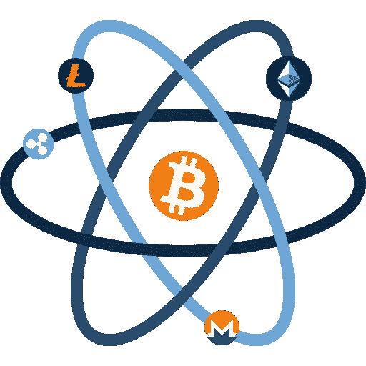

# 从物理到区块链

> 原文：<https://medium.com/hackernoon/blockchain-and-physics-i-85713d31f07c>

我的背景是量子物理和信息，但最近我决定潜入[区块链](https://hackernoon.com/tagged/blockchain)。我刚刚发行了一个以太坊令牌，目前正在做一个区块链[初创公司](https://hackernoon.com/tagged/startup)。

是什么让我对区块链感兴趣？

这不仅仅是钱的问题，我只拥有少量的加密货币。原因——除了对不久的将来去中心化世界的可能性着迷之外——是我被**重复支出问题**以及中本聪如何用比特币解决这个问题所吸引。

2008 年，Satoshi 发表了一篇题为《比特币:一种点对点的电子现金系统》的论文。他(或他们)的主要目标是:建立一个协议，在这个协议中，一个代理系统能够直接可靠地将数字货币从一个代理系统转移到另一个代理系统，而不需要任何中间人。在比特币诞生之前，这是一个长期无法实现的目标，主要障碍是重复支出问题。比特币是第一个解决这个问题的点对点数字现金。

什么是双重消费？假设在一次面对面的交易中，我给你一张一美元的钞票。你收到钱的那一刻，我就不再拥有那张一美元的钞票了。因此，我变得少了一美元。但是如果我有办法在我的车库里复制一张一美元的钞票呢？我会变得和给你钱之前一样富有！显然，这是任何货币提案都应该避免的，因为这将使这些货币变得毫无意义，并破坏整个货币体系。这就是为什么我们的祖先选择不容易被伪造(和稀有)的东西作为货币，如贝壳，钻石，黄金，白银等。后来，当我们转向纸质钞票时，银行必须确保人们很难复制和印刷钞票，并且流通中的任何两张钞票都不能有相同的序列号。

然而，当互联网时代到来时，复制信息的边际成本大大降低——通过网络复制和分发数字信息几乎是免费的。在这里，像银行，贝宝等中介。必须确保交易不被篡改，货币不被复制。我们必须信任这些中间人来处理我们的交易，直到 Satoshi 发明了比特币。

但是，在谈论重复支出问题时，人们往往会忽略一个问题:*为什么这个问题一开始就这么难？*

这就是物理学的用武之地:

> 所有经典信息都是可复制的。

所谓经典信息，我指的是我们日常生活中遇到的物体的物理状态，例如，纸张、石头、球、树叶、钻石、黄金、雪花等等。是的你没看错，雪花。由于它们奇妙复杂的结构，人们总是说没有两片雪花是一样的，所以不可能复制一片雪花。这是不正确的。说某样东西是独一无二的并不等于说它是不可复制的。

假设一片雪花处于某种尚待确定的状态，我们总是可以通过对它进行*测量*来确定它的状态。一旦我们足够精确地知道了它的状态(物理学对这种精确度没有任何限制)，我们就可以在适当的条件和程序下准备给定的状态。用专业术语来说，这是通过设置正确的哈密顿量来实现的，这样系统就会进化到期望的状态。

这里的要点是，自然界没有法律禁止我们复制我们周围看到的物体，或者计算机内部的比特。这就是双重支出问题难以解决的原因。尤其是计算机内部的比特，因为边际成本接近于零。

这意味着，无论我们用什么方法来防止重复支出，这种防止都是实际可行的。原则上没有防止重复支出的措施。这也是为什么区块链技术在我看来如此有趣——代理网络如何能够在没有任何外部自上而下协调的情况下保持几乎不可复制的货币。

这是系列文章的第一部分。在未来的文章中，我将(希望我有时间)探索区块链和物理学之间的许多有趣的话题，例如量子力学如何为双重支出问题提供原则上的解决方案；区块链中的时间戳和相对论中的时钟同步；记号的(不)可替换性和物理学中的唯一性概念。

敬请期待！

BTC:16 hqyh 4 wyfhcnxmdrq 7x 9 gyto qbt 9 dfba

ETH:0x ca 7089995414 b 33 e 87d 6 ECB 8 ff 9834 ca 0 c 273 e 41