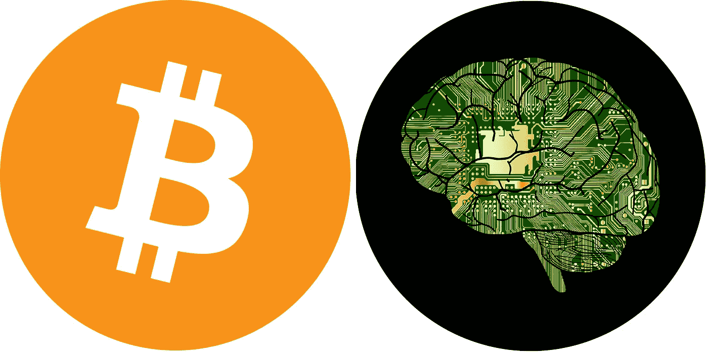

# 区块链和自动驾驶汽车——终极动态组合

> 原文：<https://medium.com/hackernoon/blockchain-and-the-autonomous-vehicle-the-ultimate-dynamic-duo-72c0f1b8c26c>

**合著:
郑伟恩**https://ca.linkedin.com/in/wyzheng凯瑟姆弗兰克 https://ca.linkedin.com/in/kesem

想象一下，你正赶着去见客户，但却一直遇到红灯。“这会让我迟到的！”，你脑袋里面的声音尖叫。你知道你的客户讨厌你迟到，更不用说许多其他后果了。如果有一种方法可以优化你的通勤，让你再也不会遇到这种情况，会怎么样？如果你的汽车更智能，能够相互通信并与基础设施通信，以确保你能按时到达会议地点，会怎么样？互联的车辆网络、机器学习和区块链技术的结合看似完全和谐地工作，可以确保你只闯绿灯，而不会打扰路上的其他人；有了它，迟到的通勤将成为过去。

每辆互联汽车都知道三件事:

*   你的目的地
*   当你想去的时候
*   每辆车都在路上。

如果我们是一个纯粹利他的社会，你的车可以告诉其他人你在赶时间，他们可以靠边给你让路。交通灯甚至可以为你变绿，这样你就永远不必停下来。人们可以跨进他们的汽车，在没有任何人工干预的情况下被带到他们的目的地，同时确信他们的路线是最快和最具成本效益的。然而，我们的社会尚未以这种方式运行，但新兴技术可以让司机在匆忙中优先行驶，而不会受到路上其他人的抱怨。

**加密货币和自动驾驶汽车——路线优化的新时代**

我们已经将路线优化的概念理解为拥堵的函数，在当前条件下，人们通常使用 Waze 等 GPS 工具来找到最快的路线。每辆自动驾驶汽车都将使用这样的系统来导航，并能够广播它们的预定路线。你可以根据预期的未来条件开发一种优化和预测技术。这已经在基于历史数据进行，但下一步将是使用每辆车的实时数据，以及车辆正迅速成为超级计算机的事实，以根据每辆车未来的位置动态更新路线。重要信息，如通行费支付、限速控制、停车预订等，会在旅行期间或之前自动传达和解决，改变我们所知的整个通勤体验。

但是优先级优化呢？决定谁应该被赋予到达目的地的最快路线的“驾驶员”。区块链技术可以提供一种解决方案，为每辆车提供加密货币钱包，允许无摩擦的点对点金融交易。

区块链技术将在车辆上实施，让乘客设定每单位时间的“成本”，因为他们被延迟给别人优先权。当你选择一条路线时，车辆会根据对其他车辆未来位置的预测，给你一个报价，根据你会耽误其他车辆多少时间给你优先权。你支付的任何东西都会直接进入路上其他人的钱包。用于“交易”的普通结构将时间转化为可购买的商品，可以自动购买，无需人工干预，也不涉及法定货币的转移。

对于收款人来说，这类似于决定购买优步资金池，或者决定全部留给自己。如果选项 A 是您自己的车辆，选项 B 是优步池，您选择的选项是基于您愿意支付更快到达您的最终目的地。

**未来**

当区块链和机器学习放在一起时，人们可以根据其他人的行为给他们带来的不便程度轻松获得补偿。很快，我们可能会看到一个广泛的区块链系统彻底改变我们上个世纪的通勤方式。路线优化可能是我们看到这种技术结合实现的第一个领域，但它不是唯一的用例。在任何地方，如果有人想以牺牲他人的利益为代价获得优先权，那么其他人现在就有办法补偿那些被耽误的人。想跳到队伍的最前面吗？现在有一种方法可以让其他人都同意这个决定……如果你厌倦了别人比你优先？嗯，你把你的成本放得很高，以至于没有人得到优先权，或者你得到了一笔横财。