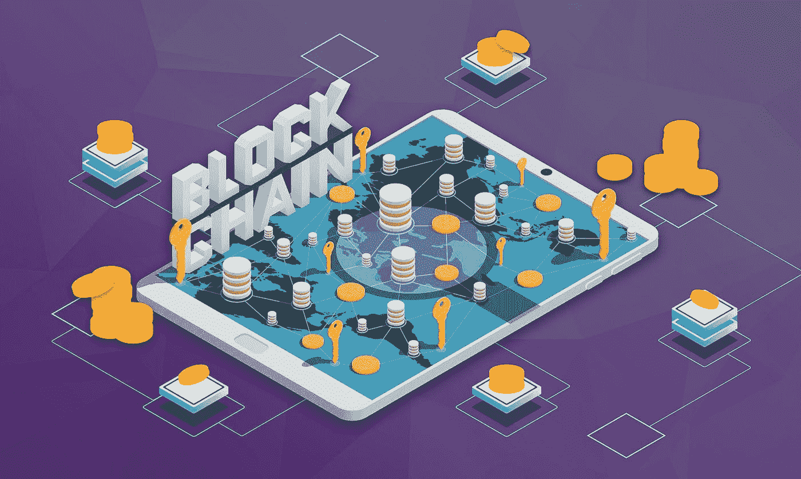

# 区块链和收藏的未来

> 原文：<https://medium.com/hackernoon/blockchain-and-the-future-of-collecting-7de67053d4b9>

ICv2 [的 Rob Salkowitz 最近写了一篇关于区块链和收藏](https://icv2.com/articles/news/view/40401/is-blockchain-future-collecting)之间联系的文章，不仅关注这项技术如何改变行业，还关注两者的相似之处。当你比较比特币——有史以来第一种加密货币和收藏时，这些相似之处很容易理解。

*   供应是有限的
*   价格经常不稳定
*   减少对价值而非可获得性的关注

在任何行业，物品变得更有收藏价值，因为它们越来越少。然而，有了数字技术，你可以无限量地生产物品，而不会产生同样的生产成本。事实上，电影和音乐行业已经认识到，你可以以大幅降低的、几乎“零边际”的成本无限销售商品。这同样适用于其他数字物品，如漫画、卡片和虚拟商品，如视频游戏皮肤和其他游戏内物品。这对公司来说很好，但也很难确定数字媒体的稀缺性。另一方面，视频游戏发行商已经发现拥有少量稀有物品可以促进游戏中战利品包和货币的购买。这是一个其他行业尚未完全解决的挑战。

但是，区块链提供了一个答案，它有能力认证交易，以及使用这种技术创造的虚拟商品。虽然市场上可能有一首歌或其他类型的数字媒体的许多副本，但你不能肯定它们是合法的。通过区块链，公司可以在他们的知识产权中添加水印或打印哈希，这意味着当你通过批准的区块链平台或供应商购买时，你知道你拥有真正的文章。这就增加了商品的价值，因为卖家和潜在买家都确信商品是真实的。

这适用于实物商品和数字商品，IBM 和惠普等公司已经在利用区块链来保护其实物库存免受假冒，并从头到尾保护整个供应链。这不仅可以确保您收到经过验证的货物，而且公司还可以计算损坏和损失，因为有了区块链，可以很容易地追溯物品脱离监管链的位置。

此外，区块链技术允许新的创作者在创作自己的收藏品时与大公司站在平等的立场上。以前，如果一家公司想使用别人的创意，他们可能会这么做，不管他们是否得到许可。但是，如果创作者利用区块链，他们可以更容易地执行证明所有权的合同，从而迫使大公司向他们支付公平的利润份额。

BLMP(区块链许可市场)目前正在建立第一个 B2B2C 区块链支持的分散市场，该市场包含整个虚拟商品供应链，包括标记这些资产，以便可以从创建到拥有进行跟踪。

如果你想了解更多关于 BLMP 和其他革新许可行业的平台和技术的信息，请访问 [C-suite Network 的 Hero Club:entrepreneur CEO 的& Opportunities](https://youtu.be/lYKiW_Pie-k) 查看 BLMP 的联合创始人兼 out David Uy。

此外，请务必参加授权博览会研讨会 [FutureTech:将影响授权的新技术](https://licensing18.mapyourshow.com/7_0/sessions/session-details.cfm?ScheduleID=15)。David Uy 将在此次活动中发表演讲，该活动将于 5 月 24 日星期四上午 10 点在全球许可集团剧院(A107 号展位)举行。

BLMP 2018，新加坡

*BLMP(block chain Licensing market place)是一家区块链科技公司，致力于消除障碍，促进虚拟商品行业中围绕供应链管理交易的复杂问题的信任。*

*BLMP Network 利用区块链技术将全球的数字平台与全球品牌连接起来，在任何数字平台上将官方授权的虚拟商品货币化；从游戏到流媒体服务&社交媒体，让数百万用户能够接触到一个全新的品牌虚拟产品世界。*

联系我们:

[网站](https://www.blmp.network/)

[推特](https://twitter.com/BLMPNetwork)

[脸书](https://www.facebook.com/BlmpNetwork)

[领英](https://www.linkedin.com/company/blmp/)

[AngelList](https://angel.co/blmp-network)