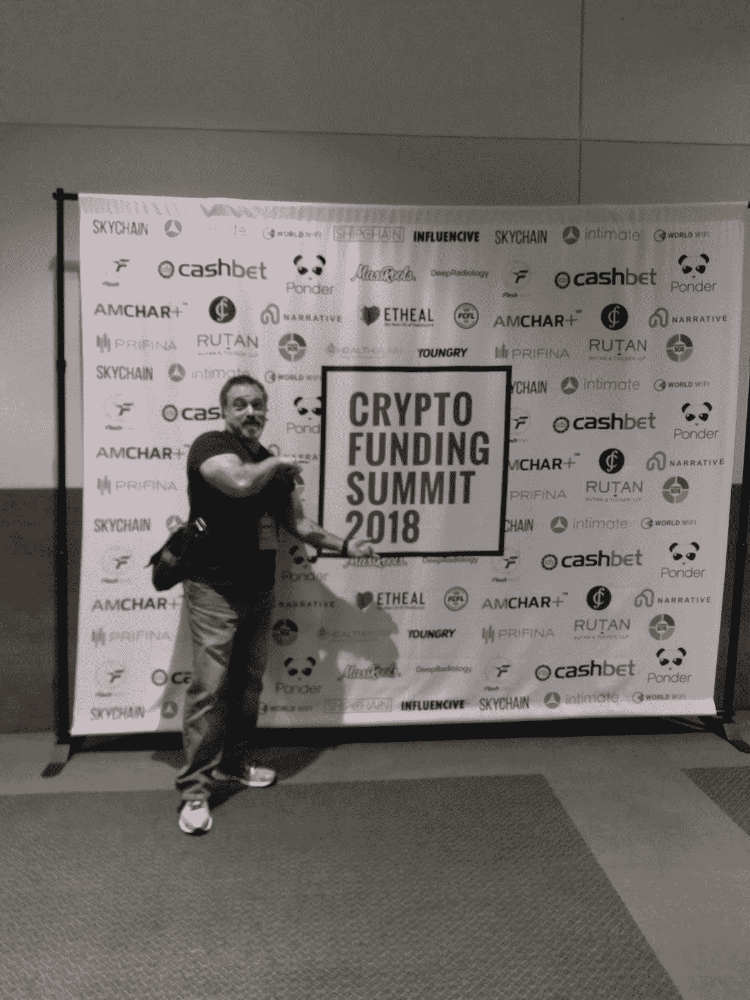

# 区块链和难以忍受的千禧一代

> 原文：<https://medium.com/hackernoon/blockchain-and-the-insufferable-millennial-9c454f8e8962>

我参加了 2018 年 1 月 24 日在洛杉矶举行的 [Crypto Funding Summit](https://www.cryptofundingsummit.com/) ，虽然参加的人很少，但有很多优秀的演讲者和一些有趣的供应商参展并进行 ICO 推介。

我在那里代表我为之撰稿的一家专业知名出版物(我不打算说出名字，因为我在这里会引起一些争议)，我特意在活动中与每个供应商交谈，了解他们在做什么，了解他们的使用案例，扮演一个小魔鬼的代言人，让他们证明他们的效用和这样做的原因。我与所有的公司、伟大的人进行了精彩的对话，一些想法很有意义，一些在我看来会彻底崩溃。那里大约有 5 家公司以某种方式与医疗信息有关。其中一家是我最后谈过的公司，我不打算公布他们的名字，因为我不想给他们任何免费的推广，但他们展位上的年轻男女是我几十年来参加体育用品、音乐和技术贸易展中遇到的最糟糕的人。

这两个人看起来都是 20 岁出头，穿着很有品味。我不知道他们的名字，所以在这个对话中，我将他们称为混账千禧男(DMM)和阿谀奉承的千禧女(FMF):

***SG:*** 大家好，我是******杂志的，跟我说说你们在这里做什么吧。

***DMM*** :将病历放在区块链上。

SG :酷，给我一些细节，你们已经有合作伙伴了吗？记录是怎么放在那里的？作为一名患者，我是否明确地这样做，或者允许我的提供者这样做，或者他们在我不知情的情况下这样做？

***DMM*** :是。

***SG*** :是的什么？

***DMM*** :要全部。

***SG*** :好的，你能给我讲一些细节吗？跟我说说。

有了我们的系统，你可以在世界任何地方随时查阅你的病历。

SG :好的，很好，但这并不是对我问题的真正回答。为什么需要你的令牌？

*:随时获取你的个人记录即时访问。*

****SG*** :好的，我是个普通人，我想看看我的医疗记录。你是说我必须安装你的移动应用程序，开一个加密交换帐户，给我的 ID 拍照，然后发送给他们，等待验证，然后让我的银行帐户连接到交换，把我的钱送进去，购买你的令牌，获得某种钱包集成，然后我就可以得到我的医疗记录了吗？*

****DMM*** :是的，我听起来很简单。*

****SG*** :你现在是认真的吗？*

****DMM:*** 对于世故的千禧一代来说，这是微不足道的，我们都已经这样生活了。*

*SG :我给你一点小建议，你的演讲风格不是特别令人愉快，而且会让人疏远。*

****DMM*** :那是你的看法。*

****FMF*** :是的，那只是你的看法。*

****SG*** :你意识到了吗，即使是少数公司在尝试的所有这些代币上都取得了成功，也需要普通人带着成千上万种不同的加密货币四处走动来完成他们的日常任务？*

****DMM*** :不，那不会发生，对我们来说也无所谓。*

***<将材料放在桌子上后开始走开>***

****FMF*** : <对着我离去的背影大喊>哦耶？嗯，奶油总是升到顶部！！！*

****SG*** : <笑得更厉害了>*

*会议的其余部分总体上非常有趣和愉快。给千禧一代的建议是，这不是一个成功的策略。*