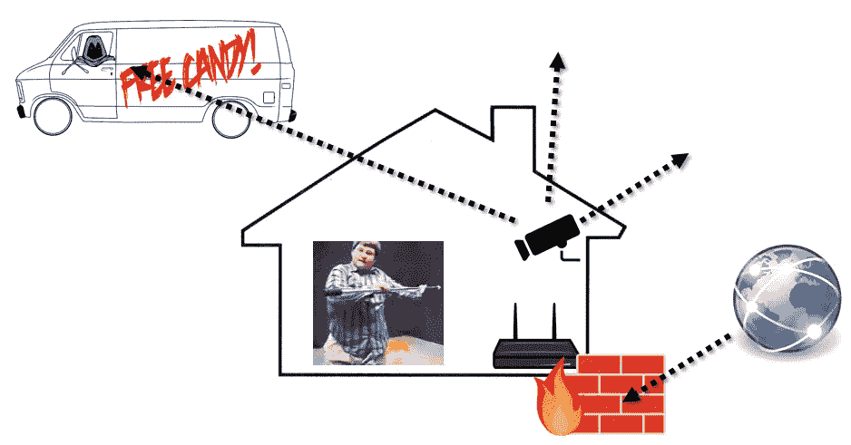

# 区块链和迈向新互联网架构的旅程

> 原文：<https://medium.com/hackernoon/blockchain-and-the-journey-toward-a-new-internet-architecture-cc0e92a9d7aa>

2017 年已经过去，区块链已经成为主流。这项技术将颠覆多个行业，为无银行账户的人创造难以置信的潜力，并从根本上改变我们交易和交流的方式。

来自社区的另一个强烈主张是，区块链技术预示着新互联网的**到来，在某种意义上是对其去中心化根源的回归。在早期，任何人都可以运行他或她自己的服务器并连接到其他人，创建一个令人难以置信的、分散的内容“网络”。然而，**最初的互联网最终变得更加集中化**——消费者蜂拥而至，追求便利和更好的界面，却牺牲了对信息的控制权。**

因此，今天的互联网依赖于强大的云服务、搜索引擎、服务器和社交媒体提供商。随着区块链的出现，将这些服务器的所有权和运营权归还给用户有了新的可能性，这本身就非常令人兴奋。

然而，我最感兴趣的是**区块链技术结合网络原始架构的重新设计，解决互联网协议本身固有的一些固有缺陷的潜力**。尽管美国国家航空航天局最近宣布了将某人送上火星的雄心勃勃的计划，尽管我们在 21 世纪取得了令人难以置信的成就，但我们尚未解决使分布式拒绝服务(DDoS)攻击、恶意软件和病毒今天仍然可能存在的设计缺陷。这些问题中有许多源于基于 70 年代和 80 年代硬件的有缺陷且过时的[架构](https://hackernoon.com/tagged/architecture)。

在我看来，如果不对互联网的基本设计进行早该进行的反思，那么区块链提出的准乌托邦生态系统的想法是不完整的，在这个生态系统中，人们、公司和设备以“无信任”的方式进行交易，并通过去中心化的应用程序(dApps)进行交互。尽管有许多区块链项目雄心勃勃地要成为“世界计算机”，但在短期内，我们已经变得非常专注于将尽可能多的交易塞进由紧张的节点网络验证的块中。尽管这项技术最近大受欢迎，但它仍然处于早期阶段，或者如弗拉德·扎姆菲尔所说，“业余时间”。

然而，从操作系统的角度来看，我认为这种对事务吞吐量和采用的关注是不够的。当涉及到整个网络或生态系统时，要求区块链做所有的事情是一个不可思议的要求。在主链和节点网络上运行数千个 dApps 类似于在你的个人电脑上运行太多的应用程序，区块链节点类似于它的内部通信总线。鉴于当今互联网存在的问题，区块链应该作为一个工具来实现新的互联网生态系统，而不是成为生态系统本身。是拖拉机，不是农场！

**在人类历史上，通过区块链，我们第一次有了一种发布和确认持久身份的手段。**在我看来，这种能力对于解决互联网设计中的一些基本问题以及我们的机器相互交流的方式至关重要。区块链技术，即使在目前的状态下，也足以实现下一代网络，这将实现物联网、无摩擦的可信商务、清晰的文件共享和 P2P 通信——只要**我们可以用新的架构和端到端解决方案设计出现有的互联网协议问题。**

# 互联网:坏的和丑陋的

2016 年 10 月发生的 **Dyn 网络攻击**事件最能说明我们今天生活在可怕的网络地狱中。域名系统(DNS)提供商 Dyn 遭受了多次 DDoS 攻击，导致欧洲和北美的许多主要互联网服务和平台瘫痪。

像 Dyn 这样的 DNS 提供商充当互联网域名的映射服务，将您在 web 浏览器中键入的 URL 与其对应的 IP 地址进行匹配。这种大规模攻击的工作方式是，从一个由打印机、摄像头、路由器等物联网设备组成的大范围僵尸网络中发出大量 DNS 查找请求，淹没该提供商。被恶意软件感染。

**这种攻击之所以可能，是因为当今管理互联网的一套规则。**这种被称为 TCP/IP 的协议规定了数据如何在网络上传输，将数据分成数据包从发送方传输到接收方。

在 DDoS 攻击中，数以百万计的此类数据包被垃圾邮件发送到像 Dyn 这样的目标，以淹没服务器。虽然存在某些保护措施和算法来识别和缓解这些攻击，但总体而言，不可能防止这些攻击的发生。

此外，这些数据包可能会被恶意行为者拦截，他们不仅可以窥探您的数据，还可以修改数据，更改目的地址或伪造其来源。执行这些“中间人”攻击的能力与病毒和恶意软件密切相关。大多数时候，我们有**“守护进程”**，Windows 更无聊地称之为后台进程，这要感谢它。

## 守护进程，又名后台进程

每一个读到这篇文章的人肯定都曾经历过个人电脑出现严重错误的情况。我们都太熟悉这个例程了——按 CTRL + ALT + DELETE 打开任务管理器，并确定要消除哪个守护进程。除了制造商预装在您机器上的那些程序之外，大量不受欢迎的守护程序可能会通过您下载的音乐播放器、色情视频或在线游戏感染您的机器。你可能安装了一个你只使用过一次的程序，但是**伴随它的守护进程将永远“活”在你机器的后台**，可能会刺探你的数据，创建弹出窗口，或者只是以最糟糕的方式成为一个憎恨兄弟的人。

Writers of Avenue Q were wrong. Turns out the Internet actually isn’t that great for porn.

你不能真的责怪普通用户不知道任何更好的。例如，认为有人可能会错误地连接到一个虚假的机场 WiFi 热点，并接受下载一个“访问程序”，进而加载多个恶意后台进程，这是完全可能的。然后，这些守护程序允许它们的主人通过你的网络摄像头监视你，如果不被发现，就永远监视你的活动。**只要一个错误就够了！**

从互联网上下载一些东西，然后在你的机器上安装一个后台进程，这种想法可以追溯到几十年前的一些早期操作系统。

## 操作系统的温和历史

基本上已经有了三代操作系统:DOS、NT 和 Windows 10。出于讨论的目的，我将简要地介绍一下 DOS 和 NT。

DOS 范式始于 70 年代末 80 年代初，持续了大约 20 年。作为第一个操作系统，DOS 是一个**单进程环境**，所有的应用程序都在同一个空间运行。这意味着如果一个应用崩溃了，所有的应用都会崩溃！

从 1992 年开始，Windows NT 是微软为消费者推出的第一个多进程操作系统，在这个系统中，你的所有应用程序“生活在不同的房间里”。当 Microsoft Word 崩溃时，Internet Explorer 不受影响！然而，这些应用程序仍然共享相同的文件系统。这是**管理员特权和权限**的出现，允许所有这些应用程序的访问和读/写能力。

当你们中的一些人读到这里的时候可能太年轻而不记得了，那时硬盘还不存在。相反，这些过程或“作业”在软盘上运行。因为“软盘”是最差的，所以**守护进程或后台进程被引入并预加载，这样系统甚至可以跟上简单的用户输入**比如打字！

尽管技术进步在 90 年代大大加快了速度，但管理特权和守护进程的**致命组合**是各种**讨厌病毒和恶意软件的滋生地。**如果您安装了恶意服务或设备驱动程序，它很可能会被授予或继承您的管理权限，这将允许它横行霸道。这种服务可以安装各种守护程序，可以修改你的注册表，监听你的流量，今天，威胁要加密你的所有文件，除非你用比特币支付赎金！

## 第三方域名服务器的问题

我们在守护进程上运行的事实，本质上是过去时代的遗物，也是基于当前互联网协议核心的一个无法解决的问题。

现有互联网上的通信有三个组成部分:

(1) **客户端**:试图访问服务器提供的服务的硬件或软件。由于该服务器通常位于另一台计算机上，客户端需要通过网络访问它。

(2) **服务器**:响应客户端请求并交付所请求内容的机器或程序。

(3) **名称服务器** : 专门的服务器，处理你的请求，告诉你你的服务器的位置。你可以把它想象成一个话务员或者一个电话簿。问题是它映射到由操作系统上的守护进程加载的数据。

因此，当您在地址栏或浏览器中键入 URL 时，您作为客户端查询名称服务器，它会为您分配正确的服务器来提供您的内容。

[More info from the good folks at HowStuffWorks](https://computer.howstuffworks.com/dns.htm)

不幸的是，由于**客户端-DNS-服务器流程是为可用性而非安全性**而设计的，因此存在利用其漏洞的[整个攻击主机](https://www.networkworld.com/article/2886283/security0/top-10-dns-attacks-likely-to-infiltrate-your-network.html)。最糟糕的是，操作系统制造商对恶意守护程序和第三方域名服务器漏洞无能为力。制造商无法控制用户决定在他们的机器上安装什么，也无法控制第三方创建的恶意或非恶意程序的行为。他们尽最大努力创建补丁和工具来删除现有的和已知的恶意软件，但此时损害通常已经造成。

总之，这些不良分子都利用了当今现有的互联网架构，使得未知的外部实体能够访问和修改您的操作系统本身，并利用不幸的用户。

# 是时候停止给应用程序太多的控制权了

考虑到所有这些来自 TCP/IP、后台进程和具有管理权限的第三方程序的问题，对端到端解决方案的需求迫在眉睫。我们需要完全放弃对守护进程的依赖，并**创造一个禁止应用程序影响操作系统的环境。**

作为一个例子，考虑你家里的[摄像机](https://www.hackread.com/bashlite-malware-linux-iot-ddos-botnet/)的两种情况。在当今的传统互联网中，路由器充当防火墙，阻止外部数据进入您的家庭。然而，就像单向镜子一样，你的路由器对从*出去*的流量不做任何事情。

High budget illustration of a creepy dude packet sniffing your cheap Walmart video camera.

这样，你的摄像机就在不停地播放，坐在你家门口可疑货车里的某个人很可能会拦截这些数据包，暴露你最大的秘密，比如你在喝麦片之前先把牛奶倒在碗里。

对于一个能够满足物联网和 P2P 交易安全需求的新互联网，摄像机和传感器等设备根本不应该被允许广播数据。相反，**数据应该只能按需访问**。只有你手机上的一个应用程序知道区块链安全 UUID 的摄像头应该可以获取数据。

现在让我们把它扩大到工业物联网。最近，我有机会采访陈蓉，一位非常杰出的操作系统架构师，他在 90 年代与微软一起开发 ActiveX、IE 和 NT。他和我分享了他在咨询中国国家能源网时遇到的一些问题。这个国家电网需要消耗和消化来自数百万传感器设备的数据。根据当前的互联网协议设计，该团队很快意识到保护这样一个网络是不可行的。

鉴于这些“智能”设备中的每一个都将不断广播，并由后台进程管理，国家电网将不得不相信制造商没有在加密方面偷工减料，也没有在任何数量的设备中引入恶意代码。在如此庞大的网络上检查每个设备的代码是根本不可能的，这使得确保外来实体无法窥探数据变得同样不可能，或者更糟的是，引入一些恶意的、隐藏的病毒集来激活和削弱 10 年或 20 年后的电网！这一特殊问题是任何工业物联网实施的巨大障碍。

那么工业规模的物联网如何实现呢？只要第三方设备驱动、守护进程等。我们能相信你的无人驾驶汽车不会绑架你吗？

对于企业和政府来说，这意味着采取端到端的控制。对于远不止物联网的普通和公共互联网来说，这要复杂得多。

# 物联网企业解决方案

对于**企业**，最简单的解决方案实际上是更加集中化——**管理互联网的整个端到端流量**并完全消除恶意守护程序、驱动程序和天底下所有其他邪恶事物的风险。

说到企业，微软实际上处于一个令人难以置信的位置，在工业物联网方面完全主导市场。虽然这可能会让一些人感到惊讶， **Windows 10 实际上是有史以来最先进的操作系统**！事实上，前面讨论的许多概念(免除后台进程，消除第三方名称服务器)实际上已经是原生的，并且在 Windows 10 中是可能的！

为了进一步打击你的想法，我还可以告诉你，Windows 10 实际上是微软将创造的最后一个操作系统。

没错，不会有 Windows 11，也不会有 Windows 12！其原因是全新的操作系统模式 [**无处不在的计算**](https://en.wikipedia.org/wiki/Ubiquitous_computing) ，计算可以在任何时间、任何地点、任何设备上进行。 **Windows 10 实际上是基于物联网的概念而构建的**，这种生态系统的关注实际上阻止了该公司提供另一个操作系统版本。

原因很有趣——在过去，如果你升级了操作系统，你的配件或第三方设备的制造商也需要升级他们的驱动程序。如果你曾经在购买新电脑时不得不插入鼠标或升级外部显示器的驱动程序，你应该明白我的意思。**不幸的是，在物联网生态系统中，指望数千家制造商跨越数百万台物联网设备升级驱动程序根本不可行！**因此，必须通过 Windows 10 推动改进，因为它再次成为一个生态系统，而不再是一个孤立的操作系统。

但是等等——你还是可以在 Windows 10 中按 CTRL + ALT + DEL 看到所有后台进程的吧？

给你介绍一下 [*倒挂*](http://strangerthings.wikia.com/wiki/The_Upside_Down) ，没人真正用的暗影境界。

Now you’re in the sunken place.

我敢肯定，我们大多数人以前都浏览过这个界面，对此毫不在意。事实上，我们大多数人都在传统模式下使用 Windows 10。实际上，你可以从这个不使用后台进程的替代界面中访问所有你喜欢的应用程序。这就是安装 Skype for Windows 和 Skype for Desktop 的区别。长话短说，技术已经在这里了！

由于其对 Windows 10 的牢固技术控制(在本文范围之外的其他几个方面也是先进的)，**微软可以简单地接管整个网络，完全消除对名称服务器的需求，确保前所未有的安全和保障水平。**

虽然我相信我们都同意我们不希望整个互联网被微软所拥有，但这种方法对于企业级来说是绝对完美的，因为(1)你有一个端到端的安全解决方案，网络上所有可以通信的东西都经过微软的审查，(2)如果出了问题，你可以起诉某人。如果微软的 Windows 10 和区块链团队没有探索这样的机会，我会感到非常惊讶。

然而，没有什么能阻止各国政府也朝着这个方向前进。与中国政府关系密切的流行信息应用**微信**，已经创造了一个安全的经济环境。通过微信访问的链接通过自己的私人浏览器打开，用户不可能下载任何会破坏服务或支付能力的恶意内容。当然，代价是平台臭名昭著的审查和拦截协议。

The Chinese Government did not like this image…

当我的一个拥有中国电信(China telecom)号码的朋友试图给一个微信群发送一张 jpeg 图片时，我才真正意识到这个现实。具有讽刺意味的是，这张图片讨论了政府利用科技公司监视本国公民的问题。它立即出现在我的手机上，与一个美国电话号码相关联，但令我惊讶的是，同一组中其他有中国号码的人都没有收到图像，也没有收到消息被阻止的通知！怪异。

由于微信是一种集中式服务，身份是通过与平台上的帐户相关联的电话号码来管理的。如果腾讯这么选择(而且我的朋友也发生过这种事！)，公司可以随时选择封禁你上平台！

因此，这种更加集中的企业/政府运营的互联网是以牺牲隐私和竞争为代价来提高互联网安全性的一种方式。对于一般的网络，有必要开发一种*分散的* *微信*，其中支付、P2P 文件共享和一般通信可以在没有外部实体/第三方跟踪或控制身份的情况下发生。**为此我们需要区块链。**

# 区块链在新网络身份中的核心作用

如果我们能够隔离应用层，使其不与互联网通信或影响互联网管道，那么下一个要解决的问题就是身份问题。企业和政府不存在这个问题，因为它们只是简单地分配它们，但是对于一个新的、公共的和去中心化的互联网，我们没有这个奢侈。

今天命名设备是非常没有意义的，因为恶意行为者可以毫不费力地欺骗成千上万的 IP 地址并传播假冒的路由器和设备。**然而，区块链技术提供了非凡的效用，使永久身份的发布和跟踪成为可能。**

解决一个新互联网的问题并不简单，这个新互联网允许持久的身份识别，以实现无摩擦的交易，而不需要数百个密码和认证应用程序，但当前系统的后果是不能容忍的。

史蒂夫·乔布斯的传记作者沃尔特·伊萨克森[指出，互联网当前的架构](https://www.linkedin.com/pulse/internet-broken-starting-from-scratch-heres-how-id-fix-isaacson/)“蕴含了匿名的潜力……多年来，网络匿名的好处超过了它的缺点……现在的问题是，没人能知道你是不是一个巨魔。或者黑客。或者是一个机器人……这毒害了民间话语，使黑客攻击成为可能，允许网络欺凌，并使电子邮件成为一种风险。它固有的不安全使得俄罗斯人可以破坏我们的民主进程。”

**回归去中心化互联网的最终端到端解决方案将需要一个点对点元素和去中心化的云服务器**，利用 Jed McCaleb 的 [eDonkey](https://en.wikipedia.org/wiki/EDonkey_network) 和 journey 等项目构建的 P2P 基础，专注于个人服务器网络的 [Urbit](https://urbit.org/) 和 [Blockstack](https://blockstack.org/) ，后者使用户能够将数据本地存储在他们的设备上，并使用区块链来验证数据并认证其所有权。

今天，在我看来，最广泛和完整的解决方案无疑是陈蓉的 [Elastos](https://www.elastos.org/) 项目，该项目已经发展到超过 1000 万行代码，以开发一个**虚拟机层，将基础网络通信与应用层的活动分开。**

[Check out the GitLab if you enjoy millions of lines of code](https://gitlab.com/elastos)

这样，**这些关键的安全属性**和针对守护程序相关的恶意软件、病毒和恶意软件攻击的防护**被强制作为系统的核心元素**，减轻了开发人员在他们编写的每一行代码中预测这些当前和固有缺陷的负担。我希望开源社区能够接受这个项目背后的概念，创建一个新的网络环境，在这个环境中，事务和交互可以安全一致地发生。换句话说，一个无论有多少弹出窗口告诉我祖母她中了彩票，她都不可能意外地下载勒索软件到我的机器上的地方！

# 意图和能力

2010 年 1 月，伊朗一家铀浓缩工厂的检查人员注意到，该工厂的离心机故障迅速。没有人，甚至是工厂的技术人员，能找出原因。差不多半年后，一家安全公司打电话来诊断一些伊朗电脑，这些电脑一直死机，重启也无法确定原因。

经过一些坚定的研究，计算机科学家提取了一组令人讨厌的文件，包括被称为世界上“第一个数字武器”或“数字导弹”的 [Stuxnet](https://www.wired.com/2011/07/how-digital-detectives-deciphered-stuxnet/) 。

有史以来第一次，一种计算机病毒从数字世界出现，影响了物理世界！原来，一年多来，Stuxnet 一直在悄悄地破坏电厂的离心机，巧妙地调整阀门压力，以破坏设备并最终摧毁它们。

这种病毒被创造出来进行外科手术般精确的攻击；事实上，直到很久以后，人们才发现它甚至有能力绘制电厂的“[电气蓝图](http://www.businessinsider.com/stuxnet-was-far-more-dangerous-than-previous-thought-2013-11)，以了解伊朗的计算机是如何控制离心机的。这个复杂的蠕虫病毒是由一个双重间谍通过一个简单的拇指驱动器传播的。

这听起来像是电影里的情节，但却是真实的。有一些组织，有许多理论，设计了一种令人恐怖的先进的传染性武器来破坏伊朗的核计划。互联网的现状以及像这样的攻击是可能的这一事实是非常可怕的。

虽然在当前的互联网中存在匿名交易的能力，但我认为我们需要一个透明的替代方案，如用于物联网设备和安全交易的 Elastos，这是一个完整的端到端解决方案，利用区块链的独特属性实现持久身份。换句话说，我们需要一种与 Tor 相反的服务，区块链可以带我们去那里，而不会受到不太友善的第三方的干涉或监督。

然而，称区块链为下一代互联网是一种过于简单化的说法；仅仅增加事务吞吐量和创建分散的应用程序是不够的。我们需要升级互联网协议本身的基础架构。

到目前为止，我们非常幸运——有一种说法是，在互联网上，**有*意图*的人，没有*能力*，而有*能力*的人，没有*意图*** 。

在某些恶意实体将两者混淆之前，是时候我们提出下一代互联网了。

*如果没有和欣思龙基金会主席陈蓉的贡献和对话，这篇文章是不可能完成的。非常感谢他分享了他一生工作中获得的见解，我希望他的团队和区块链及开源社区的其他感兴趣的成员能够帮助迎来下一代网络。*