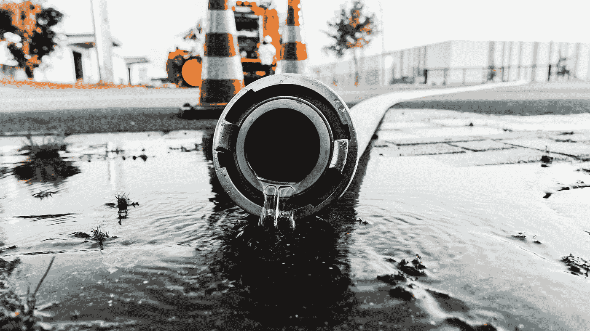
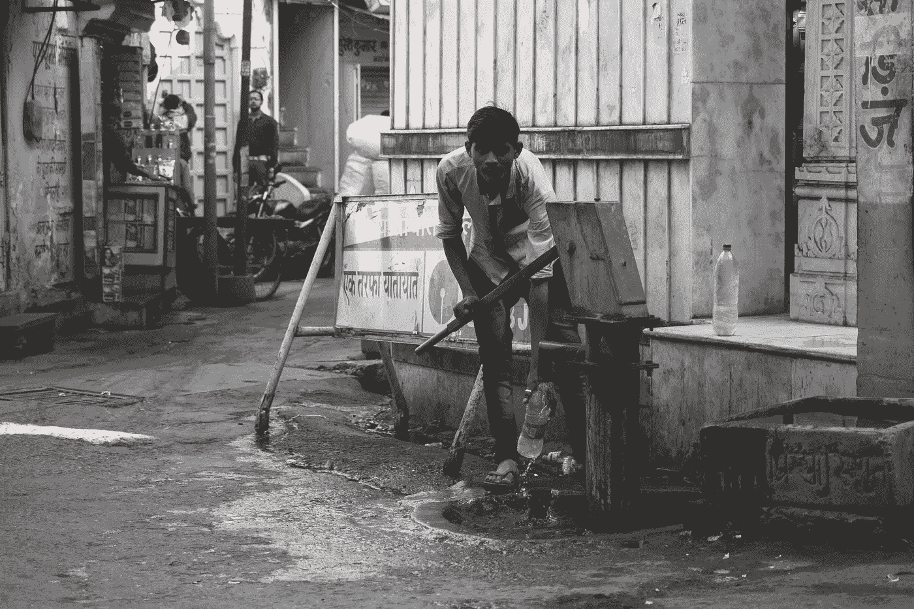
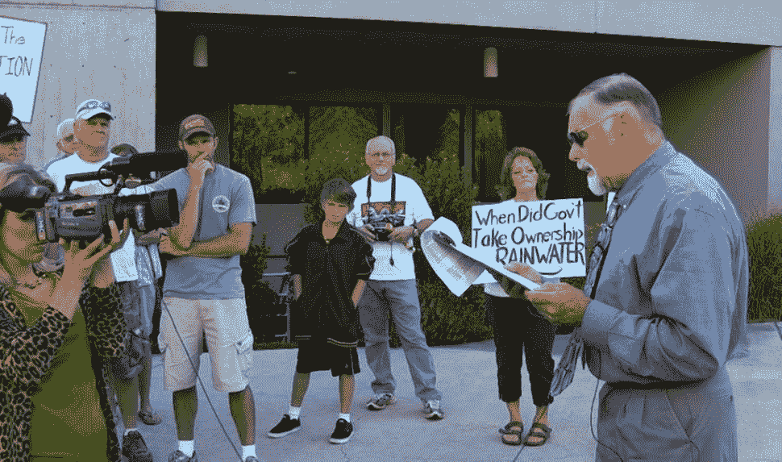

# 水和区块链:你需要知道的一切。

> 原文：<https://medium.com/hackernoon/blockchain-and-water-everything-you-need-to-know-b7e753108715>

## 一个关于冲突、垄断和浪费的故事…

Photo by [Daan Mooij](https://unsplash.com/@daanmooij)

很难想象没有自来水的日子。去年，在南非开普敦，有 400 万人被这个活生生的噩梦惊醒。官员预测该市还有 6 个月的储备。通过集体行动和该地区异常幸运的降雨，他们勉强避免了缺水。这并不是南非水问题的终结。气候变化和水资源管理不善继续导致缺水，加剧了政治、经济和邻里层面的紧张局势。

其他国家面临同样的命运。除非世界行动迅速，否则北京、东京、伦敦、伊斯坦布尔、巴塞罗那和墨西哥城都将在未来几十年内迎来末日。

但是空的水储备并不是唯一的问题。2018 年，仍有 21 亿人无法获得安全饮用水。

然而，这很容易被认为是理所当然的。毕竟，比以往任何时候都有更多的人可以获得干净的自来水。我们大多数人都认为水龙头里流出的水是廉价且无限的。只有当我们放眼全局时，我们才意识到水是多么宝贵。

# 水的真正价值

地球上有 3.26 万亿加仑的水。97%是盐水，不能喝。2.5%是淡水，但这大部分被困在两极或地下深处。这就给我们留下了大约 0.4%的土地来分配给 70 亿人和更多的牲畜(15 亿头牛和 190 亿只鸡)。它还必须与我们的整个工业和农业部门共享，为它们提供足够的水来发挥作用。气候变化、老化的基础设施以及渴望像西方一样消费的发展中国家，都将我们进一步拖入水资源短缺。

更糟糕的是，人类以无法公平分享资源而闻名。在整个人类文明中，战争一直在为水而战。腐败和冲突的循环延续至今。

# 问题#1:水资源冲突

以也门为例。水资源管理不善的恶性循环引发了一场政治危机，并导致社会高度不信任中央政府控制供水的能力。或者印度卡纳塔克邦和泰米尔纳德邦之间的长期冲突如何？过去几年越来越干燥的气候重新点燃了该地区的战火。法律纠纷引发了大规模的抗议活动，因为人们争夺水来维持家人的生命。

Photo by [Patrick Beznoska](https://unsplash.com/@patrick_beznoska)

跳到世界的另一边，2000 年玻利维亚政府将水私有化。这升级为“科恰班巴的水战”。在大规模冲突后，该市的水资源被重新收归国有，并获得了新的法律支持。然而，由于最近的缺水，在 25 年来最严重的干旱期间，玻利维亚农村的一些地区失去了 90%的农田。

一个地区的水越少，它就越有价值。对于许多社区和家庭来说，这是一个生死攸关的问题。但对于一小撮人来说，这是金钱和权力的机会。

# 问题 2:水资源垄断

金融界一直在密切关注全球淡水供应。高盛预测水将是 21 世纪的石油，他们已经根据既得利益采取了相应的行动。这个投资巨头并不孤单。其他强大的金融集团如 JP 摩根、巴克莱、汇丰和安联正在巩固他们对水资源的控制。

但是抢水不仅仅是金融机构的事情。富有的大亨们，如美国前总统老布什和石油巨头布恩·皮肯斯，正在购买数千英亩的土地和地下蓄水层、湖泊、水权、水务设施，并在世界各地的水利工程和技术公司中拥有股份。

那么为什么这是一个问题呢？举一个广为人知的美国俄勒冈州公民的例子。加里·哈灵顿因为在他的私人土地上收集雨水而被关进监狱。

从这个角度来看，亿万富翁 t·布恩·皮肯斯拥有的水权比美国其他任何人都多。他有权每年排水 20 万英亩-英尺。但是普通公民加里·哈灵顿却因为在自己 170 英亩的私人土地上收集雨水径流而被捕。当法律是为权贵设计的，以保持权力时，这种不平等是集中水资源管理的必然结果。如果水资源由一个单一的权力点控制或拥有，它将永远容易受到腐败或管理不善的影响。

Gary Harrington arrested for 30 days for collecting rainwater on his private land

为了解决这些不公平的水分配和垄断问题，我们需要更多的透明度。第四次工业革命浪潮能否提供答案？区块链技术计划提供大规模的水透明度。

# 区块链解决方案#1:水的透明度

区块链是一个安全、透明和分布式的公共账本，记录各方之间的交易。如果公共区块链用于水量和水质数据，这些信息不会被政府、公司或有权势的个人的腐败行为隐藏或改变。

这将信息访问和实时水管理方法推向了一个新的高度。关于水质和水量的数据现在可以用来在水资源日益短缺的时候做出更好的决定。

想象一下，家庭、工业消费者、水资源管理者和政策制定者都使用这些信息来决定何时节约或使用水资源。与容易滋生腐败和既得利益的中央水务管理者相比，这似乎是我们向更公平、更智能的水务系统发展的理想一步。

WATERIG 公司已经在香港开展了试点研究。他们正在开发雨水收集点。这些中枢连接到水处理系统，然后被引导到垂直农业(字面意思是在摩天大楼的侧面种植食物)和城市温室项目等应用中。因为这个系统是分散的，不同的社区可以决定什么最适合他们，然后使用区块链来众筹他们自己的水中心。

香港的 WATERIG 试验旨在增强社区在供水方面的适应能力和自力更生能力。美国密歇根州弗林特的悲惨事件提醒我们，糟糕的基础设施和疏忽的政府领导会造成多大的破坏。科学家和医生警告官员自来水中含铅量过高。可悲的是，没有采取任何行动，直到为时已晚。2016 年初，弗林特州长要求总统宣布重大灾难和紧急情况，并要求 2800 万美元的援助。其中一部分用于治疗铅中毒儿童。

一个基于区块链的水管理系统能防止这样的灾难吗？沃特里格分散的水收集点正试图减轻现有政府水收集和处理基础设施的压力。随着城市人口激增和基础设施恶化，这一点至关重要。

授权社区和小公司从雨水中获利激发了当地的经济机会。雨水通常会被浪费掉，但是当社区有机会利用区块链处理他们自己的雨水时，他们会更有动力去回收利用它。他们甚至可以创建小型企业，并从中受益。世界经济论坛报道说，雨水可以用来冷却和给工厂提供动力，或者用来制造肥料。社区变得更好，通常提供这些服务的系统的压力也减少了。

从这个角度来看，T2 2017 年联合国世界水发展报告发现 80%的雨水没有得到处理。换句话说，浪费了机会。随着气候变化和世界人口的增加，水资源变得越来越稀缺，社区将进一步受到激励，利用他们的集水中心。

# 区块链解决方案#2:合作实现更智能的水资源管理

通过多种技术的结合，水资源的效率和管理是否能得到更大的提高？区块链正在与物联网(IoT)合作，使我们城市的供水系统更加智能、安全和高效。

让我们以墨西哥城的供水网络为例。将近一半的水由于管道泄漏而浪费在他们的网络中。有了基于物联网的水资源管理系统，情况将会大不相同。该市的供水网络将配备智能传感器，收集水压和水质数据。通过互联网，这些传感器相互发送数据，以分析泄漏、管道破裂和污染。然后，他们迅速发出警报，通知水管理人员并调整水压，以避免进一步的损害。简而言之，物联网允许对城市供水网络的每个部分进行全面的洞察、自动化和控制。

同样的技术也可以应用在你的家里。智能传感器相互通信，以识别异常的用水量。该系统可以帮助你清楚地看到你的耗水量，帮助你改变你的行为和省钱。当你不在家时，如果有漏水，它会立即提醒你的手机。它甚至会自动关闭主供水系统，防止进一步的损害。

跨城市的水数据是有价值的，但就像任何自动化的东西一样，我们应该关注隐私和安全。在物联网系统中，所有数据都流向单一的安全智能点。所有的系统决策都是在这里做出的，这使得它很容易受到黑客攻击和操纵。想象一下城市的水自动化系统落入坏人之手——它可能花费数百万美元，并对国家安全构成威胁。

区块链通过使设备网络能够以其他方式保护自己，消除了物联网系统中的单点故障。区块链和物联网水网络的合作改变了我们管理水的方式，而不影响我们的安全。

# 这样够了吗？

区块链和物联网等技术让我们意识到，我们当前的水利基础设施已经完全过时，无法满足现代世界的需求。全球水危机的严重性要求创新。由于技术进步和意识的提高，我们有理由充满希望。然而，仍然有巨大的挑战需要克服。

将过时的水利基础设施数字化，或者完全取代它们，绝非易事。在这些下一代基础设施可以被整个城市使用之前，为了我们自身的安全，我们必须在未来保护它们免受黑客攻击和操纵。这需要政府、社区、行业领袖和企业的合作和前瞻性思维。

同样重要的是，我们要更加意识到水的真正价值。技术可以帮助我们在效率和管理方面取得巨大的进步，但如果我们继续把水当作一种无限的资源，我们将继续看到世界各地的零点。我们的个人用水量只占世界淡水的 8%。农业占 70%，其中大部分用于饲养牲畜。西方世界因其肉类消费而闻名，发展中国家也正步其后尘。随着水资源变得越来越稀缺，我们可能无法在全球范围内培育这种奢侈品。

我们必须努力提高对水资源分配方式的全球意识，并提出与下一代技术并行的前瞻性解决方案。

## 这位作者的更多阅读:

[*气候变化、区块链和巴黎协定:新的希望*](/@oliver.russellcw/climate-change-blockchain-and-the-paris-agreement-a-new-hope-558a32d7073)

[*区块链与能源:你需要知道的一切。*](https://hackernoon.com/blockchain-and-energy-everything-you-need-to-know-2c56977614aa)

## 是时候开始对话了

我想听听你的想法。让我知道你对使用区块链来改善我们的水资源管理有什么想法。