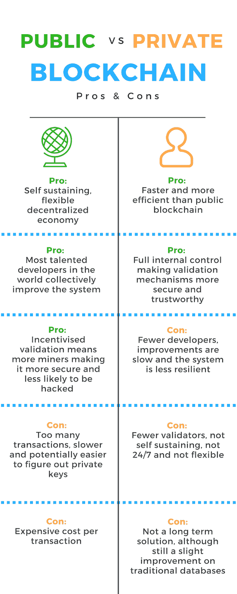

# 区块链架构分析:私有 vs 公有 vs 财团

> 原文：<https://medium.com/hackernoon/blockchain-architecture-analysis-private-vs-public-vs-consortium-65eb061b907b>

有很多关于私人与公共区块链孰优孰劣的问题，也有很多关于什么是区块链财团的困惑。对于那些希望开始自己的区块链项目的人来说，理解每个项目的好处、坏处和战略价值，以及它如何适合你的整体计划是必不可少的。

如果你想从区块链开始，看看我之前的帖子。

区块链是一个全新的项目，制定战略并充分理解不同解决方案的结构和可行性将决定你项目的成败。公司和企业家已经认识到为什么早期进入是如此有利，你要创造行业标准，这意味着你必须做得正确。你需要最好的团队、顾问、咨询师，以及那些深入了解这一点的人。

所以直接潜入…

构成区块链的核心属性是其验证者和驱动验证者的激励机制。

这是创造分权经济的关键点，也是公共区块链的优势和弱点。私人区块链也严重缺乏这一点，这使得财团成为两者之间的明智妥协。

具体来看一下公共与私人区块链的利弊，您可以看到下面的比较。

这是我在[区块链驱动](https://www.blockchaindriven.com/)咨询公司采访的专家提供的一个简单对比，他们认识到，由于缺乏对区块链技术本身的了解，选择私人区块链或 hyperledger 的决策者和高管存在巨大的困惑。

> “现在没有人对区块链有太多的了解，这将他们引向了错误的解决方案。尤其是高层决策者。为各种公司调查区块链的人都是得力助手，他们需要教育决策者，这会减慢整个过程，在这个过程中会丢失或误解有价值的信息。”
> - [Peter Borovykh，BlockchainDriven 的区块链解决方案架构师](https://bitcoinist.com/interview-with-peter-borovykh-author-of-blockchain-applications-in-finance/)

私有区块链的主要弱点是缺乏验证者和激励机制。

# 为什么验证器如此重要？

交易依赖于验证器，系统中的验证器越多，就越安全，被黑客攻击的可能性就越小。公共区块链对此过程有最好的激励，因为验证者或矿工能够通过随机验证过程获得加密货币。

私有区块链缺乏这种动机，因为它们纯粹是为一家公司内部使用而设计的，很少或没有互操作性。可能的验证者更少，并且只有一个中央组织负责监督验证过程，这意味着它不能成为一个自我维持、不断发展的机制，并且远没有那么灵活。如果没有验证器的激励，系统可能会死亡，这在创建一个长期使用的系统时是不理想的。

这是二等兵区块链最大的弱点。

想象一下微软 Word 和谷歌 Docs，就好像他们是区块链。用户必须将 Word 下载到他们的计算机上，并自己跟踪更新，即使这样，更新也很大程度上是分散的，只有内部发现的错误。另一方面，谷歌文档是在线的，这使得在任何地方都可以更容易、更安全地访问，正因为如此，用户不需要做任何事情就可以进行更新，而且它会自动、一致地更新。用户也更容易捕捉和报告错误，这意味着系统有更好、更快的改进。

这是一个非常简单的类比，但在这里适用。不仅如此，公共区块链可以由世界上所有最好的开发人员来开发，而不仅仅局限于一个内部团队。

当然，区块链也有自己的弱点。

对于当前的激励系统，工作证明(PoW)，交易成本很高，加上他们有太多的交易，使其更容易跟踪交易的来源并找出私钥。有一些解决方案可以解决这个问题并最大限度地提高安全性，但这是企业选择不使用公共区块链的主要原因。

# **误解:**

**#1** 公司害怕公开信息，这是对公共区块链的一个主要误解。一个例子是，我向一个商业伙伴做了一个声明，并将该信息输入到区块链中。验证器看不到这些细节，它们验证的是我对谁做了这个声明，而不是声明本身是什么。这些信息仍然是私人的和安全的，另外，我根本不需要把这些放在区块链上。

**#2** 区块链上验证的所有信息都是真实的。如果我说我运送了一吨有机产品，并且在区块链得到了验证，这并不意味着产品实际上是有机的。区块链最适用于数字信息，而非物理信息，但它确实创建了一个问责系统。如果那种产品被证明不是有机的，那种投入仍然保存在区块链上，并且可以追溯到我。

**#3** 区块链不能用于数字信息以外的任何东西……孰是孰非。随着物联网(IoT)技术取得重大进展，在可预见的未来，数字化物理并为其创建自动化流程是可行的。

# **财团**

如前所述，对于企业来说，联盟是一个很好的妥协，因为它允许不同部门和公司之间的通信，同时仍然允许决策者限制对数据和验证的访问。在区块链技术改进之前，联盟是目前最好的企业解决方案。

像 hyperledger 这样的私有区块链并不是真正的区块链解决方案。他们没有真正的分权，他们过于依赖内部团队，并且没有长期发展的能力。安全性可能是阻碍区块链发展的最大恐惧，也是 hyperledger 受欢迎的主要原因。

但归根结底，隐私是有时间标记的，这意味着任何被记录的私人信息最终都会公开。如误解 1 所示，公司没有必要让所有人都看到公开区块链的细节。

当然，区块链项目的战略要深入得多，所以请继续关注我的下一篇文章，它将深入探讨区块链战略。