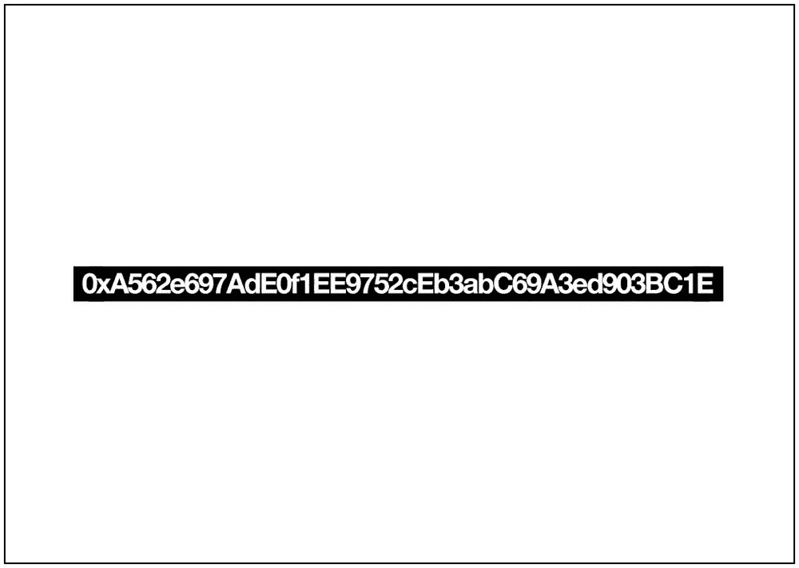

# 区块链艺术:什么是无价的？

> 原文：<https://medium.com/hackernoon/blockchain-art-what-is-priceless-a499ecaa1322>

Kevin Abosch & Ai Weiwei — Berlin 2018.

> 故事转载自[whatispriceless.com](http://whatispriceless.com)。

从我们来到这个世界的那一刻起，就有人试图赋予我们价值。他们可能会说，“那边那个男生好有潜力”或者“那个女生一文不值。”事实上，历史表明，整个社区和族裔被贬低到如此程度，甚至为种族灭绝铺平了道路。

我的父亲是一名难民，他的犹太父母在奥斯威辛被纳粹杀害。现在，成千上万的罗辛亚人已经离开了他们在缅甸的家园。虽然我认为任何人的生命都是无价的，但似乎有些人只能以这种方式与他们自己的生命或他们的朋友和家人的生命联系起来。我的大部分作品都在探索我们到底是如何以及为什么珍视任何事物，尤其是当我们考虑生命本身的价值时。我们说一件古代艺术品也是无价的，但肯定没有人的生命值钱，对吗？社会与无价之宝有着复杂的关系。我想进一步探索这一点，并在我的朋友艾未未身上找到了一个艺术合作者，他比我能想到的任何人都更关注全球难民危机。他也着迷于价值和身份的本质。作为一项练习，我们试图让那些觉得把所有东西都视为商品更容易的人更容易理解无价之宝。一段时间以来，我一直用区块链的地址作为提取情感价值的代理，和薇薇一起，我们“标记”了我们一起分享的无价时刻。表面上看，这些时刻中的一些可能显得平淡无奇，而另一些则是微妙的挑衅，但这些转瞬即逝的时刻，如:“分享茶”和“无忧无虑地沿着 Schö nhauser Allee 散步”或“谈论艺术市场”，是人类经验的基石。生命中的所有时刻都是无价的。每一个无价的时刻都由一个独特的区块链地址来代表，这个地址由我们创建的名为“无价”(符号:PRCLS)的少量虚拟艺术品(加密令牌)来“接种”。该项目只制作了 2 个 ERC20 代币，但由于它们可以被分割到 18 位小数，这些虚拟艺术作品有可能被分发给数十亿人。此外，制作了非常有限的一系列实物印刷品。两个无价的代币中的一个无论如何也买不到。剩余的代币将被分成一个代币的一百万个部分，并提供给个人收藏者和机构。这些艺术品当然可以被分成小得多的艺术品，因为无价之宝可以被分割到小数点后 18 位。在艺术界，大型作品的价格高于类似的小型作品并不罕见，因此《无价之宝》中较大部分的价格应该高于较小部分。我们评价事物的一种特殊方式是——更大的尺寸/数量=更大的价值。问题是，如果一个代币是无价的，而且确实无法得到，那么我们如何评价另一个可以得到的代币呢？

我们到底为什么要珍惜任何东西？

# 艺术家们

## 艾未未

艾未未是中国当代艺术家，涉及艺术、设计、雕塑、建筑、策展、摄影、写作、电影以及社会、政治和文化批评。他的活动主要集中在言论自由和支持人权和社会正义的方式上。

## 凯文·阿波施

凯文·阿博施是一位爱尔兰概念艺术家，他以摄影、雕塑、装置、电影和区块链技术而闻名。Abosch 的工作阐述了身份、价值和人类货币的本质。

# 物理作品

这些作品以区块链钱包地址的字母数字为特色，代表艺术家之间分享的不同“无价时刻”。每个钱包都装有一定数量的 PRCLS 令牌，以验证钱包并象征性地接种疫苗。以下是几个例子:

## 无价的

## “分享茶”

## “你有一个大鼻子——你有一个大鼻子！”

## 无忧无虑地走在 Schö nhauser Alle

## 去他妈的激进分子

## 我是加密货币

## 洞的大小

# 虚拟作品

无价令牌(符号:PRCLS)是以太坊区块链上的一个 ERC20 令牌。这个项目只创造了 2 个代币，但是由于它们可以被分割成 18 位小数，这些虚拟艺术作品有可能被分发给数十亿人。查看以太扫描 [**上的 PRCLS 这里**](https://etherscan.io/token/0x6c5315dfc0153f1c49cc819045961e779e6b6cf1) **。**

> 故事转载自[whatispriceless.com](http://whatispriceless.com)。