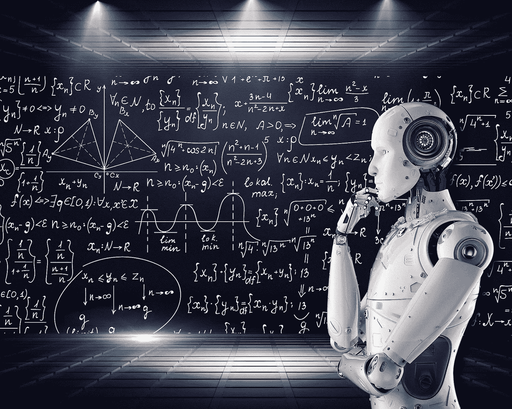

# 区块链能否确保人工通用智能发展造福人类？

> 原文：<https://medium.com/hackernoon/blockchain-artificial-general-intelligence-benefit-humanity-230e213cae12>

## AGI 还不存在，但虚构的智能机器消灭或奴役人类的描述比比皆是。一家初创公司希望能利用区块链将 AGI 发展成一个更加乌托邦式的地方。

## 什么是人工通用智能？

人工智能或“AI”指的是能够像人一样学习和执行任务的机器。“人工通用智能”(AGI)是不同的东西。这就像把所有的人工智能设备结合成一个网络。这个网络将远远大于其各个部分的总和，因为它将能够通过每台机器的综合经验以及机器之间的相互作用来产生一个*集体*人工智能。

因此，AGI 将把最好的类人思维和推理与计算机优于人类的优势——完美的回忆和近乎即时的计算能力——结合起来。如果 AGI 也能像人一样灵活机动地控制机器人，那将会产生一种新型的机器，可以取代人类的任何角色。虽然 AGI 还不存在，但专家们一致认为它的发展是不可避免的。问题是这种发展会导向什么方向？

## 反乌托邦还是乌托邦？

我们都熟悉虚构的反乌托邦描绘的智能机器消灭或奴役人类，例如，*《黑客帝国》*、 *2001:《太空漫游》*和*《终结者》*系列*。不是每个人都认为这样的场景很牵强。SpaceX 和特斯拉创始人 Elon Musk [称](https://www.theguardian.com/technology/2017/jul/17/elon-musk-regulation-ai-combat-existential-threat-tesla-spacex-ceo) AGI 是人类面临的“最大的生存威胁”，著名物理学家和剑桥大学教授 Stephen Hawking [说](https://www.bbc.com/news/technology-30290540)“全人工智能的发展可能会导致人类的终结”。*

与此同时，这种可怕的预测可能走得太远了。一个等同于或优于人类的 AGI 也有助于开发解决今天似乎难以解决的问题的方法，例如气候变化和战争。尽管如此，至少我们必须担心，AGI 是否只会让统治当今世界的一小撮有权势的人拥有更好的大规模监控和人口控制手段。鉴于大多数人类历史似乎反映了赢者通吃和强权即公理的原则，我们(人类)可能只有一次机会让 AGI 变得正确。

## 区块链和去中心化应用:一家初创公司的 AGI 解决方案

开发有益 AGI 的挑战看起来势不可挡，但一些创新者正打算这么做。Kassy.ai 是一家新成立的公司，目标是创建一个社区开发的开源 AGI。Kassy 计划通过创建一个“知识即服务”(KaaS)区块链来实现这一目标，作为全球人工智能计算系统的基础设施。Kaasy 网络将提供一套套件，开发人员可以使用这些套件来扩展他们的软件应用程序，更好地优化处理时间和访问负载平衡计算。开源的 KaaS 区块链代码也可以被分叉以创建私有知识区块链，用于可能涉及隐私问题和其他数据限制的任务。

在 KaaS 区块链的基础上，Kassy 将建立一个人工智能算法市场。市场将是分布式的，因此任何人都可以使用和添加新的算法。人工智能算法可以优化，以运行分布式计算和机器学习，从而产生任何人都可以使用该平台的人工智能技能。应用包括视频处理、机器学习、分子模拟、人工智能对话伙伴、员工即服务解决方案、增强和虚拟现实解决方案以及实时机器人车队管理。该市场还将有一个内置的补偿机制，当有人使用他们的算法时，贡献者可以获得奖励。复杂技能的技能奖励以树的形式发放，每个复杂技能的奖励在它自己和综合的简单技能之间分配。

## 建设一个有益的 AGI

在短期内，Kaasy 的计划包括在一个项目生态系统内连接一个全球人工智能专家社区，让每个人都为他们希望人工智能发展的方向做出贡献。然而，上述技术特征支持 Kassy 的长期目标，即使用区块链技术使人工智能在最简单的应用程序和设备中可用，这反过来将成为未来全球人工通用智能的基石。

*订阅我的* [*中*](/@minadown) *和* [*推特*](https://twitter.com/minad21) *频道如果你想了解区块链和加密货币项目。

如果您对本文有任何疑问，请在下面的版块发表评论。弗劳斯夫。谢谢大家！*