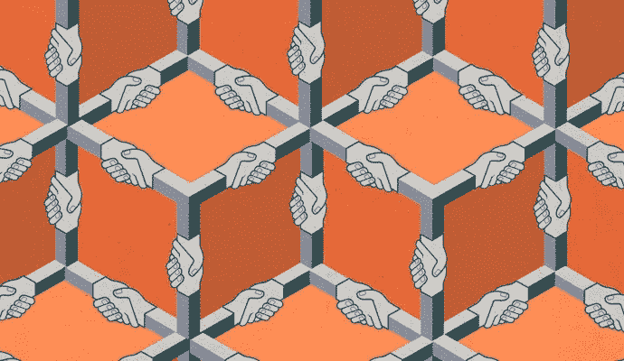

# 区块链即服务:2300 万个理由帮助推进区块链的未来

> 原文：<https://medium.com/hackernoon/blockchain-as-a-service-23-million-reasons-to-help-advance-the-future-of-blockchain-8322bf28e201>

**作者 Mustafa Inamullah** ，创意内容和设计负责人， [MIMIR 区块链解决方案](https://www.mimirblockchain.solutions/#/)

[Photo Courtesy](https://i1.wp.com/www.strategy-business.com/media/image/A-Strategists-Guide-to-Blockchain_thumb5_690x400.jpg)

[区块链](https://hackernoon.com/tagged/blockchain)即服务(BaaS)将在未来许多年里在信息[技术](https://hackernoon.com/tagged/technology)领域扮演重要角色。

如果你不知道什么是区块链即服务，BaaS 就是一个实体为你设置所有的“区块链技术”。如果您为 BaaS 付费，您就要付钱给一家公司来代表您设置区块链连接节点。BaaS 提供商将为您或您的企业处理令人困惑的后端。

本文假设读者对区块链技术有初级到中级的理解。你可能听说过“区块链”、“比特币”，甚至“以太坊”

我们需要解决的第一个问题是收养。区块链会变得多大？有多少公司将计划采用区块链的技术？区块链是下一代互联网的基础技术，还是仅仅是昙花一现？

一旦我们理解了区块链技术的规模有多大，一旦我们理解了区块链将颠覆多少行业，对 BaaS 的需求就变得显而易见了。

我们认为，BaaS 将成为推动技术采用的重要催化剂。消除等式中的困难负担将允许广泛的企业和行业在其现有平台中采用区块链。

不过 BaaS 也有一些限制。BaaS 是达到目的的一种手段。BaaS 必然会给区块链增加一些中央集权，这从来都不是理想的。区块链的目的是用分散的方法解决集中的问题。这可能是银行，也可能是任何可信的中间人。

尽管 BaaS 确实需要依赖一个集中的第三方，但这是将区块链技术推向世界的有力一步。为了达到这一点，我们必须首先检查区块链炒作。

# 区块链是一件大事

你可能已经注意到了最近围绕比特币和区块链的所有讨论。这不全是投机炒作，尽管确实存在大量的投机行为。没有做过研究的人可能只是因为炒作而跳进“密码俱乐部”，但这并不意味着整个行业都是投机的。

区块链开始在我们的社会结构中扎根。根据 Gartner 的数据:“截至 2017 年 2 月，“区块链”是 Gartner.com 第二大搜索关键词，在过去的 12 个月里增长了 400%。”

人们开始注意到了。快速浏览一下 google trends，你会发现在过去的几个月里，人们对区块链的各个方面的兴趣都呈指数级增长。但是所有这些兴趣不仅仅是好奇。

看看最近 ICO 的增长就知道了。2017 年，ICO 市场增长超过[40 亿美元](http://www.businessinsider.com/ico-funding-soars-above-4-billion-as-us-regulators-crack-down-2017-12)。对区块链表现出商业兴趣的不仅仅是新的创业公司。

据 [IBM](https://www-01.ibm.com/common/ssi/cgi-bin/ssialias?htmlfid=GBP03467USEN&) 称，“91%的受访银行正在投资区块链解决方案

到 2018 年吸收存款，以防范初创的非银行机构。“这清楚地显示了区块链对金融业的影响有多大。

甚至有[估计](https://www.mckinsey.com/industries/high-tech/our-insights/how-blockchains-could-change-the-world)谷歌的全部计算能力仅仅是比特币区块链的 5%。这还不到区块链全部计算能力的 5%。这只是与比特币的区块链相比。

不仅仅是银行业，还有几十个行业可能会被区块链打乱。这可能包括网络安全、学术界、政府、音乐和艺术，甚至乘车共享。这个列表还有其他几个潜在的候选人，但我们只需要把这一点说清楚。

区块链即将成为我们日常生活的一部分。

大人物们已经把他们的帽子扔进了区块链圈。微软一直在向他们的云计算平台 Azure 添加 BaaS 模块。微软的 Azure 专注于以太坊区块链。

IBM 也构建了自己的 BaaS 服务。它是基于 Bluemix 云平台的 Hyperledger BaaS 系统。他们更关注区块链的私人财团。

还有其他玩家。Ardor 是一个 BaaS 平台，允许人们使用 NXT 区块链。他们使用“子链”将 BaaS 带到等式的前面。他们没有将 BaaS 作为事后的想法，而是为公司预装了使用他们的 BaaS 平台的能力。

既然我们理解了区块链的这种快速兴趣和增长，我们就可以开始理解 BaaS 是多么重要了。

# BaaS 是急需的

没有多少人意识到 HTTPS 有多重要。这根本不是最终用户需要理解的技术。由于这个原因，T2 经常被认为是理所当然的。

没有 HTTPs，在线业务将是不可能的。否则，所有的密码和信息将对所有人公开。互联网上没有什么是安全的。

但是有多少人真的知道呢？尽管几乎每天都在使用 HTTPS，但普通用户不会告诉你 HTTPS 为他们做了什么。这就是 HTTPS 如此伟大的原因。

IBM 全球服务部门电子商务战略副总裁 Dev Mukherjee 曾经说过，“当技术变得无形时，它才变得真正有用。”

作为一种实现安全在线业务的方式，HTTPS 是完全有用的，当最终用户使用时，几乎没有任何迹象。它无处不在，却又看不见。这就是你如何知道它是一项真正有用的技术。

当区块链达到这个水平时，它将是有用的。BaaS 允许技术的区块链部分相对不可见。如果不是看不见，它至少是半透明的。这是朝着正确方向迈出的一步。让别人替你处理区块链肮脏的后台，可以让你或你的企业从区块链技术中受益，而不必真的与区块链技术打交道。

与区块链交互时有两个选项。你可以直接设置你的节点，然后脱掉区块链的隐身衣，或者你可以让其他人帮你做这件事。这就是 BaaS。这是你的第二个选择。

问题是，这种选择的需求有多大？

据[以太扫描](https://etherscan.io/chart/address)报道，目前仅在区块链以太坊就有超过 2300 万个唯一地址。这让你对有多少人试图与区块链服务互动有了一个大致的概念。

根据[以太节点](https://www.ethernodes.org/)统计，以太坊区块链大约有 26000 个连接节点。这意味着最多有 26，000 人与区块链直接相连。

你可能想知道，“其他 22，974，000 人是如何与区块链互动的？”这是因为 BaaS 运营中使用了许多这样的节点。他们代表最终用户与区块链进行交互。

这表明，区块链连接的需求超过供应约 88，462%。这充分证明了对 BaaS 的强烈需求。数百万人通过 BaaS 与区块链互动。对于个人和商业利益来说，区块链只会有望大幅增长。

这甚至还不包括对基于物联网的世界的未来预测。如果世界想要将区块链技术连接到物联网，他们根本不能依靠直接的节点连接。不可能让每台微型物联网计算机都承担连接区块链的负载。他们可以做的是向 BaaS 操作发出请求，然后由 BaaS 代表物联网设备完成所有繁重的工作。我们越是看到物联网融入区块链和加密货币，我们就越会看到对 BaaS 的需求。

BaaS 是重要的一步。没有它，我们就无法将区块链带入主流。也就是说，在一个完美的世界里，我们不会有中央化的 BaaS。

我们知道区块链生态系统的发展需要区块链，现在让我们看看一个完美的区块链生态系统是什么样的。

# 区块链的完美世界

那么区块链的完美世界是什么样子的呢？

区块链当然是极其令人印象深刻的技术，但它确实有一些局限性和缺点。让我们先解决最大和最相关的问题。

对于这个巨大的电力问题，我们该怎么办？

比特币本身用的电足够把自己比作一个小国。在密码挖掘的世界里有一场如此疯狂的军备竞赛，以至于计算机产生了左和右。区块链网络现在无疑是世界上最大的计算机网络之一。

这可能是一个灾难性的经济和环境问题。这个问题的一个很好的解决方案是利害关系证明(PoS)。新的 [Casper](https://blockonomi.com/ethereum-casper/) 协议将以太坊当前的工作证明(PoW)标准转换为利益证明。这意味着你不会有成吨的矿工与计算能力竞争。取而代之的是，你将有更少的“赌注者”放下赌注以确保安全。这就避免了计算安全对安全的需求，而代之以投资股份的安全。这将大大减轻电力负担。

事务性能力呢？区块链有能力处理每天发送数十亿笔交易的全球化世界的负荷吗？区块链什么时候能够每秒处理 10 万个请求？

最近[的 Crypto Kitties 惨败](https://www.nytimes.com/2017/12/28/style/cryptokitties-want-a-blockchain-snuggle.html)显示了以太坊这样强大的区块链是如何无法完全应对采用的爆炸式增长。在这个例子中，大量的人涌入区块链以太坊购买和交易加密小猫。这几乎扼杀了网络，运营成本急剧上升。

幸运的是，以太坊的一些最聪明的头脑正在研究这个问题的解决方案。[等离子](/chain-cloud-company-blog/plasma-in-10-minutes-c856da94e339)使用一种被称为雷电网络(Raiden)的技术来极大地帮助以太坊扩大规模。这是由以太坊最杰出的领导人维塔利克亲自领导的。通过使用雷电网络作为以太坊区块链的延伸，它将有助于防止瓶颈。

但是这些代币呢？它们太多了，以至于加密货币有遭受“厨师太多”困境的风险。

以太坊最聪明的头脑之一 Gavid Wood 博士正在研究解决方案。他的项目名为 [Polkadot](https://polkadot.io/) ，使用利益证明机制来实现令牌互操作性。这将允许区块链彼此无缝交互。

那么现在回到“BaaSics”，理想版的 BaaS 是什么样子的呢？有两种可能。它可能看起来像 Ardor 和 Nxt，其中 BaaS 被预先载入区块链的基本面。

或者，这里是 [MIMIR 区块链解决方案](https://mimirblockchain.solutions/)我们正在创建世界上第一个去中心化以太坊服务提供商(DESP)。我们正在使用利益相关机制的证据来支持分散的 baa。MIMIR 没有让一个实体为您建立所有的区块链基础设施，而是创建了一个系统，在这个系统中，26，000 个节点可以协同工作，将区块链接入共享给不断增长的 2，300 万想要接入区块链的人。MIMIR 不是依靠一个集中的团体来共享区块链接入，而是依靠一个分布式模型，在这个模型中，所有连接的节点都可以有偿地为人们做繁重的工作。

在一个有卡斯帕、等离子、波尔卡多特和米米尔的世界里，区块链有能力在我们的日常生活中扮演巨大的角色。如果没有当前的 BaaS 系统，我们可能永远无法实现这一目标，但一旦实现，采用分散的 BaaS 模式将非常重要。

区块链的目的是提供分散的解决方案。这种去中心化还不完美，因为它仍然是一种新技术。正因为如此，BaaS 是区块链迫切需要的拐杖，它需要去哪里就去哪里。

免责声明:本网站提供的内容是关于区块链世界相关主题的观点和评论。出于任何原因，您不打算也不应该依赖它，它是按“原样”提供的，没有任何类型的保证。您对自己的决定负责，并对任何内容进行正确的分析和验证。