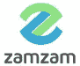
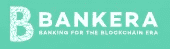
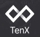

# 区块链银行评级🏆— 15 家顶级金融科技初创公司

> 原文：<https://medium.com/hackernoon/blockchain-banks-rating-15-top-fintech-startups-f35e0782c6c>

由于将[区块链](https://hackernoon.com/tagged/blockchain)T2 技术融入运营活动，到 2022 年 200 亿美元可以拯救世界银行业。该信息由咨询公司埃森哲提供。尽管事实上六个月前大银行家们对区块链持否定态度，但最近几个月，有很多消息称，最大的银行正在投入数百万和数千万美元将区块链整合到他们的业务中。

与此同时，有许多初创公司正在努力创建一家区块链银行，一方面，它将利用传统银行的优势和区块链技术的透明性。

我们分析了所有制造区块链银行或产品线类似于银行的支付系统的初创公司，并进行了评级。它包括那些通过 ICO 吸引或已经吸引资金的项目，以及从风险投资者那里筹集资金的初创公司。

我们没有在样本中包括大型国际银行的公用事业结算硬币和金融科技财团，以及像 Ripple 和 BitPay 这样与转账和银行业务相关的大型初创公司。样本包括相对较新的、有前途的初创企业，它们依靠私人或机构投资者的资金白手起家。

我们根据以下参数对每个项目进行了评级:

*   项目开发
*   团队体验
*   产品竞争力
*   增长潜力
*   新闻背景

# 区块链银行初创公司评级

1.  🥇OMI sego——总部:新加坡|募集资金:2500 万美元。
2.  🥈革命——英国| 2.5 亿美元。
3.  🥉扎姆扎姆—土耳其|无数据
4.  保留—立陶宛|＄1400 万。
5.  MenaPay 土耳其|无数据
6.  crypterium——爱沙尼亚| 5160 万美元。
7.  UTRUST —瑞士|＄2000 万美元。
8.  Bankera —立陶宛| 1.509 亿美元。
9.  CoinsBank 英国|无数据
10.  Humaniq —英国| 520 万美元。
11.  TenX —新加坡|＄8000 万美元。
12.  Paygine 美国|无数据
13.  英国 Wirex 公司| 320 万美元。
14.  马来西亚 hada DBank |＄300 万美元。
15.  比特瓦拉—德国|无数据

# 奥米塞戈

**评分** : 4.8 / 5

该项目开发的技术允许用户将货币兑换和支付服务实时结合起来。买方以方便的货币支付账户，并且对于货币和分散式加密货币，以方便的格式向接收者存入资金。

该产品的想法是创建一个开发应用程序的平台，允许该项目的任何用户通过网络发送资金，而无需银行账户和支付佣金。该项目有许多强有力的战略伙伴，包括 Vitalik Buterin。而 OmiseGO 只开发了 SDK 钱包，用户可以用加密货币兑换法定货币。

**国家**:新加波| **募集**:2500 万美元。| **网页**:[https://omis ego . network/](https://omisego.network/)

# 革命报

**评级** : 4.6 / 5

重点是缺乏转让和交换的佣金。该项目被定位为一个移动应用程序，用户可以在其中存储加密货币和法定货币，以及快速将法定货币转换为加密货币，反之亦然。此外，在世界任何地区都可以使用 Revolut 卡进行支付。

该项目的缺点是钱包内只有将法币转换为加密货币的可能，无法提取加密货币。然而，该项目得到了大型机构投资者的支持，他们在没有 ICO 的情况下投资了该项目。

**国家**:英国| **筹集**:2.5 亿美元。| **网页**:[http://revolut.com](http://revolut.com/)

# 扎姆扎姆

**评级** : 4.5 / 5

Zamzam 展示了个人、组织和政府之间财务关系的渐进生态系统。该项目是开发区块链银行与具有革命性的手机银行应用程序的数字银行牌照。Zamzam 表示，你所需要的只是输入收款人的电话号码、付款金额，仅此而已。即使收款人还没有 Zamzam 钱包，也会转账。

该项目的优势是在不同国家拥有强大的团队和游说力量。后者是区块链项目中非常罕见的问题，在监管银行系统的项目集成方面非常有用。

**国家**:土耳其| **抚养长大**:无数据| **网页** : [http://zam.me](http://zam.me)

# 保持

**等级** : 4.5 / 5

该服务提供一个帐户和一张卡。账户持有人可以通过提供固定利率的短期贷款，立即将其加密货币资产转移到菲亚特。贷款时加密货币的转换及其回报以当前汇率发生。该项目是一种银行合并，P2P 借贷。

但这是该项目的主要缺点，因为这种合并的过程并不详细，也没有详细地制定出来。平台没有发布。此外，根据规则，该系统的借款人必须立即支付贷款利息，这使得该产品缺乏竞争力。

**国家**:立陶宛| **筹集**:1400 万美元。| **网**:[https://hold.co/](https://hold.co/)

# MenaPay

**评级** : 4.4 / 5

中东第一个完全支持的区块链支付网关。MenaCash 正在开发迄今为止最全面、最具破坏性的解决方案，以解决希望在线购物、转账或只是购买加密货币的消费者所面临的主要“金融系统困境”。

**国家**:土耳其| **饲养**:无数据| **网络**:[https://menapay.io/](https://menapay.io/)

# 隐窝

**评级** : 4.1 / 5

一家加密银行，提供开户和创建虚拟卡，用于添加 NFC 支付应用程序，NFC 是一种用于商品和服务无线支付的系统，当用户需要使用带有特殊设备的手机时。使用 Crypterium 的帐户可以转移加密货币，这些货币在支付后将被转换为法定货币。这种虚拟卡可以在任何支持 NFC 的商店中用于支付。

不利的一面是每笔交易 0.5%的高额佣金，而且宣布的开发计划的主要部分仍未实现。

国家:爱沙尼亚| **筹集**:5160 万美元。| **网**:[https://crypterium.com/](https://crypterium.com/)

# **优信任**

**等级** : 4.0 / 5

Utrust 平台是一个支付处理器解决方案，使商家能够接受买家的多种加密货币作为支付方式，同时以法定货币接收。买方项目将通过提供全额付款保护和充当第三方调解人，最大限度地降低诈骗和欺诈的风险。

对于卖方来说，Utrust 提供了一次接受多种加密货币的机会，这样所有收到的付款都将被转换为法定货币，以保护卖方免受市场价格波动的影响。

**国家**:瑞士| **募集**:2000 万美元。| **网**:[https://utrust.io/](https://utrust.io/)

# 班克拉

**等级** : 3.7 / 5

最成功的银行 ico 之一，已融资超过 1.5 亿美元。他们开发了几种产品:钱包、借记卡、接受商业支付的处理系统和交易所。令人尴尬的是，ICO 于 2018 年初完成，在过去的六个月里，项目的开发没有任何进展。结果，代币的价格下跌了 80%以上。

**国家**:立陶宛| **筹集**:1.509 亿美元。| **网**:[https://bankera.com/](https://bankera.com/)

# 硬币银行

**评级** : 3.6 / 5

该项目同时致力于几个不同方向的服务——从带有移动应用程序的多货币钱包到用于商业和加密交换的互联网获取。

该项目的发起人是 Wirex，也在这个评级里。这个项目的缺点是用户对高佣金和长期交易的抱怨很多。

**国家**:英国| **提高**:无数据| **网页**:[https://coinsbank.com/](https://coinsbank.com/)

# 人类智商

**评级** : 3.4 / 5

Humaniq 是一个建立在区块链的金融生态系统，专注于简单快速地将无银行账户的人与全球经济联系起来。它结合了一家区块链银行作为金融服务和技术初创公司的核心平台，取代护照和签名的生物识别技术，ICO 和分布式所有权而不是股东，以及一只用于第三方初创公司收购和加速的投资基金。

2017 年 4 月，该项目通过 ICO 筹集了超过 500 万美元的资金。，但从那以后 MVP 仍然没有发布，Humaniq 的未来也不确定。

**国家**:英国| **筹集**:520 万美元。| **网**:[https://humaniq.com/](https://humaniq.com/)

# **天赐**

**等级** : 3.3 / 5

TenX 是一家雄心勃勃的新加坡初创公司，旨在将区块链带入现实世界，获得银行牌照，并向客户发放借记卡。该项目还开发了加密货币钱包，以及针对 Webapp、iOS 和 Android 的应用程序。

该项目的市值一度接近 5 亿美元。，但现在它接近 1 亿美元。代币价格下跌的原因是，其银行合作伙伴 WaveCrest 突然失去了 Visa 作为借记卡发行商的许可证。此后，TenX 没有解决问题。

**国家**:新加波| **筹集**:8000 万美元。| **网**:[https://www.tenx.tech/](https://www.tenx.tech/)

# Paygine

**等级** : 3.1 / 5

该团队正在基于 Fast2Pay 项目创建一个基于区块链的平台，用于开发加密货币运营的企业解决方案。Paygine 不是一个支付服务，而是一个创建支付应用的平台。pro-plan 的缺点是，用户可能不包括一个精心制定的开发计划，还包括一个几乎 100%讲俄语的团队，这通常会引起除 IT 专家以外的市场关注。

**国家**:美国| **抚养长大**:无数据| **网页**:[https://paygine.com/](https://paygine.com/)

# Wirex

**等级** : 3.0 / 5

一家区块链银行，目标是创建一个同时存储法定货币和加密货币的平台。该项目没有进行 ICO，但从几个风险基金收集了 300 万美元。

该团队自 2015 年以来一直致力于该项目。Wirex 因大量的系统故障而受到批评。用户帐户的数据会定期更改。此外，实体银行卡发行延迟的情况也屡见不鲜。

国家:英国| **筹集**:320 万美元。| **网**:[https://wirexapp.com/](https://wirexapp.com/)

# 哈达银行

**等级** : 2.4 / 5

该项目的口号是 Hada DBank 是第一家将伊斯兰银行模块与区块链技术相结合的数字银行。该平台旨在提供基于保护企业的金融法律的伊斯兰银行方法。该平台以 1:3 的比例提供最大的资产负债。

该项目的缺点是，这一合并的过程并不详细，并没有详细制定。平台没有发布。

**国家**:马来西亚| **加注**:300 万美元。| **网**:[https://hada-dbank.com/](https://hada-dbank.com/)

# 比特瓦拉

**等级** : 2.3 / 5

Bitwala 团队正在创建一种银行服务，允许同时为大量法定货币和加密货币创建账户，并发行借记卡来支付商品和服务。

2018 年初，Visa 冻结了计划发卡的合作银行 Bitwala cards。自那以后，该团队尚未找到替代合作伙伴。

**国**:德| **养**:无数据| **网**:[http://bitwala.com/](http://bitwala.com/)