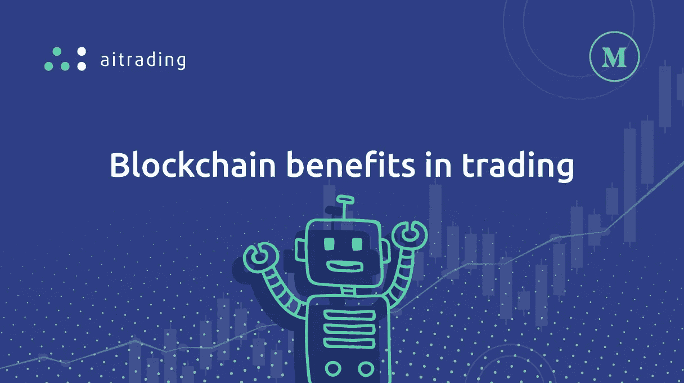

# 区块链在交易中的优势

> 原文：<https://medium.com/hackernoon/blockchain-benefits-in-trading-d981753677e2>

锁链最初是由**中本聪于 2008 年发明的，这是一个幻想的名字，用来代表一个人或一群人——真实身份仍然未知。**最初的目的是为将于 2009 年推出的虚拟货币比特币创建一种会计方法。然而，在过去的十年里， [**区块链技术**](https://hackernoon.com/blockchain/home) **的发展超出了人们的预期，因为它正在被广泛应用于其他领域，并迅速颠覆了医疗保健、航运和能源等行业。**

> “今天，区块链对电脑爱好者来说可能只是一个小饰品。但一旦被广泛采用，它将改变世界，”*IBM 首席执行官 Ginni Rometty 在 2016 年底的《华尔街日报》上写道。*

## 区块链是一个去中心化、数字化和分布式的基于云的所有交易的公共账本，它使用概念证明方法来验证每一笔交易——一个复杂的数学方程，即使是最聪明的计算机也需要花费相当多的时间和精力来解决。

这背后的想法是**每一次信息交换都是独一无二且可验证的**。在区块链中，当信息从发送方到达接收方时，信息在几个节点之间移动。每个节点只知道信息的来源和去向，使所有交易完全安全、不可追踪和保密。每次信息从一个节点传递到下一个节点时，都必须执行概念验证算法，从而确保在区块链上传输的信息的完整性。这个过程保证了每笔交易的有效性。

> 悉尼科技大学金融学高级讲师 Adrian Lee 和助理教授 KiHoon Hong 表示:“简而言之，区块链技术是一种记录和确认交易的方法，它不是一个集中的平台，而是参与者通过对等交易验证来保存完整的交易记录。”。

作为一种权力下放的制度，区块链允许有关各方订立任何类型的协议，而不需要任何中间人，包括律师、公共会计师、公证人、政府机构、公务员或证明信息完整性所需的任何其他方。所需要的只是一个**智能契约:一组代码，将帮助双方以透明、安全和可信的方式交换金钱或其他价值**(如上所述，信息使用概念证明从一个节点传递到另一个节点，以验证流程)。随着中介机构的监督和干预越来越少，与它们相关的成本也会降低，在某些情况下，它们甚至会消失。

## 由于区块链提供了监管自动执行和自我验证交易的可能性，并允许各方减少清算行等中介机构，这一技术在金融行业特别有用，尤其有助于交易活动。

> *fin fix Research and Analytics 的创始人兼管理合伙人 Prableen Bajpai 在 2017 年 6 月为纳斯达克写道*“证券交易所的运作涉及复杂的程序，可能耗时、成本效率低、繁琐且容易产生风险”。*出于这个原因，这种环境为区块链提供了证明*“其简化流程的潜在能力”*的机会，大量资金和资源正在投入，以了解这项技术如何在这方面发挥作用，特别是纳斯达克和美国证券交易所本身。*

区块链在交易中的第一次应用是在 2015 年 5 月，当时纳斯达克推出了区块链私人交易平台 Linq，允许私营公司以数字方式代表他们的股份所有权，即使他们没有在证券交易所上市。该系统成功地完成并记录了一笔私人投资者的私人证券交易，自那以来，区块链一直在展示其他几个项目，不仅是纳斯达克与花旗和 SEB 等银行合作开发新的支付解决方案和共同基金交易平台，还有世界各地的其他证券交易所。还是在 2015 年，ASX 开始评估国际象棋替代选项，两年后，选择了一家美国区块链初创公司来开发基于分布式账本的清算和结算交易解决方案。相反，在 2016 年 11 月，德意志 Börse 和德意志联邦银行[展示了](https://www.bundesbank.de/Redaktion/EN/Downloads/Press/Pressenotizen/2016/2016_11_28_blockchain_prototype.pdf?__blob=publicationFile)基于区块链技术的证券结算原型。

区块链通过一个可行的簿记系统运作，可以登记每一笔交易，否认改变和删除任何交易的可能性。一旦有关各方同意某一特定移动的有效性，这一操作“块”就被固定在系统中，不能被删除。这保证了数据不会被以任何方式操纵或修改；复制、删除或伪造信息是不可能的，因为它们将被永久地记录下来。

> “把区块链想象成新的互联网和新的信任协议。如果每个人都可以获得信息，那么就没有人需要权威机构来证明其真实性。这个比喻经常被使用，看起来也很现实，也考虑到区块链的韦德适用性。对于系统的这一方面，许多专家也喜欢通过将这项技术与谷歌文档进行比较来解释区块链，谷歌文档允许相关的每个部分进行可跟踪的更改。

区块链数据准确、及时、完整、一致且易于获取。从本质上来说，**区块链技术不仅大大简化了股票交易，也简化了其他证券的交易，因为它加快了交易过程，增加了其来源的可追溯性，并促进了记录的可用性**。该技术有可能为经纪人提供一种解决方案，大大缩短投资者下单和货币与证券实际交易之间的时间。更不用说交易相关的风险会大大降低。

区块链技术能够实时跟踪和监控任何移动和操作。验证交易的传统方式变得没有必要，因为如果可能发生可疑或异常的移动，网络将能够阻止它并向各方报告，从而确保系统的安全性和平台的稳健性。

## 如今，股票交易需要以下程序:

1.  以特定价格购买或出售一定数量证券的订单
2.  按照要求执行订单
3.  经纪人准备成交单据
4.  股份的交付和清算
5.  证券结算

新的数字化操作可以取代大量的文书工作和低效率。权力可以重新回到各方手中，这可以使过程自动化，减少效率低下，使交易活动民主化，并防止欺诈，这在过去是一个敏感的问题。交易可以通过同行确认来结算——简单多了，对吧？

## AITrading 将在每个交易者的账户中建立一个区块链钱包，并将提供全新的交易体验。你的私人经纪人，在你手里。以完全安全的方式实时下单、出价、询价、购买和销售。—你准备好了吗？

## 参考

*   艾特肯河(2017 年 11 月 21 日)。区块链上的智能合约:企业能从中获益吗？检索自[https://www . Forbes . com/sites/Roger Aitken/2017/11/21/smart-contracts-on-the-区块链-can-business-reap-the-benefits/# 6c4b 90d 01074](https://www.forbes.com/sites/rogeraitken/2017/11/21/smart-contracts-on-the-blockchain-can-businesses-reap-the-benefits/#6c4b90d01074)
*   Bajpai，P. (2017 年 6 月 12 日)。证券交易所如何试验区块链技术。检索自[https://www . Nasdaq . com/article/how-stock-exchange-is-experimenting-Thatcher-technology-cm 801802](https://www.nasdaq.com/article/how-stock-exchanges-are-experimenting-with-blockchain-technology-cm801802)
*   /.(2018 年 1 月 16 日)。区块链股票新闻:炒作之后，真正的区块链行动即将到来|股票新闻&股市分析— IBD。检索自[https://www . investors . com/news/区块链-股票-新闻-炒作后-真实-区块链-即将采取行动/](https://www.investors.com/news/blockchain-stock-news-after-hype-real-blockchain-action-to-come-soon/)
*   m . dakers(2015 年 12 月 31 日)。纳斯达克首次使用区块链技术进行股票交易。检索自[https://www . telegraph . co . uk/finance/markets/12075825/Nasdaq-区块链-share-trade-bit coin-technology . html](https://www.telegraph.co.uk/finance/markets/12075825/nasdaq-blockchain-share-trade-bitcoin-technology.html)
*   区块链技术将如何改变股票市场交易。(2016 年 02 月 08 日)。检索自[https://www . coin desk . com/how-区块链-科技即将转型-股票市场-交易/](https://www.coindesk.com/how-blockchain-technology-is-about-to-transform-sharemarket-trading/)
*   区块链将如何改变你在股票市场的交易方式。(2018 年 1 月 15 日)。检索自[https://economic times . India times . com/markets/stocks/news/how-区块链将改变你的股票交易方式/articleshow/62161610.cms](https://economictimes.indiatimes.com/markets/stocks/news/how-blockchain-will-change-the-way-you-trade-in-stock-markets/articleshow/62161610.cms)
*   证券交易所如何利用区块链技术。(2018 年 01 月 09 日)。检索自[https://international bank . com/brokerage/stock-exchange-using-区块链-technology/](https://internationalbanker.com/brokerage/stock-exchanges-utilising-blockchain-technology/)
*   t . koinex(2017 年 6 月 07 日)。区块链时代的交易— Koinex Crunch — Medium。检索自[https://medium . com/koinex-crunch/trading-in-the-age-of-区块链-2d9ea62554df](/koinex-crunch/trading-in-the-age-of-blockchain-2d9ea62554df)

 [## 区块链——黑客正午

### 区块链是所有加密货币交易的数字化、去中心化的公共分类账。区块链已经…

hackernoon.com](https://hackernoon.com/blockchain/home)