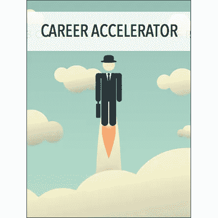
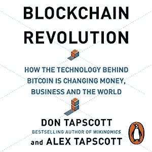
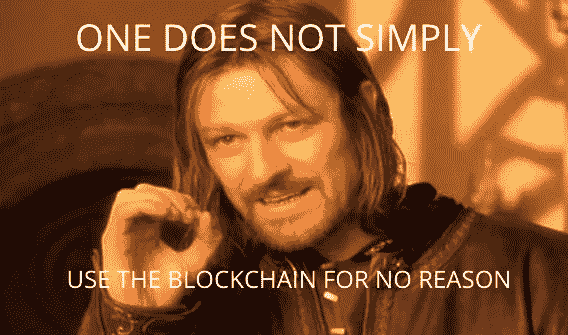
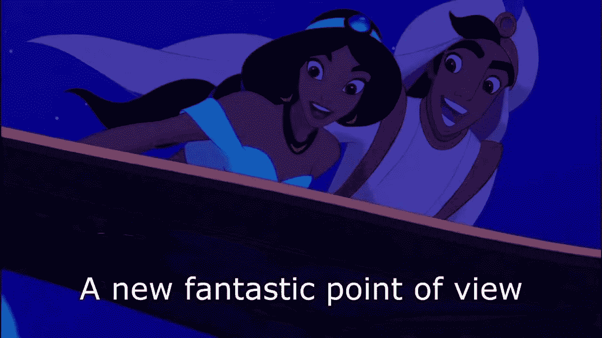

# 区块链:流行语还是一个全新的世界？

> 原文：<https://medium.com/hackernoon/blockchain-buzzword-or-a-whole-new-world-38fd749d7135>

在我之前的[文章](https://hackernoon.com/blockchain-cryptocurrencies-and-me-how-it-all-started-91c7964a41e6)中，我解释了我如何在 2017 年从一个密码怀疑论者转变为一个区块链爱好者。在意识到区块链技术在显著改变金融、商业和价值交换领域的潜力后，我改变了立场。但随着我做更多的研究，并试图了解区块链，我面临了区块链爱好者的第一个挑战:从炒作中分离真相。

**职业加速器和开放游乐场**

当时网上已经有很多与区块链有关的资料。在过去的 3-4 年里，来自各种学术背景和各行各业的人都在撰写和教授关于区块链的文章。我感到惊讶的是，在参与区块链技术不到一年的时间后，我就开始写它了。但这显然是区块链技术的现状；由于很少有人深入了解它，你可以在几个月内成为“专家”并开始训练其他人。这就是为什么我私下里给区块链起了个绰号叫“职业加速器”。

Blockchain for young professionals

事实是，区块链是一种尚未标准化的新技术。例如，看一下定义；[人们仍在努力为区块链这个词找到一个通用的定义。此外，自从 2009 年比特币被发明以来，许多不同类型的](https://www.theverge.com/2018/3/7/17091766/blockchain-bitcoin-ethereum-cryptocurrency-meaning)[区块链项目](https://en.bitcoinwiki.org/wiki/Blockchain_Projects_List)已经启动，很少有一个是完全相同的。这项技术的开源性质及其受欢迎程度使其成为雄心勃勃的探险家和想要改变世界的人最喜欢的游乐场。这显然是以严谨的研究人员为代价的。

真正的区块链专家会站出来吗？

无论如何，仍然有大量的资源可供我个人研究使用。我开始向从事这项技术的人学习:阅读媒体上的故事，跟随关于如何创建 [DApps](https://www.coindesk.com/information/what-is-a-decentralized-application-dapp/) (基于区块链的应用程序)的教程，与同事聊天，在[以太坊平台](https://www.ethereum.org/)和[近地天体生态系统](https://neo.org/)上合作开展小型项目，等等。下班后，我的个人研究通常会花去我几个小时。感谢区块链在线社区，我最终对区块链的独特技术特征有了一些了解。

但是，有些问题只有实际研究者才能回答。例如，对于区块链的顾问来说，总有一个挑战:决定何时应该使用或不使用区块链。我听说的许多区块链项目听起来完全没有必要。如果我要去区块链工作，为了区块链，我必须避免去区块链。我需要研究人员或商业领袖来帮助我理解区块链实际上是用来解决哪类问题的。

我最终遇到了一些主题专家。区块链研究院[的创始人唐·塔斯考特就是其中之一。](https://www.blockchainresearchinstitute.org/) [*区块链革命*](http://blockchain-revolution.com/) ，一本他和儿子[亚历克斯·塔普斯科特](http://www.alextapscott.com/)合著的关于这个主题的书，令人大开眼界。如标题所示，作者认为区块链可以深刻地改变世界交换价值的方式。正如他们所说，在信息互联网和物联网之后，我们终于有了“价值互联网”。对于那些想了解区块链是全球混乱的代理人的人来说，这本书是一个很好的起点。

**跳过中间人**

但是对于我们这些只想知道为什么我们会想要区块链出现在我们的生活中的人来说，在阅读完*区块链革命*后，这里是我的简短回答:当你想**跳过中间人**时，你可以使用区块链。

中间人是谁？一般来说，任何机构站在您和其他个人之间，以验证您的身份，并在您和他们之间进行价值和信息交易。根据不同的场景，中间人可以是中介银行、保险公司、政府、西联汇款、谷歌、AirBnB、脸书、亚马逊等。你通常信任中间人——至少足以向他们提供一些你的个人信息。

Source: [https://medium.com/@Joebg002/will-smart-contracts-be-the-death-of-the-middleman-7cba39987282](/@Joebg002/will-smart-contracts-be-the-death-of-the-middleman-7cba39987282)

为什么要除掉中间人？因为很多不同的原因。维护中间人的成本可能很高。他可能很贪婪。他可能会打扰你，收集比你希望他收集的更多的数据。他可能会威胁到你的一些个人自由。他可能只是逻辑上的迟钝。或者你只是不信任他。无论你和你的中间人有什么问题，区块链都会帮你摆脱他。这是一件大事——大到足以引起轰动。但你需要问的一个问题是:“我们真的应该除掉中间人吗”？

**一句流行语和一大堆问题**

这是我看完这本书后觉得最关键的问题。与我听到的关于这个话题的很多人相反，我认为答案很复杂。没错，政府和企业可能会腐败和侵扰。是的，金融机构可能会降低你的交易速度并收取费用。人类创造和控制的机构没有一个是完美的。但是，与其抛弃整个系统，更好的方法可能是修复或改进它。没有人知道消除对政府、银行和企业的信任是否会让我们的社会变得更好。然而，我们可以肯定，区块链不可能永远是解决办法。

The truth can hurt.

此外，区块链技术仍在开发中。可伸缩性无疑是主要问题之一。最好的公共区块链目前正在努力有效地处理他们的交易量，其中一些运营成本高昂，而且[非常耗能](https://arstechnica.com/tech-policy/2018/05/new-study-quantifies-bitcoins-ludicrous-energy-consumption/)。尽管区块链在未来可能变得有益，但它似乎比其他任何人都更有利于罪犯和幸运的投机者。区块链显然还没有达到人们的期望。

区块链空间的一个不幸的事情是，许多演员无法回答困难的问题。因为短期回报有时比长期利益更有吸引力，许多人无法超越像加密投资和 ico 这样的高风险投资。很少有人考虑如果实施和使用该技术会对企业和社区产生的影响(积极的和消极的)。在过度宣传区块链的同时，我们低估了它对研究、发展和监管的需求。因此，区块链爱好者有时会觉得他们有的只是一个流行词和一大堆问题。

**结论**

尽管如此，自 2017 年以来，许多令人兴奋的新区块链项目已经启动。我自己目前正在研究一个有趣的概念证明，并且很乐意在将来分享更多。的确，新技术的一个问题是它们会引发很多问题。但这种不确定性也是它们令人兴奋的地方，驱使人们开始探索。一位在区块链工作的好朋友曾经告诉我:“在区块链，天空是无限的。”因为我们还不知道这项技术的未来影响，我们很自然地变得兴奋，并想象一个全新的世界就在眼前。

Two typical blockchain enthusiasts.

我确信区块链及其共识技术在未来将发挥重要作用。然而，区块链专业人士、研究人员和爱好者面临的挑战将是调整它以适应他们社区的真正需求，并远离那里的众多骗局和不相关的倡议。我相信第一步是了解技术本身。所以我的下一篇文章将解释区块链是如何工作的。待在原地！

有用的资源:

*   【https://coincenter.org/entry/open-matters 号
*   【https://www.blockchainresearchinstitute.org/ 
*   [https://bitcoin.org/bitcoin.pdf](https://bitcoin.org/bitcoin.pdf)