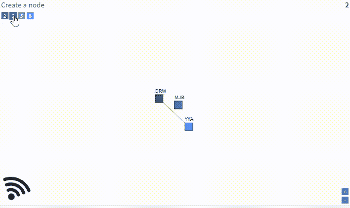
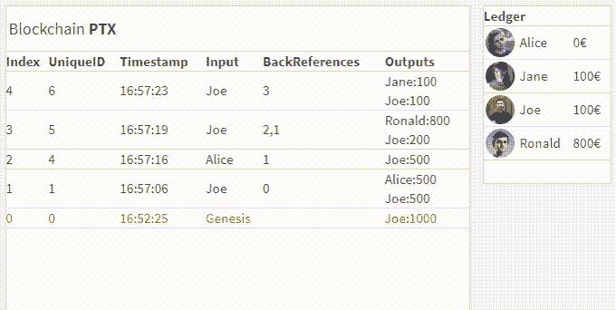
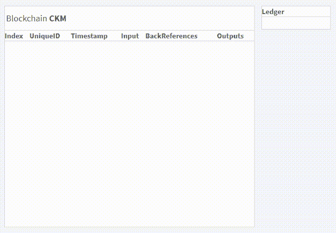
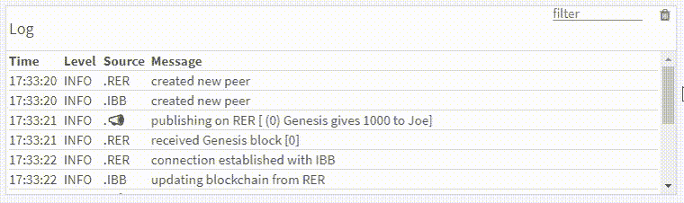
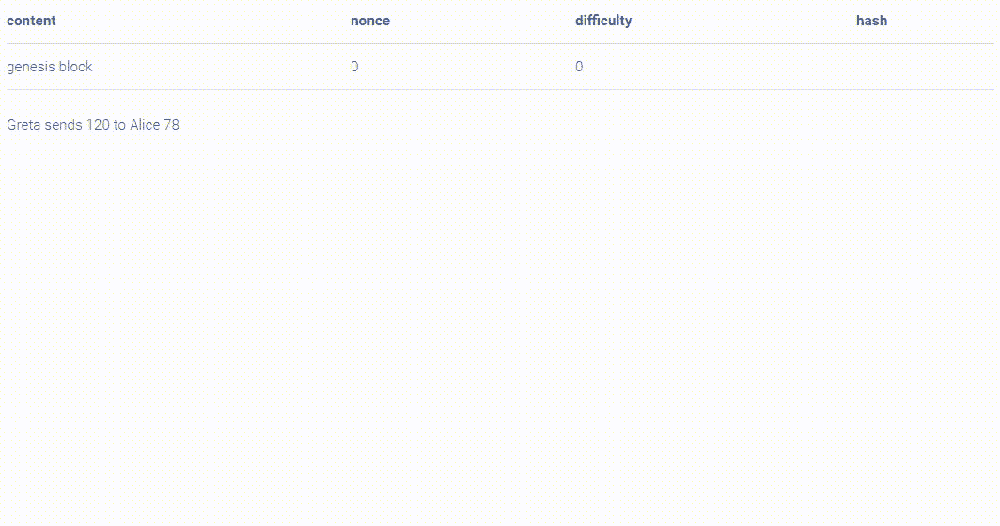

# 区块链，冷静

> 原文：<https://medium.com/hackernoon/blockchain-calm-16a91617ae95>

理解区块链需要理解许多其他不同的部分:

对等网络、工作证明、加密哈希、共识算法、分散式架构、双重支出、挖掘、未用完的事务输出、钱包、分布式分类帐、起源块、随机数……

区块链冷静是一个网站，它将这些部分可视化，互动地探索可能性，玩弄参数，考虑替代方案，质疑假设，甚至质疑区块链技术的可信度。

这篇文章向你展示了来自[区块链](#)的快照，这是对区块链进行批判性思考和深入理解的跳板。

# 1.对等网络

A network consisting of 12 peers is slowly built before records are sent

# 2.从创世街区一路向上

The Genesis Block kicks off by giving 1,000 coins to Joe. Money will flow from account to account but without the concept of mining the sum-game will always be 1,000.

# 3.计算分类账

Any new block in the chain forces an update on the ledger

# 4.双重支出

Joe has 1,000 coins. An attempt to send 500 to Ronald and 800 to Freddie ends with one transaction being rejected.

# 5.工作证明

When creating a block we look for a value called a **nonce** to combine with the payload to form a hash beginning with as many 0-bits as the **difficulty** property defines