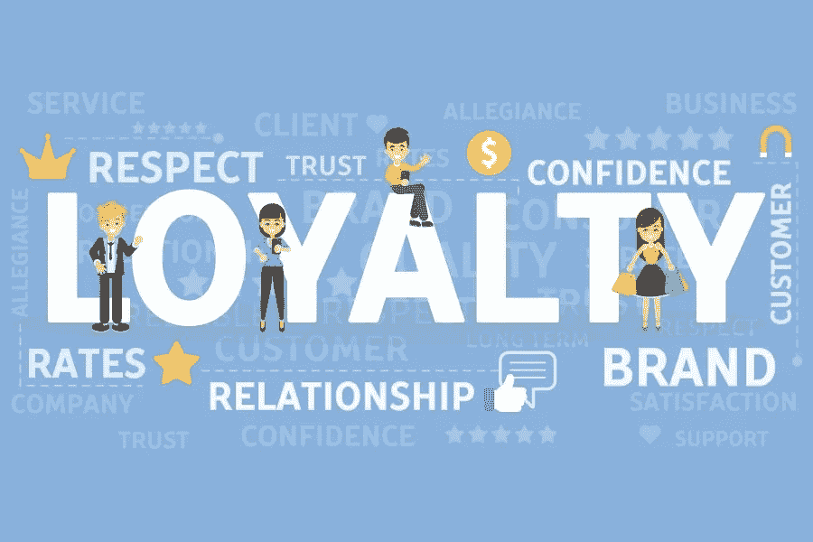
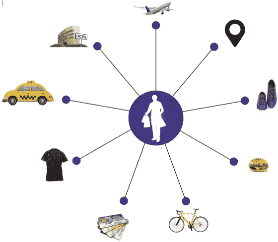

# 区块链可以拯救客户忠诚度计划变得毫无结果！

> 原文：<https://medium.com/hackernoon/blockchain-can-save-customer-loyalty-programs-from-becoming-unfruitful-3992c6bc6053>

区块链将如何颠覆零售！

credits — google.com

> 由[米特希尔·塔科雷、](https://www.linkedin.com/in/mithilthakore/)联合创始人[Quillhash.com](https://www.quillhash.com/)

美国运通(American Express)的一项研究显示，62%的千禧一代倾向于只购买首选品牌，相比之下，更广泛人群中的这一比例为 54%。此外，58%的千禧一代表示，无论如何他们都会购买同一品牌的产品。

这种显著的千禧品牌忠诚度的关键驱动力似乎是忠诚度奖励。虽然价格很重要(对所有代人而言)，但千禧一代比其他任何一代人都更有可能保持对某个品牌的忠诚，因为它能带来忠诚回报。相比之下，老一代 X 的品牌忠诚度是由价格和便宜货驱动的。由于千禧一代强烈的品牌忠诚度和推动忠诚度的忠诚度奖励，57%的财富 500 强受访品牌表示，他们将在 2017-18 年增加忠诚度计划预算。

# 那么问题出在哪里？

不足为奇的是，33%的千禧一代不喜欢奖励计划，因为“有太多的卡要带”。

现有的忠诚度计划模式不仅让消费者感到痛苦，也给零售商带来了许多挑战和痛点。这些问题包括与建立、运营和保护忠诚度积分计划相关的成本、赢得的忠诚度积分的低兑现率、客户发现注册过程过于复杂以及市场上忠诚度计划普遍过剩。仅在美国，消费者就拥有超过 33 亿的客户忠诚度计划会员。

忠诚度行业有个术语叫“破损”，指的是没有兑换的奖励积分。据报道，一个普通的美国人是七个忠诚计划的成员，据说他们中的许多人钱包里有 10-15 张忠诚卡。业内人士都知道，破损率可高达 30%。直到这些积分到期的那一天，它们将成为品牌资产负债表上的一项负债。对于一个超过 3000 亿美元的行业来说，这个问题无疑是巨大的。

我们甚至还没有触及安全方面。2017 年，对现有金融账户(不涉及信用卡和借记卡上的支付)的攻击中，有 11%是针对忠诚度账户的，而 2016 年为 4%。

# 基于区块链的忠诚度计划

通常，在建立联合忠诚度计划时，需要建立维护忠诚度积分的会计方面所需的 B2B 通信，其中各方必须审计交易并保护数据免受欺诈攻击。这是建立和运作联合忠诚度计划很快变得复杂和昂贵的原因之一。

区块链技术是运行[网络](https://hackernoon.com/tagged/network)忠诚度计划的绝佳解决方案，因为它们解决了许多这样的技术挑战。其中一个解决方案包括在所有涉及的品牌之间创建一个共享的交易分类账，实施基于“智能合同”的交换规则，这是欺诈和欺骗保护。这个[区块链](https://hackernoon.com/tagged/blockchain)网络将是不同行业品牌之间共享的可扩展基础设施。

# 为什么是区块链？

## 互操作性和第三方成本-

这种忠诚度计划的区块链模式提高了积分对用户的价值，并通过创造可信的交易为相关品牌带来新的价值。如今，忠诚度积分在不同群体的多个商店之间不可互操作。由于有大量的计划可用，客户经常遭受“忠诚计划疲劳”，这随后导致忠诚计划不活跃。其中一个主要原因是，当要从技术上实现(设置)这个复杂的系统时，设置起来既昂贵又繁琐，并且需要大量的时间和金钱投资。

区块链可以用来连接忠诚度计划的不同所有者，并使他们分发的积分具有互操作性。与奖励代币的发行和兑换相关的交易成本在区块链上要低得多，因为它们不需要第三方。区块链还大大降低了系统管理成本，这要归功于自动化流程的智能合同，同时降低了与错误实例相关的成本。最重要的是，品牌本身受益于拥有一个已经忠诚的客户生态系统，这又降低了数据采集成本。

## 实现无摩擦系统:-

通过一个不可信的、分散的技术解决方案，区块链正在集中客户的忠诚度计划。网络上的所有品牌都决定客户如何使用这些奖励，以及与谁一起使用，但从消费者的角度来看，他/她访问和管理这些奖励的能力实际上是没有摩擦的。

## 使得该过程接近实时

区块链可以让交易被多个参与方近乎实时地记录和访问，增加了忠诚度奖励计划提供商更快地打破协调惯性获得积分的机会。

## 提供安全的环境

区块链为每一笔交易创建了一个不可变的带时间戳的分布式数据库条目，使每一笔交易及其记录都易于追溯，但也使它们不可逆转，从而防止双重支出、欺诈、滥用和任何其他类型的交易操纵。

# 结论-

基于区块链的忠诚度计划(其中智能合同将自动化所有交易)将使忠诚度计划的管理变得顺畅和自主。存储在区块链上的数据将保护用户的隐私，这将增加用户对品牌的信任。实施与其他品牌的联合忠诚度计划将是小菜一碟，因为智能合同将照顾一切，从代币的转移、转换代币、在奖励和兑换代币期间验证用户，从而在多个相关品牌之间创建信任的环境。此外，除了节省管理成本之外，人们不必依赖任何第三方，让每个品牌完全访问他们最有价值的资产和数据。

> “区块链和忠诚度计划是相辅相成的。我们需要更安全、透明、自主的忠诚度系统，只有区块链能确保这一点。”
> 
> . . .

[Quillhash Technologies，India](https://www.quillhash.com/) 正在该领域广泛开展工作，为忠诚度计划所有者开发基于区块链的全球解决方案。通过下面链接了解更多信息-

> 【https://loyalty.quillhash.com/ 号

关于同一主题的进一步讨论和疑问，请加入 quill hash—【https://t.me/quillhash 电报组的讨论

*关于作者—*

*Mithil 是一位连续的区块链企业家，他与他人共同创建了“QuillHash ”,这是一家区块链企业服务公司，致力于多个公共和私人区块链，最近被公认为印度最有前途的区块链服务公司之一。Mithil 热衷于研究区块链在多个行业中的使用案例，也是主题演讲人。通过 Quillhash，他的团队为零售、医疗保健、电信、物流和供应链领域的企业构建了解决方案。*

*更多信息，关注 Mithil Thakore 上的*[*Linkedin*](https://www.linkedin.com/in/mithilthakore/)*，*[*Twitter*](https://twitter.com/mithilthakore9)*，*[*Quora*](https://www.quora.com/profile/Mithil-Thakore)*。*

*更多 Mithil Thakore 的文章，请在 medium 上关注他—*

> [米希尔·塔科雷——medium.com](/@mithilthakore9)

参考链接:-

1.  [https://medium . com/NRF-events/4-ways-retailers-can-use-区块链-to-they-advantage-1b 4139 A0 b 57d](/nrf-events/4-ways-retailers-can-use-blockchain-to-their-advantage-1b4139a0b57d)
2.  [https://www . livemint . com/AI/tbfabkgi 4 vcchqwfqvtrnj/block chain-set-to-disrupt-retail-business-around-the-world . html](https://www.livemint.com/AI/TbFABkgi4vCChqwfqvTRNJ/Blockchain-set-to-disrupt-retail-businesses-around-the-world.html)
3.  [http://www . payments journal . com/thesis-card-rewards-a-realistic-use-case-for-区块链/](http://www.paymentsjournal.com/thesis-card-rewards-a-realistic-use-case-for-blockchain/)
4.  [https://www2 . Deloitte . com/us/en/pages/financial-services/articles/making-区块链-real-customer-忠诚度-奖励计划. html](https://www2.deloitte.com/us/en/pages/financial-services/articles/making-blockchain-real-customer-loyalty-rewards-programs.html)
5.  [https://www . fine xtra . com/blogposting/15430/how-区块链破解忠诚圣杯计划](https://www.finextra.com/blogposting/15430/how-blockchain-can-crack-the-holy-grail-of-loyalty-programs)
6.  [https://blog . grid dynamics . com/区块链-技术-使用案例-零售/](https://blog.griddynamics.com/blockchain-technology-use-cases-in-retail/)
7.  [https://www . coin desk . com/Singapore-airlines-区块链-based-loyalty-program-take-off/](https://www.coindesk.com/singapore-airlines-blockchain-based-loyalty-program-takes-off/)[https://www . CMO . com . au/article/605859/how-landmark-group-transforming-marketing-through-loyalty/](https://www.cmo.com.au/article/605859/how-landmark-group-transforming-marketing-through-loyalty/)
8.  [https://www . khaleejtimes . com/business/retail/how-your-loyalty-rewards-you](https://www.khaleejtimes.com/business/retail/how-your-loyalty-rewards-you)[https://medium . com/sendy-token/why-customer-loyalty-programs-is-ripe-for-区块链-disruption-AE 4 befe 8d 450](/sendy-token/why-customer-loyalty-programs-are-ripe-for-blockchain-disruption-ae4befe8d450)[https://coin telegraph . com/explained/how-a-loyalty-program-on-区块链-works-explained](https://cointelegraph.com/explained/how-a-loyalty-program-on-blockchain-works-explained)
9.  [https://www . Forbes . com/sites/adrians winscoe/2018/08/13/should-you-be-considering-the-use-of-the-powers-your-customer-loyalty-program/# 17f 238067104](https://www.forbes.com/sites/adrianswinscoe/2018/08/13/should-you-be-considering-the-use-of-blockchain-to-power-your-customer-loyalty-program/#17f238067104)
10.  [https://economic times . India times . com/industry/services/retail/shoppers-stop-landmark-spencers-extend-loyalty-schemes-to-retain-customers/articleshow/10660647 . CMS](https://economictimes.indiatimes.com/industry/services/retail/shoppers-stop-landmark-spencers-extend-loyalty-schemes-to-retain-customers/articleshow/10660647.cms)
11.  [https://www . nitinbhatia . in/marketing-case-study/7-reasons-why-忠诚度-奖励-计划-印度失败/](https://www.nitinbhatia.in/marketing-case-study/7-reasons-why-loyalty-reward-programs-failed-in-india/)