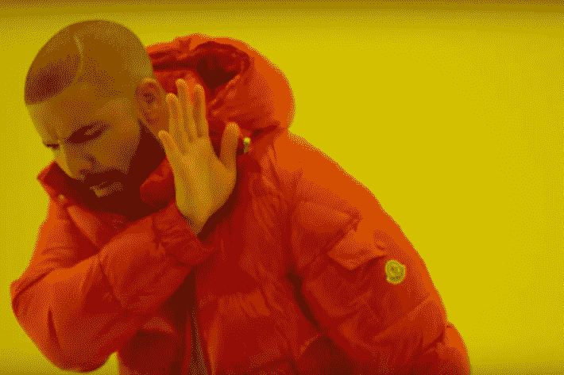

# 区块链、加密货币和我:一切是如何开始的

> 原文：<https://medium.com/hackernoon/blockchain-cryptocurrencies-and-me-how-it-all-started-91c7964a41e6>

Photo by [Thought Catalog](https://unsplash.com/@thoughtcatalog?utm_source=medium&utm_medium=referral) on [Unsplash](https://unsplash.com?utm_source=medium&utm_medium=referral)

2017 年 11 月 26 日绝对是这个科技时代历史性的一天。据[Bitcoin.com](https://www.bitcoin.com/)报道，就在那一天，全世界都见证了比特币的货币价值突破一万美元大关。2017 年 12 月 16 日，它继续达到 19，192.15 美元的历史高点。

**我知道它在上涨…我拒绝购买**

这几周我记得特别清楚，因为我也在密切关注最有价值的[加密货币](https://blockgeeks.com/guides/what-is-cryptocurrency/)升至新的高度。虽然我无法预测比特币或以太币(当时另一种正在崛起的加密货币)的价值峰值，但在它们表现出色之前的三个月里，我一直在实时观察它们的增长。事实上，自从几个月前我在我的 iPhone 上安装了[比特币基地应用](https://www.coinbase.com/) 之后，我每天都在关注它们的波动。我可能比许多人更早知道这些加密货币“出事了”。

尽管我不是快乐人群中的一员。三个月来，当我看着这些加密货币越涨越高时，我每天都做同样的决定；我选择不投资任何一家。我这样选择是因为我不相信比特币是一种真正合法的投资工具。虽然我假设许多密码投资者都在计算他们 50%、75%、100%和 200%的投资回报，但我很想知道我将来是否会后悔这个选择。

**我持怀疑态度**

老实说，我是我想象中最不可能参与加密货币的人。虽然我在 2014 年从我的室友那里听说过加密货币，但除了怀疑，它从未激发过我任何东西。提起这个话题，我常常会忽略。当我认真思考这个问题时，我严重质疑这种设备的道德价值，它要么被用于无知的投机，要么被用作毒品贩子的交易手段。作为一个喜欢远离麻烦的人，这些事实足以让我远离。

此外，我认识的人中没有人能回答我的问题:加密货币有什么帮助？在我看来，使用比特币进行交易不仅没有必要，而且也不切实际。如果你想获得比特币，你必须购买。尽管有人(很难)认为获得加密货币对每个人都是可行的，但很少有商店和零售商接受它们。我们优秀的传统法定货币更适合购买食品杂货、购物和保持简单的生活。所以比特币和其他加密的东西对我来说是禁忌。

Please. No.

直到 2017 年大学毕业开始全职工作后，我才修正了自己的立场——至少在某些方面。我遇到了当时的同事，他们是秘密投资者，也从事与区块链相关的项目。我打算在接下来的文章中尽可能清楚地解释区块链，但在此之前，我的简短解释将是“加密货币背后的技术”。至少我的新同事最初是这么给我定义的。在我有时间决定我永远不会从事“粗略的区块链东西”之前，他们还提到区块链可以完成比操作比特币更多的事情。

**然后我调查了一下**

我第一次被告知，区块链显然是一个拥有无与伦比的能力的网络，能够在没有第三方的情况下实现其参与者之间的交易，同时保持这些交易的安全性和透明度。当我考虑这一主张时，脑海中出现了不同的想法:不通过银行或金融机构的资金转移，不通过中间人的购买、销售和佣金等商业操作。腐败和隐私泄露的空间很小。没有机构，没有公司，只是通过网络联系在一起的人们。乌托邦，我想，但值得研究。

我仍然有疑问。“没有银行有什么帮助，甚至让人放心？这项技术难道没有破坏社会赖以建立的信任的价值吗？建立这样一个复杂的系统有多容易？我也很难向其他人解释为什么区块链会有所帮助。这让我看到了我对其应用的理解是多么有限，很明显我还有很多东西要学。浪费时间的风险似乎很高，但发现潜在成功技术的回报令人振奋。因此，我选择了调查区块链技术。

“A book with a magnifying glass on top of it, next to a pen, and globes on a desk in Cianorte” by [João Silas](https://unsplash.com/@joaosilas?utm_source=medium&utm_medium=referral) on [Unsplash](https://unsplash.com?utm_source=medium&utm_medium=referral)

我打算在下一篇文章中分享更多关于我的研究的细节。我至少可以说，我对区块链了解得越多，就越对它的潜力着迷。我很欣慰自己决定了解它，它与比特币和加密投资无关。

**结论**

回到 2017 年 12 月，当比特币达到最高值时，我在想，不买比特币是不是一个我会后悔很久的选择。我最终得出结论，这没关系:我知道区块链不仅仅是比特币、以太坊、ICOs 等。我最终更感兴趣的是发现区块链除了赌博和助长犯罪之外还能做些什么。我当时已经相信，它很有可能超越今天的喧嚣，成为未来的技术。

Photo by [Reuben Juarez](https://unsplash.com/@sunnystate?utm_source=medium&utm_medium=referral) on [Unsplash](https://unsplash.com?utm_source=medium&utm_medium=referral)