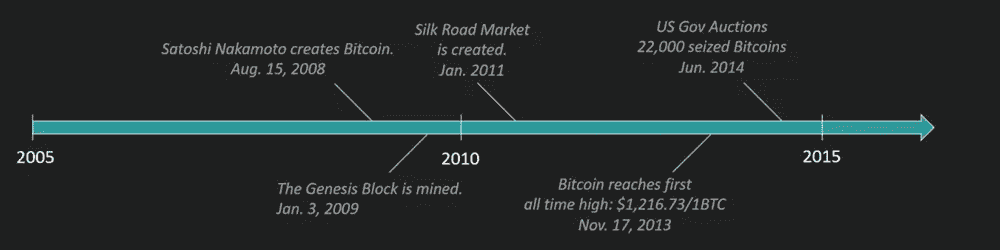
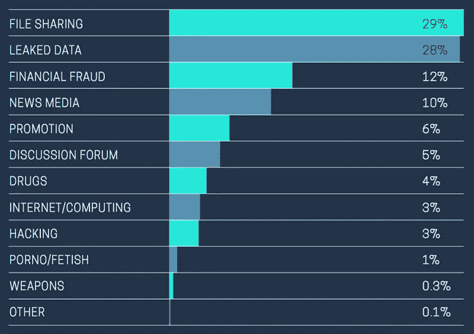
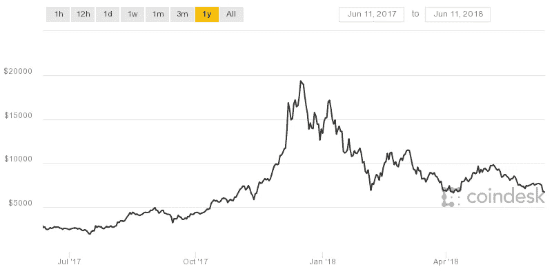
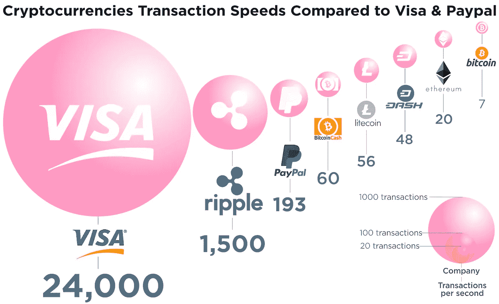
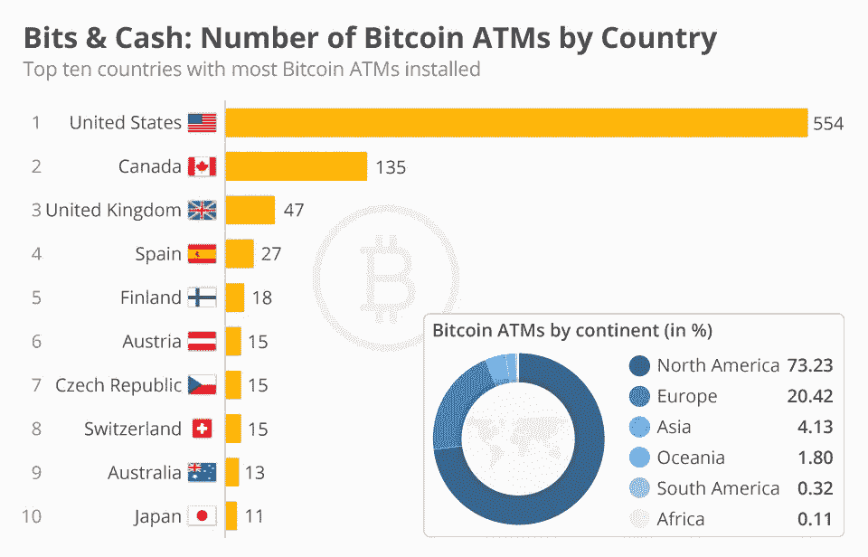

# 区块链、加密货币和黑暗网络

> 原文：<https://medium.com/hackernoon/blockchain-cryptocurrencies-and-the-dark-web-1a6d85916314>

加密货币被誉为黑暗网络的燃料，迄今为止，这艘船已经航行了一百万英里。然而，专家们设想，总有一天这艘船的船长、在平台上进行非法交易的主谋会被制止，而这一天可能比我们预期的要早。

# 回顾过去——黑暗网络的出现

我们第一次知道术语“暗网”是在 20 世纪 70 年代，这个术语用来表示具有高度隐私性的专用网络。起初，互联网这个看似隐秘的部分是无害且平静的。

但随后，它逐渐成为犯罪活动交流和策划的避风港。黑暗网络除了允许这些非法计划浮出水面，还促进了交易和加密货币，尤其是比特币，成为首选货币。

以下是黑暗网络犯罪的简要历史。2015 年 2 月，罗斯·乌布里希特因贩卖价值超过 10 亿美元的毒品被判终身监禁。今年 3 月，Tomáš Jiříkovský在捷克共和国被捕，此前他试图从一个暗网市场窃取数千枚比特币(或数百万美元)。

六个月后的 9 月，Trendon Shavers 接受了审判，他承认自己经营了一个 1.5 亿美元的庞氏骗局。此后不久，法国人马克·karpelès 从一家加密货币交易所 Mt. Gox 盗用了一笔金额达 3.9 亿美元的资金。不久之后，他被逮捕并被指控犯有欺诈罪。

所有这些导致了黑暗之网的衰落或力量减弱了吗？不完全是。加密货币，黑暗网络上的默认货币被称为服务于更高的目的！

# 密码和黑暗之网

2017 年，比特币的价值出现了天文数字的增长，在自由落体式下跌之前达到了 2 万美元的峰值。这能归因于暗网上发生的和没有发生的交易吗？让我们找出答案。然而，在我们深入研究比特币(没有双关语的意思)之前，让我们研究一下是什么让 cryptos 成为黑暗网络交易的理想选择。

# 在黑暗网络上使用加密货币的原因

区块链着手解决中心化问题。通过分散式区块链技术，这项技术可以实现很多功能，这也是加密货币的基石。区块链技术有几个固有的特征，它们将在下面讨论。

## 匿名

能够执行交易而不留下痕迹，起初可能会显得多余，但是，如果我们深入研究，它对暗网上的活动非常有益。除了比特币，Monero 等货币还有隐形地址等功能，可以生成接收资金的地址。这些地址是可追踪的，但不能追溯到原来的主人。

## 安全性

你会惊讶于在黑暗网络上执行的交易量。从出售儿童色情制品到购买非法毒品，这些交易的资金非常昂贵，不能允许拖延。交易商需要一种安全可靠的方式来转移资金，只有一种货币可以做到这一点，而不会受到政府的干扰——加密货币。现在，我们可以继续在黑暗网络上使用比特币和其他货币。

# 比特币和黑暗网络

澳大利亚进行的一项研究报告称，约 47%的比特币交易是在暗网上完成的。回答你的问题-是的！一半的比特币用于满足黑暗网络黑手党的渴望，而另一半则适合你的加密爱好者身份。此外，使用加密货币匿名的概念现在或多或少正在成为一场闹剧。

当比特币出现时，它承诺完全匿名，这使得全球社会张开双臂拥抱它。然而，区块链的本质是，精通技术的个人可能会知道在网络上进行巨额交易的人的地址。

# 替代硬币和黑暗网络

像莱特币和 Monero 这样的加密货币目前正在市场上掀起波澜，这是由于比特币经济向替代比特币经济的转变。这些替代硬币更有利，它们处理交易更快，具有一定程度的可靠性，它们也更好地坚持了匿名的概念。他们相对较低的交易费用和价值也使其更好。

# 阻碍在暗网上使用加密货币的因素

## 价值

当 1 XMR 的价格约为 157 美元时，没有人愿意花 1 BTC 6000 美元购买非法物质。比特币、以太币等有价值的货币成本高，意味着人们无法以现值进行交易。类似地，个人目前不愿意以较低的金额交易他们的代用币，因为他们相信它在未来一定会暴涨。这让我们陷入了一个棘手的困境。

## 交易的速度

在过去的几个月里，比特币在黑暗网络上的活动急剧减少。尽管许多人将此归因于价格的上涨，但这也是因为区块链网络上的交易变得异常缓慢。这是由于比特币作为加密货币的受欢迎程度增加。想象一下一个吸毒者想要快速戒毒。这样的人不能等待交易在网络上结算，他们通常寻找最快的可用选项。比特币上未经证实的交易数量一度达到近 6 万笔。糟糕的一天，可以差到 15 万。

## 监管中的政府

去年，暗网市场(DNM)上的一些大公司面临着动荡时期。像 Alphabay 和 Hansa 这样的网站最近被关闭了，其他几个网站面临着严重的反对，要么是通过 DDoS 攻击，要么是破产。考虑到这一事实，没有结束的迹象，政府将继续冰雹石头在加密的概念，似乎最糟糕的还在后头。

## 交易费用

比特币正在暗网上失宠，这可以归因于交易成本相对急剧上升。其原因可归因于缩放问题。我们有一个精选的矿工小组，他们在网络上解决计算问题，以验证这些交易，采矿不再像以前那样有利可图。

由于这个原因，我们不得不承受由于业务量增加而导致的交易成本的相应增加。这对于那些希望自己的需求立即得到满足的黑暗网络用户来说尤其令人气馁。为什么有人想要得到一种大约 30 美元的药物，却要支付大约 35 美元的交易费？

# 结论

区块链是黑暗网络不可或缺的一部分，加密货币对其增长起到了推动作用。随着最近对黑暗网络的打击和比特币的逐渐废弃，未来是令人兴奋的。

**第二部分**

 [## 区块链技术对黑暗网络的免疫力

### 在儿童书籍中，反派是一个具有邪恶意图和普遍邪恶观点的神秘人物。他的服装…

codeburst.io](https://codeburst.io/immunity-on-the-dark-web-as-a-result-of-blockchain-technology-6693eb087bdd) 

[作者:德米特里·布德科](https://www.linkedin.com/in/dmitrybudko/%5C)