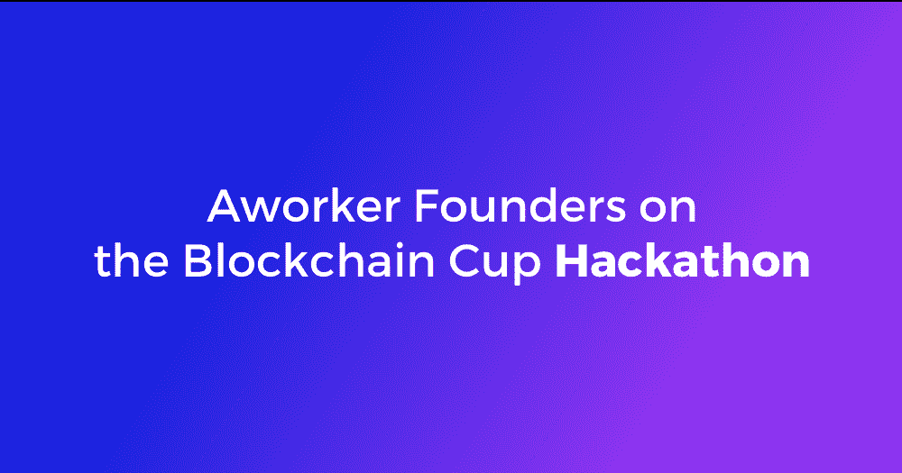
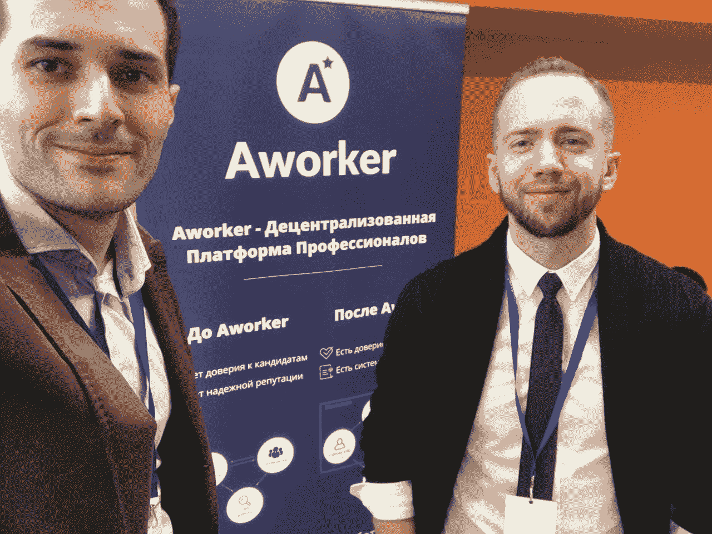
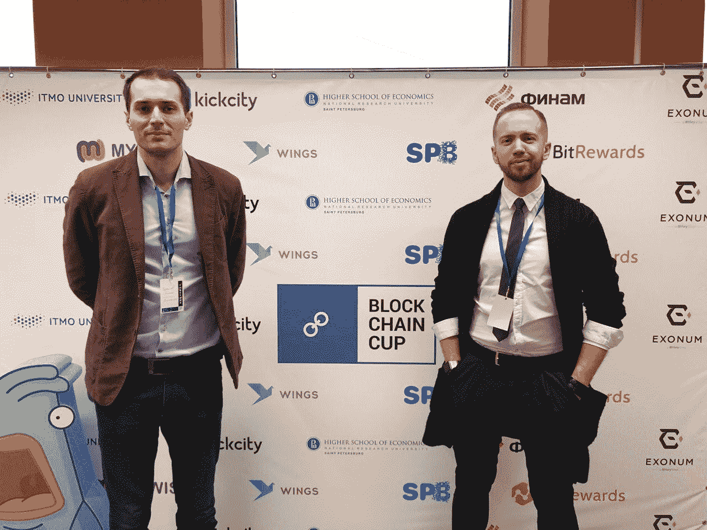
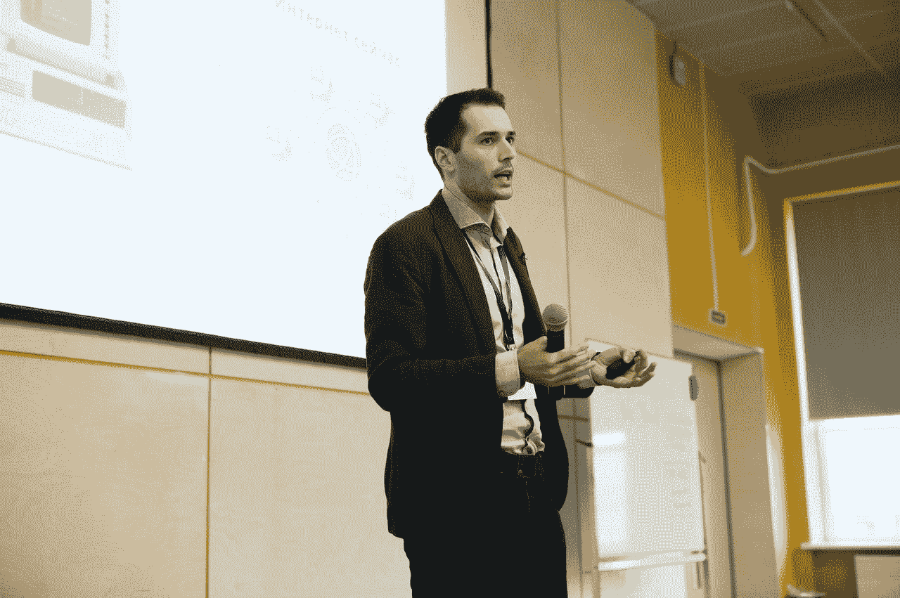
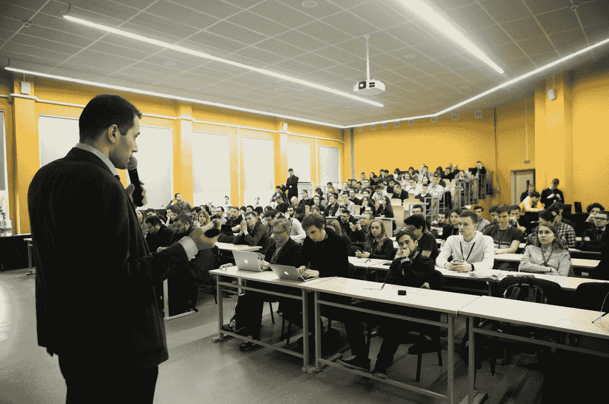

# 区块链杯黑客马拉松

> 原文：<https://medium.com/hackernoon/blockchain-cup-hackathon-7864b25ca228>

4 月 21 日至 22 日，我们与 Aworker 的人力资源合作伙伴 Mikhail Barkov 一起前往圣彼得堡，评估[区块链杯黑客马拉松](http://blockchaincup.info/)上的项目。

除了专家们分享他们在[区块链](https://hackernoon.com/tagged/blockchain)行业的知识之外，还有一个项目的竞赛。活动主办方为与会者提供了自己的案例，这些案例与公司当前的任务和项目直接相关。参与者的任务是分解输入数据并执行案例中设定的任务。在[黑客马拉松](https://hackernoon.com/tagged/hackathon)的第一天，参与者就已经开始合作开发他们自己的基于区块链技术的项目。

有 15 个天才开发人员团队试图完成五个主题中的一个。我们是人力资源领域区块链的领导者，有三个年轻的技术专业人员团队。

这些团队必须根据员工的专业技能和能力开发员工评估系统。参与者只有 24 小时的时间来创造一个解决方案，并准备好在评委面前展示。

上周六，我还发表了一篇演讲，内容是区块链技术实施后招聘行业的未来。

在 30 个小时内，各团队努力工作，为活动赞助商设定的任务开发出自己的解决方案。组织者为团队执行如此复杂的任务提供了舒适的条件:24 小时访问工作区、互联网和食物。周日是公布结果的日子。三个团队中的两个成功地完成了我们的任务，但其中一个给我们留下了最深刻的印象，那就是来自 Mozhaysk 的团队。我们要感谢黑客马拉松的所有参与者。

我要感谢这次活动的组织者，我要祝贺获奖者和所有参与者，你们都做得很好！