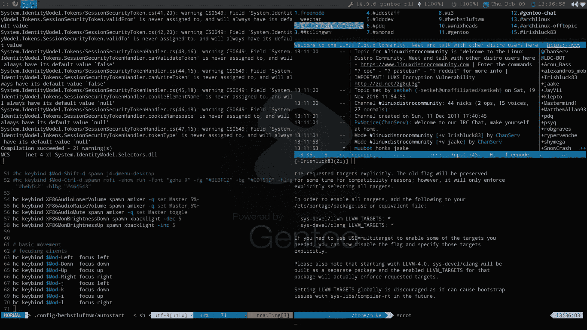
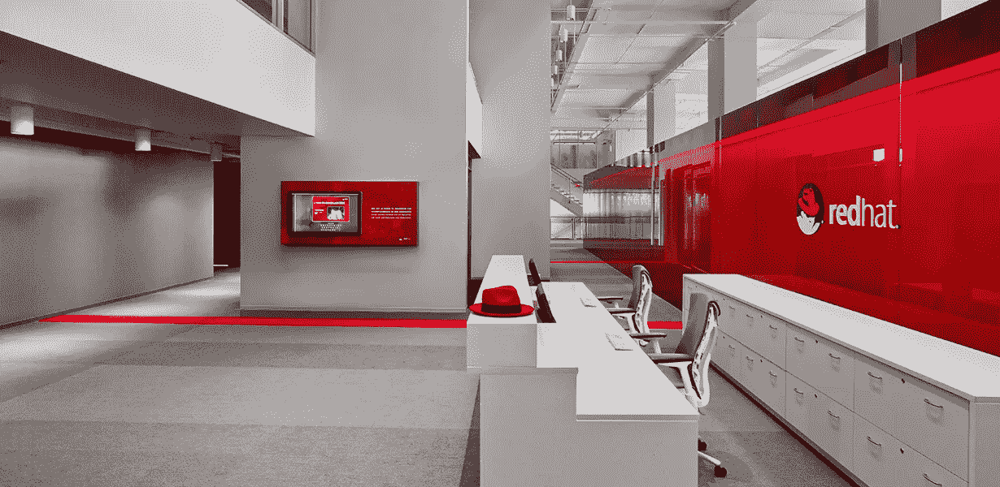

# 区块链:区分 Linux 和红帽

> 原文：<https://medium.com/hackernoon/blockchain-differentiate-linux-red-hat-b825831e7b60>

## 分离社区驱动的开源项目和业务

# 结构

历史上，开源的低级协议和工具都努力保持免费。一方面是意识形态。另一方面，有一个策略。梅特卡夫定律( [2](https://en.wikipedia.org/wiki/Metcalfe%27s_law) )指出，电信网络的价值与系统连接用户数量的平方(n)成正比。因此，如果它是免费的，它有巨大的生存潜力。但是历史告诉我们一个不同的故事。构建一个社区驱动的产品和销售一个社区驱动的产品是不同的。这需要很多时间、金钱和其他资源。毫无疑问，Linux 是一个伟大的技术产品。但是少数产品已经成为基于 Linux 的大生意。

Gentoo Linux — Google+: [https://plus.google.com/communities/100146718762350759856/stream/09938b7e-4913-4bc5-bdd6-9635c4a1bf60](https://plus.google.com/communities/100146718762350759856/stream/09938b7e-4913-4bc5-bdd6-9635c4a1bf60)

每一项技术都渴望占据行业主导地位。[正如 2000 年代一样，蓝光赢得了与 HD DVD](https://blog.chronicled.com/blockchain-industry-consortiums-when-they-work-and-why-they-fail-2e02851b651f) 、[的战斗，然后 LTE 与 WiMAX](https://community.sprint.com/t5/Sprint-News-Archives/FAQs-about-the-WiMax-network-shutdown/ba-p/939129) 的战斗。自 2015 年以来，类似的事情已经在区块链生态系统中开始。在 W3C 的基础上，组织了 Interledger 社区团体。有许多不同的企业供应商和财团，如 [Hyperledger](https://www.hyperledger.org/) 、 [R3](https://www.r3.com/) ，以及知名的公共区块链平台，如[以太坊](https://www.ethereum.org/)、 [Stellar](http://stellar.org) 。这些财团被要求在研发、融资、伙伴关系、信息共享等方面进行合作。社区驱动的平台和团队在创造[技术](https://hackernoon.com/tagged/technology)解决方案方面很棒，但是他们似乎在商业发展方面失败了。

首先，没有以企业为中心的文化。因此很难将这些产品与真实的市场条件和需求相协调。例如，公共区块链太“公共”了。使用公共区块链在某人的财产上分发加密的个人数据是合乎需要和自然的吗？不难得出结论，秘密是类似于骶骨的东西。你能想象 SpaceX 公开发布所有受商业秘密保护的合同吗？完全不可能。但社区驱动的公共区块链平台正在努力实现智能合约的完全去中心化和公开化，这意味着公开共享，但要加密。

# 集中

早在 2015 年，[inter ledger 协议就已经纳入了](https://ripple.com/insights/implementing-the-interledger-protocol/)这一隐私要求，因为“银行不愿意在分类账中记录总交易数据”。到目前为止，社区驱动的公共区块链平台不会做出同样的事情。企业产品集中化是因为没有其他方法来协调其[合规性](https://www.fincen.gov/news/news-releases/fincen-fines-ripple-labs-inc-first-civil-enforcement-action-against-virtual)，性能，并提供保证。有时看起来很危险，但如果没有集中化，我们就不会有[苹果](https://apple.com)、[英伟达](https://nvidia.com)、[宝马](https://bmw.com)、[特斯拉](https://tesla.com)产品。社会学规律是这样的，从中国的灌溉建设时期到如今特斯拉 Model 3 的生产管理，都需要明确的协调。我们需要减少市场垄断。

Red Hat: [https://www.redhat.com/en](https://www.redhat.com/en)

Red Hat ( [NYSE:RHT](https://www.google.com/finance?q=NYSE:RHT) )在向企业社区提供开源软件方面取得了巨大的成功。[它还进行了 21 次公开收购和 17 次风险投资](https://www.crunchbase.com/organization/red-hat)。Ubuntu 公司 Canonical 在[也做了同样伟大的事情。2003 年，SUSE](https://www.ubuntu.com/) [被 Novell 以 2 . 1 亿美元收购。这可能发生在区块链市场。在未来，最有前途的社区驱动网络可能会被银行和其他金融机构收购，然后按照法律和商业要求进行分流(如此集中)。就像知名品牌 ETF 一样(巴克莱的 iPath)，这些网络也将被收购者打上品牌。](https://www.novell.com/news/press/2003/11/novell_announces_agreement_to_acquire_leading_enterprise_linux_technology_company_suse_linux.html)

顺便说一下，Novell 被 Attachmate 收购(2010 年，22 亿美元)，然后 Attachmate 被微焦点收购(2014 年，24 亿美元)(2005 年，在 [LON 上市:MCRO](https://www.google.com/finance?q=LON:MCRO) )。这样的风险链。[此时](https://www.mckinsey.com/~/media/McKinsey/Industries/Financial%20Services/Our%20Insights/A%20mixed%202015%20for%20the%20global%20payments%20industry/Global-Payments-2016.ashx)，更高价值的企业对企业支付带来了 135 万亿美元流量的 2400 亿美元收入，平均交易价值为 15，000 至 20，000 美元，每笔交易的典型费用为 30 至 40 美元。因此，对于国际汇款市场和跨境支付来说，这可能是一场新的大战，其中一些比特币叉子是瑞银(UBS)的品牌，另一个以太坊叉子是摩根大通(JP Morgan Chase)或其他品牌。所以所谓的价值互联网可能是。

## 你喜欢这篇文章吗？跟着我；)然后拍手👏

