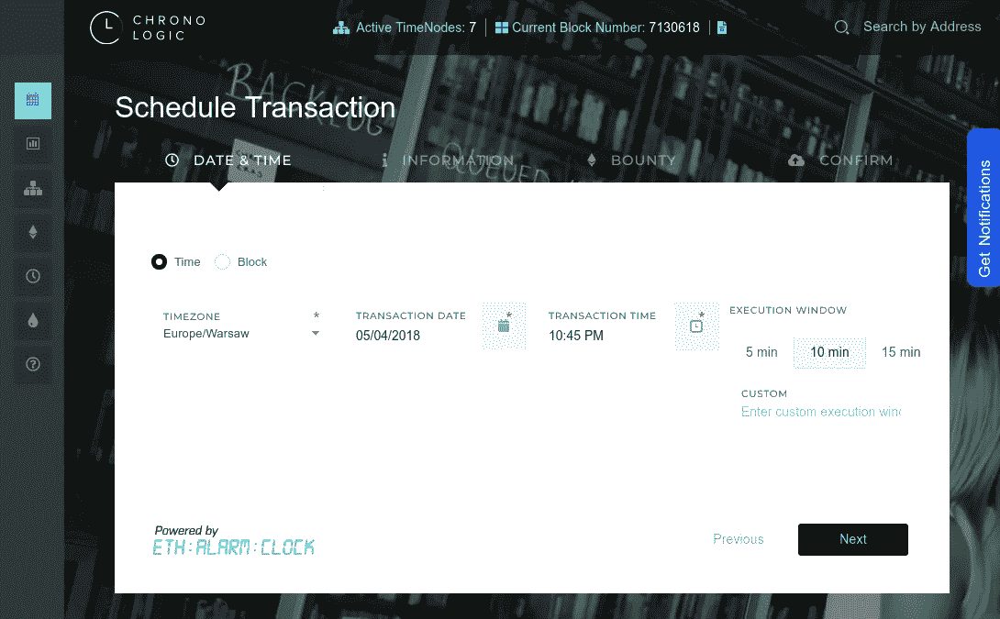
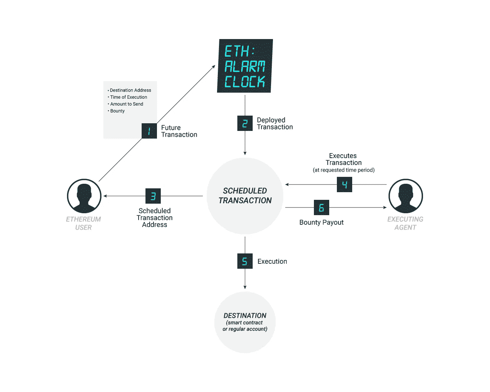
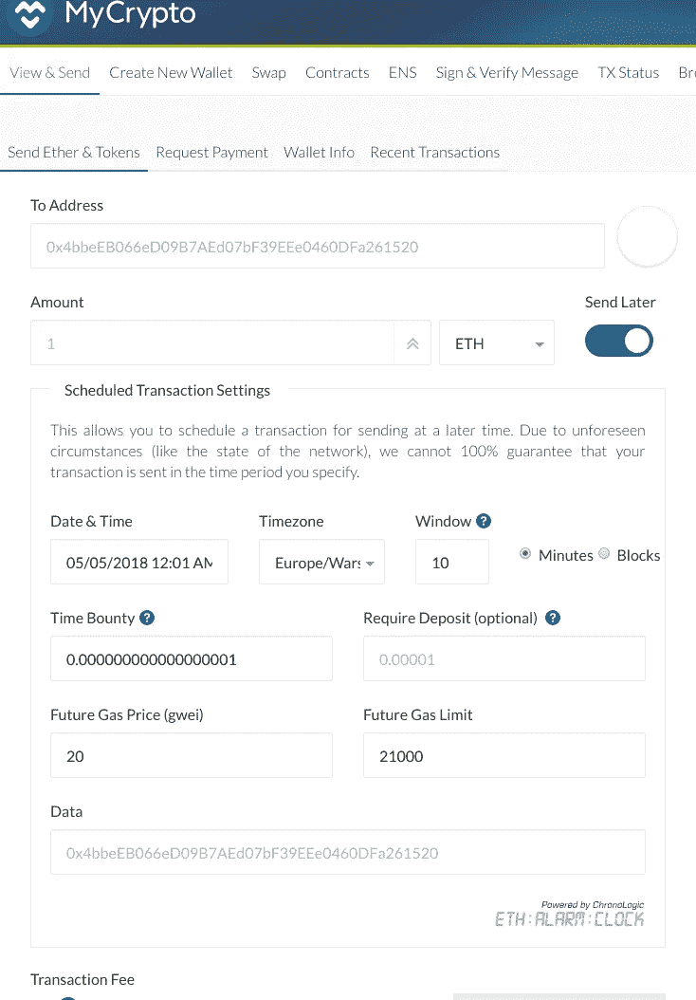

# 区块链不知道时间。需要有所改变。

> 原文：<https://medium.com/hackernoon/blockchain-doesnt-know-time-there-s-need-for-a-change-492e56a00e7d>

加密货币渴望最终让银行崩溃。虽然，为了让它成为现实，加密钱包的功能不应该让位于银行系统。最基本的财务功能之一是安排交易。不幸的是，区块链不知道时间的概念，我们需要改变它。

常见情况——我们需要纳税。截止日期是每个月的 10 号。我们不想更早转账，而是正好在最后一天。第二个例子，每个月我们可以支付房租。我们希望明年实现交易自动化。在这两种情况下，银行体系都让我们能够做到这一点。加密货币钱包呢？

加密货币对此的回答是什么？最受欢迎的两种加密货币是比特币和以太坊。当谈到两个平台的技术进步水平时，以太坊因为智能合约而更加强大。那是什么意思？在比特币中，我们只能在地址之间转移价值。然而在以太坊中，我们可以在区块链中创建程序和设置逻辑。通过这种方式，创建了分散的应用程序。一个示例应用程序可以是一个分散的音乐站点。

回到安排交易的问题上来……在比特币中，这是“不行”的。时间的概念是不存在的，只有块。当然，你可以启动一个所谓的“CRON”，这意味着，在某个时间点，计算机进程将会启动。它将尝试使用例如控制台客户端来执行事务。这是一种集中的方式，所以所有的机器或互联网问题都可以停止执行。你不想那样，对吗？

CRON 的想法在以太坊世界和在比特币世界一样有效。然而，以太坊还能提供更多。实际上，它提供了一个机会来创建一个有效的、分散的解决方案…我已经提到过智能合同。按照他们的逻辑，我们既可以访问当前的块号，也可以访问… UNIX 时间。这意味着我们可以在智能合同中保存我们想要执行的交易的细节。这种智能合同将允许执行，只有在你自己设置的窗口，它可以是五分钟。

以太坊中安排交易的解决方案还没有在本地实现，但是平台本身允许在智能合同中创建一个更高层次的协议。

# 以太坊闹钟

允许调度事务的协议是[以太坊闹钟](https://github.com/ethereum-alarm-clock/ethereum-alarm-clock)。它是由以太坊基金会成员 Piper Merriam 于 2015 年创建的。用户可以选择执行事务的时间或时间段。因为不能 100%保证精确的时间/块执行，我们要求用户为执行设置一个时间窗口。假设用户 A 想在 5:15 给用户 B 发送 1 个 ETH。因此他或她选择 5:15 作为窗口开始，并将时间窗口设置为 5 分钟。这意味着可以执行交易的最晚时间是 5:20。

Short introduction to the protocol

事务的执行受到时间节点网络的保护。当安排交易时，用户需要设置一个小的赏金，他或她准备为执行交易而向某人付费。这创造了一个市场和网络中的第二个参与者……一个“时间节点”被激励去执行交易。

实际上，成为一个时间节点就是在浏览器中打开一个带有导入以太坊钱包的标签。这个钱包将用于执行预定的交易和收集奖金。允许调度和充当时间节点的站点是:[https://app . chronologic . network](https://app.chronologic.network)。为了测试这里描述的功能，你应该安装 [MetaMask](https://metamask.io) (仅用于调度)并使用 Kovan testnet。该协议将很快在以太坊主网上运行。目前，该协议正在接受 ZK 实验室的审核。它将确保用户的资金安全。

# 技术性

让我们分析一下从调度事务到执行事务的路径。可以使用 [eac.js-cli](https://github.com/ethereum-alarm-clock/eac.js-cli) 、JavaScript 控制台客户端或 web 应用程序来安排事务:[https://app . chronologic . network](https://app.chronologic.network)。控制台客户端和应用程序都使用相同的库— [eac.js-lib](https://github.com/ethereum-alarm-clock/eac.js-lib) 。

[Web application](https://app.chronologic.network/) used for scheduling a transaction.

无论哪种方式(控制台客户端或 web 应用程序)，我们最终都会调用`TimestampScheduler`智能合约中的方法`schedule`(如果我们选择了时间调度)或`BlockScheduler`。接下来，为每个计划的交易创建新的智能合同— `TransactionRequest`。它的创建在`RequestFactory`契约中注册，由节点网络观察。在这个网络中，每个 TimeNode 都运行一个控制台客户端或浏览器选项卡，这允许捕获由`RequestFactory`发出的`RequestCreated`事件。TimeNode 将所有事务保存在缓存中，并等待能够执行事务并获得奖金的时刻。

一个有趣的机制是“声明”事务的可能性。它赋予节点执行事务的优先权。有时这意味着需要 ETH 存款。如果一个节点要求一个交易，而不执行它，存款将会丢失。

所有以太坊闹钟智能合约都是用以太坊平台的语言 Solidity 编写的。

# 集成

我们在巴黎以太坊社区会议上进行了 60 多次采访。结论是开发者和以太坊用户都确实缺乏安排事务的能力。在以太坊世界，众筹销售每天都在发生。他们可以在晚上开始——取决于我们的时区。你可以使用以太坊闹钟协议，将节省下来的时间用于其他事情，而不是等待购买令牌。

第一个给你安排交易的以太坊钱包是 MyCrypto。

Test it live on [mycrypto.com](https://mycrypto.com) (choose Kovan network)

由于这种集成，用户可以使用“稍后发送”开关，选择合适的时间发送交易。下一次集成即将到来，但首先，我们要等待审计。在与以太坊的创建者 Vitalik Buterin 交谈时，我们发现以太坊基金会计划将日程安排原生纳入以太坊。没有实施的原因是缺乏时间，实施时间表已经推迟。

Ethereum’s creator — Vitalik Buterin speaking about Ethereum Alarm Clock

# 将来的

如果你是以太坊的用户，几个月后你就可以一边使用你最喜欢的钱包一边安排交易了。另一方面，如果你有兴趣成为一个 TimeNode，并为执行事务赢得 ETH 奖金，也许是时候让你开始测试了。