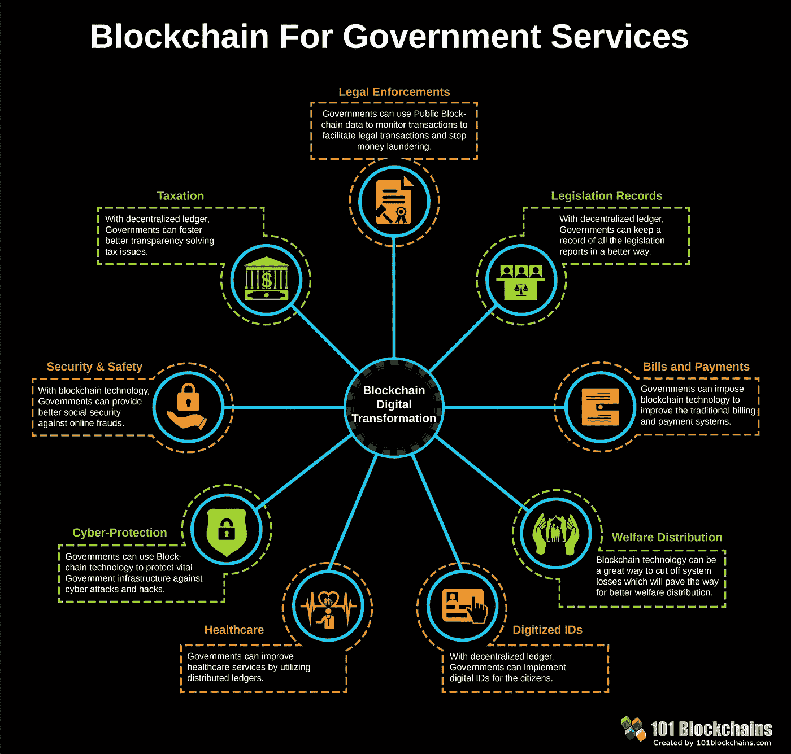

# 区块链教育是经济增长的关键因素

> 原文：<https://medium.com/hackernoon/blockchain-education-as-a-key-factor-to-economic-growth-274cc3d200d5>

区块链技术正在成为 21 世纪最有前途的技术之一。许多人将这项技术目前的重要性与互联网热潮相提并论，互联网热潮彻底改变了商业，创造了价值数百万、数十亿美元的产业。专家认为，在这个数字时代，区块链的影响非常重要。

## 重点是让员工能够理解区块链

事实上，随着越来越多的企业希望充分利用区块链技术，对区块链开发人员的需求非常大。根据 TechCrunch 上发布的一份报告，就就业机会而言，区块链技术是增长第二快的行业，区块链的一名开发人员大约有 14 个职位空缺。

## 10 所开设区块链技术课程的大学:

1.  斯坦福大学
2.  杜克大学
3.  乔治敦大学
4.  麻省理工学院(Massachu-setts Institute of Technology)
5.  伯克利
6.  康奈尔大学
7.  纽约大学(NYU)
8.  普林斯顿大学
9.  墨尔本皇家理工大学
10.  伊利诺伊大学

除了这些大学课程，还有一些来自网站的在线课程，比如[区块链工厂](https://blockchainsfactory.com)。

斯坦福传播区块链教育的技术很有趣，因为它突出了潜在的趋势。这种方法对于不断变化的 IT 行业非常有用。区块链的课程设置不断更新，新的内容不断增加。

**杜克大学成功传授区块链教育**

区块链教育不应仅限于此，还应应用于其他领域。提供区块链课程的机构的目标是教育学生关于区块链的知识。杜克大学在 2014 年引入了创新和 Cryptoventures 课程。

杜克大学的创新和 Cryptoventures 课程教授潜在候选人区块链的各个方面，包括智能合同和加密金融的开发。这门课程开始时只有 13 名学生，从那以后它取得了长足的进步。这门课程吸引了来自商业、工程、计算机科学和法律的学生。

调查显示，报名参加“计划、创新和秘密投资”课程的学生人数大幅增加。这表明加密货币市场正在蓬勃发展。

**了解区块链教育的影响**

区块链技术可以很容易地在各种政府系统中实现，以促进问责和打击腐败。该技术有助于从生产阶段到产品到达客户手中这一阶段的产品监控。

[Blockchain for Government Services](https://101blockchains.com/blockchain-government-transformation/)

这项技术非常适合于[医疗保健行业](https://101blockchains.com/blockchain-technology-in-healthcare/):计费和索赔管理、临床数据交换、医疗保健物联网、供应链完整性、临床试验。

区块链在各个行业的使用使该技术能够极大地改善运营。仅举几个[智能合同用例的例子](https://101blockchains.com/smart-contracts/):

[Smart Contracts Use Cases](https://101blockchains.com/smart-contracts/)

这项技术有潜力改变[现代工业](https://101blockchains.com/blockchain-applications/)的运作方式。实施区块链技术可以带来经济增长。

尽管对区块链工作的需求越来越大，但对最好工作的竞争仍然存在。我发现这个 [36 个区块链求职面试问题&答案](https://blockchainsfactory.com/blockchain-interview-questions/)的列表挺有用的。