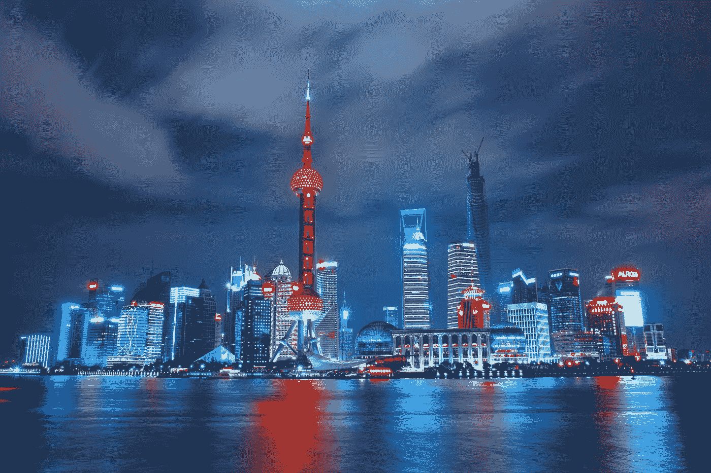
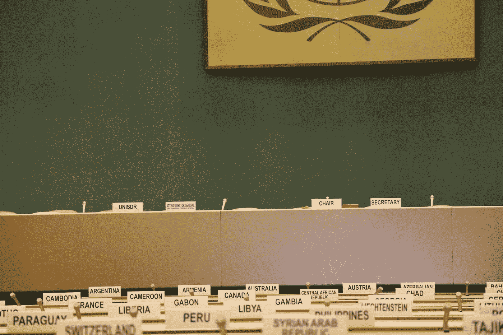

# 区块链赋能新兴市场

> 原文：<https://medium.com/hackernoon/blockchain-empowers-emerging-markets-5ebbe73de773>

Shanghai, China

新兴市场是全球 86%的千禧一代的家园。

事实上，中国和印度的千禧一代比美国和西欧的劳动人口总和还要多。

他们是不可忽视的高技能人群。

根据高盛的一份报告，[中国 90 年代出生的人比他们的父母毕业的可能性高出 31%。](https://seekingalpha.com/article/4131518-investing-emerging-millennial-boom)

尽管年轻的懂技术的劳动力具有创业精神，但由于金融市场动荡和基础设施不可靠，新兴市场难以获得牵引力。

> **区块链正在让世界着火，改变着它所涉及的每个行业，并重新定义了我们对技术的理解。**

它将在任何地方促进创新和想法，但在新兴经济体尤其如此。

这是因为区块链提供了一个难以篡改的信任和信誉平台。

它有能力识别和核实 11 亿没有证件的个人，其中许多人在新兴市场，并将他们注入世界经济。

新兴经济体正在利用像区块链这样的创新技术来加速发展，巩固他们作为行业先锋的地位。

由于缺乏基础设施，他们似乎处于劣势，但是，在干净的基础上构建最新的技术比替换旧的和过时的技术更容易，也更便宜。

区块链技术可以比作[新兴市场的智能手机热潮](https://www.mediatek.com/blog/emerging-markets-power-the-next-smartphone-boom)，在那里，各国“跨越”了固定电话。

这种快速发展已经在世界各地复制。

肯尼亚不是通过建立更多的银行，而是通过采用移动支付服务来解决银行缺乏的问题。通过为没有银行账户的人提供银行服务，肯尼亚引发了一场支付革命，使 194，000 名肯尼亚人摆脱了贫困。

Sugarcane production in Brazil

当发展中国家逐渐摆脱对化石燃料的依赖时，巴西通过甘蔗生产制造乙醇，跳过了石油作为燃料来源的“发达”进程。

在世界的另一端，中国[正在投资可再生能源](https://www.scientificamerican.com/article/solution-to-energy-and-climate-crises-in-game-of-leapfrog/)和他们的“太阳谷”

区块链可以帮助稳定新兴经济体，并激励外国投资者在这些金融市场中工作。

在金融和人道主义援助等行业，它取代了易受腐败影响的中间人，或者可能从他们的服务中抽取佣金。

> **区块链研究机构的联合创始人唐·塔斯考特将今天的金融体系******视为“披着数字外衣的工业技术和纸质流程的组合”****

**金融机构几乎跟不上技术发展的步伐，每一步失误都会带来灾难性的经济影响。**

**对于缺乏大多数国家赖以生存的基础设施和技术的新兴经济体来说，尤其如此。**

**尽管资源不足，但新兴市场潜力巨大，拥有低成本劳动力、丰富的资源和尚未开发的行业可供投资。**

**阻碍他们的是他们的高风险。腐败、欺诈和陈旧的官僚作风让潜在的商业伙伴望而却步。**

**区块链在多个方面支持新兴经济体。它通过提供一个清晰透明的平台来跟踪支付和资产，从而减少腐败。**

**此外，它削减了不必要的成本，这些成本可以更好地用于其他地方。**

**汇款是新兴经济体最大的资本流入形式之一。根据海外研究机构的数据，2015 年每 200 美元汇款中有 12%流向银行和其他金融机构。**

****

**United Nations General Assembly**

**发送人道主义援助一直是一件大事，当一些国家得知他们的捐赠被暴君拿走时，他们就会停止捐赠。**

**区块链允许捐赠者在旅行时追踪付款，确保它们不会落入坏人之手。**

**由 40 多个人道主义团体支持的 Disberse 通过观察钱从英国的一所学校转移到斯威士兰的四所学校来测试他们的计划。**

**在约旦的阿兹拉克难民营，叙利亚难民正在使用虹膜识别技术购买食品杂货和生活用品，资金通过一个基于区块链的系统流动。**

**这个想法是在世界粮食计划署注意到他们向当地银行支付了价值数百万的餐费后产生的。区块链降低了 98%的成本，允许他们以同样的价格提供更多的服务。**

**它还激发了微软等公司与非营利组织在 ID2020 上合作，这是一项为缺乏合法身份的 11 亿人提供合法身份的任务。**

> ****找工作通常需要财务和政府记录。有了区块链，公民们就有了一个网络钱包，无论他们去哪里，钱包都会跟着他们。****

**区块链有助于提供不会丢失或被盗的数字文件，并导致迪拜到 2020 年通过它运行所有政府文件。**

**这种可能性是无限的。区块链可以用来验证一个人的年龄、教育程度、血统，甚至他们的职业经历。**

**区块链技术正在重塑人们理解金融、安全和透明度的方式。但对于新兴经济体来说，它正在改变生活。**

**我们的世界从未见证过一项技术以如此方式独自改变产业。**

**为这些新兴国家提供成功所需的资源和技术将推动创新和全球化达到新的高度。**