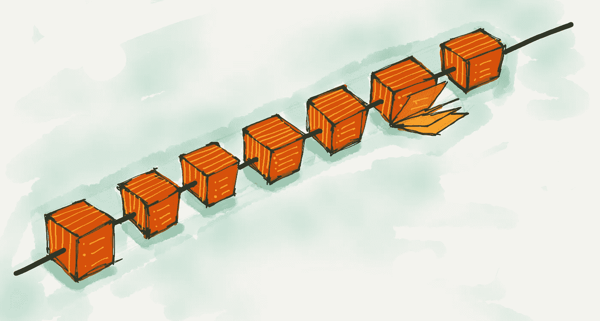
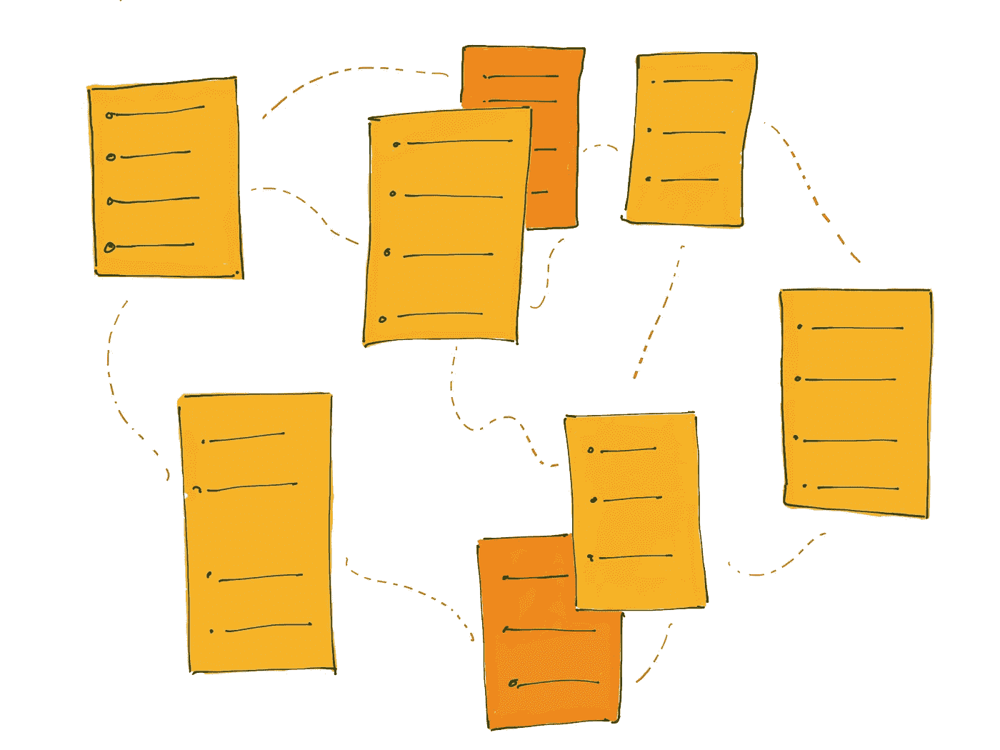
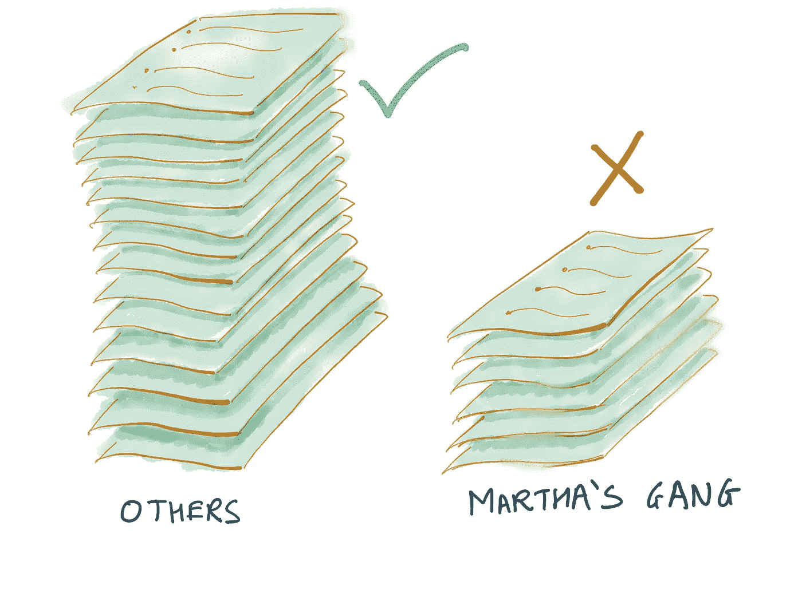
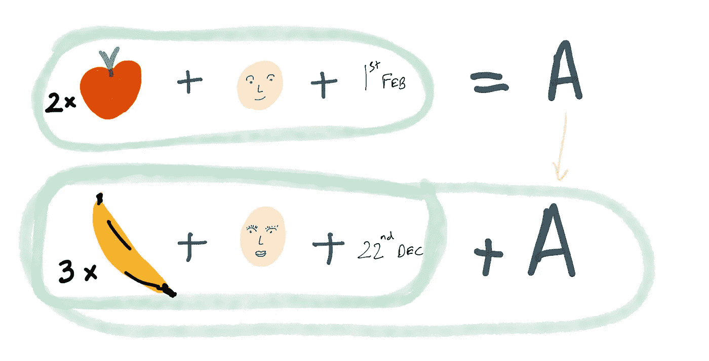
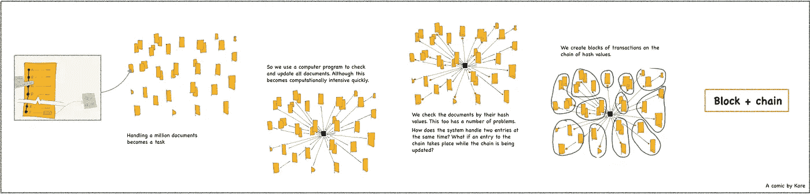

# 假人区块链

> 原文：<https://medium.com/hackernoon/blockchain-for-dummies-ae786c6a5fe7>

约翰是一名平面设计师。他还在孟买经营一家出租车组织。约翰没有办公室，他更喜欢在德里的家里工作。该公司的管理层根据他的偏好，建议他把孟买作为经营业务的最佳城市。他不拥有任何车辆，这些车辆是通过第三方组织租用的，在第三方组织中，许多像 John 这样的人汇集了有价值的资源(时间、金钱、声誉、计算)。车辆的硬件和软件自动更新，车辆决定何时需要去维修，相互告知最佳路线以获得更大的投资回报。当 Seema 进入 John 的一辆出租车并要求它带她回家时，出租车通过名为“VerifyB”的第三方身份验证服务来识别她。“VerifyB”会自动识别她的重要凭据，如血型、保险、钱包余额，并只将相关信息发送给约翰的出租车服务。乘车开始后，出租车上的软件开始从 Seema 装有美元的银行钱包中扣除小额付款。谢天谢地，约翰的出租车服务接受美元，即使不接受，系统也可以将任何货币转换成约翰喜欢的货币。出租车服务上的软件为出租车和 Seema 运行动态保险定价算法。该模式在事故多发地区收取较高的保险费率。如果约翰的车队已经决定走更安全但稍微长一点的路线；该算法相应地调整票价和保险的价格。
Seema ' s ride 中的所有交易都是自动发生的。她从来不需要与手持设备互动。她上了一辆自己选择的出租车，说明了自己的意图。只有关于 Seema 的相关信息被提供给了 John 的舰队。约翰永远不会知道她的名字、年龄、住址、朋友、关系等等。识别软件不允许共享这些信息，并要求 Seema 同意当一个奇怪的请求，如她的名字或电话号码出现时，Seema 拒绝它，并标志着约翰的舰队的声誉。这并不影响她的旅程。约翰和 Seema 都不需要互相认识或交流。

约翰的出租车服务不是一个正常的组织。公司由投资者约翰和管理一切的软件程序组成。没有人管理。没有司机，车队由自动驾驶汽车组成。约翰没有很多流动资金，但他在计算资源方面做出了贡献。

在家里，约翰经营着另一家企业，将屋顶太阳能电池板的多余能量出售给微型电网，他出租多余的 wifi 带宽。不在家时，他通过一个管理房屋租赁的软件程序出租他的空公寓，并以他选择的货币按秒为入住和使用向他支付费用。智能锁、运动传感器、自动调温器和一系列“智能”设备可以管理各种服务，如身份验证、在房间里呆的时间、水、电的使用、游泳池的使用等。事物之间无缝协作。所有货币交易和其他交易都在分布式分类账中进行记录和加密。约翰不必依赖第三方来确保信任。信任是内在的。信任被编码在系统中。

## 编码信任

比特币、以太坊或<insert popular="" digital="" currency="" in="" trend="">因其可观的回报开始出现在日常用语中。它让一些人变得非常非常富有。在我看来，这不是这些货币有趣的地方。有趣的是这些货币背后的技术潜力。如果你用金钱来看待这个世界，用数十亿美元来思考，那你可能就错了。想想万亿！</insert>

欢迎来到区块链的世界！

# 区块链

区块链是一个全球分布式账本，它依赖于点对点网络的资源。简单来说，把区块链想象成一个非常长的电子表格。您有一份电子表格，您的朋友 Martha 有另一份。该文档由四列组成:水果名称、添加的水果量、添加水果的人和添加水果的日期。您在电子表格中添加了一个条目“2 个苹果”。为了使两个电子表格完全相同，Martha 需要添加相同的条目“2 个苹果”。现在玛莎的朋友 Seema 想加入你的电子表格小组，所以玛莎给了 Seema 一份电子表格。当 Seema 添加条目“9 个橙子”时，您和 Martha 都需要对各自的副本进行更改，以使它们完全相同。*规则是任何人都不能删除或修改以前的条目，成员只能添加条目。*

几天过去了，你的电子表格小组现在已经有 20 名成员了。Martha 是电子表格小组的创始人之一，她没有对该文档做出任何贡献。她开始嫉妒 Seema，Seema 已经有点像摇滚明星了。尽管很生气，她还是决定对电子表格做*细微的修改*。她在电子表格的几个地方用 Seema 的名字替换了她的名字。她甚至说服其他 5 名成员做同样的事来换取*的帮助*。

当每个人都要更新他们的电子表格时，John 注意到属于 Martha 和其他几个成员的一些电子表格中存在差异。他们呼吁对水果电子表格进行干预，所有的电子表格副本都要进行布局并检查不一致的地方。20 个电子表格中的 14 个被发现是相同的副本，属于玛莎和她的团伙的 6 个副本被发现是伪造的。在成员投票的基础上达成共识。玛莎和她的团伙被迫删除他们的副本，并用 14 个相同的副本来替换它们。该文件的神圣不可侵犯性保持不变。平衡恢复了。

Fruit spreadsheet consensus. The other members had far more identical copies on the spreadsheet.

对于团队来说，处理 20 个成员仍然是可以管理的，但是在超过 50 个成员的组中维护副本很快变得混乱和复杂。现在想象一下我们的水果电子表格小组有一百万成员，这简直是一场噩梦。

Seema 建议他们开始使用计算机程序来维护副本。每当向电子表格中输入一个条目时，这个简单的程序都会检查并更新所有成员的所有副本。它还通过计算网络上的所有副本来检查以前条目中的任何差异。Seema 的想法虽然聪明，但有一个重大缺陷。检查和更新一百万个电子表格是计算密集型的，很快一些成员的计算机开始崩溃。

We can create unique hash values by adding the fruit id multiplied by the number of units, the user id and the date and the previous hash.

约翰提出了另一个想法；与其检查整个电子表格，为什么不在每个文档中检查一个数学上唯一的值(我们称之为哈希值)。该值由电子表格列中的公式得出。假设我们分别给每个成员和水果分配一个唯一的数字 ID。我们在每个列条目中添加成员和水果的 id，以及日期和水果的数量，我们将它们存储为电子表格中第一个条目的**哈希值**。对于后续条目，我们使用相同的公式，并添加前一个条目的哈希值。这开始形成引用整个电子表格的散列值的**链。这样做的好处是，计算机程序只需检查电子表格链中最后一个条目的哈希值，而不是整个电子表格。如果任何成员试图篡改电子表格的先前条目，他将不得不对电子表格链中的所有条目以及所有电子表格副本进行更改，这实际上是不太可行的。**

然而，电子表格链在设计上也有缺陷。对于网络上的大型电子表格，对所有成员的文档执行实时更新也是计算密集型的，因为交易和链的更新可以在毫秒内发生。系统如何同时处理两个条目？如果在链被更新的时候发生了一个到链的条目呢？

Martha 建议我们在 10 分钟内处理所有事务，而不是实时执行事务。然后，这部分事务可以作为 ***块*** 添加到我们的电子表格链中。约翰、Seema 和玛莎刚刚创建了一个**区块链**。

为了简单起见，我故意省略了一些特性，如加密、密码术、共识协议等。在上面的例子中。我们将继续讨论这些问题。

# 参考

1.  [**区块链革命**亚历克斯·泰普斯科特和唐·塔斯考特](https://amzn.to/2KYdZpE)
2.  [**谁拥有未来？**作者杰伦·拉尼尔](https://amzn.to/2KP3qpy)
3.  [**智慧城市:大数据、公民黑客和对新乌托邦的追求**作者安东尼·m·汤森](https://amzn.to/2L0n0hS)
4.  [**约翰·梅达**的简单性法则](https://amzn.to/2ujywut)
5.  [**区块链如何改变货币和商业**](https://www.youtube.com/watch?v=Pl8OlkkwRpc) 唐·塔斯考特(TED Talk)
6.  [**区块链将如何彻底改造经济**](https://www.youtube.com/watch?v=RplnSVTzvnU&t=89s) 贝蒂娜·沃伯格(TED Talk)

附注:关于这项技术在金融领域的机遇和可能性，已经谈了很多，即微支付、货币兑换、汇款、保险、区块链 IPO、替代硬币等。我已经尽可能远离这些话题。
所有观点均为个人观点。

## **喜欢吗？此文** [**此处**](/zenturtle/blockchain-for-the-internet-of-things-71a06afce81) **阅读较长版本。**

如果你觉得这篇文章有用，请鼓掌分享。:)