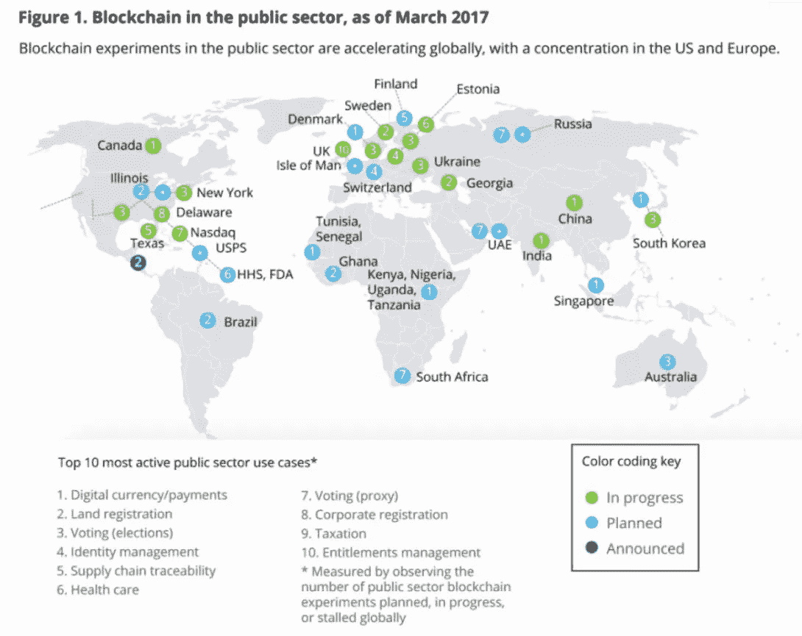

# 面向政府的区块链

> 原文：<https://medium.com/hackernoon/blockchain-for-government-41e3b097356d>

“To date, 35 million unique addresses exist on the Ethereum blockchain,” says ConsenSys. (Image source: [ethernodes.org](https://www.ethernodes.org/network/1))

## 采用率正在全面上升，尤其是以太坊。

这不是我第一次写世界各地的政府如何看待区块链技术，以改善服务，安全交易，并增强安全性和信任。这一趋势正在发展，并引起了包括城市一级在内的世界各地国家和地方机构的极大关注。

区块链现在是政治讨论的话题，政府官员有兴趣更好地了解比特币和加密货币以外的区块链动态。事实上，区块链“在公共部门有许多应用，可以提高政府服务质量，保护产权，防止欺诈，减少繁文缛节和浪费，同时提高透明度，”正如 [Mohit Mamoria](https://medium.com/u/24f7fbc09357?source=post_page-----41e3b097356d--------------------------------) 在媒体上向[Jorge Barba](https://medium.com/u/a0b0adbdb803?source=post_page-----41e3b097356d--------------------------------)解释的那样。

根据德勤官员的说法，“区块链在公共部门的影响力将主要在幕后。但该技术有潜力为广泛的服务和流程带来安全性、效率和速度。”

例如，在二月份， [IBM 区块链](https://medium.com/u/610fc58d12f7?source=post_page-----41e3b097356d--------------------------------)团队[调查了 16 个国家的 200 名政府领导人](https://www-01.ibm.com/common/ssi/cgi-bin/ssialias?htmlfid=GBE03801USEN)对区块链的体验和期望。

这项名为*建立对政府的信任:探索区块链的潜力*的研究得出结论，这项技术提供了正面解决信任和官僚主义挑战的机会。它发现，相当一部分被他们称为“*先锋”*的政府“正在启动应用区块链来转变监管合规性、合同管理、身份管理和公民服务的项目。”根据 IBM 的说法，“区块链提供了一种增强政府、企业和公民之间透明度和协作的新方法。”

最近，[美国国务院](https://medium.com/u/86ab506c3866?source=post_page-----41e3b097356d--------------------------------) [启动了全球参与中心(GEC) *技术系列*](/digital-diplomacy/tech-and-blockchain-to-fight-foreign-propaganda-and-disinformation-27d0ad3a5774) 来研究不同的技术和解决方案，包括区块链支持的内容认证*，以*对抗外国宣传和虚假信息。[去年](/digital-diplomacy/blockchain-for-government-and-diplomacy-7ffe59403461)，他们召集了第一次关于外交和外交政策的区块链活动，参与者包括[硬币中心](https://medium.com/u/7b0409e499a0?source=post_page-----41e3b097356d--------------------------------)[的](https://medium.com/u/2751ecae6aa7?source=post_page-----41e3b097356d--------------------------------)杰里·布里托；[全球区块链商业理事会](https://medium.com/u/8d62848d16da?source=post_page-----41e3b097356d--------------------------------)[的杰·史密斯](https://medium.com/u/9ed2c574986d?source=post_page-----41e3b097356d--------------------------------)；[Bitfury 组合](https://medium.com/u/8d62848d16da?source=post_page-----41e3b097356d--------------------------------)的杰·史密斯和瑞秋·皮潘[；](https://medium.com/u/f3c72b23a620?source=post_page-----41e3b097356d--------------------------------)[参议院](https://medium.com/u/26a7c53cdfeb?source=post_page-----41e3b097356d--------------------------------)[的约翰·沃伯特](https://medium.com/u/6c7078bf7b01?source=post_page-----41e3b097356d--------------------------------)；[区块链信任加速器的 Tomicah Tillemann](https://medium.com/u/107980161ecf?source=post_page-----41e3b097356d--------------------------------)；和许多其他人。此外，几个月前，他们宣布与可口可乐、[Bitfury Group](https://medium.com/u/f3c72b23a620?source=post_page-----41e3b097356d--------------------------------)和 [Emercoin](https://medium.com/u/dd52d1827102?source=post_page-----41e3b097356d--------------------------------) 建立新的合作伙伴关系，启动一个项目，利用区块链在全球范围内帮助反对使用强迫劳动。区块链信托加速器也参与了这个项目，这是一个由[新美大](https://medium.com/u/8b7450ee42a6?source=post_page-----41e3b097356d--------------------------------)、 [NDI](https://medium.com/u/2e629d29255?source=post_page-----41e3b097356d--------------------------------) 和 Bitfury 创建的非营利组织。

同样在美国，国土安全部的 DHS 部门正在与私人和公共合作伙伴一起探索和测试基于区块链的围绕合同、身份和交易的解决方案，正如 DHS 的 Anil John 和 ConsenSys 的 Victoria Adams 最近在 DC 意大利大使馆的数字外交系列活动中所解释的那样。

据路透社报道，法国总统[埃马纽埃尔·马克龙](https://medium.com/u/bb9cecbbf08d?source=post_page-----41e3b097356d--------------------------------)和他的政府准备投资人工智能、区块链和数据挖掘，以“转变”其庞大的官僚机构，而不是简单地削减预算和工作岗位[。一项 7 亿欧元的基金将在未来五年内帮助投资 IT 项目。](https://www.reuters.com/article/us-france-reform/macrons-state-reform-tsar-looks-to-technology-to-cut-red-tape-idUSKCN1G41LF)

据 CNN 报道，印度财政部长 Arun Jaitley 最近表示，印度将“积极探索使用区块链技术”。加拿大科技行业协会 [NASSCOM](https://medium.com/u/251557db1bc2?source=post_page-----41e3b097356d--------------------------------) 也与加拿大[区块链研究所](https://medium.com/u/aadc3aba361d?source=post_page-----41e3b097356d--------------------------------) (BRI)合作，探索区块链在政府和学术机构以及企业中的应用。这一合作关系是在加拿大总理贾斯廷·特鲁多访印期间宣布的。

The [European Commission](https://medium.com/u/960f4c0ad987?source=post_page-----41e3b097356d--------------------------------) has also shown interest in blockchain technology and [has recently launched the *EU Blockchain Observatory & Forum*](https://hackernoon.com/blockchain-in-europe-b914cf1a9ea1)*,* in partnership with ConsenSys, The initiative aims to “highlight key developments of the blockchain technology, promote European actors, and reinforce European engagement with multiple stakeholders involved in blockchain activities.”

And more examples are coming from [Finland](/essentia_one/essentia-to-become-first-blockchain-based-solution-from-finnish-government-through-collaboration-4ae326126c13), as explains [Matteo Gianpietro Zago](https://medium.com/u/ddbdad3b6225?source=post_page-----41e3b097356d--------------------------------) of the [Internet of Blockchain Foundation](https://medium.com/u/b79b272bd8d6?source=post_page-----41e3b097356d--------------------------------) and founder of [Essentia](https://medium.com/u/d177f8c2c7d3?source=post_page-----41e3b097356d--------------------------------); [Georgia](/@BitfuryGroup/the-bitfury-group-and-government-of-republic-of-georgia-expand-historic-blockchain-land-titling-4c507a073f6b) as per the Bitfury Group; [the UK](/swlh/building-smarter-services-on-the-blockchain-7e8cfee4bab5), as per a [Nile](https://medium.com/u/f9ed996b1811?source=post_page-----41e3b097356d--------------------------------) post; the city of [Tokyo](https://blog.iota.org/iota-selected-by-tokyo-metropolitan-government-program-fde6b34ddc16), as per [Dominik Schiener](https://medium.com/u/aa6871c68c9d?source=post_page-----41e3b097356d--------------------------------) of [IOTA Foundation](https://medium.com/u/23dd6fd8c899?source=post_page-----41e3b097356d--------------------------------); and many more.

Source: Deloitte and Fletcher School of Law and Diplomacy at Tufts University.

Even the Chinese government is looking at the future of blockchain. “A new generation of technology represented by artificial intelligence, quantum information, mobile communications, internet of things, and blockchain is accelerating breakthrough applications,” Chinese President Xi Jinping said recently, according to a translation of his remarks published by CNBC.

 [## Chinese President Xi Jinping calls blockchain a 'breakthrough' technology

### Chinese President Xi Jinping said in a speech this week that blockchain - the technology underlying bitcoin - has…

www.cnbc.com](https://www.cnbc.com/2018/05/30/chinese-president-xi-jinping-calls-blockchain-a-breakthrough-technology.html) 

The article explains that despite China’s official ban on sales of new digital tokens and halt on Bitcoin trading, the country remains a hub of activity for blockchain development and several start-ups are partnering with the local Chinese government to research or implement the technology. Blockchain is also [mentioned twice](http://www.gov.cn/zhengce/content/2016-12/27/content_5153411.htm) in the Chinese State Council’s 13th five-year economic plan that was released in 2016.

While the number of governments around the world experimenting with blockchain is growing, the trend seems to focus on [ethereum](https://medium.com/u/d626b3859bc9?source=post_page-----41e3b097356d--------------------------------) mostly. [In a recent post here on Medium titled *The State of the Ethereum Network*](https://media.consensys.net/the-state-of-the-ethereum-network-949332cb6895), ConsenSys explains that “countries around the world have found ways to implement blockchain technology — specifically, Ethereum — to benefit their citizens.”

They list a few examples:

*   the government of [Brazil](https://cointelegraph.com/news/brazilian-government-plans-to-process-petitions-and-write-laws-on-ethereum) announced its intention to move petitions and popular voting onto Ethereum;
*   [Canada](https://www.ethnews.com/canada-leverages-ethereum-blockchain-for-public-transparency-of-government-grant) is testing out using Ethereum to provide transparency to the use of government grants to ease citizens’ concerns of misappropriation and corruption;
*   the city of [Zug, Switzerland](/uport/zug-id-exploring-the-first-publicly-verified-blockchain-identity-38bd0ee3702) — a long-time crypto bastion — began offering digital IDs registered on Ethereum in 2017;
*   [Chile](https://www.coindesk.com/chile-to-use-ethereums-blockchain-to-track-energy-data/) uses Ethereum to track the data and finances from the energy grid, hoping to combat corruption and exploitation through transparent, immutable data available for every citizen to see;
*   [Dubai](https://smartdubai.ae/en/Initiatives/Pages/DubaiBlockchainStrategy.aspx) is on the move to become an entirely integrated, blockchain-powered city by 2020;
*   爱沙尼亚成为分布式生态系统的典范，并通过将其许多国家系统迁移到以太坊区块链而成熟为“数字共和国”。

ConsenSys 写道:“尽管区块链技术被认为是一个用数字边界和公民身份重新定义当前全球政治结构的机会，但当前的系统并不担心使用其不可变的安全账本来增强其服务。”“我们将继续看到政府采用以太坊区块链，因为它的效用在当前的例子中得到证明。”