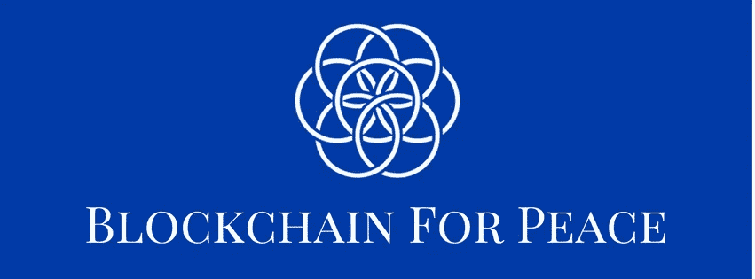
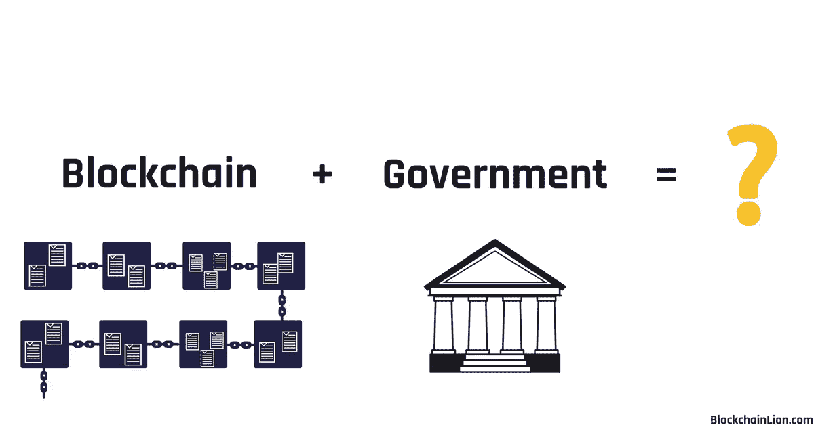
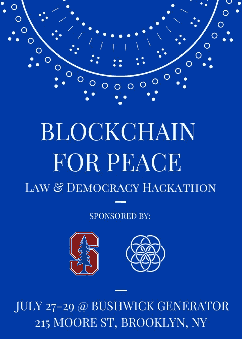

# 区块链促进和平——法律与治理黑客马拉松

> 原文：<https://medium.com/hackernoon/blockchain-for-peace-law-governance-hackathon-41bb784cc25f>

> Blockchain for Peace 是一个社区资源中心，供社会企业家、研究人员和影响力投资者创建开源知识库。

程序员、设计师和学者去哪里释放他们最好的想法，推动他们的创造力和智力的极限？在黑客马拉松上，数百人组成团队，在 24 小时内产生想法，然后将他们的创作提交给评委小组以赢得奖项。我们很兴奋地宣布今年最棒的黑客马拉松，7 月 27 日至 29 日在 Bushwick Generator 举行的 [Blockchain for Peace 的“法律&治理”黑客](https://www.eventbrite.com/e/blockchain-for-peace-hackathon-law-democracy-tickets-46976493958)。它将由和平加速器、斯坦福大学和布什维克区块链联盟共同主办，在距离纽约市区块链社区中心的 ConsenSys 总部两个街区的地方举行。

## [现在就在 Eventbrite 上注册](https://www.eventbrite.com/e/blockchain-for-peace-hackathon-law-democracy-tickets-46976493958)，加入[和平松弛区块链](https://join.slack.com/t/blockchainforpeace/shared_invite/enQtMzg0NTQyNjczODI2LWM4ZjVmMmQ5ZjAzZThkMWU3MTBkZmU3NTFmNTNkYTgyYjZhNDk3MmQ1YmZhMzA0NjhkOGI3N2JkNzdmZjE2YmI)。

**参与者可以:**

*   为我们的特色开源项目贡献代码、文档或设计
*   从头开始编写自己的应用程序
*   使用区块链设计新的司法或治理模式，并撰写白皮书

**奖项类别:** 无论你是打造应用还是撰写白皮书，所有提交的作品都会按类别一起审核。无论最终产品是什么，伟大的想法和努力工作看起来都是一样的。

*最佳解决方案设计* —经过深思熟虑、详细、实用，并具有可持续的商业模式。

*最具社会影响力* —根据联合国可持续发展目标创造最具影响力解决方案的团队。

*代码奖励* —所有黑客都可以通过 [Gitcoin](https://gitcoin.co/) 奖励赢得奖品。为像 [uPort](https://uport.me) 这样的开源项目竞争解决代码挑战，最好最快的会立即得到 ETH 的奖励。*请提前设置你的 Gitcoin 账户。*

**黑客创意:**

*   为当地布什维克社区设计一个[道](https://ethereum.org/dao#the-code)。
*   设计仿生影响下的全息自组织组织
*   将 TCR 整合到投票、提案和流动民主的法律流程中。

延伸阅读:
[迪拜的区块链政府计划](https://smartdubai.ae/en/Initiatives/Pages/DubaiBlockchainStrategy.aspx)，[分权组织与阿拉贡](https://blog.aragon.one/the-aragon-manifesto-4a21212eac03)，[全息档案及其运作方式](https://www.holacracy.org/how-it-works/)，[样本全息组织文件](https://www.holacracy.org/holacracyones-structure-governance)

**你能期待什么:**

*   表扬创造积极影响的人、政府和公司。
*   美味健康的食物。
*   创造真正的变化，提高对本地和全球问题的认识。
*   构建未来解决方案，引领全球创新。
*   有趣的新朋友和业务联系。

**团队:** 你最多可以有一个 10 人的团队。我们建议 40%的开发人员，40%的设计师，20%的法律专业人士，这样你就可以做出最好的产品。

**什么是区块链促进和平:** 由[和平加速器](https://www.peaceaccelerators.com/)和[斯坦福大学的和平创新实验室](https://peaceinnovation.stanford.edu/)发起为了团结和结盟国际和平运动，区块链促进和平是一个全球社区资源中心，面向社会企业家、研究人员和专注于区块链的影响力投资者。有关区块链促进和平或黑客马拉松的咨询，请发送电子邮件或关注我们。