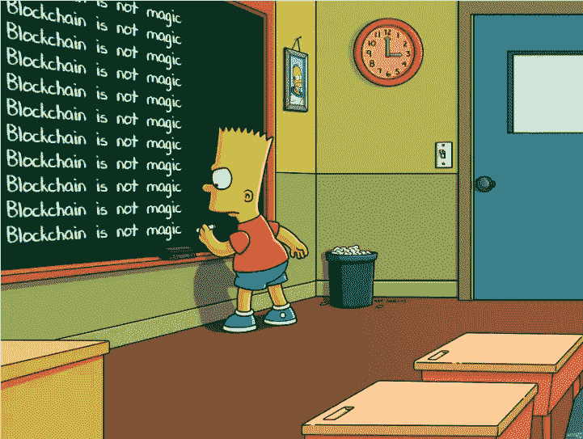
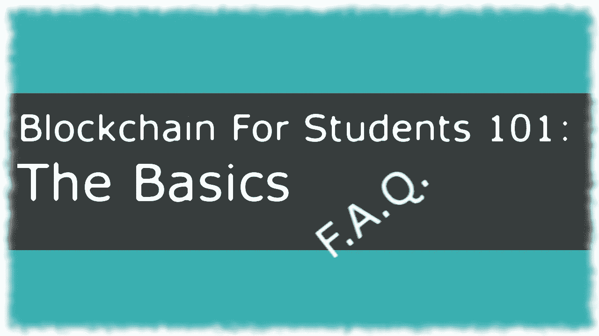
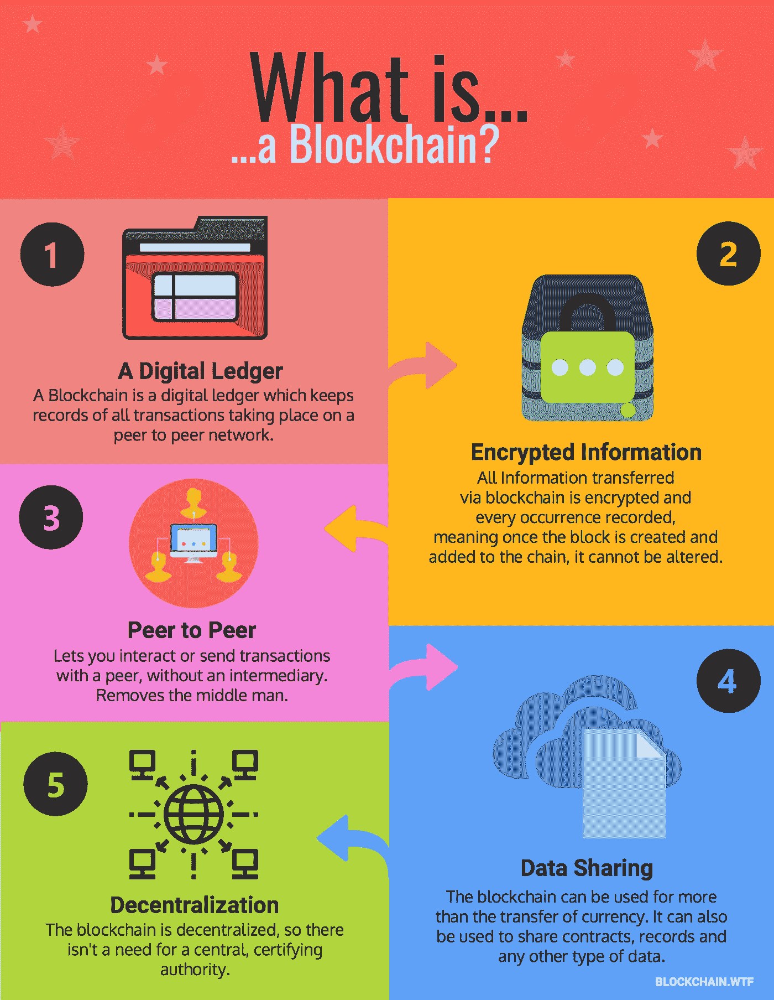
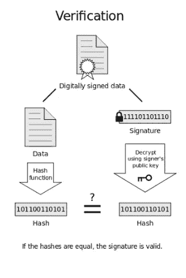
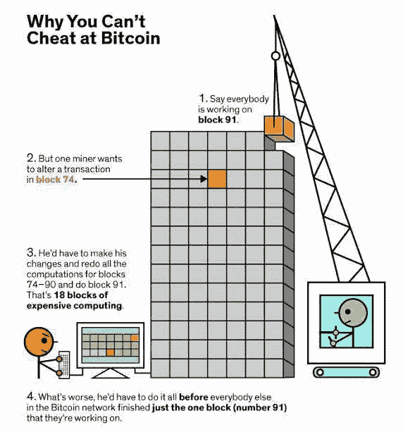
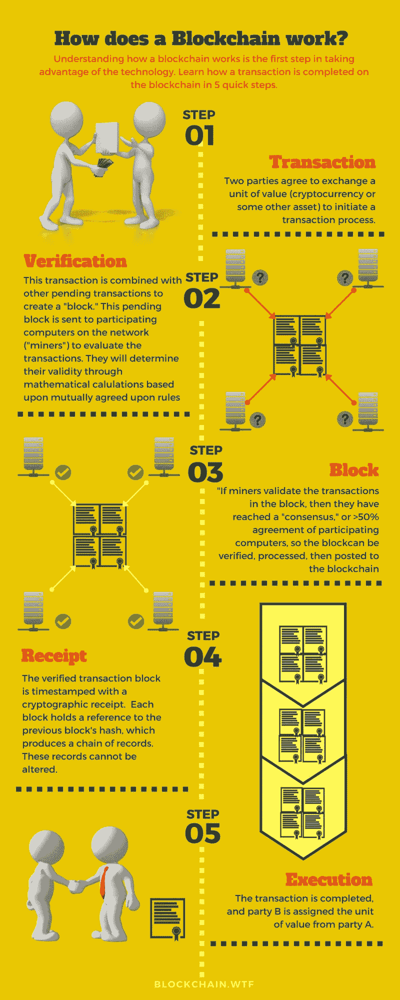

# 面向学生的区块链 101—基础知识(第 1 部分)

> 原文：<https://medium.com/hackernoon/blockchain-for-students-101-the-basics-part-1-f39b8201a7d5>

当我了解区块链技术时，我努力寻找涵盖该技术大部分方面的高水平文章。本文旨在向您介绍这项技术，解释它的工作原理，向您展示它的一些应用，并促进围绕该主题的讨论。并且记住:



Blcokchain is not magic, keep that in mind.

由于社会责任、安全和隐私在互联网上的作用越来越大，区块链被认为是当今真正热门的趋势，因为它旨在缓解与上述领域相关的问题。我相信，凭借政治和社会意识，区块链将迅速改变我们对经济、政府和记录保存的看法。要知道这种技术有其严重的缺点，我们将在后面讨论。我希望你对这项技术有疑问，因为我有一些答案。



**问:现在我知道区块链可以瞄准解决具体问题。为什么了解(至少了解一点)区块链很重要？**

**答:**无论你是计算机科学、工程、管理、经济学、哲学、艺术、生物学还是其他专业的学生，请记住这一点:这项技术范围很广，[还不成熟，有一个仍处于萌芽状态的市场](https://www.mckinsey.com/industries/financial-services/our-insights/the-promise-of-blockchain)，还有一个尚未出现的清晰的成功秘诀。

无论你学的是什么，你的领域都与区块链有关，有了足够的创造力和解决问题的技巧，你将能够发现问题并(希望)提出解决方案。

事实上，根据麦肯锡的一篇文章，

> ……鉴于比特币的市值在 2017 年期间从不到 200 亿美元飙升至超过 2000 亿美元，区块链对比特币的关注并不令人惊讶。然而，比特币只是区块链技术首次引起政府和行业关注的应用。

这项技术有很大的商业和社会潜力。如果我们理解了它，我们就可以试着用它来解决问题。社会受益，你的公司受益，你受益。请记住:

> 区块链不仅仅是为了计算机科学的人去理解、开发和应用。

**问:区块链，**上什么[🌍](https://emojipedia.org/earth-globe-europe-africa/) **你是** **吗？**

注意:请容忍我所做的任何简化。这些概念和算法背后都有很多研究。如果你想有更深的了解，我将包括一些资源。

**答:**区块链是由[中本聪](https://en.wikipedia.org/wiki/Satoshi_Nakamoto)在 2008 年发明的技术。它是连接在一起的记录(称为节点)的列表。创建它的主要目的是作为 B[it join](https://en.wikipedia.org/wiki/Bitcoin)的公共交易[分类账](https://en.wikipedia.org/wiki/Ledger)。



Source: [https://blockchain.wtf/what-the-faq/what-is-blockchain/](https://blockchain.wtf/what-the-faq/what-is-blockchain/)

**问:好吧，有意思。还有什么是比特币(** [₿](https://emojipedia.org/bitcoin-sign/) ) **？**

**答:**比特币是一种不受监管的数字货币。从中本聪对[比特币:一种点对点电子现金系统](https://bitcoin.org/bitcoin.pdf)的分析中，可以看出其主要目标是创建一种去中心化的电子现金，不需要中间人，同时防止[重复消费问题](https://en.wikipedia.org/wiki/Double-spending)。怎么会？称为[工作证明](https://en.wikipedia.org/wiki/Proof-of-work_system)的安全协议消除了对可信第三方验证交易的需要。

**注:** *如果你对比特币和其他加密货币感兴趣，敬请期待我未来的文章《学生区块链 101:比特币&朋友》。* ***随意给自己留点时间，关注我*** [🦄](https://emojipedia.org/unicorn-face/) *。*

**问:区块链和比特币有什么区别？**

**答:**比特币使用区块链技术作为其交易账本。

**问:比特币为什么这么出名？**

**答:**比特币区块链的发明使其成为第一种不需要中央机构就能解决[重复消费问题](https://en.wikipedia.org/wiki/Double-spending)的加密货币。每个人都可以看到发生的所有交易。如果你去[块浏览器](https://blockexplorer.com/)，你可以检查所有发生的交易。

问:区块链技术的缺点是什么？

在技术方面，相对于集中式数据库，区块链的成本非常高。开发速度较慢，难以扩展，维护成本高昂。吉米·宋写了一篇[非常详细的文章](/@jimmysong/why-blockchain-is-hard-60416ea4c5c)讲述区块链的陷阱。

人们必须考虑到许多公共分类账不受监管。这使得诈骗和市场操纵有了发生的空间，尤其是在加密货币领域。

[采矿耗费大量电力](https://digiconomist.net/bitcoin-energy-consumption)，以比特币为例。这不是很环保，因为通过燃烧，化石燃料仍然是电力的主要来源之一。

另一方面，有不同的共识机制不需要大量的计算能力。尽管如此，仍有许多区块链初创公司致力于帮助我们变得更加可持续发展。

*如果我们使用电力来驱动旨在帮助我们更可持续发展的技术，那么浪费大量电力，增加化石燃料的燃烧，你认为这合理吗？*

**问:那些创业公司看起来很有趣。请告诉我一些它的应用的例子。**

**答:**在环境方面，提出了一些非常有趣的解决方案:

By Future Thinkers

这个来自未来思考者的视频展示了被这项技术颠覆的主要行业。

By Future Thinkers

亲爱的企业家们，总而言之，如果你的想法有所发展，你可以考虑使用这项技术:

*   许多合作伙伴
*   确保注册的信息没有被更改
*   以透明、无冲突的方式交换任何有价值的东西，同时避免中间人的服务(智能合同)。

**注:** *如果你对智能合同技术以及如何释放你的企业家一面感兴趣，请继续关注我的文章“学生区块链 101:如何围绕智能合同建立业务”和学生区块链 101:通过建立一个来学习区块链。*

***随意给自己留点时间关注我*** [🦄](https://emojipedia.org/unicorn-face/) *。*

**问:** **那些都是有趣的应用。他们相信自己是安全的。我可以欺骗和改变已经发生的交易吗？加密货币安全吗？**

**答:**简答:应该不会，而且很难。不那么简短的回答:

区块链应该是不可改变的 T21 和可验证的:任何参与者都可以查看每条记录，允许任何人单独验证每笔交易的真实性。因此，这些块是**可审计的**。

一旦一个块被插入到链条中，在不改变所有后续块的情况下，不能追溯改变**和**。为什么？

警告:技术部分！

> [**散列函数**](https://en.wikipedia.org/wiki/Hash_function) 是可以用于将任意大小的数据映射到固定大小的数据的任何函数。
> 
> 如果散列函数很好，那么给定文本的输出总是不同的。比如比特币使用的哈希函数就是 SHA256。

```
Example, with SHA:
INPUT:              |   OUTPUT:Hello, dear reader  | 25EFBAB20773BD[...]5F3A90395D7BB9D45BE9FF14D08
Hello, dear reader! | 0EF69EF9CD0158[...]A25FB1F23D2080A8E2CA8A73DA5
```

如你所见，仅仅改变一个字符，你会得到完全不同的结果。

当一个新的块将要被创建时，它具有前一个块的数据的散列。哈希是一种加密签名，很难破解。很容易验证散列是否被改变。当您更改数据时，会产生不同的散列。



Source: [https://crypto.stackexchange.com/questions/12768/why-hash-the-message-before-signing-it-with-rsa](https://crypto.stackexchange.com/questions/12768/why-hash-the-message-before-signing-it-with-rsa)

在验证步骤，数据的散列将与记录在下一个块上的散列不同。系统意识到有人试图篡改数据。

从理论上讲，如果您更改一个节点的数据，哈希很可能会有所不同。因为当前节点的散列将被插入到下一个节点，所以您还需要更改下面的节点。



Source: [https://steemit.com/bitcoin/@darkflame/why-you-cant-cheat-at-bitcoin](https://steemit.com/bitcoin/@darkflame/why-you-cant-cheat-at-bitcoin)

虽然其设计在默认情况下是安全的，但[加密货币易受一系列攻击](https://arxiv.org/pdf/1706.00916.pdf) : CoinJoin 易受 DoS 攻击，Ripple 易受共识分裂攻击，比特币易受 [51%攻击](https://www.investopedia.com/terms/1/51-attack.asp)。不仅仅是[比特币被多次打击](https://en.wikipedia.org/wiki/Bitcoin#Thefts)，而且[整个网络都可能处于危险之中，这要感谢矿池](https://en.wikipedia.org/wiki/Bitcoin#Trend_towards_centralization)。

以太坊网络上发起了另一个非常著名的攻击 [DAO 攻击](https://www.coindesk.com/understanding-dao-hack-journalists/):

*   道是一个去中心化的自治组织。他们的目标是编纂组织的规则，消除治理中对文档和人员的需求。
*   这些规则是由开发人员写在智能合同中的。
*   最初有一段供资期，供资期结束后,"一体行动"可以开始运作。

发生了什么事？软件出现了 bug，一个攻击者成功泄出了 360 多万以太。

当然，技术安全细节是棘手的，需要大量的工作。但实际上，理解技术和边做边学要容易得多。

***注*** *:如果你有兴趣边做边学，敬请期待我以后的文章《区块链学生 101:通过搭建一个来学习区块链》* [🦄](https://emojipedia.org/unicorn-face/)。

**问:现在我知道什么是区块链，以及“它有多安全”。它是如何工作的？**

**答:**为了用作[分布式分类账](https://en.wikipedia.org/wiki/Distributed_ledger)(也就是说，在一个分布式数据库中，在不可信的环境中维护关于共享事实状态的共识)，我们需要组织参与者(也称为节点)。这种组织是通过拥有一个点对点的网络来实现的，它遵循一套特定的规则。例如，这些规则是参与者如何交互以及如何验证节点。



Source: [https://blockchain.wtf/what-the-faq/what-is-blockchain/](https://blockchain.wtf/what-the-faq/what-is-blockchain/)

**注:** *如果你是技术细节的爱好者，敬请期待我的文章《学生区块链 101:通过搭建一个来学习区块链》。* ***你现在知道该交易了*** [🦄](https://emojipedia.org/unicorn-face/)T10。

**问:什么是共识？**

**答:**这和上面海报的步骤#2 有关。任何参与者都可以向链中添加信息。因此，有审查和验证交易的机制是很重要的(记住，你不能相信网络中的任何人)。这些机制被称为“共识”。 [Chris Hammerschmidt](https://medium.com/u/55b1d71e6573?source=post_page-----f39b8201a7d5--------------------------------) 写了一篇关于共识机制的[非常有见地的文章，你可能想看看。](/@chrshmmmr/consensus-in-blockchain-systems-in-short-691fc7d1fefe)

问:你告诉我区块链是分布式数据库。用什么方式？

**答:**分布式数据库的存储设备(记录)并不都附属于一个公共处理，而是分布在网络上。这些旨在帮助构建可处理大量数据的可扩展解决方案。

对于“普通的”分布式数据库，您有一个中央机构来管理数据和用户之间的交互。在区块链，没有这样的权威，只有协议。不要 100%信任一个组织(它有几个问题)，你必须信任所有参与其中的“51%”的人/组织(继续阅读就知道为什么了)。可以说，区块链是一个分散的数据库，其管理系统也是分散的。

问:区块链有哪些类型？

**答:**区块链有三种，就其知名度而言:

**公众区块链**:任何人都可以参与网络。通常网络会奖励参与者。例子:比特币和以太坊。

**私人区块链:**参与者通过邀请加入网络。有助于公司在不泄露敏感信息的情况下将该技术整合到他们的流程中。

**联合区块链:**联合区块链在存在验证要写入区块链的块的预选节点的条件下运行。

# 下一步:
干杯，继续摇摆💪如果你喜欢这篇文章，请订阅我的邮件列表。
这里👇。这对我意义重大。

[](http://eepurl.com/go_uUD)[](https://hackernoon.com/blockchain/home) [## 专家讲解的区块链——黑客正午

### 区块链是所有加密货币交易的数字化、去中心化的公共分类账。区块链已经…

hackernoon.com](https://hackernoon.com/blockchain/home)