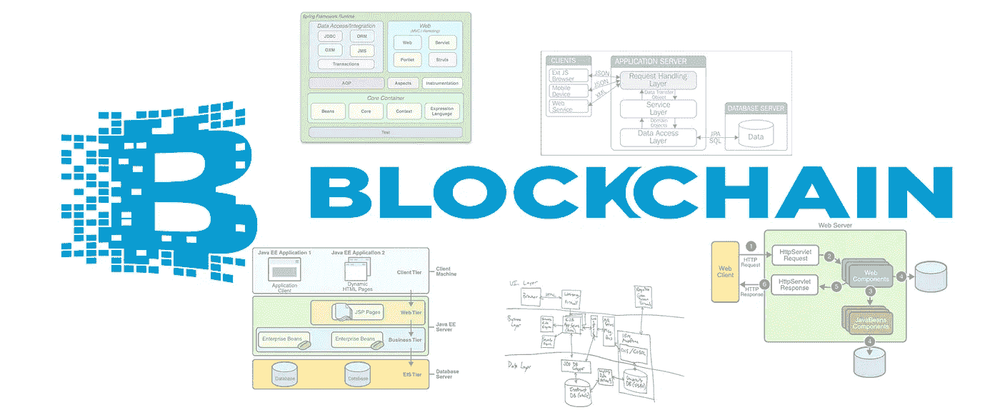

# 区块链作为企业应用平台

> 原文：<https://medium.com/hackernoon/blockchain-for-the-enterprise-b34320fcd64a>

[马诺拉奥](https://www.linkedin.com/in/manorao)

跟随以下 Unfollow 马诺拉奥

登录以关注该作者

# 介绍

区块链海啸就要来了！2009 年始于叛逆和神秘的加密货币世界的东西，现在已经渗透到主流企业的墙壁和大厅。如今，人们问的问题不是企业是否应该采用区块链，而是何时以及如何采用？在帮助企业利用区块链方面，企业 IT 应该扮演什么角色？本文探讨了这些问题，旨在为如何解决这些问题提供指导。我有意避免讨论加密货币的细节，或者区块链技术的加密和算法细节。相反，我从企业架构和应用程序开发的角度来看待区块链。我试图在区块链和关系数据库之间进行比较，因为关系数据库仍然是企业应用程序的主力。

# 为什么区块链在企业环境中很有意思？

区块链技术带来的最重要的创新是实现了**分散式交易处理应用。**第一个这样的应用是 2009 年 1 月发布的比特币，它实现了用户之间的加密货币转移，而不需要银行作为可信的中介。但是除了加密货币之外，还有许多其他企业用例可以应用区块链技术。值得更深入地研究一下分散计算模型，以了解它与企业应用程序的相关性。

**集中式计算**:集中式计算的常见定义(例如[维基百科](https://en.wikipedia.org/wiki/Centralized_computing))关注于应用程序代码和数据的位置——代码和数据驻留在单台计算机上的应用程序通常被定义为集中式计算应用程序。出于理解区块链的目的，对该术语的不同定义更为有用，它侧重于应用程序代码和数据的所有权/控制权。考虑到这一点，集中式计算可以定义为一种模型，其中应用程序的 ***数据和业务逻辑由单个实体*独立控制。**应用程序的所有用户都信任该实体代码和数据的正确性和完整性。我们今天看到的大多数应用程序都遵循这种模式。

**分布式计算:**这个术语的常见定义(例如[维基百科](https://en.wikipedia.org/wiki/Distributed_computing))也关注代码和数据的位置。分布式计算是一种模型，其中使用多个服务器(节点)来执行单个逻辑任务或应用程序。分布式计算的目标是可伸缩性和容错性。只要单个实体控制应用程序的数据和业务逻辑，根据上面的定义，它仍然被认为是集中式计算应用程序，即使涉及多个服务器。我们今天看到的大多数应用程序都遵循集中式计算模型，并作为分布式计算应用程序来实现。

**分散计算**:在这个模型中， ***没有一个实体独立控制应用程序代码或数据。多个独立控制的节点，每个节点都有数据和应用程序代码*** 的精确副本。分散应用的早期例子有 Napster、 [BitTorrent](https://en.wikipedia.org/wiki/BitTorrent) 和星际文件系统( [IPFS](https://github.com/ipfs/ipfs) )。这些应用程序主要出现在点对点文件共享领域。

然而，大多数业务应用程序都是事务处理应用程序。他们依靠执行平台提供原子性、一致性、隔离性和持久性(ACID)的属性来正确执行他们的业务逻辑。

**分散式事务处理**是分散式计算的一个特例，具有以下附加属性: ***每一个有效的事务都以完全相同的顺序，在这些节点的每一个节点上执行，并针对每个节点本地维护的数据副本进行操作。***

比特币是第一个分散交易处理应用的公共实现。它使价值(比特币)从一方转移到另一方，并保证任何一方都不能“重复花费”给定的价值单位(比特币)，所有这些都不需要可信的第三方。虽然最初关于比特币的讨论主要集中在它引入的加密货币上，但注意力逐渐转移到比特币背后的区块链技术，以及如何利用它实现其他有趣的用例。

所以区块链很有趣，因为它支持一种新的应用程序，我们称之为分散式事务处理应用程序，或称之为 **Dapps** 。

# 探索区块链的关键组件

如今有许多区块链平台可供使用。下面对组件的描述并不旨在准确描述这些平台中的任何一个。此外，下面的大部分描述适用于*公共*区块链实现。我在本文后面讨论了*许可*区块链。公共的和许可的区块链在下一节中定义。

## 分布式(分散式)分类账

区块链平台的核心是分布式分类账(DL)，即区块链网络上执行的所有有效交易的仅附加分类账。交易被分组到加密密封的块中，这些块通过加密链接在一起(因此得名*区块链*)。网络中的每个完整节点都有该分类帐的精确副本。

在功能上，DL 类似于关系数据库的事务日志，它维护所有修改数据库状态的事务的记录。

## 分散状态

在区块链上存储应用程序状态一直是一个有争议的话题。当比特币首次发布时，除了加密货币转移协议要求的以外，它不支持在区块链上存储任何应用程序状态。经过大量辩论，比特币核心 0.9 版引入了 OP_RETURN 操作码，允许包含 80 字节的数据作为交易输出。这种有限存储的创造性使用已经出现。存在证明 Dapps 在这个字段中存储数字制品的散列——实际的制品通常存储在像 IPFS 这样的分布式散列存储器(DHT)中。在比特币网络上实现的彩色硬币协议将它们所需的状态作为编码字符串存储在这 80 个字节中。

另一个流行的区块链平台 Ethereum 引入了在区块链上直接存储应用程序定义的数据结构的能力。改变这些数据结构的唯一方法是在以太网上执行事务。每个节点都有完全相同的状态副本。

在功能上，区块链上的状态类似于存储在关系数据库中的状态。存储在关系数据库中的数据结构的复杂性，以及从关系数据库中查询和检索数据的效率，可以说比目前区块链实现所提供的要高。

## 分散式交易逻辑(智能合同)

每个区块链平台都为开发人员提供了定义新事务逻辑(或协议)的机制。比特币使用基于堆栈的虚拟机执行交易，该虚拟机执行有限的指令集(操作码)。比特币允许在交易消息中嵌入操作码，从而规范定制交易逻辑。以太坊有一个更强大的、图灵完整的、基于堆栈的虚拟机，叫做以太坊虚拟机。以太坊允许交易代码(智能合约)存放在区块链网络上，并由来自用户或其他智能合约的交易调用。以太坊上智能合约的部署本身是通过交易来完成的，因此受到所有交易所受的相同规则(共识和透明)的约束。此外，智能合约代码存储在以太坊的 DL 中，因此是不可变的。

在功能上，智能合约类似于关系数据库世界中的存储过程和触发器。它允许通过自定义逻辑封装对状态的访问。从这个意义上说，智能合约实现的业务逻辑自动化并不是革命性的发展。智能合约的去中心化特性及其不变性是全新的。

## 分散共识(分散事务管理器)

传统的事务性应用程序依赖事务管理器在访问共享状态时提供原子性、一致性、隔离性和持久性(ACID)。事务管理器提供的服务之一是对所有访问共享状态的事务进行严格排序。分散的事务处理应用程序需要相同的 ACID 保证来实现有用的业务服务(如加密货币的转移)。换句话说，他们需要一个**分散的事务管理器**，它将确保在区块链上执行的所有事务的严格排序。在区块链平台中达成这种严格的交易顺序的过程被称为共识或**挖掘**。

区块链中的一致性类似于关系数据库管理系统的内置事务管理器功能，它决定了访问数据库状态的事务的严格顺序。

## 身份和访问控制

区块链网络中的每个参与者都需要一对公钥/私钥。所有交易都由发送方进行数字签名。

在**公共**区块链，任何人都可以参与区块链网络。没有授权接入区块链网络或创建代表用户的公钥/私钥的中央机构。

在**许可**中，区块链，一个被所有参与者信任的中央机构，控制着区块链网络的身份和访问管理。虽然这似乎与消除可信第三方的区块链核心原则背道而驰，但在参与者已经拥有*部分信任*关系的情况下，例如在企业对企业的环境中，许可区块链是有价值的。

与提供丰富的基于角色的访问控制框架来管理对数据库中状态的访问的关系数据库不同，区块链通过设计允许任何人读取包括状态在内的整个 DL 内容。任何需要限制可见性的区块链状态都应该在存储到区块链之前进行加密或哈希处理。得到许可的区块链引入了某种机制来限制这种透明度。下文将对此进行更多讨论。

# 探索区块链的主要房产

## 分散

如前所述，比特币和其他加密货币平台支持各方之间的价值转移，并使整个网络相信转移确实发生了(保证没有“双重花费”)，而不需要中介。 [Namecoin](https://namecoin.org/) 是另一个区块链网络，允许任何人注册键/值对，并以分散的方式将它们转移给其他人。在这两种情况下，消除可信中介消除了该可信第三方对信任的潜在背叛。它还允许用户避免支付通常由这些可信任的第三方收取的佣金。(用户确实需要在公共区块链上支付交易费来确认他们的交易。本文后面会有更多关于交易费的讨论。)

出于性能或高可用性和容错的目的，可以复制关系数据库，但是数据库的所有副本都由单个实体控制。在用户不知情或不同意的情况下，该单个实体中的不良行为者可能故意破坏数据库状态(例如，从账户中吸走资金)。获得数据库特权的黑客可以在用户或控制数据库的实体不知情或不同意的情况下破坏数据库状态。

## 不变

经常被吹捧的区块链的属性之一是 DL 的不变性——一旦事务被包括到区块链的块中，它就永远不能被任何人更改或撤消。这是区块链的一个关键属性，但是有一些注意事项值得详细讨论。

大多数公共区块链目前使用工作证明(POW)协议来实现共识。POW 的首要漏洞是“51%攻击”。如果 51%或更高的共识权力(在比特币的情况下为散列权力)由单个实体或单个串通实体组持有，他们可以追溯性地改变 DL 中包括的交易集和/或交易顺序，从而使 DL 变异。请看[https://en.bitcoin.it/wiki/Weaknesses](https://en.bitcoin.it/wiki/Weaknesses)关于这个漏洞(标题为“攻击者拥有大量计算能力”的章节)和比特币平台其他弱点的详细信息。

区块链网络上的节点有时可能不得不丢弃其分类帐副本中的一个块(或一组块)并接受新的块。这是在存在网络延迟的情况下建立分散共识的结果。因此，一旦块被包括在其分类帐中，节点上的不变性就不能立即得到保证。许多比特币客户会认为交易是“未确认的”，直到交易所在的区块深度达到 6 个区块。因此，不变性不是立即发生的——不变性的**时间**取决于块创建的时间间隔(比特币平均 10 分钟，以太坊平均 15 秒)，以及你愿意等待的块数。更详细的讨论见 https://en.bitcoin.it/wiki/Confirmation 的[。](https://en.bitcoin.it/wiki/Confirmation)

如果启用了对关系数据库中所有状态的所有创建、更新和删除操作的完全审计，审计日志应该提供与存储在 DL 中的事务所提供的信息相同的信息。从这个意义上说，关系数据库可以提供同样的不变性(或者更准确地说，是对状态变化的全面考虑)。如前所述，数据库及其审计日志由单个实体控制，因此受到集中式计算模型的限制。

## 透明度

区块链网络上的所有参与者都可以看到存储在 DL 中的所有交易。这类似于一个数据库，其中每个用户都可以读取数据库中的每条记录。透明性是区块链的主要优点之一，它允许分散存储和对 DL 的访问。但这确实意味着只有可以公开共享的状态才应该存储在区块链上，或者在存储在区块链上之前应该对状态进行加密或哈希处理。

## 交易费用

公共区块链是共生的生态系统。“矿工”为区块链提供执行共识协议的关键服务。交易用户需要挖掘者来验证和“确认”他们的交易。为了激励矿商，用户在区块链网络上进行的每笔交易都会收取交易费。矿工收取包括在由他/她开采并被网络接受的区块中的所有交易中的交易费(这是除了创建并奖励给获胜矿工的任何本地加密货币之外的)。

比特币的交易费用取决于交易信息的大小，不像信用卡费用是交易价值的一个百分比。与从一个人到另一个人的简单比特币转账相比，具有更大消息大小的复杂交易(例如，multisig 交易)可能会产生更高的交易费用。以太坊的交易费用取决于智能合约的计算复杂性，以及每次交易中存储在区块链上的数据量。

截至本文撰写之时，比特币网络的平均交易费用超过 11 美元，但在 2017 年 12 月 22 日已达到 55 美元。以太坊的平均费用目前为 1.50 美元，但在 2018 年 1 月 10 日达到了 4.15 美元。交易费用由用户支付，并且可能是重要的因素。

# 被许可的区块链

公共区块链的计算成本和复杂性限制了公共区块链上事务吞吐量的可伸缩性。这导致了对发展许可区块链的投资。最著名的例子是 Linux 基金会主持的 Hyperledger 项目。该项目的使命是"*创建一个企业级、开源的分布式分类账框架和代码库，在此基础上，用户可以构建和运行健壮的、特定于行业的应用程序、平台和硬件系统，以支持业务交易。*

我想强调的公共区块链平台和许可的区块链(特别是 Hyperledger 项目)之间的 5 个关键区别是:

1.安全和成员服务:存在一个中央可信机构，它提供身份和访问控制管理。只有由该中央可信机构授权的各方才能加入区块链网络。

*2。*隐私和保密:Hyperledger Fabric 试图通过创建**渠道的概念来减少 DL 完全透明的问题**。来自 [Hyperledger Fabric docs](http://hyperledger-fabric.readthedocs.io/en/latest/) 的摘录提供了这样的解释:“ *Private 是受限制的消息传递路径，可用于为网络成员的特定子集提供交易隐私和机密性。通道上的所有数据，包括交易、成员和通道信息，对于没有被明确授权访问该通道的任何网络成员都是不可见的和不可访问的。”*

3.共识: [Hyperledger 架构，第 1 卷 Hyperledger 业务区块链哲学和共识简介](https://www.hyperledger.org/wp-content/uploads/2017/08/Hyperledger_Arch_WG_Paper_1_Consensus.pdf)是一篇优秀的文章，解释了 Hyperledger 项目中正在探索的各种共识方法。下面这篇文章的摘录解释了其中的原因。"*Hyperledger 开发人员的运营假设是商业区块链网络将在部分信任的环境中运营。鉴于此，我们明确表示不包括匿名矿工的标准工作共识方法证明。根据我们的评估，这些方法在资源和时间方面的成本太高，不适合商业区块链网络。”* Hyperledger 项目正在 Hyperledger Fabric、Hyperledger Indy 中的 RBFT、Hyperledger Iroha 中的 Sumeragi 和 Hyperledger Sawtooth 中的 POET 中探索一种简单的基于 Kafka 的订购服务。上面引用的文章解释了每种方法的细节和优缺点。

4.状态:Hyperledger 项目似乎使分散状态的存储和查询更加有效。摘录自 [Hyperledger Fabric docs](http://hyperledger-fabric.readthedocs.io/en/latest/) 提供了这样的描述:*“状态数据库选项包括 LevelDB 和 CouchDB。LevelDB 是嵌入在对等进程中的默认状态数据库，将链码数据存储为键/值对。CouchDB 是一个可选的外部状态数据库，当您的链码数据被建模为 JSON 时，它提供额外的查询支持，允许对 JSON 内容进行丰富的查询。t*

5.交易费:与在不信任环境中运作的公共区块链网络不同，许可的区块链网络在部分信任的环境中运作，不需要交易费来激励矿工或防止滥用。

# 摘要

区块链是构建**去中心化交易处理应用**的平台。该平台提供以下功能:

1.应用程序的状态是**分散的**(存储在区块链网络的每个节点上)和**透明的**(可被所有参与者读取)

2.应用程序的交易处理逻辑是**分散的**(在区块链网络的每个节点上执行)

3.所有有效交易都存储在**分散分类账**中，其中:

*   每笔交易都由发起者进行数字签名，提供了身份识别、完整性和不可否认性
*   分类账中的所有交易都有一个单一的全局排序，这是由一个分散的一致协议决定的
*   分类账的内容是透明的(所有参与者都可以阅读)

4.Dapp 事务的提交点(变成**不可变**)不像集中式事务处理应用那样简单。交易的提交与交易的提交是异步的，需要一个**时间的不变性**间隔，这取决于块创建频率和用户的风险承受水平。

5.**交易费用**由交易发送方承担。

如摘要所示，区块链是一个非常复杂的开发平台，并且在运行时比传统的应用平台计算量更大。状态和分类帐的透明性意味着不可能提供传统企业应用程序通常需要的多层基于角色的访问控制。交易费用可能变得很大，并且由交易的发起者承担。因此，需要仔细判断区块链平台提供的独特属性是否满足应用程序的需求，其优势是否值得增加的复杂性和性能限制。以太坊的创始人 Vitalik Buterin 在他的书《商业区块链》中指出*“理解涉及数据库和区块链的权衡和明智选择是一项需要完善的关键能力。在区块链特别擅长的方面找到正确的平衡，并将衍生的好处与后端数据库或现有应用程序结合起来，这是您需要不断寻找的魔力的一部分。我们仍在学习这些界限是什么，就像钟摆一样，我们可能会过度地向一边摆动，然后再向另一边摆动，直到找到一个中间点。”*

*原载于 2018 年 2 月 5 日*[*https://www.linkedin.com*](https://www.linkedin.com/pulse/blockchain-enterprise-mano-rao/)*。*