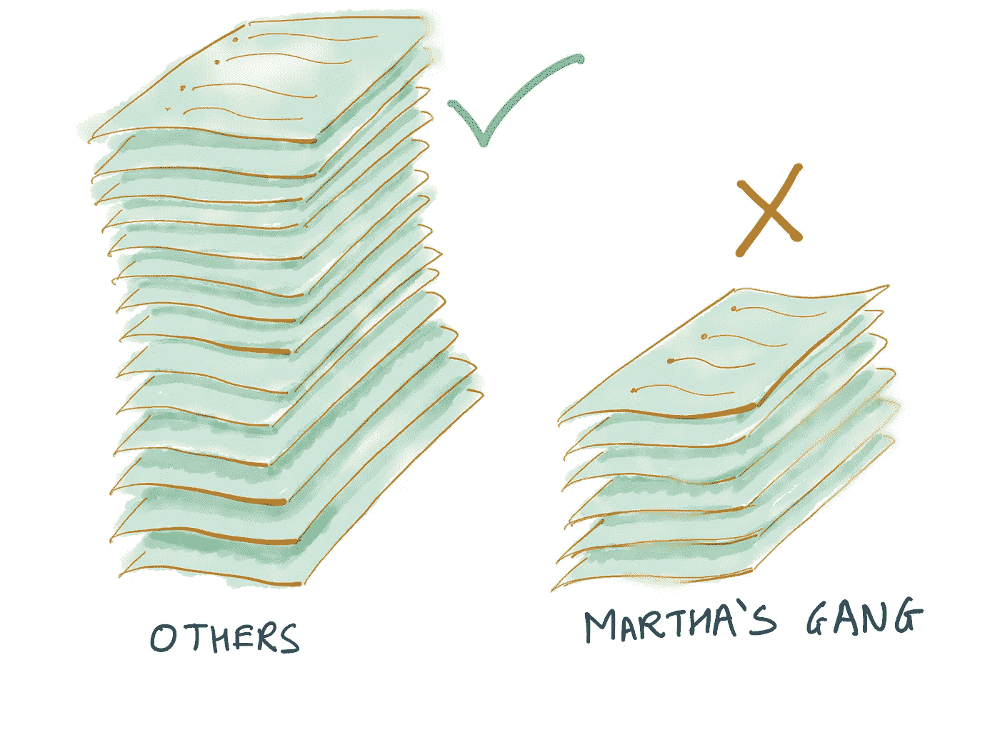
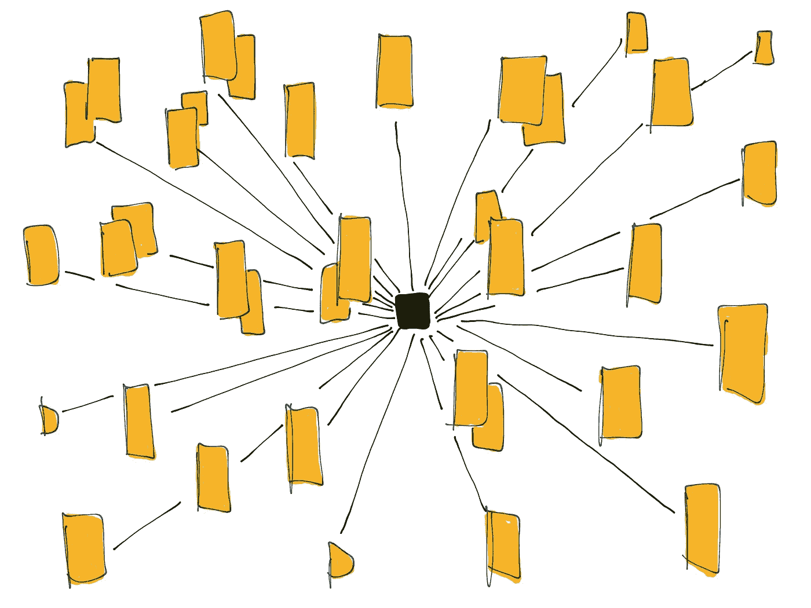
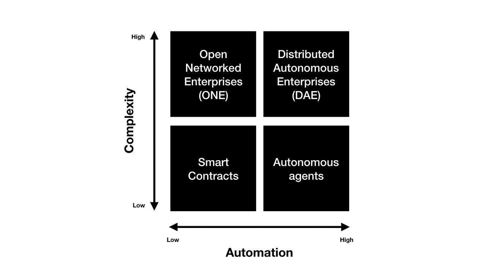

# 面向物联网的区块链

> 原文：<https://medium.com/hackernoon/blockchain-for-the-internet-of-things-71a06afce81>

约翰是一名平面设计师。他还在孟买经营一家出租车组织。约翰没有办公室，他更喜欢在德里的家里工作。该公司的管理层根据他的偏好，建议他把孟买作为经营业务的最佳城市。他不拥有任何车辆，这些车辆是通过第三方组织租用的，在第三方组织中，许多像 John 这样的人汇集了有价值的资源(时间、金钱、声誉、计算)。车辆的硬件和软件自动更新，车辆决定何时需要去维修，相互告知最佳路线以获得更大的投资回报。当 Seema 进入 John 的一辆出租车并要求它带她回家时，出租车通过名为“VerifyB”的第三方身份验证服务来识别她。“VerifyB”会自动识别她的重要凭据，如血型、保险、钱包余额，并只将相关信息发送给约翰的出租车服务。

一旦乘车开始，出租车上的软件就开始从 Seema 装有美元的银行钱包中扣除小额付款。谢天谢地，约翰的出租车服务接受美元，即使不接受，系统也可以将任何货币转换成约翰喜欢的货币。出租车服务上的软件为出租车和 Seema 运行动态保险定价算法。该模式在事故多发地区收取较高的保险费率。如果约翰的车队已经决定走更安全但稍微长一点的路线；该算法相应地调整票价和保险的价格。Seema's ride 中的所有交易都是自动发生的。她从来不需要与手持设备互动。她上了一辆自己选择的出租车，说明了自己的意图。只有关于 Seema 的相关信息被提供给了 John 的舰队。约翰永远不会知道她的名字、年龄、住址、朋友、关系等等。识别软件不允许共享这些信息，并要求 Seema 同意当一个奇怪的请求，如她的名字或电话号码出现时，Seema 拒绝它，并标志着约翰的舰队的声誉。这并不影响她的旅程。约翰和 Seema 都不需要互相认识或交流。

约翰的出租车服务不是一个正常的组织。公司由投资者约翰和管理一切的软件程序组成。没有人管理。没有司机，车队由自动驾驶汽车组成。约翰没有很多流动资金，但他在计算资源方面做出了贡献。

在家里，约翰经营着另一家企业，将屋顶太阳能电池板的多余能量出售给微型电网，他出租多余的 wifi 带宽。不在家时，他通过一个管理房屋租赁的软件程序出租他的空公寓，并以他选择的货币按秒为入住和使用向他支付费用。智能锁、运动传感器、自动调温器和一系列“智能”设备可以管理各种服务，如身份验证、在房间里呆的时间、水、电的使用、游泳池的使用等。事物之间无缝协作。所有货币交易和其他交易都在分布式分类账中进行记录和加密。约翰不必依赖第三方来确保信任。信任是内在的。信任被编码在系统中。

## **编码信任度**

比特币、以太坊或<insert popular="" digital="" currency="" in="" trend="">因其可观的回报开始出现在日常用语中。它让一些人变得非常非常富有。在我看来，这不是这些货币有趣的地方。有趣的是这些货币背后的技术潜力。如果你用金钱来看待这个世界，用数十亿美元来思考，那你可能就错了。想想万亿！</insert>

欢迎来到区块链的世界！

# **区块链**

区块链是一个全球分布的账本，它依赖于点对点网络的资源。简单来说，把区块链想象成一个非常长的电子表格。您有一份电子表格，您的朋友 Martha 有另一份。该文档由四列组成:水果名称、添加的水果量、添加水果的人和添加水果的日期。您在电子表格中添加了一个条目“2 个苹果”。为了使两个电子表格完全相同，Martha 需要添加相同的条目“2 个苹果”。现在玛莎的朋友 Seema 想加入你的电子表格小组，所以玛莎给了 Seema 一份电子表格。当 Seema 添加条目“9 个橙子”时，您和 Martha 都需要对各自的副本进行更改，以使它们完全相同。*规则是任何人都不能删除或修改以前的条目，会员只能添加条目。*

几天过去了，你的电子表格小组现在已经有 20 名成员了。Martha 是电子表格小组的创始人之一，她没有对该文档做出任何贡献。她开始嫉妒 Seema，Seema 已经有点像摇滚明星了。尽管很生气，她还是决定对电子表格进行*细微的修改*。她在电子表格的几个地方用 Seema 的名字替换了她的名字。她甚至说服其他 5 名成员做同样的事来换取帮助。

当每个人都要更新他们的电子表格时，John 注意到属于 Martha 和其他几个成员的一些电子表格中存在差异。他们呼吁对水果电子表格进行干预，所有的电子表格副本都要进行布局并检查不一致的地方。20 个电子表格中的 14 个被发现是相同的副本，属于玛莎和她的团伙的 6 个副本被发现是伪造的。在成员投票的基础上达成共识。玛莎和她的团伙被迫删除他们的副本，并用 14 个相同的副本来替换它们。该文件的神圣不可侵犯性保持不变。平衡恢复了。

Fruit spreadsheet consensus. The other members had far more identical copies on the spreadsheet.

对于团队来说，处理 20 个成员仍然是可以管理的，但是在超过 50 个成员的组中维护副本很快变得混乱和复杂。现在想象一下我们的水果电子表格小组有一百万成员，这简直是一场噩梦。

Handling a million documents becomes a task

We use a computer program to check and update all documents. Although this becomes computationally intensive quickly.

Seema 建议他们开始使用计算机程序来维护副本。每当向电子表格中输入一个条目时，这个简单的程序都会检查并更新所有成员的所有副本。它还通过计算网络上的所有副本来检查以前条目中的任何差异。Seema 的想法虽然聪明，但有一个重大缺陷。检查和更新一百万个电子表格是计算密集型的，很快一些成员的计算机开始崩溃。

We can create unique hash values by adding the fruit id multiplied by the number of units, the user id and the date and the previous hash.

约翰提出了另一个想法；与其检查整个电子表格，为什么不在每个文档中检查一个数学上唯一的值(我们称之为哈希值)。该值由电子表格列中的公式得出。假设我们分别给每个成员和水果分配一个唯一的数字 ID。我们在每个列条目中添加成员和水果的 id，以及日期和水果的数量，我们将它们存储为电子表格中第一个条目的**哈希值**。对于后续条目，我们使用相同的公式，并添加前一个条目的哈希值。这开始形成引用整个电子表格的散列值的**链。这样做的好处是，计算机程序只需检查电子表格链中最后一个条目的哈希值，而不是整个电子表格。如果任何成员试图篡改电子表格的先前条目，他将不得不对电子表格链中的所有条目以及所有电子表格副本进行更改，这实际上是不太可行的。**

We check the documents by their hash values. This too has a number of problems. How does the system handle two entries at the same time? What if an entry to the chain takes place while the chain is being updated?

然而，电子表格链在设计上也有缺陷。对于网络上的大型电子表格，对所有成员的文档执行实时更新也是计算密集型的，因为交易和链的更新可以在毫秒内发生。系统如何同时处理两个条目？如果在链被更新的时候发生了一个到链的条目呢？

We create blocks of transactions on the chain of hash values.

Martha 建议我们在 10 分钟内处理所有事务，而不是实时执行事务。然后，这部分事务可以作为 ***块*** 添加到我们的电子表格链中。约翰、Seema 和玛莎刚刚创建了一个**区块链**。

> 信任是内在的；完整性被编码和分发。

为了简单起见，我故意省略了一些特性，如加密、密码术、共识协议等。在上面的例子中。我们将继续讨论这些问题。

# 一个新的世界秩序…嗯…也许…也许不是

第一个区块链是在 2008 年由一个名叫中本聪的匿名人士或团体构思的。它于 2009 年作为比特币的核心组件实现。就像我们的水果电子表格示例一样，单词 *block* 和 *chain* 在中本聪的原始论文中是分开使用的，但最终作为一个单词*区块链*被推广。比特币或任何其他数字货币都不是保存在某个地方的文件。它代表了比特币区块链上发生的交易，其中每笔交易都由一个大型点对点网络进行验证和批准。除了数字货币，区块链还可以被编程来安全地记录任何对人类有价值和重要的东西，如土地记录、出生证明、身份、医疗记录等。

很多人都在谈论这项技术在金融领域的机遇和可能性，即。微支付、货币兑换、汇款、保险、区块链 IPO、替代硬币等。我将尽可能远离这些话题。部分原因是经济学专家已经写了足够多的书，部分原因是人们感觉到的直接转变很可能不在这个领域。我真的相信，要采用这项技术，它必须像互联网一样融入金融世界，而不是作为一个神秘人的礼物来改变金融的面貌。再说一次，如果被证明是错的，我会是最开心的。
虽然是革命性的，但如果我们停止将区块链视为这种革命性的技术(确实如此),而开始将它视为一种在系统中保护和嵌入信任的工具，我们会受益更多。“任何融合轻薄的设计都会给人一种更小、更轻、更卑微的印象。约翰·梅达在他的书《简单法则》中写道:“当交付的价值远远超过最初的预期时，怜悯就会让位于尊重。”。如果这项尚未成熟的技术行为不端，如果我们不再认为它是大卫用来战胜世界上所有邪恶的，我们会更加宽容。如果我们不再认为它是通向新世界秩序的大门。

## **起步小**

区块链需要被视为一种用于确保系统信任的工具，而不是解决世界所有问题的解决方案。虽然这个想法是革命性的，但它的价值在于执行。区块链的杀手级应用可能不会来自大公司。它来自边缘，也许是某个车库里的几个孩子在摆弄它。我们需要从小规模开始。简单的应用。也许是一个小房子，也许是房子里的一个房间。

*嘿！他们称区块链为新互联网。这到底是什么意思？*

互联网开启了企业家和行业的新时代。尽管有些人认为，它未能实现其民主的承诺，为所有利益相关者提供平等的机会。与之前的时代非常相似，互联网已经变成了垄断，少数几家公司控制了大部分流量，从而控制了大部分财富。所有这些都是以这些公司从中创造财富的人的隐私为代价的。杰伦·拉尼尔在他的书《谁拥有未来》中认为，中产阶级越来越被剥夺了网络经济的权利。通过说服用户放弃关于他们自己的有价值的信息来换取免费服务，公司可以在几乎没有成本的情况下积累大量的数据。许多人认为区块链可能会成为这些公司开始承担责任的一种方式。这是一个很长的镜头，但我们需要得到正确的。

互联网不是用来分配价值的，而是用来分享信息的。它使复制数据变得更容易，但却无法实现价值转移..钱，不像自拍，推特或其他任何信息好。你可以把同样的自拍发给你所有的朋友，但不是同样的一块钱。你汇的钱需要离开你的银行账户。同一美元不能用于两笔交易。这被称为双重花费问题。为了让人们能够在互联网上做生意，需要人们可以信任的中介。银行和许多科技公司抓住了这个机会。他们通过一个或多个第三方的中央数据库来清算每一笔交易，从而解决了重复花费的问题。每个第三方都从交易中抽取一定比例的费用。在许多情况下，和解可能需要几天时间。区块链承诺在不需要中央机构的情况下大幅降低交易成本和结算时间。

Satoshi 设计的系统可以在互联网上工作，但如果有必要，它也可以在没有互联网的情况下运行。独裁政府可以关闭互联网，而区块链仍然可以作为一个交易机制。你可以通过短波无线电、莫尔斯电码甚至是短信中的一系列表情符号进行交易。与互联网不同，区块链是一个更加包容的系统。

*在前面的水果电子表格例子中，我们遗漏了区块链的两个主要组成部分，当人们达成共识时，谁来做这项工作？我们如何利用这一交易链来构建除货币之外的其他东西呢？*

# **共识机制**

通过计算链的所有副本的散列值来实现一致性。这就需要网络中的人们花费大量的计算能力来维护区块链。水果电子表格集团不是一家跨国公司。那么，我们如何奖励那些为维护网络贡献资源的人呢？

Satoshi 利用现有的点对点网络和智能加密技术创建了一个共识机制，可以解决双重花费问题，如果不是比可信的第三方更好的话。为了实现这一点，比特币网络使用了一种**工作证明(PoW)** 机制。运行比特币节点的矿工或网络参与者将最近的交易收集为一个数据块，其中每个数据块都必须引用前一个数据块。这个过程每 10 分钟重复一次。问题是，有多个矿工试图解决同一个区块。为了选择将被分配来解决一组交易的矿工，我们创建了一个很难解决的数学难题，即需要大量工作。难题通常是找到一个非常长的数字(哈希值),计算机试图猜测每个数字。谁先解决了这个难题，谁就可以开采这块石头。作为开采该区块的交换，矿工将获得比特币作为奖励。在每一次成功的交易之后，难题的复杂性开始增加，即挖掘者需要寻找甚至更大的散列值。谜题的复杂程度还取决于网络中矿工的数量。从统计角度来看，查找散列大约需要 10 分钟。以太坊区块链的第一个版本也使用了工作证明。然而，还有其他共识机制。

**利益证明**是一种机制，要求矿商使用本国货币进行交易，即用户需要在正在进行的交易中拥有利益。对于以太坊区块链，本地硬币是以太。为了达成共识，网络参与者花费很少的乙醚来行使他们的投票权。

**活动证明**结合了工作证明和利益证明。随机抽取的矿工必须完成工作(解决难题)并使用密码(货币)在区块上签字，以使区块成为官方区块。

**容量证明**要求采矿者分配相当大容量的硬盘用于采矿，而**存储证明**要求采矿者在分布式云中分配和共享磁盘空间。

还有其他类似 Ripple (XRP)使用的机制，它依靠社会网络来达成共识。社交网络中成员的价值取决于它所连接的独特成员/节点的数量。这种类型的机制是有偏见的，因为新来者需要社会智慧和声誉来参与。只有授权的成员团体才能达成共识。这种模式允许公司风格的结构与区块链的问责制共存。

Satoshi 选择拥有计算能力的人作为经济背景。以太坊选择以太的所有者，而瑞波选择社会资本的所有者作为经济背景。

# **智能合约**

这些是计算机程序，用于保护、实施和执行组织、人和物之间的合同结算。智能合约这个术语是由尼克萨伯在 1994 年创造的，当时它还是一个没有出路的想法。区块链改变了这一切。它使人们能够编写可执行的程序。交易可以在具有内置结算系统的分散技术平台上执行。这意味着，当你购买股票或共同基金时，它会立即出现，而无需等待中介。这挺酷的。

通过启用多重签名协议，区块链使您能够实施需要多人批准交易的复杂智能合同。它也被称为多重签名。把它想象成一把需要多把钥匙才能打开的锁。每个成员都有一个密钥或签名。多重签名可用于仲裁或远程股东会议，以决定公司的战略。一组智能合同可以捆绑在一起执行复杂的交易，称为分布式应用程序。

## **分布式应用(dApps)**

分布式应用程序(dApp)是一组智能合约，用于存储数据并在区块链上实施多个智能合约。这些 dApps 可以开始相互操作以在网络上执行特定的功能。例如，任何人都可以使用通用验证 dApp 来请求和验证一个人的身份。在这种情况下，验证 dApp 可以决定执行交易需要多少关于身份的信息。在约翰的出租车服务的情况下，Seema 只需要向约翰的出租车提供她的钱包信息，这是验证 dApp 提供的。如果 John 请求任何其他信息，dApp 会标记该请求，并询问 Seema 是否希望提供相同的信息。

简单的智能合同需要人们在交易上签字，但是对于简单的重复动作，如每天早上送牛奶和实时付款，人们可能会选择将任务自动化到程序中。我们称这些为自主代理。一些**自主代理**可能是智能的，它们可以适应系统的状态并相应地行动。例如，系统知道您正在度假，因此会暂时停止牛奶订购。另一方面，dApps 的集合可以让公司制定巧妙的、自我强化的协议。一个简单的新设备申请不应该通过多个批准电子邮件，智能合同可以简化这一过程。另一种情况是，当生产一种产品时，货物可以从供应商处直接到达工厂车间。不需要仓库。

The X-axis indicates the degree to which humans participate in the model. Y-axis shows the functional complexity of the model.

现在想象一下，一整个公司在没有任何人工干预的情况下运行在区块链网络上。这是区块链能够完成的圣杯，我们称之为**分布式自治企业(DAE)** 。区块链让科幻电影真正成为可能，让人类有时间去做其他(希望是更好的)事情。

# **使事物能够协作**

区块链的技术还没有准备好迎接黄金时代。它容易受到容量问题、系统故障、意料之外的错误的影响，也许最具破坏性的是，会让技术不成熟的用户大失所望。就像互联网在它的初期一样，在区块链可以被人们在日常生活中使用之前，需要进行大量的实验、尝试和错误。当然，存在像数字货币这样的成熟应用，但是区块链需要超越仅仅是货币交易。

新兴的物联网领域(IOT)似乎是一个成熟的候选人。区块链的技术有潜力解决智能、自动化、隐私、价值转移等许多设计师和工程师一直在思考的问题。早期的消费类 IOT 设备很少具有实用价值；除非你想让你的恒温器让你的灯泡让你的扬声器在你的智能手机上给你发一条信息，告诉你屋里太热了。

> 你的亚马逊 Echo 应该能够轻松地与你的谷歌主页、Cortana 或任何其他人工智能助手或互联网连接设备进行对话。

为了实现 IOT 的全部价值，网络需要互操作。你的亚马逊 Echo 应该能够轻松地与你的谷歌主页、Cortana 或任何其他人工智能助手或互联网连接设备进行对话。挑战在于，所有这些设备和设计它们的公司都使用集中式数据库。您需要不同的 API 协议来处理来自这些提供者的数据。他们经常不能很好地相处。

**通用 API** 在区块链基础设施之上工作的物联网提供了为整个网络可以使用的通用合同创建**通用标准 API 的机会；包括政府、像谷歌和亚马逊这样的大型企业以及小型创业公司。身份管理 API 就是一个例子:您不需要在不同的平台上创建概要文件。当您在其中一个平台上创建一个经过验证的概要文件时，任何应用程序都可以使用它来提供服务。个人可以决定需要共享的信息量，并轻松撤销对其个人数据的访问。如果任何公司试图在他们的中央服务器上复制这些数据，区块链就会有一个该事务的条目。如果用户希望某个特定的公司删除他们的数据，区块链将执行个人被遗忘的权利。
在物联网上，每一个物体都需要注册，都需要有一个身份。设备需要协调货币、电力、计算、声誉等形式的价值转移。他们需要创建可信设备网络，并且这些网络需要与外部世界互操作。物联网依赖于一个事物分类账。这些互联网连接设备的固件可以附加元数据，以便网络上的其他设备可以快速认证、识别这些设备并与之协作，而无需设置。这些信息可用于以智能合同的形式为这些设备分配角色和行为特征。尽管一些公司正在各自为政地开发一个基本的 IOT 基础设施，但用户、现有企业和新加入者共享网络会更好，就像互联网一样。您的所有设备，包括 PC 和电话，都需要在同一个网络上运行。**

隐私——房间里的大象。
区块链网络可以在安全性、可靠性和确保隐私方面为物联网提供巨大的价值。闻所未闻和被认为是稀奇古怪的事情正变得司空见惯。你的恒温器现在有了隐私政策。
当你周围的所有设备都开始收集你的行动信息时，会发生什么。收集、分享和分析无限量的数据，这些数据可能会永远困扰着一个人。他们会利用这些信息向你出售商品，并为你提供个性化服务。这是你个人信息的代价吗？一个相关的搜索结果是你隐私的真正价值吗？这些都是重要的问题，需要在公司开始用智能设备轰炸你以换取你的私人数据而没有或很少反响之前回答。智能家居设备和服务应该为访问你的私人信息付费。数据的价值应该取决于信息的个人化程度。例如，你的姓名和年龄并不太有价值，但你的健康记录很有价值。

> 对于这些设备来说，将隐私设置为默认设置非常重要。

除了保护隐私和信任之外，这些东西在简化设备和周围世界之间的交互方面可以发挥重要作用。对于这些设备来说，将隐私设置为默认设置非常重要。品牌将通过尊重隐私、将用户置于设计的中心以及确保端到端加密来赢得信任。区块链网络可以很容易地被设计成确保隐私。

## 1.智能系统

IOT 设备的区块链网络可以成为家庭或其他私人和公共空间的智能自动化系统的基础。如果连接的设备性能不佳，消耗的数据或电力超过了智能合同的规定；则网络可以重置、重启或完全拒绝该对象。设备可以具有嵌入元数据的固件，以供其他设备验证、识别和委派任务。固件将包括由制造商或者在某些情况下由用户定义的智能合约。这些智能合同可以触发诸如更新设备软件、安排维修和维护、在危险情况下向地方当局发送通知等事件。
区块链可以实现智能基础设施。例如，网状供水管道和智能仪表。智能仪表可以相互通信，并通知泄漏或过压。由于网络是用区块链构建的，它可以在互联网上工作，也可以是独立的。如果其中一个智能仪表出现故障或失去与互联网的连接，相邻的智能仪表可以拾取数据，并在任何一个节点连接到互联网时传输数据。网络可以触发智能合同来升级、维修或更换智能电表。这个系统是自我维护和自我服务的。

## 2.交换价值单位

部署在区块链网络上的物联网可以确保货币、电力、时间、个人数据、计算能力等价值单位的安全可靠交换。用户可以安全地租用多余的容量，如 wifi 带宽、太阳能电池板产生的电力、昂贵的设备和其他以前不可能的资源。这实现了真正的共享经济，而不像优步和 AirBnb 那样，母公司成为了一个数据仓库，除了提供相关服务之外，还可以利用你的个人信息实现其他目的。即使他们知道，在区块链的网络上，个人也能看到她的数据在哪里以及如何被使用。用户甚至可以将他们的个人数据货币化。像 Fitbit 这样的公司可能想知道你早餐吃了什么，你做了什么活动，或者你打算参加一个瑜伽班。作为回报，Fitbit 可以用 Fitbit 硬币、优惠券或货币支付给你。

**点对点分布式模型** 区块链网络还支持安全可靠的点对点生产和分发模型。例如，人们可以开始出售太阳能屋顶在微型电网上产生的多余电力。这些节点可以在网状网络上创建自己的自助式电力基础设施。这些网络可以与当地或国家电网互动，在社区之间买卖电力。智能合同可以被配置为协商最佳电价。太阳能信用可以给予利用太阳能的用户。太阳能发电的价格可以更低，也可以兑换成太阳能信用额。能耗较低的设备可以获得额外的积分，这些积分可以用来购买升级产品或以货币的形式兑换。这些智能设备将与任何公共事业无缝协作。

## 3.有责任

可以创建一个区块链网络，其中每一个公共基础设施都被标记。智能公共设备以及带标签的公共基础设施，如长凳、智能电线杆、交通信号灯，可以形成一个公共物联网。这个公共物联网可以是一个自我维护、自我服务的系统，部署在每个公民都可以访问的分布式账本上。市民可以跟踪公共设施的位置、安全、维护细节。欺诈和腐败要么极其困难，要么根本不可能。部署这种系统的政府将会有更高的接受率。
公司可以给每件设备贴上标签，传达所有权、保修和其他重要信息。公司也可以将系统部署为私有区块链，以跟踪库存、管理保险、设备的自我维护和自我服务。智能合同可以触发租约的自动续订、管理付款、购买升级、自动交付和维修等。
区块链可以增加问责制，减少或消除公共和私营机构的腐败。

# **挑战**

区块链实现了安全交换价值的新方式，同时确保了可靠的交易。它使人们能够计量过剩产能，并促进非传统的创收方式。尽管有这么多好处，但这项技术还需要应对一些挑战。

1.  由于围绕比特币和其他数字货币的大肆宣传，区块链开始看起来像一个金字塔计划。
2.  该技术尚未成熟，易受容量问题、系统故障、意外缺陷的影响，而且最具破坏性的是，可能会让技术不成熟的用户大失所望。
3.  比特币区块链缺乏交易能力。一些人建议，减轻这种情况的方法是使用其他共识算法。另一种方法是使用侧链，它是比特币等更大区块链的分支，同时使用母公司区块链的基础设施。
4.  区块链的交易是不可改变的，这创造了一个有点反社会的系统。永恒性是一把双刃剑。
5.  基础的界面和体验还有很多工作要做。比特币地址是一个字母数字代码。你不需要输入 IP 地址来访问一个网站，那你为什么还要输入字母数字代码来访问比特币钱包呢？
6.  有一个经验法则:电脑每消耗 1 美元的电力，就需要 50 美分来冷却。比特币网络消耗大量能源。许多人认为这种计算和能量可以转移到更高尚的追求上，比如治愈癌症或解决世界饥饿问题。超过一个点，能源消耗将是不可持续的。为了做到这一点，我们将不得不放弃工作证明，否则硬件将会改进。获得可再生能源也可以缓解这一问题。
7.  从短期来看，这会减少工作岗位。从长远来看，这会让优步失业。
8.  如果一切都被记录下来，那就没有意外收获的空间了。
9.  区块链毕竟是一种工具，可以用于邪恶的目的。封闭的区块链是安全的，基本上不会受到攻击，这可能会让我们回到缺乏透明度和对机构信任的问题上来。它可能会像互联网一样陷入权力集中的陷阱。
10.  量子计算的实现若隐若现，可能需要我们彻底改造作为区块链基础的加密基础设施。

# **计算的演变**

下一波联网设备可能会更加微妙:监测健康数据的嵌入式纹身，移动到感染部位并直接攻击它的智能药丸，让你交流思想或搜索你似乎无法用人脑回忆起来的模糊引语的大脑接口。所有这些设备都将创建自己的公共和私有网络。这些网络将需要无缝连接和互操作；以思维的速度。万物互联将需要分布式、可靠和安全的信息共享，以实现行动和交易的自动化；能够明智地行动，自我服务和自我维护。为了实现这一点，企业可以充当社区的管理者。就像互联网一样，比起建立各自为政的研发单位，培育一个像 Linux 一样的同类产品社区是更好的投资。区块链毕竟是一种工具。它可以用来改变世界，无论是好是坏。这有可能是人类失败的实验。它的价值并不在于它可以启用智能系统、降低交易成本或提高交易速度。现有系统也可以做到这一点。区块链的真正价值在于能够通过设计嵌入的隐私、问责和信任来实现这些可能性，而不是系统之上的功能。

短期来看，区块链可以恢复言论自由，而不用担心被监视。
从长远来看，它可以成为完全人工智能的基础。

> 短期来看，区块链可以恢复言论自由，而不用担心被监视。
> 从长远来看，它可以成为完全人工智能的基础。

和平！

# 参考

1.  [**区块链革命**亚历克斯·泰普斯科特和唐·塔斯考特](https://amzn.to/2KYdZpE)
2.  [**谁拥有未来？**作者杰伦·拉尼尔](https://amzn.to/2KP3qpy)
3.  [**智慧城市:大数据、公民黑客和对新乌托邦的追求**作者安东尼·m·汤森](https://amzn.to/2L0n0hS)
4.  [**简单性法则**约翰·梅达](https://amzn.to/2ujywut)
5.  [**区块链如何改变货币和商业**](https://www.youtube.com/watch?v=Pl8OlkkwRpc) 唐·塔斯考特(TED Talk)
6.  [**区块链将如何彻底改造经济**](https://www.youtube.com/watch?v=RplnSVTzvnU&t=89s) 贝蒂娜·沃伯格(TED Talk)

注:我故意不涉及 IOTA，它在不同的协议上工作。很多人都在谈论这项技术在金融领域的机遇和可能性，即。微支付、货币兑换、汇款、保险、区块链 IPO、替代硬币等。我已经尽可能远离这些话题。
所有观点均为个人观点。

如果你觉得这个帖子有用，请鼓掌分享。:)