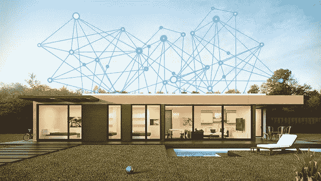

# 面向大众的区块链:窥视不太遥远的去中心化未来

> 原文：<https://medium.com/hackernoon/blockchain-for-the-masses-a-peek-into-the-not-so-distant-decentralized-future-669e2d05e60c>

## 每项技术首先服务于研究人员和书呆子，然后是商人，最后是大众。当它开始服务大众时，我们称之为成熟技术。

Image Credits: [Max Pixel](https://www.maxpixel.net/photo-2472141)

> “每张桌子和每个家庭都有一台电脑。”
> ——比尔·盖茨，1980 年

几十年前，比尔·盖茨设想每个家庭都有一台电脑。回顾过去，我们已经走过了漫长的道路，现在，平均来说，许多家庭都拥有一台以上的电脑。除了*电脑，在大多数家庭中，我们还有智能手机、平板电脑、智能电器等。而且，从技术上来说，我们在这些设备中都有一台(小型)计算机。因此，几乎每个家庭都有一台以上的电脑。*

*大多数时候，这些设备是相互连接的，并且也连接到互联网。借助网络连接存储和/或云存储，这些设备可以相互通信和共享数据。我们已经看到人们(高级阅读用户)增加路由器和网络存储驱动器来连接家中所有设备的趋势。*

*然后是基于人工智能和语音识别的智能家居助手，帮助我们处理各种日常事务。例如，每天早上 *alexa* 【试图】叫醒我，给我播放音乐，给我更新世界各地的天气、交通和板球比赛。*

*所有这些技术——计算机、互联网、人工智能、人机交互等等。从研究开始，然后在企业中普及，最后以上述设备的形式到达大众。同样，区块链，今天大多被使用(或者我应该说尝试过？)的学术机构和大小企业。它还没有到达大众。*

*下面是 Andrew Keys(ConsenSys)采访的摘录，他谈到了区块链技术的现状，*

> *我的论点是，我们正处于 1996 年的 93 年——下一代互联网的时代——在 1996 年，你可以在没有许可的环境下工作。在那之前，都是内部网。— Andrew Keys，ConsenSys*

*正如 Andrew 正确指出的，我们还需要几年时间让区块链为广泛使用做好准备。我相信，那时企业将开始*依赖*区块链。我们将看到一些现实世界中的问题被区块链解决，而不需要集中备份(B 计划)系统。区块链的第一波生产部署可能更多的是 B2B 设置。在那之后，我想，我们可能还需要几年时间，区块链将被用于 B2C 环境，并将直接接触到大众。*

*除了在规模、性能和稳定性方面的就绪性之外，还有一个面向大众的技术就绪性维度——可用性。今天，区块链看起来像一项复杂的技术，所有的数学和密码学都融入其中，让外行人看起来像火箭科学。但这正是计算机、互联网和人工智能在婴儿期的情况。例如，在 80 年代，[要连接到网络上的另一台计算机，我们必须手动将其地址保存到我们计算机上的一个文件中](https://medium.engineering/use-a-dev-domain-not-anymore-95219778e6fd)。今天，正如我们所知，事情变得更加简单和不同。当一台计算机连接到网络时，它必须经过一个[的全过程才能在网络上获得一个身份(IP 地址)](/@thatnerd/internet-distribution-by-dhcp-tcp-ip-9e8db8288e33)。谈到密码学，今天当我们[通过 *https*](https://medium.freecodecamp.org/https-explained-with-carrier-pigeons-7029d2193351) 连接到任何网站时，在区块链使用的同样的[密码学概念](https://www.digicert.com/ssl-cryptography.htm)开始发挥作用。只是今天先进的网络浏览器和服务器已经抽象出了细节。同样，在几年时间里，区块链将开始看起来更简单和容易，因为我们已经建立了工具来抽象出复杂的细节。*

*现在，我们已经了解了一些杰出的技术在过去是如何发展的，以及区块链的现状，我现在将尝试描绘一幅区块链在不久的将来开始接触大众的画面。*

*为了描绘这幅未来的图画，让我们从现在开始。今天，如上所述，我们家里有几个设备，它们都是连接的。通常，我们有一个路由器将所有这些设备相互连接，并通过 WiFi(或 LAN)连接到互联网。现在，让我们在图片中引入一个区块链节点。让我们也将这个节点连接到路由器。*

**

*Image Credits: [HelpNetSecurity](https://www.helpnetsecurity.com/2017/03/08/connected-home-solutions/)*

*就像我们有其他设备和装置直接连接到路由器，从而连接到网络，不久我们应该会看到区块链节点，包装成随时可用，即插即用的设备。不需要自己设置节点，但会有预打包、预配置的节点，随时可以连接到链和网络。*

*让我们看看这个预打包的节点可能是什么样子。今天，当我们需要设置一个*以太坊*节点时，[我们需要在一台电脑上下载一个以太坊客户端，设置我们的钱包和账户，然后用命令行或基本 GUI](https://github.com/ethereum/go-ethereum/wiki/geth) 运行客户端。为了与这个节点交互，我们需要将它与一个或多个 dApps 连接。明天，在不久的将来，这个过程可能会是这样的—*

1.  *去电子商店(实体或网上)*
2.  *浏览不同配置中预打包的区块链节点。*
3.  *买一个带回家。*
4.  *打开包装，将其连接到电源和网络。*
5.  *设置您的身份并配置您的网络参数。*
6.  *将此节点与您的手机和笔记本电脑上的 dApps 连接(就像您的手机连接到网络一样，它将与此节点配对/连接)*

*看完这些步骤，如果你也有一种似曾相识的感觉，那很自然。因为这是我们今天获得新的智能手机、智能电视和其他智能电器的方式。为什么不明天去区块链节点？*

*就像今天的电脑预先配置了软件许可证和 OEM 专用驱动程序一样，这些预先打包的区块链节点将带有内置的硬件钱包和网络配置。进一步设想，这些区块链节点还将支持云订阅，这样，只有所需的区块链州保留在家中的硬件上，其余的备份在云上，从而节省带宽和电力。*

*今天，我们可以在同一硬件上并行安装和运行多个区块链客户端。同样，在这些预打包的区块链节点中，将有连接到多个网络的选项。一些显而易见的/预先配置的选择可能是连接到您首选的支付网络、您首选的身份网络、分散的社交网络、分散的市场等等。*

*现在我们在家里有了一个区块链节点，与一个或多个网络连接并同步，让我们看看它将如何使用。*

*在上面嵌入的推文中， [Trent](http://trent.st/) 提到了区块链运动的两个阶段，后一个阶段是关于(文明的)优化。这个优化阶段的一个贡献者可以是*家庭*节点的设置，它可以帮助我们优化几乎所有与家庭相关的事情——服务、公用事业、支付、通信等。*

## *支付和服务*

*对所有公用事业的所有支付都将在家里使用这个区块链节点完成。我们将不必连接到几个网站和应用程序来支付电费、互联网费、水费、暖气费等。等等。这将使我们免于在几个中央系统和中间人(支付网关)处输入敏感信息。*

*电力供应商将简单地提供一个地址和一个订阅 id，用于发送付款。在下一个层面，家里的智能电表将直接连接到这个区块链节点，进行自动化但安全的支付。类似地，智能路由器将能够为互联网订阅付费。许多国家已经开始跟踪使用区块链系统的公用事业的使用和支付情况。*

## *通信*

*所有重要的公共通信将通过广播或使用区块链网络来完成。区块链节点将取代广播和电视，使通信更加安全可靠，杜绝假新闻。*

*概括地说，许多冲突的解决将发生在区块链，或者我应该说，冲突的解决将不需要，因为区块链。家庭节点将有助于确保所有的支付和通信从一开始就是防篡改的。*

## *身份和认证*

*因为这个区块链节点连接到本地路由器(记住)，所以它也连接到家里的其他设备——平板电脑、电话等。使用*多方计算*区块链节点的签名密钥将在其中一台设备上共享，一旦您使用区块链节点进行交易，您的手机也会收到批准交易的通知。*

## *物联网和智能家电*

*通过路由器，区块链节点还将连接到家中的所有智能电器。咖啡机订购咖啡和牛奶的令人敬畏的物联网场景将最终变得更加安全，因为咖啡机的身份将与您的身份一起在区块链上注册，并且您和您的咖啡机将进行多重签名交易，以实现整体完整性。洗衣机将能够支付洗涤剂的费用。*

## *区块链网络*

*为所有这些使用案例提供服务，一个网络可能不够。区块链将会有一个 T2 网络，就像互联网是网络的网络一样。为了确保服务于不同用例的不同链能够相互通信，将会开发新的标准来支持[链间通信](https://interledger.org/)。家庭区块链节点将能够支持这些标准和多个链的客户端，所有复杂的细节将从我们使用的节点中抽象出来。这就像我们今天使用互联网一样，我们有 HTTP、TCP/IP、WWW、JSON 等标准。使网络和服务相互通信。*

## *挑战*

*为了实现上述所有目标以及更多目标，我们需要解决分散系统当前面临的挑战。当一项技术的接口变得无缝，使用变得容易时，这项技术就成熟了。今天，正如我们所知，区块链界面很复杂，因此可用性很低。除此之外，还有对可伸缩性和隐私的挑战。这些挑战是社区和火炬手非常熟悉的，有大量的工作正在进行中，以解决它们。*

## *结论*

*这只是普通人对区块链未来的一连串想象。根据我们对区块链的了解有多成熟，以及我们想用它来解决什么问题，可能会有一千种不同的变化。一些*密码*专家，在读完这篇文章后，可能会对上面提到的一些事情的可行性提出疑问。我认为，更重要的是，对于我们这些在区块链行业工作的人来说，让这项技术为大众所用非常重要——就像我们的前辈让电脑、互联网和人工智能为我们所有人和我们的非技术家庭成员所用一样。*

***本文最初发表于**[**gautamdhameja.com**](https://www.gautamdhameja.com/blockchain-for-the-masses-a-peek-into-the-not-so-distant-decentralized-future-669e2d05e60c/)**。***