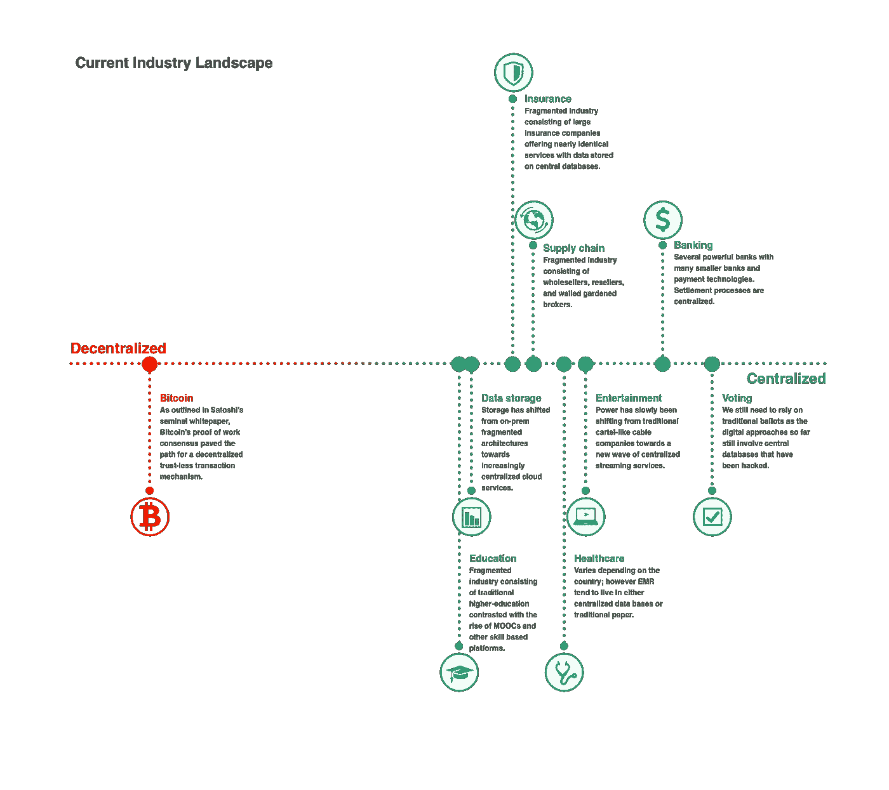
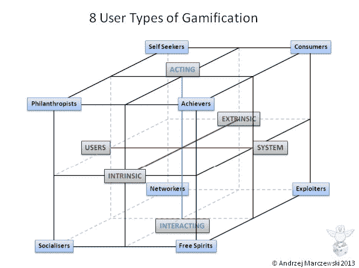
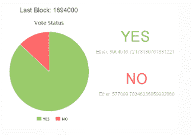
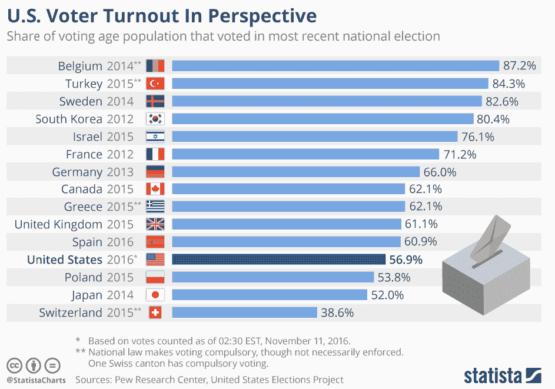
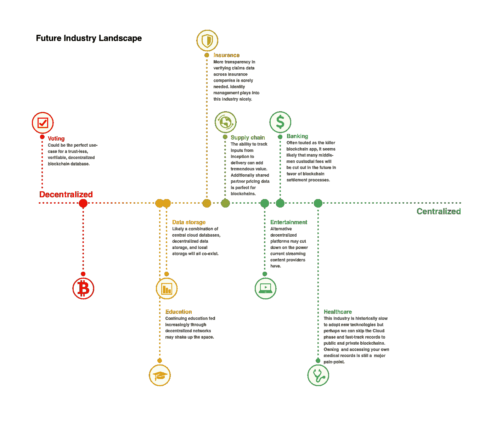

# 区块链治理:我们需要去中心化到什么程度？

> 原文：<https://medium.com/hackernoon/blockchain-governance-how-decentralized-do-we-need-to-be-799a7988ce84>

虽然分权治理并不是解决所有用例的万灵药，但在一个深陷日益严重的不平等、民族主义、对传统政府/银行机构的不信任、全球变暖、潜在的核末日等问题的世界中，我们需要更多的分权治理。虽然我对所有不同的[区块链](https://hackernoon.com/tagged/blockchain)治理模式感到非常兴奋，这些模式将在未来几年内迅速得到试验和发展，但重要的是要强调，与政府机构、公司、基金会和其他组织相关的治理主题是一个极其微妙的主题。根据项目的不同，应该在理解不同的项目和组织将在权力下放的范围内处于不同位置的情况下分析和探讨这一主题。

在阅读了无数的 token 白皮书并看到如此多的项目将“去中心化”或“去中心化治理”作为一个时髦词，我不禁一遍又一遍地问，为什么 x 特定的用例需要那么去中心化？如果没有那么分散，它应该在光谱的哪个位置结束，以增加社会的最大价值？**为了回答这些问题，这篇文章将考察从历史、其他学科和当前区块链治理方法中吸取的各种教训，以说明实现分散治理不仅仅是技术设计的功能，也是文化采纳的功能。**因此，我们应该努力从 UX 设计、公司治理和创新的公司文化中汲取最佳实践，以最大限度地发挥分权治理的价值。确定技术设计和文化采纳的最佳实践的正确组合将告诉我们我们的特定用例需要如何去中心化。

为了确定我们应该在去中心化的光谱中结束，让我们首先尝试描绘当前的风景。

Thanks to Lillian Wei for the infographic

在进一步阅读之前，我想提醒一下，这个初始范围并不是基于一个由数据支持的公式来确定某个特定行业或政府机构目前在这个范围内的位置。**事实上，我要说的是，我第一次描绘当前的风景是相当随意的，更多的是为了让我们以一种更渐进的方式思考分权治理的主题。**

让我们以银行业为例。在区块链社区，我们通常认为银行业是一个更极端的集中化行业，有许多中间人银行家和经纪人，他们的脱媒时机已经成熟。银行作为提供最终借贷结算过程的可信第三方的机制在概念上是集中的；然而，银行/金融行业可以被认为是分散的，因为有许多银行需要在一个标准网络中运营，以促进彼此之间的交易(国内的芯片和跨境的 SWIFT)。还有很多支付技术(VISA，Paypal，Venmo，Square 等。)与现有银行系统一起工作，以便提供集成和易用的服务。这些玩家也可以被认为是集中的，因为他们经营着“围墙花园”，你必须把信任放入其中以换取费用。可以说，确定一个行业是应该集中还是分散的工作并不是非黑即白的，当我们探索区块链技术和治理解决方案时，我们应该努力了解我们当前系统的优势和劣势，然后再用分散的解决方案完全取代它们。

# 了解我们从何而来

# 治理的目的

借用《区块链治理综合概述》中的一句话 Fred Ehrsam 总结道:

*“正如生物体一样，最成功的区块链将是那些最能适应其环境的生物。假设这些系统需要进化才能生存，* [*初始设计*](https://en.wikipedia.org/wiki/Butterfly_effect) *是重要的，但是在足够长的时间线上，变化的机制是* [*最*](https://en.wikipedia.org/wiki/Natural_selection) [*重要的*](https://briankeng.com/2015/07/a-little-bit-of-slope/) *。”*

为了促进进化过程，治理的主要功能是作为一种自我维持的机制，允许生态系统中所有参与者(主观的)最大限度地改进和成长。换句话说，治理应该作为功能科学，因为它提供了一个创造/提炼/维护知识的渠道，同时也作为一种机制，根据我们时代的当前事实和理论来决定最佳行动。换句话说，良好的治理将导致采取有意义的行动来应对全球变暖，而不是支持其成员向权力下放(呜呼，回到煤矿！).

# 了解参与者

在任何新的或现有的治理系统中，了解生态系统中的参与者及其激励/动机至关重要。为了更深入地探究动机，我们可以看看游戏化的研究，因为它试图理解用户心理和动机，以设计游戏生态系统。这与设计治理系统有相似之处，因为它们都涉及描绘参与者的动机和设计协调机制。借用 [Yukai 和 Andrzej 关于游戏化的 8 种用户类型的帖子](http://yukaichou.com/gamification-study/user-types-gamified-systems/)，我们可以在这个初始框架的基础上，通过 UX 世界定义用户角色的最佳实践，精心制作一个更全面的区块链治理参与者类型列表。

最终，系统中的每个参与者或团体都有自己的激励机制，而且这些激励机制很可能不会完全一致。如果我们将迎来一个快速测试许多区块链治理设计的新时代，因为它与链上(第 1 层)和链下(第 2 层)协调相关，我们不妨从游戏世界吸取经验教训，因为它与快速模拟协调机制相关。游戏和区块链系统之间一个特别有趣的相似之处在于这两种媒体的在线性质。我相信我们所有人都可以证明不同的人在面对面时和在中间时的行为(论坛上的巨魔)。如果你对那个兔子洞感兴趣，有一系列关于这个主题的研究:[网络心理学贴](https://cyberpsychology.eu/article/view/4273/3313)。

# 分权与集权的拉锯战史

## 企业 IT 是内部部署还是云部署

虽然与区块链治理设计相关的游戏化心理学有许多途径可以探索，但首先要探索的一个更重要的途径是理解以前的治理模式，因为历史往往是押韵的。从业务角度来看，B2B 和 B2C 领域的治理经历了分散化和集中化的拉锯战，这可以追溯到计算机的出现。在企业领域，世界各地的财富 500 强企业在过去十年中投入了大量资源，将其数据和治理流程集中到云中。**这一切都是为了扭转之前的损害，当时内部大型机解决方案被吹捧为一种分散式治理，可以提高效率，并允许各个业务部门更快地定制和应对问题。**开始时的宏伟愿景很快就变成了业务部门对流程和系统的过度定制；从而导致重复输入数据的浪费。关于这个话题更全面的历史，请查看这个[的帖子](https://www.brookings.edu/blog/techtank/2016/02/04/idea-to-retire-decentralized-it-governance/)。当我们更深入地回顾历史时，可以清楚地看到，集中治理和分散治理并不是什么新鲜事，并且总是会有这种来回的争斗。

## 互联网 2.0 的诞生

请记住，互联网最初是作为一个 P2P 协议开始的，它具有一种去中心化的特质。在接下来的几十年里，亚马逊、谷歌和脸书等公司在[互联网 2.0](https://www.tonysheng.com/disaggregation-theory) 时代创造了巨大的价值，聚合数据和流程，提供便捷和愉快的用户体验。这种聚合的另一面是，随着这些参与者变得越来越集中和强大，他们不可避免地在集中范围内进一步结束，并因此开始引入其他外部因素，如侵犯隐私和垄断经济。

## 媒体战争

这种来回拉锯战的另一个例子可以在娱乐业中看到，torrenting 等技术试图分散文件共享，但却被国家机构镇压，并重新集中到我们今天拥有的当前分散的流媒体订阅经济中。历史表明，根据特定的行业，企业和治理在这个范围内来回摇摆。不幸的是，历史经常朝着一个方向剧烈地摇摆；从而促使新技术或运动向另一个方向发展。在我们探索去中心化的治理模式时，让我们记住我们从何而来，不要因为过于偏向去中心化的方向而无意中扼杀了对社会极具附加值的技术。谨记历史教训，谨慎前行，让我们深入了解为什么区块链治理如此令人兴奋，以及它如何能够将集权之针移回适度的分权(因为我认为我们目前在互联网 2.0 和 3.0 的过渡阶段是不平衡的)。

# 为什么区块链去中心化治理令人兴奋

从根本上来说，区块链技术是一个分散的账本，可以抵抗审查、不可变、透明、可验证和安全——根据协议，这些属性的程度各不相同。这些特性使它成为实现分散治理模型的主要候选，在这种模型中，自下而上的创新可以被提议、投票、验证和实现。虽然区块链治理迄今主要涉及以下方面:

*   协议变更和技术升级
*   关键错误和漏洞修复
*   为 R&D 使用集合基金

分散治理模式也有可能被应用于解决许多因信息错误而困扰人类的重大问题(例如全球变暖)。我最兴奋和乐观的是区块链治理的潜力，它可以促进更接近真理的实践，因为它是一个可靠的技术系统，可以信任，以便人类有一套我们都同意的基本假设。如果民众甚至不能就基本事实达成一致，我们怎么能希望有一个自我维持的系统，能够不断进化和获得更好的知识？**当政府有能力传播错误信息，并在旨在为大众提供日常多巴胺的集中式社交网络上放大这些影响时，能够扭转现状的去中心化治理模式的前景让我非常乐观。**这里有一个令我兴奋的实施想法列表。为了简洁起见，我还包含了一些链接，这些链接指向已经很好地总结了这些方法的其他文章:

*   一个系统中的参与者决定了它的价值，那些拥有最多信息的人通过对结果打赌来表达他们的想法。
*   [分散自治组织(DAO)](https://blog.gnosis.pm/what-is-dao-may-never-die-the-dao-daos-and-the-future-of-organization-4d3b7e7c3f50) —通过智能合同和发行令牌的组合来实现组治理。
*   [流动民主](https://en.wikipedia.org/wiki/Delegative_democracy)——每个人都可以投票或委托他人投票的制度。
*   二次投票制(Quadratic Voting)——一种购买选票的制度，每增加一张选票要花两倍的钱。

# 权力下放宣传的陷阱

虽然这些未来的方法中有许多显示出了希望，但我们可以从许多当前的区块链治理模式中获得真知灼见。在 Vitalik 关于区块链治理的[帖子](https://vitalik.ca/general/2017/12/17/voting.html)中，他深入探讨了链上投票(第一层)和链外投票(第二层)的利弊。Tezos 和 Dfinity 经常被引用为链上投票的例子，其中任何人都可以提交更改以实现协议升级。在这些情况下，投票是自动的，并且在达到预编程的法定人数之后，协议具有实现这些改变的所有逻辑。另一方面，在第 2 层中，硬币投票是松散耦合的，对协议的任何升级都被应用，但是生态系统中的参与者(矿工、开发者)可以选择是否升级他们的软件以与新的升级兼容。虽然能够实现一个系统听起来很诱人，在这个系统中，来自世界各地的人们不必交互，并且可以简单地通过投票和让代码自动处理以前非常官僚的过程来快速自我改进系统，但我必须强烈同意来自以太坊的 Vlad Zamfir 的[帖子](/@Vlad_Zamfir/against-on-chain-governance-a4ceacd040ca)的观点，他认为:

*”其中我认为“紧密耦合”的链上投票被高估了，由* [*【比特币*](https://hackernoon.com/tagged/bitcoin) *、比特币现金、以太坊、Zcash 和类似系统所实践的“非正式治理”的现状远没有通常认为的那么糟糕，那些认为区块链的目的是完全消除柔软的糊状人类直觉和感觉，支持完全算法治理(强调“完全”)的人绝对是疯了， Carbonvotes 和类似系统所做的松散耦合投票被低估了，并描述了在考虑区块链治理时首先应该使用的框架。”*

官僚治理流程存活了这么久是有原因的，在我们到达艾萨克·阿西莫夫设想的人工智能可以更好地为我们做出理性决策的未来之前，我们必须接受任何区块链治理方法，人们如何互动和利用这项技术都是至关重要的。

## 选民参与

最终，所有不同的区块链治理模式都围绕着不同的投票方式。考虑到这一点，我们可以看看不同国家、基金会、董事会等的历史投票趋势。即使将美国总统选举的投票率(我们通常不认为这是疯狂的高参与度，约 55%的合格选民)与道碳投票(4.5%)进行比较，我们也可以看到鲜明的对比。当然，这只是一个例子，这将是另一个有趣的帖子，创建一个所有区块链治理平台的投票统计数据的综合列表，并将这些数据与当前政治投票的不同部分(性别、收入、教育水平等)进行比较。).尽管投票人数相差很大，但这两个投票例子中的一个共同主题是，它们都表现出经典的公地悲剧经济问题的要素，即生态系统中的参与者没有足够的动力来采取符合大多数人最大利益的行动。不幸的是，这导致了意想不到的负面影响。可悲的是，如果你单独采访这些参与者，他们中的许多人事后会哀叹没有参与，因为他们本可以阻止这个结果。可以说，选民参与在区块链空间是一个问题，就像在民族国家一样。

DAO Carbonvote participation rate

投票中的另一个问题在于，在一个充斥着无关信息的时代，年轻人的注意力(更有可能采用新兴技术的那部分人)是如何分散的。**人们一生中只有这么多“在乎”的事情，我希望在区块链治理中看到的是实施最好的文化管理课程，以烘焙文化机制，从而增强这种最初的分权治理风气。**无论是正式治理还是非正式治理(核心创始人/开发团队对区块链社区的影响),正如今天许多区块链社区的情况一样，我们都在与人打交道，因此需要正确的领导和文化价值观，以促进区块链治理的愿景成为提高知识和成果的机制。任何系统的参与者都需要参与到游戏中来，仅仅因为去中心化有使当前过程非中介化的效果，并不意味着它不能被组织起来并富有成效。

## 瑞士法典的教训

本着组织和生产力的精神，我们可以参考“瑞士规范”的最佳实践，该规范最初由[经济学会](https://www.economiesuisse.ch/sites/default/files/publications/economiesuisse_swisscode_e_web_0.pdf)于 2002 年 7 月发布，适用于所有经济部门，并在此后不断修订。从高层次来看，主要任务陈述如下:

*“公司治理包含所有旨在维护公司可持续利益的原则。在保持公司最高层决策能力和效率的同时，这些原则旨在保证透明度以及管理和控制的健康平衡。”*

在完全分散的治理模式中，如果没有适当的组织和领导水平，社区参与可能会演变成垃圾邮件和巨魔战争，这违背了良好治理的最初目的。尽管《瑞士准则》很难读懂，但许多关于适当激励、组织和有效促进讨论的常识性建议都是久经考验的原则，经受住了时间的考验。通读《瑞士法典》的一个主要见解是，以高度参与游戏的方式构建董事会的组织当然会有非常高的选民参与度。这是一个显而易见的说法，但它是区块链治理的关键区别，为参与性和强有力的治理打开了大门。

# Dash 和其他刀的教训

## 破折号

我有机会与之合作的一个具体的分散治理模式是 Dash 的治理模式，它将 10%的整体奖励用于社区基金，然后可以按月用于社区提议和投票的项目。在某些情况下，Dash 作为一种类似于比特币的工作证明币运行，但很大程度上不同于比特币，因为它创建了第二个共识层，称为 Masternode 网络，支持 instasend、privasend 和 governance 等次要功能。要成为 Masternode，你必须投入 1,000 Dash(目前约为 300，000 美元),以获得对提案投票的奖励，并获得保护次要功能的红利。虽然许多共识纯化论者指出，大约 4，700 个主节点的网络不是真正分散的，但这是一种有趣的权衡，它在游戏动机中创造了适量的皮肤，以推动更有意义的治理讨论。

完全公开，我一直在一个团队工作，专注于增强提案生成器的体验，因为当前的工具是脱节的，可以通过应用 UX 设计的最佳实践来改进。在这个过程中，我已经能够通读许多提案和讨论，并注意到迄今为止提案的一般类别通常属于:推广/营销、活动、创意(电影)和技术。在快速行动的黑客精神中，许多工具和过程已经由社区非常快速地创建和发展，以努力过滤好的提议和社区反馈。Masternode 网络的赌注效应似乎对投票者的参与产生了积极的影响，因为我观察到平均有 25%的人参与；然而，关键的问题，也可以说是大多数 DAO 模型的问题，是确保为每个提议提供知情和高质量的反馈。

创建具有有意义的参与、提议想法和反馈的 DAO(分散自治组织)的一部分包括围绕专业、清晰和知情建立一套强大的文化规范。在这个问题上，Dash 核心团队在建立这种文化方面做得非常出色，不仅提供了相当多的[文档](https://dashpay.atlassian.net/wiki/spaces/DOC/pages/1146914/What+is+Dash)和培训材料，不仅介绍了平台的工作方式，还介绍了他们希望在参与之后继续生活下去的愿景和文化。最初，Dash 的创始人试图将错误/代码奖金的决策过程民主化，但很快意识到，应用 Zappos 这样的 [Holacracy](https://hbr.org/ideacast/2016/07/the-zappos-holacracy-experiment.html) 过程可以刺激组织其他方面自下而上的创新。

一个强大的核心团队的有趣之处在于，他们总是获得很多非正式的权力，因此，每当他们批准某个特定的提案时，这就成为一种合法性的标志，使其他投票者更容易追随。另一方面，也存在一些问题，例如，那些对技术提案进行投票的人，他们自己可能不是职业技术专家，因此会向社区中其他技术影响者寻求指导。**对我来说，如何让最合格、最知情的参与者来权衡正确的提议，是让分权治理持久的关键。这个挑战并不新鲜，因为美国的开国元勋们试图回答同样的问题以避免暴民统治。我很有兴趣看到对 DAO 设计的潜在调整，其中投票权不仅是你拥有多少令牌的%,而且是你在某个特定领域积累的多少声誉的%。如何定义声誉系统并围绕如何衡量“专业知识”建立数据将是一个有趣的设计和数据科学问题，必须进行大量调整，以避免许多其他声誉系统的陷阱，这些系统可以轻松地进行游戏。**

## 其他 DAO 实现

其他 DAO 实现包括 [SmartCash](https://vote.smartcash.cc/Proposal?f=&c=3) ，它与 Dash 的模型相似，但在两个关键方面有所不同:

*   70%的采矿奖励用于社区项目，而 Dash 只有 10%。
*   所有 SmartCash 的持有者都可以投票，他们的投票权基于他们持有的硬币的百分比，而 Dash 目前只有 Masternodes 投票权。

由于拥有更大的资源池和更广泛的社区，提案的类型更加多样，并且更倾向于国际推广使用案例，如将 SmartCash 引入尼日利亚。随着时间的推移，当地和地区社区可能会像 Kore.life 正在做的那样自我组织他们自己的 DAO。

当我们处于治理实验的这个阶段时，建立正确的文化规范是很重要的，因为人们经常习惯于仅仅为了传统而遵循传统。无论你是兄弟会成员还是美国开国元勋之一，传统涵盖了从深思熟虑的宪法到随意/愚蠢的通过法案的所有范围。请记住，不相关或过时的传统一旦存在就很难改变，我们应该利用这段时间来创建具有持久核心原则的治理模型，其中改变是一个关键原则(建立一个能够修改传统的传统—我知道这是一种矛盾修饰法)。

此外，我们还应该整合在公司和基金会中发现的大量研究和最佳实践，这些公司和基金会研究了如何最好地激励和参与团队。例如，[项目 aristotle](https://rework.withgoogle.com/print/guides/5721312655835136/) 试图研究谷歌高效团队的共同要素。关键的一点是，组建一个培养心理安全的团队比组建一个由顶尖 A 型人才组成的团队更重要。一个培养这种友谊的兼收并蓄的团队可以从头脑风暴会议中产生的创新想法中受益，在头脑风暴会议中，想法可能不会合并；然而，其他成员或许能够实现这一愿景，并将其具体化。另一方面，一个充满 A 型人的团队可能会表现出类似巨魔的行为，他们害怕分享任何头脑风暴的想法，因为害怕失去他们的社会地位。如果我们要组织并授权分散的社区在各自的社区中创造价值，我们还需要吸取这些社会经验并将其应用于分散的治理模式中。

# 平衡的方法

无论我们是在处理一个潜在的区块链创业想法还是一个分散的治理模型，我们都需要根据关键标准来评估我们试图解决的用例，以确定我们应该如何集中或分散地设计我们的系统。在决定是否为供应商网络实施区块链解决方案的情况下，一组标准涉及该特定生态系统中的信任程度以及该网络需要多快更新数据。对于信任度非常低且不需要实时更新的网络，分散式区块链解决方案是完美的选择。在其他情况下，不需要在许多分散的各方之间进行协调，而实时处理是必须的，那么在 AWS 之类的东西上托管一个中央数据库是一个不错的选择。考虑到这一标准，以下是潜在的未来行业前景:

在治理的情况下，可能需要一系列的链上投票、链外投票，以及所有方式的混合组合，这取决于主要的用例。纯链上*紧耦合*投票可以在优先考虑尽快修复小错误的情况下发挥作用，因此没有必要增加官僚流程。另一方面，如果有范式转变需要评估和投票，例如从*工作证明*转移到*利益证明*，这种硬分叉的影响将在参与者中产生深远影响，因此需要一种全面的共识机制，在这种机制中，知情的参与者可以讨论和制定最适合生态系统需求的解决方案。

归根结底，区块链技术是达到目的的不可思议的工具和手段，而不是目的本身。当有人说他们想成为 x 的去中心化版本时，我们不应该欣然点头。相反，我们应该问在光谱上有多远，为什么。集权与分权的拉锯战并不新鲜，是人类集权本性的结果。在许多方面，我们正在建立超越任何个人的治理体系。因此，当区块链正在发生激动人心的技术突破时，我们也需要同时应用历史和其他学科提供的最佳治理和文化实践。

*感谢* [*杰夫·霍奇斯*](https://www.linkedin.com/in/jeffahodges/)*[*莉莲·魏*](https://www.linkedin.com/in/lillian-wei-7ab3203a/)*[*米切尔·李*](https://www.linkedin.com/in/milee1/) *编辑此贴。***