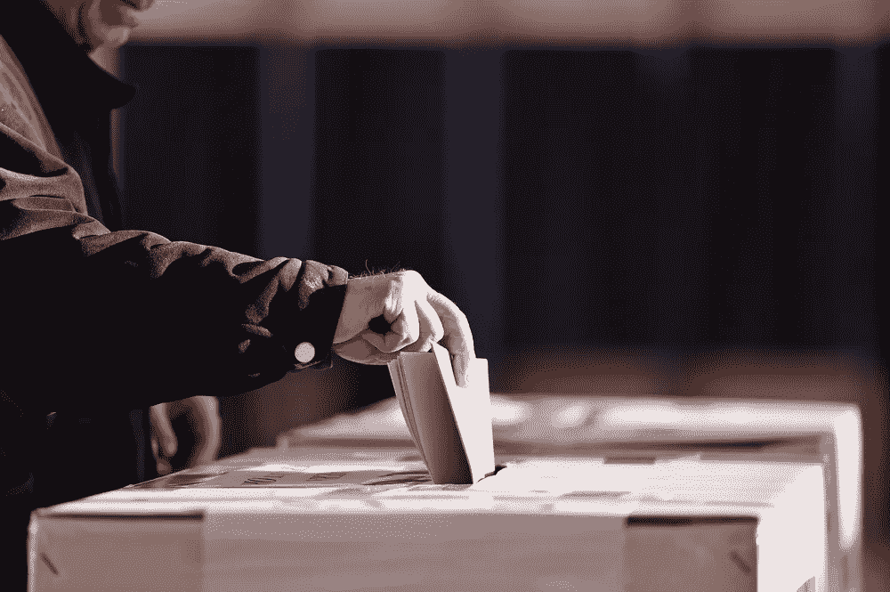

# 区块链有可能简化全世界的民主。以下是方法

> 原文：<https://medium.com/hackernoon/blockchain-has-the-potential-to-streamline-democracy-across-the-world-heres-how-d09d24992cec>

B 锁链作为一个实验开始。

最初，问题是它能否取代银行。但是因为存储在 T2 区块链 T3 上的数据不需要第三方 T4 管理或操作，世界很快意识到这个问题的答案是“是的”

然后，区块链更进了一步。随着以太坊的出现，我们意识到区块链技术不仅仅可以用于金融交易。事实上，我们已经意识到，它有可能分散整个经济，并简化全世界的民主。

以下是方法。

# **为什么区块链可以作为民主化工具**

关于区块链的一个关键问题是，它需要共识。

由区块链供电的网络中所涉及的实体必须在它可以被使用之前就其内容达成一致。用户稍后想要对区块链进行的任何数据调整或安全升级也是如此。除非达成共识，否则调整不可能发生。

这样，区块链*要求*民主参与。

有趣的是，正是这一要求确保了存储在区块链上的数据保持安全。

> 区块链使用加密哈希函数对其存储的数据进行加密，这使得它从根本上是安全的。

但是数据也是加密的，用户可以跟踪数据的历史变化。

没有人能够篡改存储在区块链上的数据而不被网络中的其他人发现。

当区块链扩展到金融交易以外的应用时，这种透明的安全感变得更加重要。

例如，最近的新闻[称，与川普总统竞选活动有关的数据分析公司 Cambridge Analytica 在未经授权的情况下使用了来自脸书的 5000 万用户的个人信息，这是推动区块链技术实现数据民主化和去中心化的一个明显原因。](http://www.businessinsider.com/cambridge-analytica-trump-firm-facebook-data-50-million-users-2018-3)

> 将来，政府可以使用区块链来计算票数。

因为区块链跟踪存储在其上的数据的历史变化，我们将能够验证任何给定的人是否投了一次票、投错了票或者根本没有投。

这将使我们能够更有目的地打击选民欺诈。

正是区块链所允许的透明度使其成为如此独特的民主化载体。通过分散数据，区块链给了民主一个强大的武器。

# **区块链作为民主化工具的应用**

除了打击选民欺诈和简化金融交易之外，区块链还可以用来全面追究政府的责任。

> 如果政府存储区块链的数据，区块链可以作为真相的来源，这将使我们当选的领导人更难撒谎或腐败。

公司也是如此。区块链将使清除高管的挪用公款或其他欺诈行为变得更加容易，因为他们的行为总是可以被追踪的。

潜在的更强有力的方式是区块链可以改善第三世界国家人民的生活——那些有钱投资的地方的居民不信任他们的金融机构。

通过为这些人提供一种工具，让他们能够准确监控他们的资金在何时发生了什么，我们可以给他们投资所需的信心。

这不仅对他们来说更安全，而且对整个世界经济也有好处。

# **接下来是什么**

你现在可能已经读到很多关于*区块链技术在民主化经济和机构中的潜在应用。*

但是区块链已经被用于这些目的的例子在世界各地都有。

去年，乌克兰对区块链的选举平台进行了测试，以获得市政一级的选票。爱沙尼亚居民使用区块链自行公证文件，比如结婚证和出生证明。丹麦的一个政党正在使用区块链软件进行内部投票。

全球各地的机构迅速转向使用区块链技术似乎势不可挡。但你需要明白的主要一点是，区块链技术拥有远远超出金融交易的应用。

通过分散经济和揭开集权公司的秘密外衣，区块链已经在改变世界。