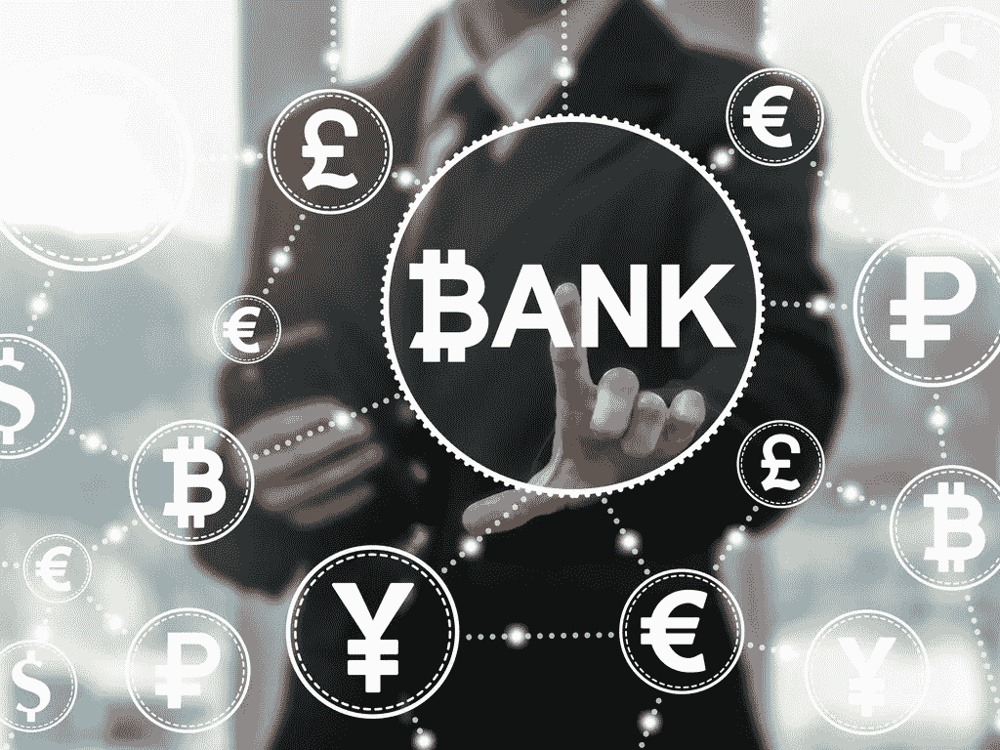
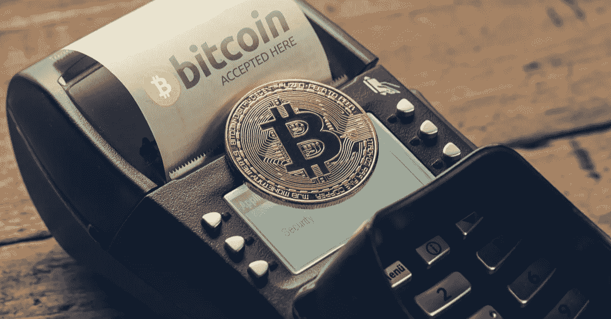
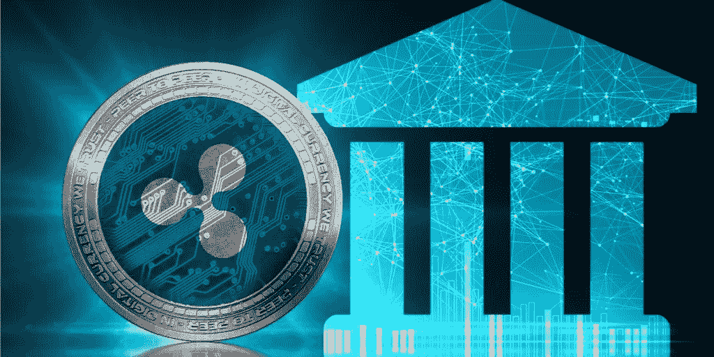

# 区块链对金融业的影响

> 原文：<https://medium.com/hackernoon/blockchain-impact-on-the-financial-industry-179175952ec8>

在本文中，我们将分析金融机构的哪些领域将主要受到区块链技术的影响。我们相信，在不久的将来，区块链技术对金融组织的影响将与互联网对信息产业的影响相同。它将彻底重组它。

分散式分类账技术通过在互联网上实现点对点、简单、即时和几乎免费的价值交换，创造了“价值互联网”。迄今为止，这一角色一直由银行垄断。我们将分析这项新生技术将如何挑战银行领域，并催生强大的竞争对手。另一方面，一般来说，银行和金融机构一直处于技术发展的最前沿，描述他们目前如何准备战斗也是非常有趣的。

我们将把这项研究分成两篇不同的文章。一个面向零售银行，即处理我们日常业务的银行(I ),另一个面向涉及资本市场和企业银行业务的投资银行(II)。

**I —对零售银行的影响**

我们所知道的银行参与非常多样化的活动。从货币供应到房地产管理，银行存在于我们经济的每一个环节。但情况并非总是如此。起初，出于安全考虑，银行只是代表客户储存黄金。作为交换，顾客会收到一张收据，证明他们拥有一定数量的黄金。出于显而易见的便利原因，这些收据随后被逐步兑换成商品和服务，因为它们是由黄金支持的。法定货币诞生了。

但后来，由于人们只交换这些收据，银行意识到，所有沉睡在保险柜里的黄金都可以被借出，这就是 2008 年大多数人发现的奇异衍生产品的历史开始。

银行的这段(非常)简史提醒我们**银行的核心功能是更新分类账，以便组织支付，顺便提供贷款**。而今天依然如此。当你用信用卡购物时，你的银行通过从你的账户中删除花费的金额并将其添加到卖方的账户中(如果需要，通过卖方的银行)来更新其分类账。所以你的账户只是银行分类账上的一个数字，显示你存了多少钱，银行欠你多少钱。同样的，当银行给你一笔贷款时，你账户的借方会产生一条线，每次你还款时这条线就会减少。

因此，在当前的经济体系中，银行扮演着可信中介的角色，因为没有这些中介，人们就无法进行价值交换。区块链会改变这一切吗？**毕竟，区块链也是一个分类账，但区别在于不需要可信的中介，因为网络的所有成员都以分散的方式更新它**。理论上，区块链可以将每个参与者连接到一个经济系统，这样他们就可以使用区块链记录所有交易，直接进行交互。

**银行是值得信赖的中介**

根据[瑞士瑞信银行](https://www.finextra.com/finextra-downloads/newsdocs/document-1063851711.pdf)发布的一份报告，支付卡行业的市场领导者，如 Visa 和 MasterCard，并不直接关注基于技术发展的分散式账本技术，因为在该领域进行了大量投资。**由于支付终端和取现点数量众多，用户通常认为国内支付(在同一国家)的实现是高效和快速的**。

密码纯粹主义者会说，通过扫描二维码或从账本 Nano S 发送硬币来支付并不更困难。唯一的区别在于已经筹集了大量投资来为每一家商店配备卡支付机，而用安全的比特币支付终端取代它们将需要时间。

bitcoin payment system

使用比特币或任何加密货币的直接支付不应与加密卡混淆，如 Xapo、TenX、CryptoPay、Bitpay、Bitwala **、**和 Wirex 提出的加密卡，它们是使用加密货币预付的借记卡。我们不能认为它们是比特币/加密货币支付，因为[信用卡公司仍然控制着他们发行借记卡的权利](https://www.coindesk.com/visa-cracks-bitcoin-debit-cards-europe-providers-say/)。

然而，在我们所知的支付系统远非高效的领域，加密支付肯定会成为强大的竞争对手:**互联网支付(1)、国际转账(2)以及向无银行账户者提供金融服务(3)** 。

**1 —互联网支付**

我们通常会忘记，信用卡是在互联网出现之前创建的。因此，它们是为实物支付而不是互联网支付量身定制的。信用卡存在三个主要问题。首先，他们要求**高额的加工费**。这是信用卡运营商获得报酬的方式，这些费用可以由固定费率(通常为 0.30 欧元)和可变费率组成。对于电子商务平台上的日常交易来说，这些费用是可以管理的，但对于我们正在进入的微支付世界来说肯定不是这样，在这个世界里，机器之间正在完成数十亿次微交易。**欺诈是信用卡支付的第二大弱点。尽管银行和信用卡运营商竭尽全力保护这些交易，但 2015 年欺诈造成的损失高达 210 亿美元。最后但同样重要的是，安全是网上信用卡支付的一个主要问题。**

与此同时，全球最大信用卡发行商 VISA 的首席执行官 Alfred Kelly 在接受美国消费者新闻与商业频道采访时提到， ***“我不认为比特币是支付系统的玩家”*** 。在比特币协议的当前状态下，他可能是对的。正如我们在关于物联网的文章中提到的，比特币是一种非常安全的互联网价值转移媒介，但它也非常有限，原因如下:

*   **比特币协议慢**:比特币协议编程为每 10 分钟添加一个区块。工作证明的难度实际上总是根据在网络上工作的矿工的数量(即网络上使用的散列能力的数量)进行调整，因此两个块之间的时间范围将总是 10 分钟。人们还普遍认为，要使一项交易被认为是不可撤销的，还应该在区块链中增加 6 个区块。实际上，这意味着我们需要等待 60 分钟来确认交易，这对商业应用来说太长了。
*   **比特币不可扩展**:由于可以添加到区块链的交易数量有限，实际上很难将区块链应用到一个指数级增长的网络中，因为网络成员(无论是自然人还是非自然人)之间的交易也将呈指数级增长。每个区块链块的大小为 1MB，不足以处理比特币网络上的所有交易。确实认为有 250，000 笔交易永久等待处理。
*   **比特币费用非常高**:上一点的直接后果是，目前，与可用空间相比，增加区块链交易的需求非常重要，以至于未成年人向用户收取的费用最高可达 25 美元。同样，这些费用不适合比特币的商业用途。

(暂时)解决这些问题的一个方法是**扩展块大小**，以便同时处理更多的交易，并降低未成年人的费用。**这就是实现 SEGWIT 2X** 的目的。SEGWIT 分叉的取消清楚地表明，比特币协议开发者选择了另一种解决方案。

Lightning network

**闪电网络**(在我们的文章[“物联网:区块链、闪电网络和 Tangle](https://www.blockchains-expert.com/en/internet-of-things-blockchain-lightning-network-and-tangle/) ”中有详细描述)似乎已经被选为替代方案，因为**它提出了一个非常有前途的架构**。它允许创建链外渠道，用户可以在其中实现他们想要的尽可能多的交易，而不必每次都将它们添加到区块链中，但仍然受益于分散式分类帐网络的安全性。换句话说，**交易立即得到确认，当这一笔交易关闭时，费用分摊到渠道的所有交易中，最后一笔交易**(各方相互欠款的净额结算结果)被添加到区块链中。

唯一的问题是频道只能在两个人之间设置。为了联系到一个你不共享频道的人，你将不得不使用中间节点或“中枢”。然而，这些节点和枢纽可能会被监管机构视为“资金转移者”，并受到诸如最低资本、了解你的消费者(KYC 支票)(……)等严格要求的制约，这些要求不是任何特定的人都能完成的。

**"金融罪行执法网的条例将"汇款人"一词定义为提供汇款服务的人，或从事资金转账的任何其他人。术语“货币传输服务”是指“接受来自一个人的货币、资金或其他替代货币的价值，并通过任何方式将货币、资金或其他替代货币的价值传输到另一个地点或个人。""**

**这是银行和信用卡公司等主要企业可能会参与进来并开始管理比特币网络的地方，但只有未来才能证实这一点。**这段视频很好地总结了这个问题:

**Tangle，闪电网的替代方案**

Tangle 是第二个创新的例子，T2 可以显著提高在线支付的速度和安全性。这是一种基于 DAG(有向无环图)的新型网络，它是根据物联网而设计的。严格地说，泰戈不再是真正的区块链，因为不再有“块”或“链”。 **Tangle 实际上是第二代区块链**，它不依赖于通过加密哈希相互连接的块架构，但保留了当前区块链的一些基本功能:

-点对点网络

-分散的数据库

-验证交易的共识机制

事务直接存储在 DAG 中，这意味着每个节点都是一个矿工，没有费用。由于这些原因，基于 Tangle 的系统应该伸缩性很好，非常快，而且便宜。

**国际支付**

与信息系统相比，互联网上的价值转移系统晚了 20 年。当前的国际支付系统与 80 年代的电子邮件通信系统非常相似:一个封闭的、条块分割的系统。如果你是 GEnie 消息系统的用户，你只能给 Genie 的用户发送电子邮件，而不能给 CompuServe 或 AOL 的用户。SMTP 是连接所有这些独立网络的协议，并很快成为参考协议。

这些分歧的后果是多方面的。国际支付通常需要一天以上的时间，只能在银行机构的营业时间内完成，并产生大量成本。原因是，在到达目的地之前，你的资金可能会经过几家有自己的流程和系统的银行。

所有这些步骤大大增加了交叉检查数据的工作，从而增加了转移的时间、成本和出错的风险。

> ripple 董事长兼联合创始人克里斯·拉森(Chris Larsen)在 2016 年 12 月 1 日 Quora 上的一次问答中总结了当前的形势: *"* 全球交易需求正在发生变化，而当前的金融体系远远不足以满足未来的支付需求和机遇。对于低价值支付来说尤其如此，对银行来说无利可图，对客户来说成本太高。各种规模的公司从第一天起就越来越全球化，需要提供按需交付的服务。从财富 500 强到科技行业及其他行业，我们称之为“新公司”，包括优步和亚马逊等公司，前者需要向 70 多个国家的司机支付费用，后者代表 100 多个国家的商家向 185 个国家的客户运送约 10 亿件商品。新公司希望他们的银行能够让他们即时支付小额款项，并提供全面的交易可见性。各种规模的银行都希望为这些客户服务，并为企业和消费者提供小额支付等新产品，以实现零售汇款。”

**我们之前提到，信用卡公司在中短期内可能不会受到加密货币发展的影响，但对于组织国际资金转移的公司来说，情况可能会有所不同，如 SWIFT 或西联汇款**。这些公司提出的服务速度慢、费用高，而且通常依赖过时的技术系统。正如我们已经提到的，由于区块链技术的发展，现在已经有可能以一个荒谬的价格将大笔资金立即转移到世界的另一端。世界经济论坛(World Economic Forum)更进一步表示，让 DLT 感到不安的力量来自一个简单的事实，即“技术是现成的，这一事实使得银行、支付提供商和信用卡公司变得多余”。

涟漪:银行对威胁的回应

Ripple 是一种互联网协议，旨在促进其成员之间的资金供应(一个仅由银行和公司组成的不断增长的社区)。正如简单邮件传输协议(SMTP)定义了组织电子邮件交换的规则一样，RTXP (ripple Transaction Protocol)定义了一组规则，以在互联网上以任何货币、加密货币、材料(例如黄金)或任何其他价值单位立即免费执行交易。

Ripple and banks

Ripple 的目标是将所有现存的和不兼容的银行系统连接起来，以使机构间的国际资金转移即时且几乎免费。关于 Ripple 功能的更多信息，你可以阅读我们的文章" [Ripple:连接银行的协议](https://www.blockchains-expert.com/en/ripple-the-protocol-that-connects-banks/)"

**向没有银行账户的人提供金融服务**

分散式账本技术将为无法开立银行账户的人提供机会，让他们能够通过智能手机获得银行服务。根据麦肯锡发布的[报告，近 25 亿成年人(几乎是世界成年人口的一半)无法获得借贷、存储或转账的银行服务。](http://mckinseyonsociety.com/half-the-world-is-unbanked/)

然而，这些成年人中有很大一部分现在配备了智能手机，可以让他们直接获得小额信贷或接收在国外工作的亲戚的付款，而无需使用昂贵的中介。据海外发展研究所称，这些过高的费用每年花费非洲大陆 18 亿美元，足够支付该地区 1400 万儿童的小学教育费用。这是因为工人们向他们在撒哈拉以南非洲的亲戚汇款平均要支付 12%的费用。给你一个想法，一个工人寄 200 美元来支付他家人的教育费用，他将承担 25 美元的费用。

**比特佩萨**

[BitPesa](https://www.bitpesa.co/) 是一家总部位于肯尼亚的初创公司，**通过允许用户将比特币兑换成肯尼亚先令**并直接发送到他们的手机投资组合中来提供支付服务。

在他的手机上拥有一个投资组合并使用它进行支付在非洲越来越普遍，这项服务在 BitPesa 到来之前就已经在肯尼亚存在了。Safaricom 持有 M-Pesa，它是移动电话转账和支付领域无可争议的领导者(该国 GDP 的一部分将通过它的系统)。BitPesa 最初依靠 Safaricom 网络来确保其发展。

但是，BitPesa 以比 M-Pesa 低得多的价格提供同样的服务，实际上是与 Safaricom 直接竞争，后者决定终止合同，因此无法在非洲大陆提供服务。

与 Airtel money 的新协议随后帮助 BitPesa 回归，并确保了过去两年的高增长。

**阿布拉**

我们还想提一下凯西，一家成立于 2014 年的初创公司，其目标是组织免费、即时的国际货币转账。这个应用程序也使用比特币协议来实现转账，但与 Bitpesa 的不同之处在于，用户不自己购买比特币。正如凯西创始人兼首席执行官比尔·巴尔海德特(Bill Barhydt)在 2016 年 7 月“美国银行家的区块链和数字货币”会议期间所说，“T2”*用户甚至没有意识到自己拥有比特币投资组合。从他们的角度来看，他们持有当地的货币* 。这个应用程序很有趣，因为它提出了管理比特币波动性的重要风险。

根据 Bill Barhydt 的说法，与不断持有大量比特币的机构比特币投资者签订智能合约，可以实现投资组合的稳定性。**这些合同的运作有点像“差价合同”**(“差价合同”)，即双方就一项财产(这里是比特币)的未来价值以及根据该价值在合同结束时的波动进行双边支付达成一致的合同。

我们可以想象，凯西通过执行相反的 CFD 组合来平衡其投资组合，这样一个合约产生的收益将补偿另一个合约的损失。

**恒星**

Stellar 提出了一个基于分散式分类账的支付框架，其运作方式与 Ripple 开发的系统相同。stellar 的创始人 Jed McCaleb(也是著名的 MtGox 的创始人)和 Joyce Kim 在离开该项目创建 Stellar 之前也是 Ripple 的创始人之一。stellar 创始人的想法是向无法获得银行服务的人(主要是发展中国家的居民)提供移动电话支付服务，以及即时和几乎免费的国际转账解决方案。

Stellar

具体来说，Stellar 提供了一个平台，通过其 API(“Horizon”)开发应用程序，并通过“stellar core”这一中介与整个网络进行交互，Stellar core 的功能是通过我们上面描述的共识系统验证交易。一旦连接到网络上，从地球的一端到另一端交换任何价值都是容易、直接和几乎自由的。

**网络发放并存储在区块链上的贷款**

依靠区块链技术的金融科技初创企业在贷款行业也非常活跃。有两个玩家提出的解决方案非常有前途:SALT 和 Jibrel Network。

两家创业公司使用相同的机制。用户将把他们的一些资产记录在区块链上，作为他们从网络其他用户那里获得贷款的抵押。对于每一笔登记的资产，都会发放一个令牌并转让给贷方，直到他收到贷款的全部还款。在贷款有效期内，贷款人可以兑换这些代币并获得利息。

这些加密贷款机构发放的贷款非常灵活，因为借款人不需要预付款，利息由双方商定，信用检查由加密货币和实物资产抵押取代。

如果借款人没有全额还款，我们显然可以质疑资产记录的法律效力以及贷款人加速资产记录的做法，但当你看到法国监管机构最近承认区块链上记录的所有权的法律价值时，你真的可以感受到变革之风。

**结论**

即使这项技术仍处于非常早期的阶段，但很明显，这种趋势将会持续下去，并将像互联网改变信息产业一样改变金融业。a 银行充分意识到了这种威胁，并且几乎都在资助 fintech 初创公司孵化器，以保持在这种颠覆性技术的顶端。

如果你喜欢这篇文章，请不要犹豫，喜欢它或分享它！！