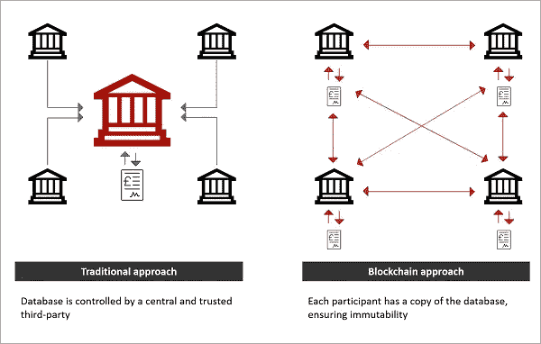
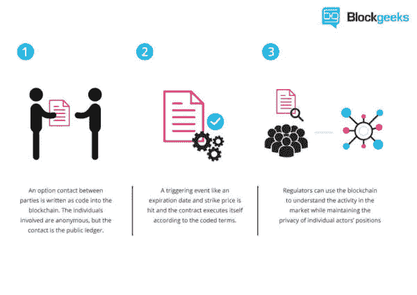
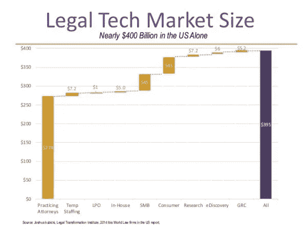

# 区块链:对公证行业的影响

> 原文：<https://medium.com/hackernoon/blockchain-impacts-on-notarial-professions-a58245030a3f>

新技术对一个有 700 年历史的职业的影响。

2008 年，区块链的首次使用伴随着一种现象出现，如今许多人认为这是一场革命:比特币。这项技术由 Satoshi Kishimoto(化名)发明，是当今新技术领域的一个重要话题。然而，区块链是一项可以应用于许多领域的技术，但也引发了一些问题，包括法律层面的问题。这就是为什么区块链的存在及其可能性允许我们质疑这项技术对公证人职业的影响。

这篇文章将解决许多问题，如合法性、安全性或作为区块链技术核心的可信第三方的消失。

# 聚焦区块链技术

对于后者，有必要重新定义性质。根据 [Modex 的智能合约市场](https://blog.modex.tech/canada-using-blockchain-for-transparent-administration-of-government-contracts-127baca81f45)的说法，区块链是一种存储和传输信息的技术，透明、安全，并且在没有中央控制机构的情况下运行。它构成了一个数据库，包含自创建以来用户之间的所有交流历史:不会丢失任何数据。另一方面，这种技术的优点是允许用户自由查阅交易登记册。

# 通过区块链运营区块链

此外，理解私人区块链和公共区块链之间的区别也很重要。大众[区块链](https://hackernoon.com/blockchain-revolution-and-technical-job-opportunities-b02a452dcde2)是历史悠久的区块链。每个人都可以使用它，并且每个人都可以访问链的注册表。这是完全的非中介化，不受私人机构的监管。另一方面，私人区块链可以由财团(例如银行)创建，只面向该链的成员，或者由一个行为者创建，也可以是一个潜在的金融机构。

正是在这种技术框架中，提出了与公证有关的问题，我们将在下面对其进行定义。
公证职业。

公证人的职业基本上有七种。它可以是公证人，具有作为印章保管人的特殊性，但不仅仅是。公证员通常伴随或与实习公证员、助理公证员、书记员、形式主义研究者、税务会计师或房地产谈判者有关。这些行业有相当不同的作用，能够面向技术法律、行政、管理，当然还有加盖国家印章。公证书可以采取多种形式，涉及法律环境中的房地产、婚姻合同、遗嘱、出生和公民身份。

作为区块链的一部分，公证交易不会受到这项技术提供的所有可能性的影响。随着智能合同的出现，这将是公证行业和这些业务未来可以预见的巨大辩论的主题。

# 智能合同的作用以及与公证行业相关的问题

“智能合同”这一术语具有误导性，因为它本身不是合同。事实上，它是合同义务的检查和自动实现的总和。具体地说，[智能合同](https://www.business2community.com/customer-experience/how-blockchain-could-transform-the-customer-experience-02106138)是一个自治程序，它将自动执行预先在区块链中定义和注册的条件。

不像不是在区块链中实现的程序，而是在更传统的技术上实现的程序，智能合同是防篡改的、不可修改的和完全安全的。因此，智能合同是双方之间令人兴奋的信任杠杆，因为遵守合同是自动的。因此，欺诈在理论上是不可能的。

通常由立法管理的智能合同使用的主要问题是合同在这种情况下的适用性。因此，可能出现两种可能性:要么合同将进入现有立法，要么有必要立法以考虑其在社会中的作用。

关于公证职业，我们将感兴趣的是以下问题:如果公证书是一份智能合同，它是否有效？正如我们前面提到的，智能合同应用领域的预测是多种多样的，可能涉及房地产交易等，对此，公证人的存在是必不可少的。

这就出现了一个本质问题:公证人有什么用？公证人现在是国家印章的守护者。印章是公共权威的标志。也就是说，它代表了共和国的权威(历史上也代表了国王或皇帝的权威)。因此，当公证员在起草的文书上盖章时，该文书就成为公证文书。它具有公共权威的力量。因此，公证行为在提供证据方面处于层级的顶端，这使其成为无可争议的行为，这与智能合同形成了平行。质疑公证行为的唯一现有方式是通过被称为伪造的程序，相比之下，这相当于质疑司法判决。

因此，无论从法律还是技术角度来看，智能合同都很难取代真实行为。然而，如果要设想这一点，人们可以想象区块链财团代表数字化地籍，其中真实的契约以及印章可以添加到登记册中。提醒一下，地籍簿是一套计划和管理文件，它确定了位于每个城镇的全部财产，并记录了作为某些税收计算基础的价值。由于智能合同技术，补偿是自动的，完全安全的，没有欺诈。

# 智能合同的实际案例

智能合约的概念并不是因为区块链才出现的:Nick Szabo 在 1994 年第一次提到了这样一个项目。为了更好地理解它们，这里有一个智能合同的典型用法的例子。这是安盛保险公司的案例，该公司推出了基于智能合约以太坊的产品 Fizzy:the oracles。这些 oracles 有点特殊，因为它们的作用是将外部世界(数据库、API、web 服务)连接到区块链。因此，它是区块链和外部数据源之间的桥梁。

Fizzy 是一种旅行保险，它基于一种智能以太坊合同，如果被保险人在巴黎戴高乐机场和美国之间的飞机延误，该合同将自动触发对被保险人的赔偿。这种类型的智能合同是一种令人着迷的应用，尤其是当我们考虑到约 60%受延误影响的乘客在延误的情况下不会要求赔偿。虽然这听起来可能对运输公司有利，但应该记住，如果不向客户支付赔偿，这些公司可能会支付沉重的税款。多亏了智能合同，赔偿得以安全完成，被保险人肯定会得到补偿，航空公司也免受可能威胁它们的税收。此外，

# 法律技术市场的出现及其机遇

几年后，在盎格鲁撒克逊法律的国家出现，像美国，法律技术的，这些创业公司希望将行政和司法程序数字化。

法律技术是初创公司天空中非常有趣的不明飞行物，因为它们将法律领域和新技术联系在一起。这些结构的明确目标是提出小企业和个人可能面临的所有行政和司法程序民主化的 100%数字化解决方案。

LegalTech 与公证行业的合作将在多个方面令人感兴趣，主要是允许公证行为和印章的数字化，作为中期前景。然而，仅仅提到这种做法就会发现许多障碍:公证行为数字化意味着国家印章数字化，这在历史上是不可接受的。公证人是一个古老的职业，自从公证人成为封印的守护者以来，已经有几个世纪了。除了法律方面之外，公证人是一种属于国家文化的职业，深深植根于社会习俗。

# 消失还是与区块链提供的可能性互补？

从概念上讲，智能合同和公证行为非常相似:它们带来了信心和安全，以及最小的伪造风险。**智能合约技术**带来的两个显著区别是使用和去中介化。然而，公证书具有智能合同尚不具备的优势:立法框架和国家权威的标志。公证职业的消失现在看来是不可能的，无论是从专业知识还是从这些职业的社会文化重要性来看。另一方面，印章的保管人不能是一个初创企业，尽管它是合法和可靠的，但这种责任的象征意义是婚姻、继承和不动产法的核心，在该法中，人们特别发现出生证明，

# 公证行业如何适应或发展？

正如我们之前看到的，不能排除智能合同和公证书(更一般的公证职业)之间的互补性。然而，互补性的存在导致了公证工作的调整，这种调整不能破坏这一职业的本质。因此，可以想象地籍或公证公司使用 LegalTech 作为登记册数字化的提供者。

公证处将同时与国家、与真实行为相关的各方以及市场中的新参与者联系起来，提供 CRM(客户关系管理)服务以及私人区块链，在此基础上有可能向权利持有人发布机密访问。这些 CRM 服务将用于管理公证公司的所有客户，并允许与最新客户进行最佳沟通。另一方面，CRM 可以链接到地籍的私人区块链，其中公证行为将受到保护并可由各方搜索。

进一步思考，人们可以想象一个国家财团的区块链是由国家建立的，其中分区块链将由地籍精确地创建。区块链国家财团的前景在政治上、技术上和经济上都令人兴奋，在创造就业方面发挥着有影响力的作用。另一方面，CRM 可以链接到地籍的私人区块链，其中公证行为将受到保护并可由各方搜索。

进一步思考，人们可以想象一个国家财团的区块链是由国家建立的，其中分区块链将由地籍精确地创建。区块链国家财团的前景在政治上、技术上和经济上都令人兴奋，在创造就业方面发挥着有影响力的作用。

另一方面，CRM 可以链接到地籍的私人区块链，其中公证行为将受到保护并可由各方搜索。进一步思考，人们可以想象一个国家财团的区块链是由国家建立的，其中分区块链将由地籍精确地创建。

区块链国家财团的前景在政治上、技术上和经济上都令人兴奋，在创造就业方面发挥着有影响力的作用。其中子区块链将由 cadaster 精确创建。区块链国家财团的前景在政治上、技术上和经济上都令人感兴趣，在创造就业方面发挥着重要作用。其中子区块链将由 cadaster 精确创建。区块链国家财团的前景在政治上、技术上和经济上都令人感兴趣，在创造就业方面发挥积极作用。

# 区块链/公证处联盟可以创建交易吗？

正如我们以前所看到的，尽管这样一个联盟存在立法和社会文化障碍，但机会仍然很多。如果政府帮助消除阻碍因素，甚至立法，许多行业将会出现。因此，建立这样一个数字化项目将是政府工程师创造的目标，他们专门在区块链建立区块链财团生产的施工现场及其维护，在提供智能合同和区块链解决方案的各种公司开发，甚至在像 [Modex marketplace](https://market.modex.tech/) 这样的市场上为公证公司开发，而且在区块链出现了专门的公证人，从而在美国培养了一批非常熟练的人才。最后，

设想一个充满希望的未来联盟之间的职业公证人和区块链不是无关紧要的。如果事先存在的障碍在没有国家帮助的情况下很难克服，那么有充分的理由相信，国家可能会支持并帮助实施这一项目，因为它可能会获胜。

在考虑机会的同时，人们很快认识到，在建立国家财团区块链的过程中，国家将在影响力、声誉和先锋性两方面胜出。此外还有创造就业和价值的经济因素。通过将法律技术、区块链和公证结合起来，可以想象，在强劲增长的背景下，一个新的市场将会出现，其持久性几乎得到保证。