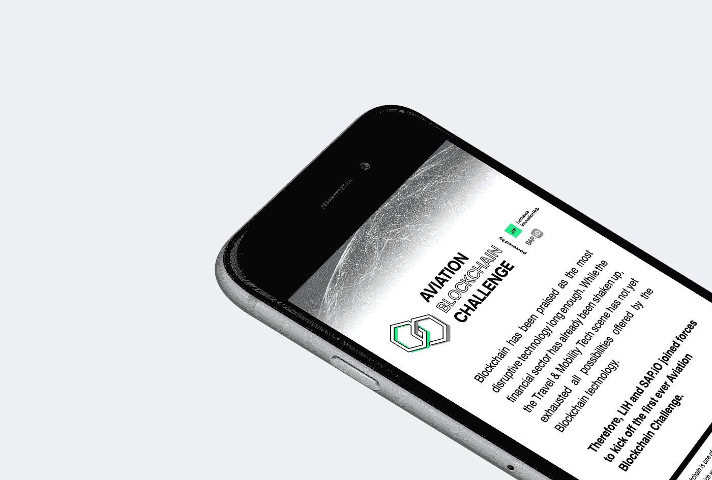

# 航空领域的区块链:准备好起飞了吗？

> 原文：<https://medium.com/hackernoon/blockchain-in-aviation-ready-for-take-off-e0fc6a06615a>

这篇客座文章最初发表在@lufthansainnov 上

## 区块链似乎正处于其炒作周期的顶峰。区块链对航空业的现状和潜在影响是什么？我们采访了柏林汉莎航空创新中心的高级风险开发经理兼区块链专家赖因哈德·兰格:

**1。区块链技术因具有颠覆几乎所有行业的潜力而受到称赞。会对航空业产生什么样的影响？**

[区块链](https://hackernoon.com/tagged/blockchain)当然不是万能良药。在我们这个行业，这可能会对旅行体验产生直接影响。一个令人兴奋的例子是安全的身份管理:区块链可以与生物识别一起实现无缝、自动化的过程。旅行者将不再需要为移民目的输入通行证数据。与此同时，他们将完全控制谁接收他们的数据。例如，其他潜在的用例包括对航空公司维护文档的安全存储、航空公司间结算解决方案、全自动旅行保险或忠诚度硬币的链上引用。

**2。《经济学人》将区块链描述为“建立信任的机器”** **纵观航空业，哪里可以跳过中间商？**

我们与 Winding Tree 的发展伙伴关系是一个分散运营和管理的航空公司和酒店 B2B 市场，这只是在旅游和移动技术生态系统中跳过强大中间商的一个例子。简而言之，在未来，航空公司、酒店和其他旅游服务提供商可以在 Winding Tree 的平台上提供服务，而对相应内容感兴趣的公司将只连接到区块链的分布式 B2B 市场，以获得针对其客户需求定制的特定服务。

一旦投入运营，Winding Tree 将加强汉莎航空集团的核心直接分销战略，从而在保持库存完整性的同时降低分销成本。因此，客户可以从更具竞争力的价格和合作伙伴提供的新机会中受益。

**3。你相信像汉莎航空这样从 1955 年开始运营的航空公司可以脱离传统的商业惯例，积极开发新技术，还是会有相对较少航空经验的新数字玩家来设定标准？**

汉莎集团对新技术有很强的亲和力。我们将只在能够充分发挥区块链技术潜力的领域应用最新的[技术](https://hackernoon.com/tagged/technology)。此外，作为汉莎集团首席数字官 Christian Langer 博士领导的新数字战略的一部分，区块链用例已经拥有了一个全集团范围的测试和实施平台。

**4。从长远来看，旅行者如何从基于区块链的解决方案中受益？**

区块链通过简单地省去中间人来培养透明度和信任。最终，这将带来价格优势和更丰富的产品，尤其是第三方解决方案。

例如，基于区块链的旅游保险和赔偿解决方案将在服务中断时，更容易为客户处理索赔、赔偿和退款。对于航空公司来说，这种解决方案还增加了透明度，简化了非常复杂的供应链中的相关流程，并显著降低了处理成本。

**5。就连区块链的支持者也承认，这项技术的普及还需要一段时间。毕竟，互联网的基础技术是在 20 世纪 60 年代创造的，但互联网用了几十年才变得无处不在。我们还要多久才能在航空业看到基于区块链的解决方案？**

我们生活在变化速度呈指数增长的时代。因此，我希望区块链的解决方案在不久的将来会对我们的日常生活产生显著的影响——即使是在信任通常不是最关键问题的西方世界。

然而，采用将需要一些时间，因为航空业有一些问题需要首先解决，如对透明度的承诺以及区块链技术本身，如可扩展性。封闭的生态系统用例将是第一批，体验像区块链这样的分布式安全账本技术的好处。

**6。如前所述，媒体对区块链的报道就好像它是几乎所有问题的技术解决方案——甚至是对那些尚未被视为问题的领域。如果我们仔细看看，现实是什么样子的？**

一般来说，有各种各样的分布式分类帐技术，这些技术通常包含相当大的技术和业务挑战。尽管大肆宣传，但当中央托管人已经达到必要的信任级别时，分散化有时是没有帮助的。

委内瑞拉由石油支持的加密货币 Petro 是一个真正的集中化例子，它挑战了分散托管人、没有单一负责方的普遍观念。该国发行加密货币，以规避其他国家施加的制裁，并需要防范其法定货币的恶性通货膨胀。加密货币的核心论点是为什么发明了区块链，反之亦然，其核心是作为市场和价值控制实体的央行。

**7。为了缩小景观，你能说出三个区块链的创业公司/公司吗？为什么？**

我绝对看上克洛维亚了。他们正在构建一个开发工具，以简化区块链的实现和创建过程。现在这是一个巨大的挑战，因为由于区块链解决方案的直接货币互联，软件错误或后门可能会导致立即的金钱损失。以 [MtGox 交易所](https://cointelegraph.com/news/the-mess-that-was-mt-gox-four-years-on)为例。

另一个令人兴奋的项目是 0x，这是众多去中心化加密货币交易所中的一个。目前，为了将传统货币(法定货币)兑换成加密货币或者将加密货币兑换成加密货币，你需要一个集中的交易所(就像外币交易所一样)。作为合法公司，它们由一群策略不透明的人控制，你需要相信他们会负责任地管理你的资金。例如，Mt. Gox 在一名员工的帮助下遭到黑客攻击，当时丢失了 85 万枚比特币，价值 4.5 亿美元。尽管一些比特币可以被追回，但有必要分散这些单点故障。

Filecoin 也很有前途。他们正在研究分散的文件存储，任何连接到互联网的人都可以以一种安全的方式向第三方提供他们的备用数字存储。只有当你在既定所有者需要的时候提供数据(小块加密数据，而不是单个文件)时，你才需要支付使用费。

> **我们很高兴地宣布，我们与** [**SAP.iO**](https://medium.com/u/e2c1b8020a75?source=post_page-----e0fc6a06615a--------------------------------) **联手，在全球范围内启动首届** [**航空区块链挑战赛**](http://aviation-blockchain-challenge.com/index.html) **，为区块链技术应用的各个领域带来开创性的想法，并在航空行业发起实际的试点项目。**
> 
> **申请** [**这里**](http://aviation-blockchain-challenge.com/index.html) **，如果你准备好迎接挑战！**