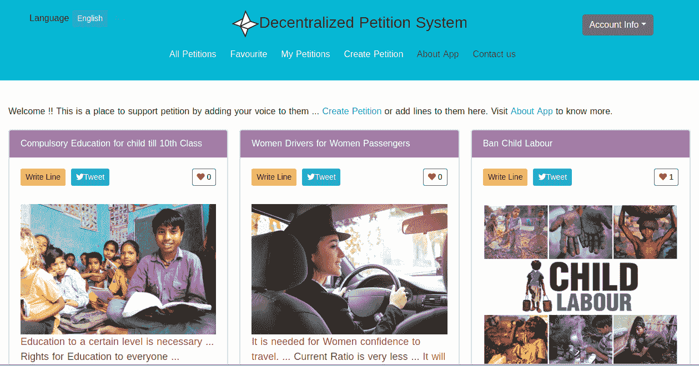
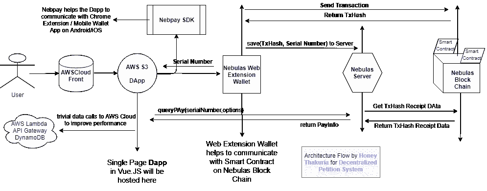

# 众包一个分散的请愿系统

> 原文：<https://medium.com/hackernoon/blockchain-in-crowdsourcing-3f164a6ecb78>

从群众中寻找解决问题的思路和信息是非常有效的。可以利用它的一个有趣的领域是在线请愿系统。

简而言之，请愿书是一份由许多人签名的正式声明，呼吁当局关注某一特定的事业。

> **现有中央信访系统的问题**:

1.  他们隐藏签名，不允许支持运动的人的信息，愚弄观众。
2.  被指控出售个人数据赚钱。
3.  在政治压力/金钱下，容易操纵与特定竞选活动相关的大众数据。

如果以上任何一件事情发生了，那么为突出/解决人们的问题而做的事情，实际上可能会成为对他们的诅咒。

> **解决**:

由于这是一件大事，请愿书签名者的数据非常重要，它需要得到保护，需要分散，因此需要放在区块链上。这些数据将有助于我们获得正确的数字和人们的情绪，然后当局可以利用这些数据以道德的方式解决这些问题。

**分散信访系统**就是这样一个[开源项目](https://github.com/honey93/accenture_hack_web_smartcontract)旨在解决这样的问题。它建立在[区块链](https://nebulas.io/)星云之上，这是一个确保数据完整性和安全性的公共区块链。

在接下来的文章中，我将解释该平台的技术架构以及迄今为止取得的进展:

> **架构概述**:

当用户点击 DApp 的 url 时，该 URL 由 AWS S3(SPA 托管)通过 Cloud Front 提供。浏览器中加载的 DApp 通过 Nebulas Web Extension Wallet 与 Nebulas 区块链上的智能合约通信，并为其使用 NebPay Sdk。不太重要的数据可以使用 AWS Lambda & API Gateway 从 AWS Cloud 获得。

跨越 Nebulas 所有节点的写入过程需要一些时间，因此 Nebulas 服务器用于保存事务细节，这些细节稍后用于检索关于事务状态的信息。

在这篇[帖子](https://medium.freecodecamp.org/architecting-dapp-using-nuxt-js-nebulas-fc00712ae341)中可以找到代码级别的深入概述。这里解释的体系结构与这里讨论的几乎相似。

> **成绩**:

**最佳建筑奖**:上述建筑入选 2018 年 8 月 25 日在印度班加罗尔举办的[埃森哲区块链黑客马拉松](https://www.hackerearth.com/sprints/accenture-blockchain-hackathon/)最佳建筑奖。

如前所述，该项目是开源的，代码可以在[这里](https://github.com/honey93/accenture_hack_web_smartcontract)找到。如果你有任何疑问，你可以通过 thakuria.honey@gmail.com 联系我，或者通过 Linkedin 联系我

期待开源社区的贡献，把这个项目从工作原型到现场阶段。