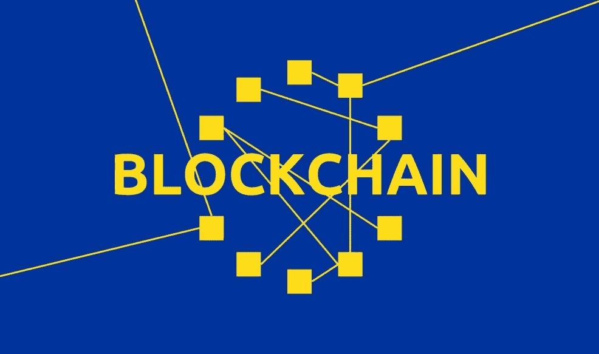

# 区块链在欧洲

> 原文：<https://medium.com/hackernoon/blockchain-in-europe-b914cf1a9ea1>

## 欧盟委员会与 ConsenSys 合作，启动了欧盟区块链观察站和论坛。

[欧盟委员会](https://medium.com/u/960f4c0ad987?source=post_page-----b914cf1a9ea1--------------------------------)已经启动了欧盟区块链观察站&论坛。该倡议旨在“突出区块链技术的关键发展，促进欧洲行动者，并加强欧洲与参与区块链活动的多个利益相关者的接触。”

“像区块链这样的技术可以帮助降低成本，同时增加信任，可追溯性和安全性，”欧盟委员会负责数字单一市场的副主席安德路斯·安西普在一份声明中说。

Ansip 强调了区块链“通过防范攻击和消除对任何中间人的需求，使在线社会和经济交易更加安全的巨大潜力”

欧盟委员会负责数字经济和社会组合的欧盟专员玛利亚·加布里埃尔将区块链技术定义为“游戏规则改变者”

她补充说，进入区块链空间对欧盟来说是关键，以便将欧洲置于“发展的最前沿”

这是在区块链周围实施更好的政策和活动的又一步骤，同时给予欧洲联盟重要的发言权。2016 年 11 月，欧盟委员会成立了一个关于金融科技的[特别工作组](https://ec.europa.eu/digital-single-market/en/blog/european-commission-sets-internal-task-force-financial-technology)，以制定一项关于金融科技的全面战略。此外，该委员会目前正在制定一项金融科技行动计划，将于春季提交。

根据彭博的说法，欧盟的推动“是试图确保整个集团的研究项目并更好地协调他们的努力的几个努力之一”。

彭博报道称，欧洲中央银行(ECB)也一直在寻找利用新技术的方法，而欧洲中央银行行长 Mario Draghi 在 5 月份表示，欧洲中央银行正在密切关注区块链的创新，以确保其在欧元区的采用不会破坏支付系统。

新成立的欧盟区块链观察站和论坛将与 [ConsenSys](https://medium.com/u/6c7078bf7b01?source=post_page-----b914cf1a9ea1--------------------------------) 合作，帮助在欧洲开展推广活动。

ConsenSys 刚刚加入了[政府区块链协会](https://governmentblockchain.org/organizations/listing/consensys)，致力于“教育和支持全球公共部门”，正如 Alexander Kostura 在 LinkedIn 帖子中解释的那样——将与欧盟委员会密切合作，运营该观察站。

欧盟的声明解释说，该观察站将“在帮助欧洲抓住区块链提供的新机遇、积累专业知识和展示该领域的领导力方面发挥积极作用。”

它补充说:“它(天文台)将收集信息，监测和分析趋势，应对挑战，探索区块链的社会经济潜力。"

新实体还将促进区块链空间的更多合作，与所有感兴趣的利益攸关方——技术专家、创新者、公民、行业利益攸关方、公共当局、监管者和监督者——建立新的伙伴关系。