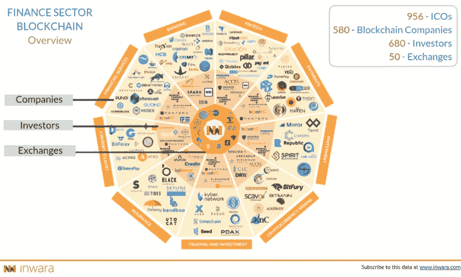
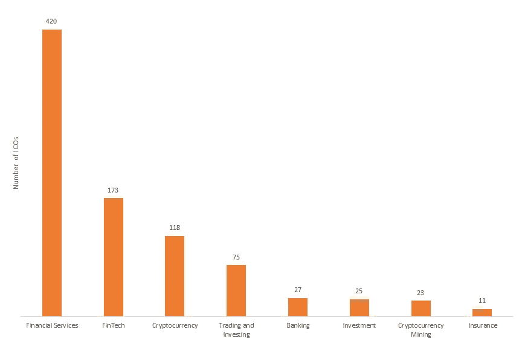
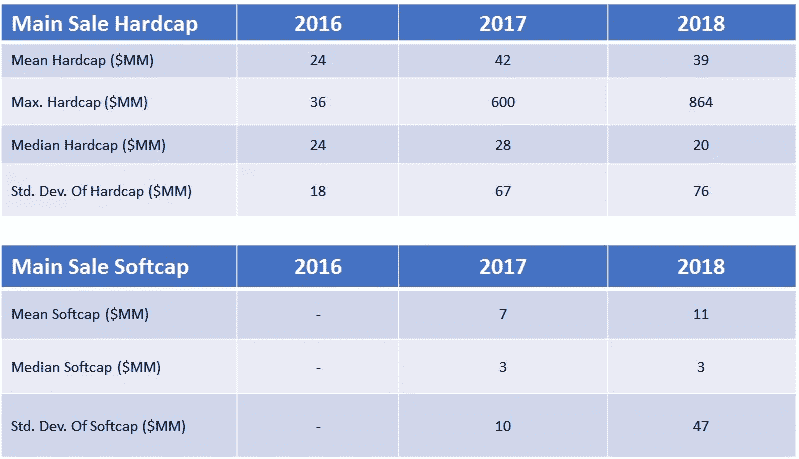
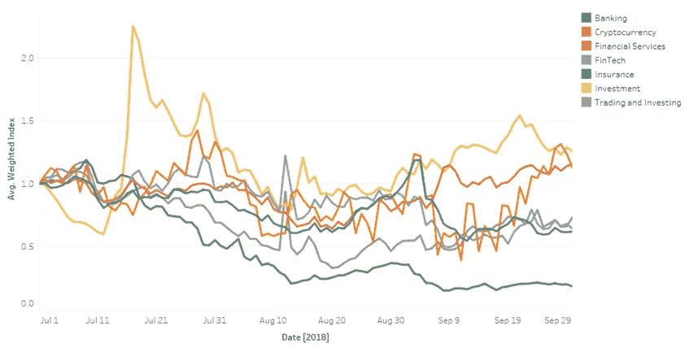
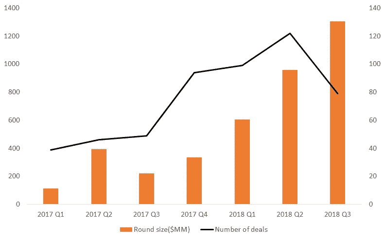
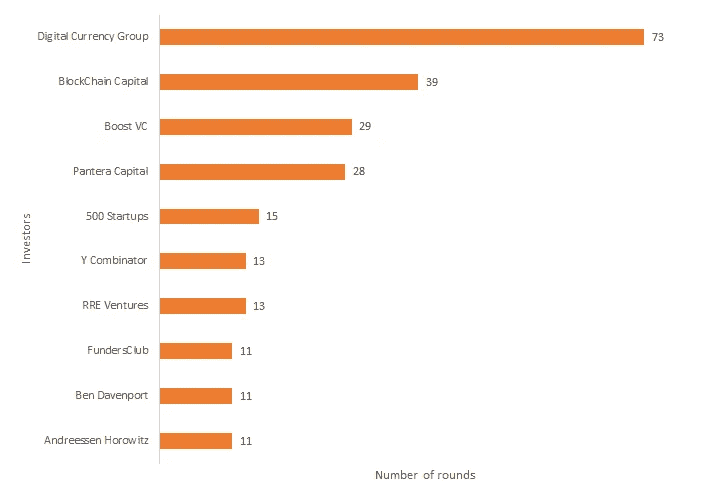
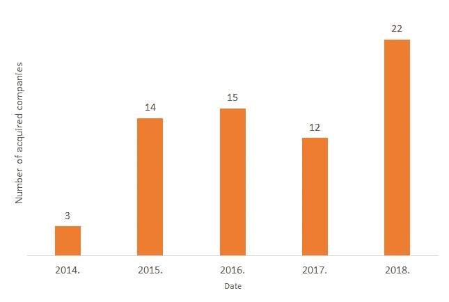
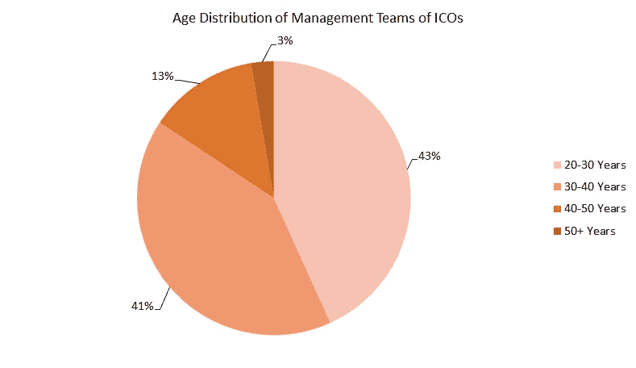

# 金融中的区块链:ICO 市场研究、私人融资活动和 MnA

> 原文：<https://medium.com/hackernoon/blockchain-in-finance-ico-market-research-private-funding-activity-and-mna-98ebcf6d41a1>

# 一个准备反弹的板块…

区块链已经成为金融领域的挑战者。许多团队，无论是初创企业还是企业赞助的团队，都在试图制定基本规则，定义这个领域的发展历程。尽管存在技术挑战和监管障碍，但团队正在更快地创新，以塑造生态系统中的新参与规则。在现金转移、资本和风险中介方面，初步成果是明显的。

InWara 研究了拥有或没有 ICO 的区块链技术公司的趋势。该研究基于对参与机构投资者代币的 ICO、私募轮融资的资本以及基于通过 ICO 融资的公司发布的信息的数据的分析，提供了见解。

这项研究涵盖

*   金融行业 ICO 前景
*   金融 ICOs-市场趋势分析
*   私人筹资活动
*   兼并和收购
*   杂项统计

# 金融行业 ICO 前景

迄今为止，金融部门拥有超过 957 个 ico，其中并非所有 ico 都成功筹集了资本以达到各自的硬上限。在该行业中，金融服务业的成功 ico 数量最多，达到 137 个。

Source: InWara’s Finance sector report

**金融服务**占金融行业 ico 总量的 40%以上，而金融行业 ico 又占整体 ico 的 40%以上。

## 资本筹集需要一个喘息的机会，门槛平均硬资本略有下降

Source: InWara’s Finance sector report

## 金融领域的符号组学解码

金融部门在 2017 年筹集了 24 亿美元，在 2018 年年初至今筹集了 19 亿美元。2017 年和 2018 年年初至今，平均筹集资金保持相对稳定，为 4000 万美元。

有趣的是，2018 年与 2017 年相比，硬资本和软资本之间的差异有所减少，因为硬资本减少，软资本增加，这表明市场日趋成熟，对资本要求和部署有了更好的理解。拥有成功 ico 的关键人物包括:

## **龙币(DRG)**

Dragon 是一家总部位于区块链的公司，以更安全、更透明、更具成本效益的方式为娱乐行业提供支付解决方案。

## **普马佩(PMA)**

PumaPay 是一个免费、开源、基于区块链的支付协议，具有独特的拉式支付架构。

## **液体(QASH)**

Quoine 的 Liquid platform 是一个单一的全球采购交易平台(world book ),拥有一套相关的服务(大宗经纪业务)。结合起来，这些产生了世界上最高水平的流动性——允许任何个人获得新的加密经济提供的机会和财富。

## 投资回报:危险水域中的保险 ico

Source: InWara’s Finance sector report

尽管大盘波动较大，但基于投资、加密货币和金融服务的 ico 仍成功实现了 2018 年第三季度的收益。不幸的是，保险 ico 出现了二次探底的下行趋势。

# 金融 ICOs-市场趋势分析

本节涵盖影响市场的新闻和事件:

*   富达投资案例
*   洲际交易所巴克特的秘密制度化
*   谷歌对加密货币的态度

# 私人筹资活动

私人投资者一直支持金融行业，2018 年投资轮次增加了 65%。2018 年第三季度，私人投资轮融资总额已超过 10 亿美元。总体而言，与 2017 年相比，私人资金在 2018 年年初大幅增长了 150%以上。

Source: InWara’s Finance sector report

在私人投资者中，风险资本参与预售和非公开销售的情况越来越多。

金融领域十大活跃风险资本投资者

Source: InWara’s Finance sector report

专注于区块链的基金在 2018 年进行了大量投资，这些投资由[数字货币集团](https://dcg.co/) & [区块链资本](https://blockchain.capital/)进行。

# 并购:2018 年金融行业并购增长 61 %

Source: InWara’s Finance sector report

本节将分析像 Earn.com[收购比特币基地](https://www.coinbase.com/)这样的重磅交易。

更多详情请见部门报告！

# 杂项统计

本节涵盖了活动 ico、故障 ico 和结束 ico 的数量。该部分还提供了对成功率和失败率的详细分析。还对创始人的年龄、背景、经历等进行了分析。

Source: [InWara’s Finance sector report](https://www.inwara.com/report?utm_source=finhackernoon&utm_medium=finhackernoon&utm_campaign=finhackernoon)

在所有行业中，超过 80%的 ico 由年龄在 35-40 岁之间的管理团队领导，但金融行业似乎由相对年轻的管理层领导。

# 总结一下

尽管 2018 年放缓，但未来似乎很乐观。真正需要做的只是从图表上退一步，接受一次关于潜在基本面的教育，以认识到数字资产被无缘无故地击败了。然而，反弹即将到来。

# 方法学

InWara 研究团队确保研究的质量和准确性，并由质量控制人员和高技能分析师进行详尽的分析。研究团队努力只发布尽可能准确的信息，因此所有信息都是在事实基础上仔细考虑的，数据是通过分析 3000 多份 ICO 白皮书、近 2200 篇官方公司博客文章、500 篇官方新闻稿以及对新闻和社交媒体来源的持续网络监控收集的。

“我们的客户使用我们的数据分析引擎来寻找数据和独特的见解，以帮助他们在市场上买卖加密产品。我们在本报告中使用了数据分析工具来分析后面列出的每个 ICO 的投资回报率。按行业或国家过滤数据需要 10 秒钟。

“InWara 帮助您发现为未来 ICO 投资做出无风险选择所需的信息。订阅 InWara 的市场情报工具，帮助您做出投资决策。”

免责声明:这不是财务建议。InWara 不提升/降级任何公司/ICO。本信息或其他媒体中的观点、陈述、估计和预测仅属于作者个人。它们不一定反映 Inwara 或其任何附属公司(“Inwara”)的意见。Inwara 没有义务更新、修改或修正此消息或其他媒体，或以其他方式通知其接收者，如果此处陈述的任何事项或此处陈述的任何意见、预测、预测或估计发生变化或随后变得不准确。本邮件或其他媒体中提供的任何内容、信息和材料均按“原样”提供。Inwara 对其准确性、完整性或及时性，或收件人获得的结果不做任何明示或暗示的保证，并且不对任何收件人在此的任何不准确、错误或遗漏承担任何责任。在不限制上述规定的情况下，Inwara 对任何消息或媒体的接收方不承担任何责任，无论是在合同、侵权行为(包括疏忽)、担保、法规或其他方面，对于此类接收方因其或任何第三方决定的任何行动、意见、建议、预测、判决或任何其他结论或任何行动过程而遭受的任何损失或损害，无论是否基于此处包含的内容、信息或材料。**