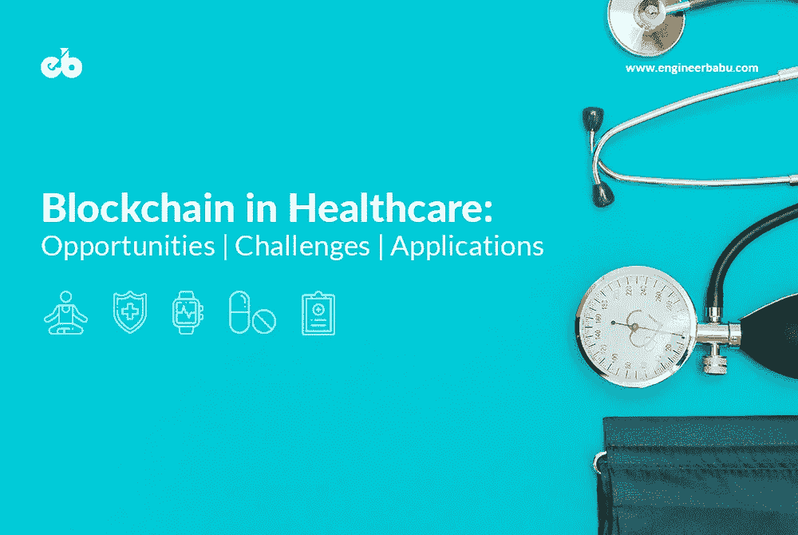
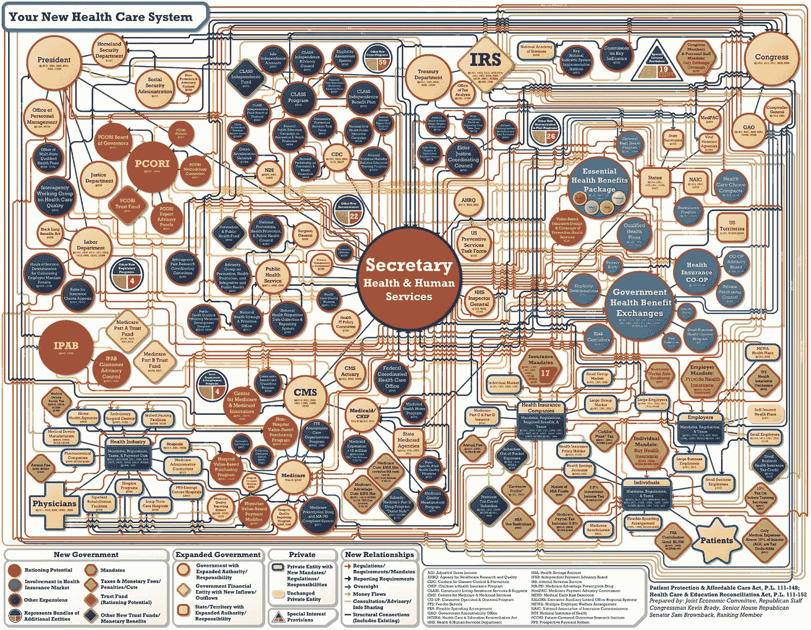
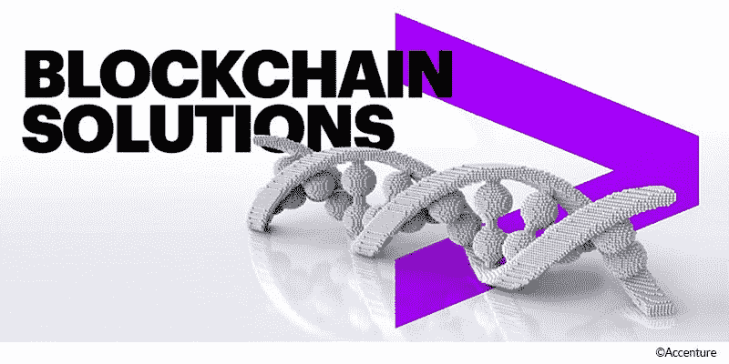
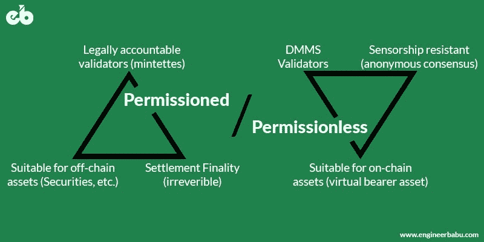
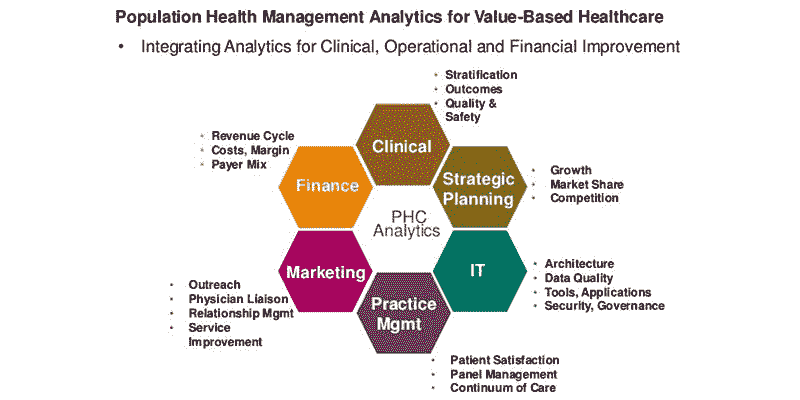
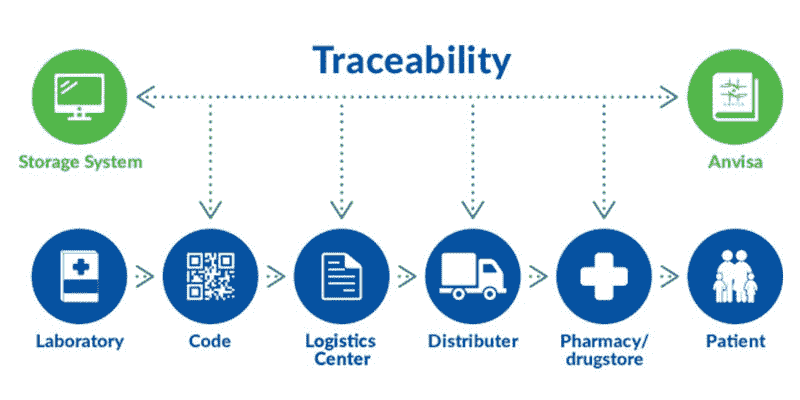
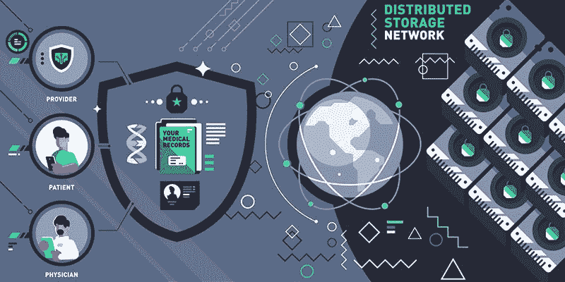

# 医疗保健中的区块链:机遇、挑战和应用

> 原文：<https://medium.com/hackernoon/blockchain-in-healthcare-opportunities-challenges-and-applications-d6b286da6e1f>

## 改造现有的医疗保健技术基础设施。

[Image Source](https://www.engineerbabu.com/)

随着时间和技术的进步，成长中的企业需要在其业务的所有方面带来革命性的变化。谈到医疗保健领域，增长的紧迫性会上升到更高的水平。当今需要有最新技术支持的优质医疗保健服务。此外，医疗保健系统的格局正在向更加以患者为中心的方法转变，这种方法侧重于两个主要因素，即在任何时候都提供负担得起的治疗和适当的医疗保健设施。

# **当前的医疗保健系统**

专注于高质量的医疗保健服务意味着确保患者的健康管理始终处于较高水平。然而，联邦法规和条例使得这个过程变得更加冗长乏味。由于这个原因，在许多情况下，保持这些过程完好无损并仍然提供有效的患者护理是不可行的。提供优质医疗服务的主要问题是提供者和支付者之间的差距。供应链中对中间商的依赖使情况变得更糟。

在医疗保健行业，关键的患者数据和信息仍然分散在不同的部门和系统中。因此，关键数据无法在需要时方便地获取。现有的医疗保健生态系统不能被认为是完整的，因为系统中的多个参与者没有一个用于平稳流程管理的系统。此外，它还被认为不足以处理信息交换，需要进行某些重大修改。

Example showing the complexity in current Healthcare System — [Image Source](https://visual.ly/community/infographic/politics/your-new-health-care-system)

对可用数据的滥用阻碍了医疗保健组织为了更好的健康状况而提供适当的患者护理和高质量的服务。尽管在经济方面相当有效，这些组织还是不能满足病人的需求。下面是一些来自参考资料的统计数据，强调了这一事实:

—美国近一半的临床试验没有报道

—多达 40%的医疗保健提供商数据记录中充满了错误或误导性信息

—据估计，目前组织中医疗保健数据泄露的成本约为每条记录 380 美元。预计这一数额将随着时间的推移而增加。

如今，许多医疗机构仍然依赖过时的系统来保存患者记录。这些系统具有保存患者数据的本地记录的功能。这使得医生难以诊断，这对于医生来说是耗时的，对于患者来说也是乏味的。因此，维护面向患者的业务的成本大大增加。

当前医疗保健领域普遍存在的问题不受限制。随着时间的推移，它们继续以高强度增长。对技术先进系统的需求是不可否认的。以导致约 2 亿美元损失的假药问题为例。如果在供应链中安装一个具有精确跟踪功能的系统，这种情况可能会大大减少。

另一个导致医疗保健行业高成本的耗时且繁琐的过程是健康信息交换。由于患者对自己的数据没有任何控制权，身份盗窃、金融数据犯罪和垃圾邮件的机会每天都在增加。

尽管如今每个医疗机构都有电脑和手机等设备，但我们仍然无法无缝地收集、分析、保护和交换数据。因此，今天的医疗保健系统不仅需要一个先进的系统，还需要一个平稳、透明、经济高效且易于操作的系统。

# **区块链解决方案**

根据 Gartner 的炒作周期，区块链技术已经超越了“创新触发器”，并处于“膨胀预期的峰值”。它有可能扰乱不同的行业，如金融、银行、供应链以及医疗保健。但是在深入探讨区块链如何影响医疗保健的细节之前，让我们先了解一下它是什么。

[Image Source](https://www.accenture.com/au-en/service-blockchain-financial-services)

区块链是最近席卷全球的最具颠覆性的技术之一。区块链不过是一个分布式分类账，记录整个网络中发生的交易和活动。区块链的最独特之处在于，一旦一条信息被添加到分布式分类账中，就没有人能对其进行更改。存储在区块链上的信息完全是绝对安全的。为了让任何人在一个块中进行更改，必须对其后的所有块进行更改。

区块链的运作依赖于三个长期存在的主要原则。这些原则的综合运用使区块链能够提供安全可靠的数字关系。

*   **私钥加密** —在私钥加密中，私钥作为一个变量与算法一起使用，对代码进行加密和解密。即使算法不保密，密钥也是保密的。在区块链中，创建了安全数字身份的参考，然而，交易是在开放网络上进行的。
*   **分布式分类账** —分布式分类账也称为共享分类账，是指共享记录的共识。在 DLT，分类账是实时更新的，没有中央机关负责维护分类账。相反，网络参与者保持分类账更新。分类账中的任何变化都会在几秒钟内反映出来。
*   **认证** —认证是证明真实性的过程。在区块链中，所有交易在加入链之前都要经过认证。这个过程通过验证和核实所有交易的算法进行。一旦信息被加密、数字签名和存储，真实性就被密封了。

医疗保健公司、技术创新者和整个医疗保健行业的成员都在寻找各种方法，以了解在当前时代什么是可能的，以及区块链可以做些什么来使医疗保健在未来变得更好、更实惠。

# **区块链解决医疗保健问题的灵丹妙药**

区块链有能力在医疗保健生态系统中带来巨大突破，因为它可以轻松地为患者的医疗保健管理带来具体变化。借助这项技术，权力将回到人们手中。这意味着个人将负责处理自己的记录，从而全面控制自己的数据。

该技术能够成功提高患者护理质量，同时将资金维持在合理的水平。通过区块链，可以消除多级身份认证中出现的所有挑战和障碍。随着采用率的不断提高，区块链已经进入了医疗保健领域。即使在开始阶段，这项技术也被医疗保健生态系统中的人们积极接受。

根据 IBM 进行的一项研究，大约 16%的医疗保健高管决定在今年的工作中实施区块链解决方案，而大约 56%的高管预计到 2020 年采用区块链。

对区块链来说，在未来一段时间内颠覆医疗行业的全面愿景是解决困扰当前体系的问题。想象一下，在一个医疗保健系统中，医生、患者和药剂师可以在任何给定时间轻松访问所有信息。区块链允许创建和共享单一的公共健康信息数据库。

该系统将被该过程中涉及的所有实体访问，无论它们使用哪种电子医疗系统。这提供了更高的安全性和透明度，同时允许医生将更多的时间花在患者护理和治疗上。此外，它还将有助于更好地共享研究统计数据，从而促进任何罕见疾病的临床试验和治疗。

在医疗保健系统中，医疗保健解决方案提供商之间顺畅的数据共享可以带来准确的诊断、有效的治疗和经济高效的生态系统。患者数据的日复一日的增长要求合理利用资源，以便最有效地利用通过数据发现的洞察力。

Comparing Permissioned and Permissionless Blockchains — [Image Source](https://www.engineerbabu.com/)

面向医疗保健的区块链允许医疗保健生态系统的多个实体保持同步，并在一个常见的分布式账本上共享数据。有了这样的系统，参与者可以共享并跟踪他们的数据和系统中发生的其他活动，而不必寻找额外的完整性和安全性选项。根据网络参与者的要求和访问权限，可以使用两种类型的区块链:

## **获得许可的区块链**

顾名思义，这些类型的区块链只允许在许可的基础上在网络参与者之间共享实时数据。许可区块链是一个封闭的网络，系统中的所有参与者都可以访问该网络。它在组织和企业内部构建和使用，以便安全地交换信息和进行交易。一旦交易通过共识处理，它将被视为一个永久记录，并作为一个新的块添加到现有的区块链。

## **未经许可的区块链**

无许可区块链允许任何人创建自己的地址，并开始与网络互动。一个最流行的无许可系统的例子是互联网，它允许任何人创建自己的网站。类似地，在无许可区块链中，网络上的任何人都可以通过在网络上创建自己的地址来与同一网络上的其他参与者进行交互。

在这两种方法中，私有或许可的区块链可以有效地用于医疗保健，以便在医疗保健生态系统中做出正确的决策。区块链技术在医疗保健领域的应用有很大潜力，因为它正在被进一步探索。区块链的分布式技术具有不变性、不可信任性和分散性等特性，为医疗保健行业提供了检测欺诈、降低运营成本、简化流程、消除重复工作以及在医疗保健生态系统中应用透明度的机会。

frost & Sullivan research for block chain Technology in Global health care，2017–2025 指出，“区块链技术可能不是应对医疗保健行业挑战的灵丹妙药，但它有可能通过优化当前的工作流程和解除一些高成本看门人的中介来节省数十亿美元。”

# **区块链在医疗保健领域的应用**

在探讨了区块链技术在医疗保健领域的重要性以及它可能带来的变化后，这里有几个利用该技术潜力的使用案例，它们可以使医疗保健行业更加方便、安全和可靠。

## 人口健康数据

[Image Source](https://image.slidesharecdn.com/hcad6635healthcareanalyticssession12-161029202410/95/population-health-management-predictive-analytics-big-data-and-text-analytics-5-638.jpg?cb=1477773055)

人群健康数据是指特定人群的医疗信息。例如，它可能是 25-40 岁患甲状腺疾病的女性的健康风险信息。为了了解不同人群的风险，数据通常以匿名形式提供，在这些情况下不会透露姓名。

说到人口健康管理，迄今为止面临的最大挑战是数据安全性、可共享性和互操作性。如果患者信息被隔离并存储在不允许信息顺畅交换的多个系统上，那么跨各种患者集的群体健康数据集将变得稀缺。区块链为这一特定挑战提供了可靠的解决方案。如果应用得当，区块链将提高安全性、数据共享、互操作性、数据完整性以及实时更新和访问。

使用区块链技术可以让人们参与人口健康研究，并以代币的形式将他们的数据货币化。此外，更好的数据和共享人口健康数据可以改善不同人群的医疗服务。随着更多的数据集，人工智能和人工智能等新技术的使用将成为可能，这将导致发现人口健康的广泛风险。

## 安全医疗保健设置

当前的医疗保健系统和组织通过一个单一的中央数据库运行。该数据库由组织中的一个实体管理。使用这种方法，故障点也变成了一个点。在这种情况下，如果黑客或反社会分子攻击系统，他/她可以访问整个数据库，并将患者和组织置于危险之中。

可以利用区块链来防止组织的内部基础设施。一个拥有多个独立参与者的大型组织，这些参与者对内嵌加密的区块链分类帐拥有不同级别的访问权限，这将使组织免受外部威胁和攻击。如果区块链网络在医疗保健组织中得到正确实施，它将防止此类勒索攻击以及其他问题，如数据损坏或硬件故障。

## 通过加密货币进行患者支付

区块链在医疗保健领域的另一个吸引人的好处是使用加密货币代替现金或法定货币进行支付。现金医疗很普遍，但是医疗保健费用并没有这样定义。即使在今天，仍有 5–10%的案例来自金钱欺诈和未履行服务的账单。仅在美国，2016 年就发现了 3000 万美元的欺诈。

通过实施区块链系统和应用程序，提供正确解决方案和消除欺诈的可能性增加了。账单处理自动化将从供应链中移除第三方，并降低总体管理成本。此外，当大型机构采用加密货币支付处理时，将会发生重大转变。支付给医疗保险的每一分钱都将被跟踪，并确保在此过程中没有欺诈行为。

## 药品可追溯性

An example explaining Drug Traceability — [Image Source](https://www.libbs.com.br/wp-content/uploads/2016/01/rastreabilidade-en.png)

供应链中的假药和假药一起构成了每年数十亿美元的重大损失。根据一个健康研究资助组织(HRFO)的报告，发展中国家几乎有 10%到 30%的药物不是原创的。而由于这些问题，仅美国医疗保健行业每年就承受大约 2000 亿美元的损失。正如这些统计数据显示的那样，假药导致数百人因吃错药而死亡。假药的传播是制药领域的一个严重问题。

可用于药品追溯的区块链技术的主要特点是其安全性。添加到块中的每个新事务都是不可变的，并且带有时间戳。这将使跟踪产品变得容易，并确保区块内的信息不会被更改。为了确保医疗药物的可追溯性和真实性，在区块链注册任何特定药物的制药公司都必须值得信赖。因此，在这种情况下，使用控制权在中央机构手中的私人区块链是有意义的。当这些公司被允许使用特定药物区块链时，他们将有证据证明他们生产的药物是真实的。

在这种私人药品区块链中，制药公司有权在供应链的参与者中选择谁将充当矿工，无论是制造商、分销商还是零售商。根据供应链上的位置授权，每个人都可以拥有不同的权限或可访问性选项。例如，虽然实验室可以注册药品，但批发商有权核实交易。此外，每个包含药物信息的块都有一个哈希，该哈希将链接到另一个块。当药物沿着供应链在不同实体之间流动时，它可以很容易地被跟踪。

此外，区块链系统中数据透明的特征有助于找到完整的来源路径，从而有助于根除假药的流通。

## 临床试验和数据安全

进行临床试验是为了确保和分析为治疗特定疾病而开发和提出的任何特定药物的有效性。基于一个假设，提出的药物可以被测试，基于试验的成功，它们可以在更大的规模上实施。因此，为了进行临床试验，需要大量的数据集。研究人员专注于这些数据集，并在不同情况下进行定期测试，以生成报告、统计数据和有效率。基于这些报告，对数据进行分析，并做出进一步的决策。

然而，在许多情况下，今天大多数制药公司对记录结果表现出兴趣，这些结果可以确保他们公司的某些利益。在这种情况下，研究人员经常隐藏或修改他们收集的数据和信息，以改变结果。

为了使临床试验更加公平和透明，研究人员可以利用区块链技术，这有助于记录安全、公正和透明的临床试验。

另一方面，对于那些相信进行真实临床试验的公司来说，一切都需要安全和透明。为此，流程中创建和使用的文件(如知情同意书、研究计划、法规和研究方案)需要加盖时间戳。这意味着文件应该有一个证明和他们的创建时间的细节。对于预先计划的终点，特别重要的是保留这些信息的时间戳，以创建一个证明，表明该协议甚至在试验开始之前就已经存在。

区块链技术将增加临床试验和结果的可信度。这些文档可以作为智能合同存储在区块链上，充当数字指纹。该文档目录将减少审计成本、文件审查、丢失文档问题和欺诈。区块链还将保持制药公司的供应链管理以及药品跟踪的问责制。

## 患者数据管理

Distributed Storage Network — Image Source

HIPPA、健康保险可移植性和责任法案对患者数据的隐私有严格的规定。它要求保护 PHI(患者健康信息)不被泄露和修改。尽管有安全规定，但患者数据不能被限制。医疗保健是一个包含多个实体的复杂系统，需要患者在整个生态系统中共享他们的数据和医疗记录。

例如，患者在接受治疗或仅仅是购买药物时，必须与医生和提供者分享他们的健康相关信息。此外，患者数量的增加导致医疗服务提供商需要管理越来越多的数据。这种不断增长的数据给医院和诊所管理患者信息带来了困难。

将区块链引入这个以数据为中心的系统解决了许多问题。用于患者数据管理的区块链系统将为单个患者健康信息块创建散列，而集体系统将在理论基础上构成患者 ID。区块链系统甚至允许病人向第三方透露他们的必要数据，同时对他们的身份保密。与第三方共享数据的时间限制和访问权限也可以由患者控制。

# **结论**

区块链医疗保健的潜力在很大程度上取决于医疗保健生态系统对新技术的接受程度，以便创建技术基础设施。尽管对于区块链与当前医疗保健系统的整合及其文化采纳存在某些担忧和猜测，但该技术在医疗保健领域仍然很受欢迎。

在过去的一年中，它席卷了医疗保健行业，许多解决方案正在开发中。有这么多潜在的使用案例和可能性，区块链肯定会永远颠覆医疗保健领域。

— — — — — — — — — — — — — — — — — — — — — — — — — —

## 看我的其他相关文章

**1。** [**区块链技术讲解:简介、意义、应用**](https://www.engineerbabu.com/blog/what-is-blockchain/) **，也上**[**hacker noon**](https://hackernoon.com/blockchain-technology-explained-introduction-meaning-and-applications-edbd6759a2b2)
**2。** [**区块链是如何彻底改变银行和金融市场的**](https://www.engineerbabu.com/blog/blockchain-revolutionizing-banking-financial-markets/) **，也上**[**hacker noon**](https://hackernoon.com/how-is-blockchain-revolutionizing-banking-and-financial-markets-9241df07c18b) **3。** [**区块链是如何颠覆供应链行业的？**](https://www.engineerbabu.com/blog/how-is-blockchain-disrupting-the-supply-chain-industry/) **，也上** ****4。** [**关于智能合约你需要知道的一切:初学者指南**](https://www.engineerbabu.com/blog/smart-contracts/) **，也上**[**hacker noon**](https://hackernoon.com/everything-you-need-to-know-about-smart-contracts-a-beginners-guide-c13cc138378a) **5。** [**十大知名区块链开发公司**](https://www.engineerbabu.com/blog/top-10-reputable-blockchain-development-companies/) **，也上**[**hacker noon**](https://hackernoon.com/top-10-reputable-blockchain-development-companies-7c6eba562b90)**

> ***我是 Mayank，*[*engineer Babu*](https://www.engineerbabu.com/)*的联合创始人。随时联系我*[*LinkedIn*](https://www.linkedin.com/in/mayankpratap/)*| mayank@engineerbabu.com(关于 EngineerBabu —* [*中*](https://hackernoon.com/how-mayank-pratap-built-engineerbabu-a-profitable-it-service-company-generating-more-than-50-000-per-month-bcd3006bdbb5) *)。***

**此外, [EngineerBabu](https://www.engineerbabu.com/) 通过构建高级 IT 解决方案，帮助初创公司、企业和所有者发展业务。他们开发的项目 95%都按时完成了。 [30+由风投](https://www.engineerbabu.com/casestudies)资助，获得最具创新总理设计奖，入选 Y-Combinator 2016 & 2017。**