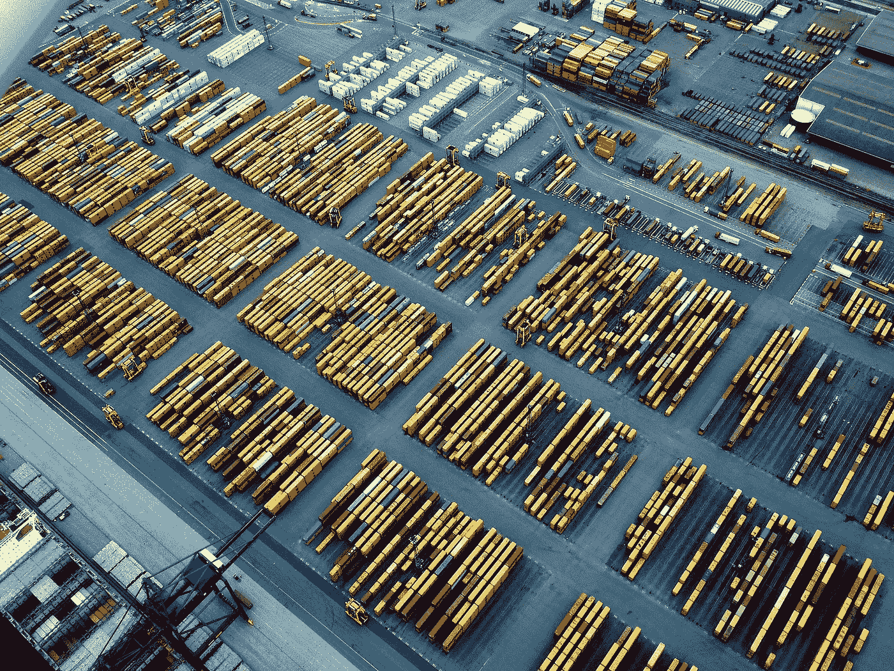

# 供应链和物流中的区块链

> 原文：<https://medium.com/hackernoon/blockchain-in-supply-and-logistics-2a240e69c522>

供应链被低效和问题撕裂。区块链可以有所帮助——首批应用已经在测试中。

随着制造流程的日益全球化和复杂化，供应链也相应变得更加复杂。例如，你在零售商店购买的普通电子产品是在世界各地发生的许多许多不同步骤的结果，原材料被采购、加工并制成组件，这些组件本身被出售和运输，为更复杂的产品提供基本部件。供应链中任何一个环节的失败——或者“供应链树”可能是更恰当的描述——都意味着最终产品成本高昂的延迟。传统系统不擅长管理供应链，但区块链可以提供理想的解决方案。

# 供应链完整性

现在引起公众注意的问题之一是供应链的不透明。处于产业链某一点的公司可能对处于早期阶段的公司知之甚少，也可能不在乎。尽职调查总体上是失败的，因为企业优先考虑以最好的价格获得他们需要的材料或物品，而不管它们是如何创造的。

这体现在一系列广泛的问题上，从假货——包括像药品、运动服和时装这样的高价值物品——到侵犯人权，如童工和使用冲突矿物。所有这些都有非常真实的人力和财务成本，但供应链的性质意味着实体通常与其他阶段绝缘，除非他们直接处理它们(有时甚至没有)。

[区块链](https://steemit.com/cryptocurrency/@wavesplatform/waves-ng-speed-capacity-and-a-bit-of-blockchain-for-dummies)是这些问题的完美解决方案，因为它使得单一的、不变的记录存在:任何人都可以看到的、不可更改的普遍真理。这采取的形式是在每个阶段记录货物的收据和来源，散列文件和在区块链上永久登记。这种解决方案简单而有效，已经在使用中。 [Everledger](https://www.everledger.io/) 为钻石贸易开创了这一先河，最近又有新的举措开始使用区块链来保证金枪鱼和其他商品的原产地，这些商品来自侵犯人权、过度捕捞、欺诈以及非法、未报告和无管制捕捞威胁当地社区环境和福利的地区。

# “牛鞭效应”

在更系统的层面上，供应链运转不良。许多大公司使用“准时制”流程，这种流程依赖于制造商在任何给定时间点都有恰好合适的库存数量——过多或不足都意味着成本高昂的低效。

不幸的是，供应链的孤岛性质意味着它们不能很好地应对供需波动。这被称为弗雷斯特效应或牛鞭效应。需求在某一点的微小变化的影响会随着它在供应链中的传播而被放大，比如一端 5%的增长会变成另一端 40%的增长。如果没有很好地理解价格上涨的原因，也就是说，如果零售商或批发商不了解制造商或原材料供应商，那么价格上涨将会被误解，产生严重的影响。这个经典故事涉及沃尔沃的营销团队，他们注意到绿色汽车不如其他颜色的汽车卖得好。该团队实施了一项成功的营销活动，并转移了多余的库存。然而，制造业不知道具体情况，将数据解读为对绿色汽车需求的有机增长——因此增加了产量。

区块链解决方案同样有助于全面了解整体情况，并对需求变化做出更加快速、可靠和明智的响应。为此，[沃尔玛](http://fortune.com/2017/08/22/walmart-blockchain-ibm-food-nestle-unilever-tyson-dole/)， [IBM](https://www.wsj.com/articles/ibm-pushes-blockchain-into-the-supply-chain-1468528824) 等已经开始研究如何实施这一理念来改善供应链管理。

# 结论

总体而言，区块链技术为供应链管理带来的好处与其他区块链应用程序具有相同的主题:实时、安全、可信的活动记录，所有人都可以看到，并且无法更改。供应链完整性和管理已经成为区块链技术最早的真实使用案例之一。