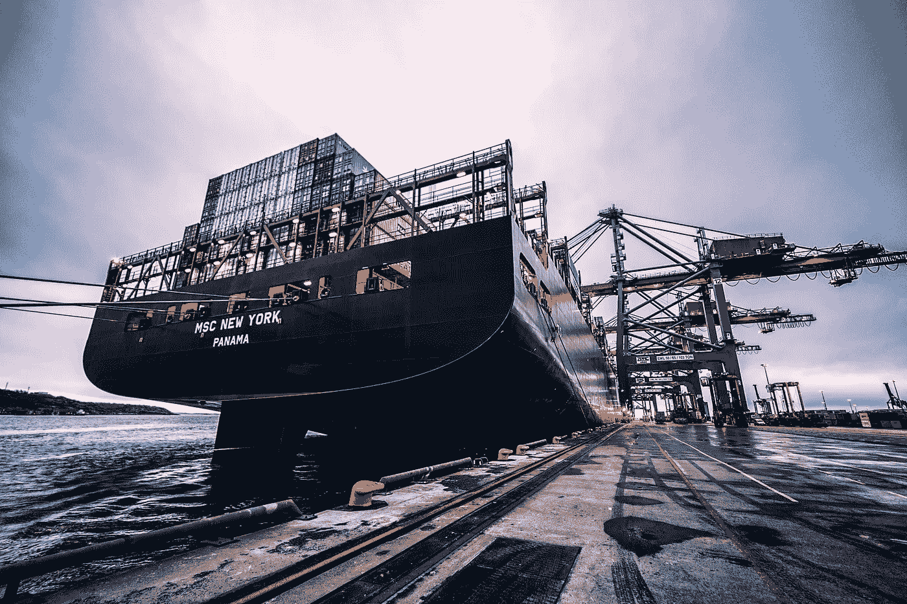

# 供应链中的区块链——每个故事都需要一个英雄

> 原文：<https://medium.com/hackernoon/blockchain-in-supply-chain-every-story-needs-a-hero-ac858ff02ca3>

当一般人想到[供应链](https://www.blockgemini.com/blockchain-in-supply-chain.html)和物流时，他们会想到将产品或服务从点 **A** 推进到点 **B** 的复杂工作流程。当普通人想到[区块链](https://www.blockgemini.com/blockchain-consulting.html)的时候，嗯，除了[比特币或者以太坊](https://www.blockgemini.com/create-an-ico.html)之外，他们真的不知道还能想到什么。任何对这两者有一丁点兴趣的人都会问，“[区块链如何融入这幅图景](https://www.blockgemini.com/why-blockchain.html)，它如何改善供应链？”。在我们开始回答这些问题之前，我们先来看看 **1。**是什么造就了高效的供应链管理，以及 **2。**描述什么是区块链及其资助者。

# 无供应解决方案需要英雄——高效的供应链管理。

## 一切都很重要，这很重要

任何参与供应链管理的人都会告诉你，“监控、管理和改善一切都很重要！而不仅仅是业务运营所需的连续步骤”。这包括材料库存、工具和技术的维护或监控、人才或操作员的委派、书面工作的文档记录和合规性、利益相关方之间的交易、ERP 或 CRM 等平台的利用等。收入损失可以归咎于供应链管理不善，这是有原因的。即使是像不升级办公设备这样简单的事情也会造成昂贵的后果。至少随着时间的推移。

## 以传真机为例

随着技术的新进步，差异的减少归因于用新的方法或工具取代旧的方法或工具。这方面的一个例子是**传真机**。传真机需要纸张消耗、墨盒、人工参与以及“到位”程序或政策作为避免错误的手段，而另一方面, **EDI** 以电子方式以工业标准格式传递信息，传统上通常通过纸张传递/接收。这使得双方能够有效地进行[商业交易](https://www.blockgemini.com/fintech-blockchain.html)(单据)，而无需利用传统资源，例如基于纸张的采购订单或发票。这个故事的寓意是什么？微小的变量很重要。它们很重要，因为这些资源的消耗最终会作为流程的一部分(在这种情况下，是客户端和提供者之间的通信)的另一项支出或成本。作为 EDI 的结果，我们现在能够减少纸张和墨水的消耗，同时加快双方之间的商业合作进程。

虽然 API 可以被认为是一种替代方案，但是 EDI 的概念完美地说明了传统机器(传真)与新技术(EDI)的融合是如何在减少财政资源和时间的同时改善商业交易的授权的。总之，在供应链管理中，任何简化流程同时降低费用的事情都被认为是一个特殊的目标。

# 定义超级英雄的能力——简而言之就是区块链。

## 2018 年最普遍的问题——区块链是什么？

又来了。 [区块链](https://www.blockgemini.com)是一种只添加、分散方式的分布式账本技术，由点对点网络机制运行，通过使用哈希函数追溯引用以前记录的列表来记录和验证数据。 ***慢一点是吧？*** 为了简化成更容易理解的东西，可以把区块链想象成一个数据库(分类帐)中不断增长的记录列表(块),这些记录使用加密技术连接起来，并需要参与者的验证。就像科学有一套协议(科学|数学方法)来验证事实/理论，然后需要其他合格科学家的同行审查批准，区块链也是如此！

## 不仅仅是唱片

虽然不同的区块链有不同的验证方法 ***(通过共识机制)*** ，但区块链的特点要求有比简单输入数据更广泛的用途。[比特币](https://www.blockgemini.com/blockchain-in-banking.html)，区块链的副产品，是展示支付交易便利化最常用的参考点。以太坊是一个被认为是区块链 2.0 的框架，它经常被用来创建[智能合同](https://www.blockgemini.com/smart-contract-development.html) — ***一个高度可编程的数字合同，只要满足设定的条款和条件，它就会自动执行，从而产生交易*。**除了区块链自动化交易和验证我们可以安全定义为有效的信息的能力(无需集中审批)，区块链还能够[将](https://www.blockgemini.com/blockchain-smart-city.html)集成到其他技术和软件中，在我看来，这是其价值的最大卖点。

# 坏人永远不会逃脱——为什么区块链拯救了世界，而不是重新创造了世界。

就像任何超级英雄的故事一样，伤害永远无法完全逆转。尽管英雄化险为夷，但恶棍总是设法造成一些伤害。然而，仅仅因为我们都经历过让我们痛苦的无法控制的事件，并不意味着我们注定要在痛苦中度过余生。同样，[供应链流程](https://www.blockgemini.com/blockchain-in-supply-chain.html)也可能存在漏洞，需要一个解决方案来缓解由许多变量导致的收入损失。企业大多是乐观的，当研究已经完成时，解决方案被大量利用。 [**企业为什么转向区块链？**](/block-gemini/what-enterprises-should-consider-when-hiring-a-blockchain-firm-df2cc7fb732b) 首先，这是一个作为服务平台的交钥匙解决方案。其次，它很容易集成到技术和软件中，是的，这包括旧的和过时的遗留系统。企业无需重新配置整个系统或流程(因此需要停止运营),就可以根据需要缓慢实施向区块链系统的融合。问题是，“区块链在供应链流程中处于什么位置，它如何增强运营？”。答案取决于对两个问题的理解。

1.  **供应链流程目前存在哪些低效之处？**
2.  **区块链的哪些特征可以作为解决这些低效问题的“填空”解决方案？**

## 4 供应链目标及其现有的低效率

为了简化和避免供应链目标的大量概括，我们将从基于产品和客户的供应链系统的角度来说明目标，这通常需要利益相关者如供应商、买方、零售商等之间的合作。这些目标可以应用于具有不同业务关系的其他行业，这些业务关系需要基于服务的流程，但是对于本文来说，我们将关注协作交互，因为它们与大多数企业场景相关。

1.  **共享或管理数据的效率:**资源的库存或运输等资产的管理需要通过协作来提高效率，这通常是供应链系统中各方之间正在进行的委托。在这些方之间有效地共享数据可以使货物在正确的时间到达正确的地点以最小化成本并满足客户需求，或者完全相反***——混乱。*** 如何共享和处理信息对于保持所有运营的效率至关重要。
2.  **优化运输和物流:**解决运输和物流问题是高效供应链管理的一个关键变量。参与货物运输、订购和装运的每个利益相关者都依赖于防止高成本和不良时间的活动的优化。实体之间的自动交易通常有助于清晰的通信。 ***然而，需要一些人工参与来促进这些自动化的交互，以便进行适当的委托。这种方法并非不会出错。***
3.  **质量改进的反馈:**在协同供应链系统中，提高业务交易质量的反馈至关重要。知道在哪里解决问题或缺陷可以让涉众专注于改进，避免重复的挫折。这个问题依赖于可靠的信息，这些信息指出了在这个过程中出现的漏洞或错误。如果没有明确的证据或关键迹象来揭示流程中的哪些地方或哪些部分失败了，不必要的争议可能会一直得不到解决。 ***这是基于这样一个原则，即监控一切对于改善供应链流程中的物流至关重要。***
4.  **建立长期稳定性:**在供应链系统中的利益相关者之间建立信任可以在您的运营中建立稳定性，并加强共同业务计划的协作规划、协调和分配。随着技术的进步、商业模式的改变和沟通方式的进步，优化供应链系统将有助于满足商业目标的共同利益。 ***没有不断的细化，挫折泛滥，利益相关者失去信任，机会因共同的不良经历而丧失。***

## 增强供应链目标的区块链功能

*让我们来看看一些亮点，这些亮点使区块链成为企业解决方案的重要候选人，尤其是在供应链管理方面。*

*   **不可变的&安全的** —因为区块链只是附加的，这意味着记录在分类账上的数据一旦输入就不能被删除、更改或篡改。这防止了无信任方之间未解决的争议，并使数据安全，使其不容易被篡改。
*   **实时跟踪&资产来源** —提高产品可追溯性&来源通过区块链，来自区块链供应链的信息安全、可靠且具有包容性。由 Chain Business Insights 对全球供应链专业人士进行的一项调查(2017 年 5 月发布)发现，43%的人打算在未来一年将区块链/DLT 引入他们的供应链，另有 20%的人打算在未来两年内引入。
*   **分散** —区块链平台分散！这意味着它是自我调节的，不依赖于中央治理点。企业可以依赖无信任的交互，知道在完成各种业务交易之前需要验证。**注:** *有些人不同意区块链完全去中心化，但这不一定是真的，也不重要。一旦参与者加入网络，仍然需要共识机制来验证交易，这仍然是一个完全自我调节的过程，不依赖于中央治理点来批准交易。网络启动者可以定义私有区块链的规则，但是规则(协议)定义验证的过程，这使得交易以分散的方式发生。*
*   **自动化** —由于共识机制是自我管理的，智能合同遵循相同的原则，区块链本身能够自动化供应链流程中发生的交易。
*   与其他技术的轻松集成 —区块链吸引供应链企业系统的另一个显著特征是能够集成到现有技术中。区块链作为与人工智能、大数据、物联网设备等技术的工作对。可以通过自动化和安全存储可检索数据来优化完成流程所需的操作。