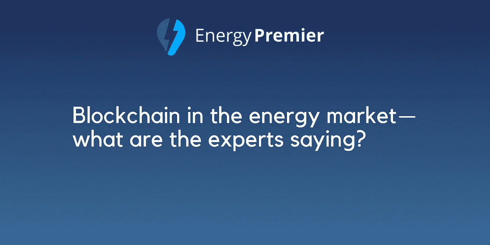

# 能源市场中的区块链——专家怎么说？

> 原文：<https://medium.com/hackernoon/blockchain-in-the-energy-market-what-are-the-experts-saying-86e55f754a2a>

全球领先的数字资产软件平台区块链正在改变能源市场。它是一个数字领导者，使比特币等加密货币能够在不需要政府或银行的情况下扩张。区块链不仅是加密货币的基础，而且现在被认为是点对点交易中最重要的东西。

随着能源市场的增长，我们相信区块链提供了更好的方式来处理这一领域，以及世界各地用户之间的交易。

能源市场的一些专家认为，区块链可以干预能源部门，以便做出改进和改变。我们意识到，能源行业必须通过智能合同提高产能、降低排放，而区块链可以做到这一点。

那么，专家们对此有什么看法呢？

> “我相信，在能源交易中，区块链应用程序可以有效地与其他非区块链解决方案竞争。点对点能源交易刚刚兴起，众所周知难以管理，区块链的解决方案可能会有用。”— **巴黎电信管理学院经济学研究主任米歇尔·伯恩**
> 
> “对所有人来说，最好的结果是一个适合所有人的市场。”— **英国能源公司首席执行官劳伦斯·斯莱德**
> 
> “互联网为通信带来了什么，区块链将为可信交易带来什么，能源和公用事业行业也不例外，”——**IBM 全球战略能源、环境和公用事业副总裁 Stephen Callahan。**
> 
> “从长远来看，点对点能源交易和调度领域的区块链自动化将改变这个行业。使用智能合同，区块链将能够同时清算实物和金融市场，自动调度电网两端的负载、发电和存储。”— **Jon Creyts，** [**落基山研究所**](https://medium.com/u/993dacbe7eb6?source=post_page-----86e55f754a2a--------------------------------) **常务董事，** [**能源网络基金会**](https://medium.com/u/c26b2b6a4a88?source=post_page-----86e55f754a2a--------------------------------) 董事会成员
> 
> “想象一下，你种了很多西红柿，但你不能越过篱笆和邻居交换西葫芦——你必须去超市卖给他们，然后从他们那里购买。这就是现在能源市场的状况——我们希望改变这种状况。”—**[**电力台账**](https://medium.com/u/f83f767f7b7?source=post_page-----86e55f754a2a--------------------------------) 董事总经理大卫·马丁**
> 
> **“所有这些都将节省资金，并可能改变我们生产、储存和消费电力的方式”——**DHL 能源公司总裁史蒂夫·哈利称之为“电力互联网”****
> 
> **“通过第二代和第三代区块链，不仅能够转移价值，而且能够在一定的规则下转移价值——智能合同，使能源行业的扩张不仅成为可能，而且对于能源交易来说也是切实可行的，推动财富向能源的转变发生在未来或现货交付。有了选择的力量，我们可以让世界变得更干净、更美好。”—[Nikolaj Martyniuk](https://medium.com/u/74c927812536?source=post_page-----86e55f754a2a--------------------------------)**WePower 联合创始人兼首席执行官****

**这只是开始。我们将看到区块链如何在未来引起能源市场的变化。关于这个话题有很多积极的观点，所以我们相信区块链可以让能源市场变得更好。**

**这就是为什么 **Energy Premier** 团队也致力于将区块链带入能源市场——为此，我们开发了一个位于区块链的电力零售平台[**https://energypremier.com/en**](https://energypremier.com/en)**。**我们也在为基于令牌的平台[【https://tokensale.energypremier.com/】T21](https://tokensale.energypremier.com/)**推出 ICO，允许在全球范围内通过令牌进行能源交易。****

> ****感谢您的阅读。****
> 
> ****[订阅最大的电力竞价平台](/@energypremier)随时关注我们的更新。也参与我们电报频道的讨论:[https://t.me/joinchat/Hq0j1hDxZ3eRKFNo5f7oTw](https://t.me/joinchat/Hq0j1hDxZ3eRKFNo5f7oTw)****
> 
> ****在这里加入预售和众筹:[https://tokensale.energypremier.com/](https://tokensale.energypremier.com/)****

****你也可以看看其他类似的文章:****

*   ****[从比特币到 ICOs 的旅程](/@EnergyPremier/the-journey-from-bitcoin-to-icos-c37deca6e4db)****
*   ****[2017 年最成功 ICOs】](/@EnergyPremier/the-most-successful-icos-of-2017-93b11307e1b6)****

********