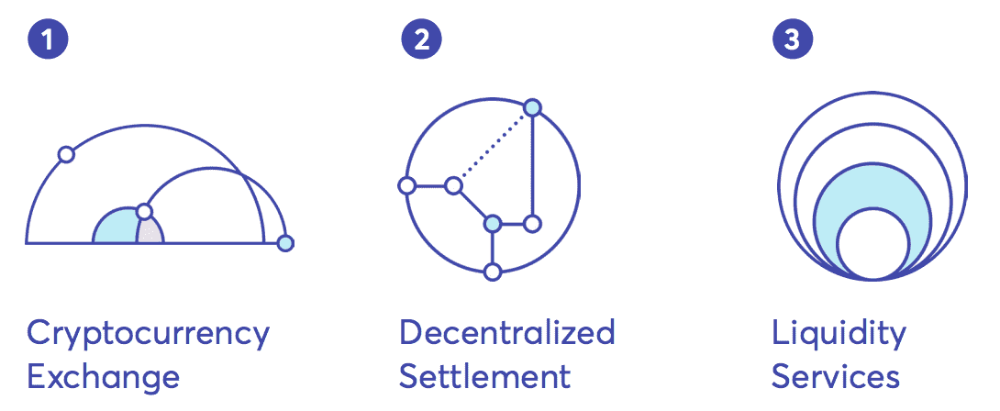
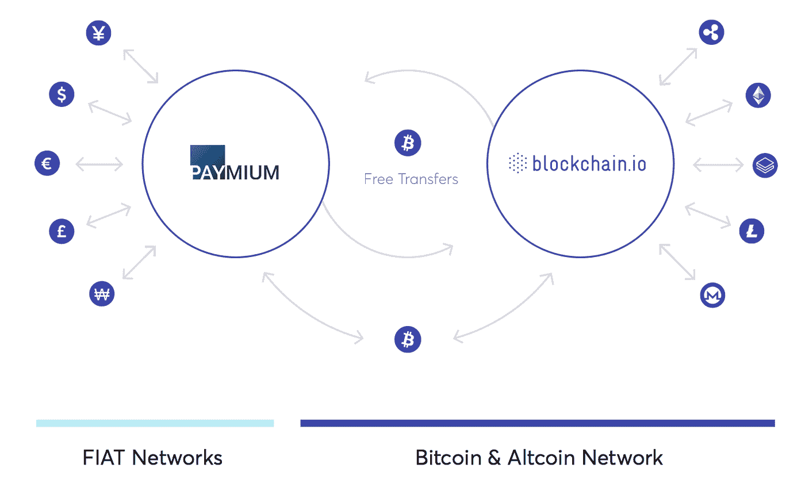
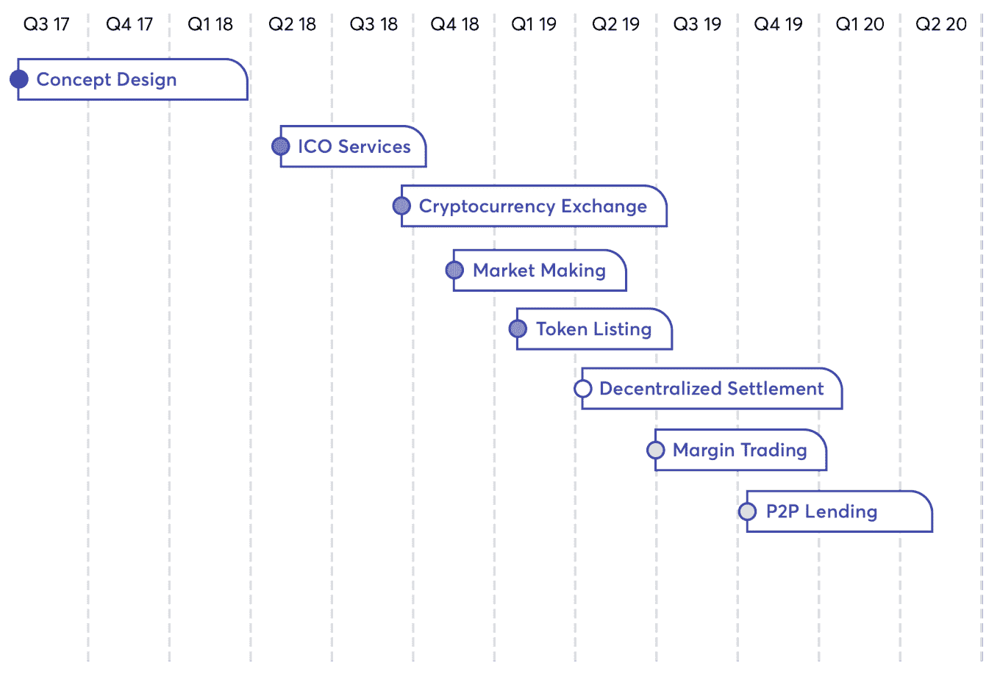
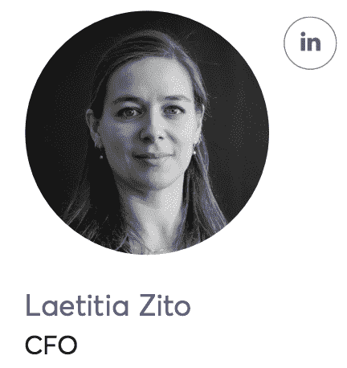
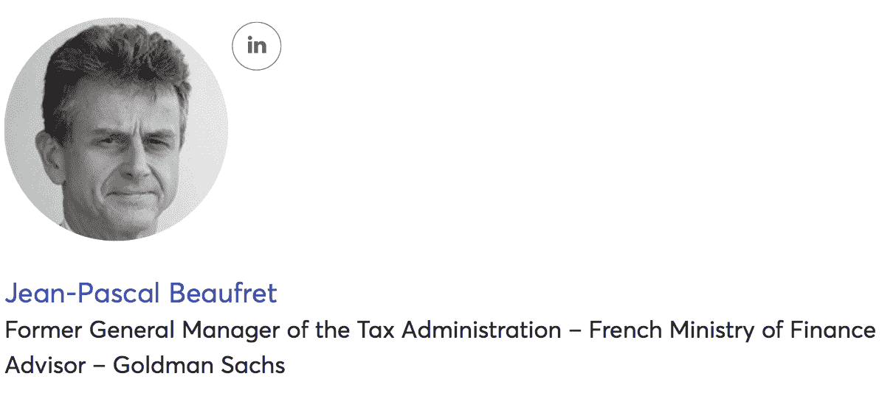
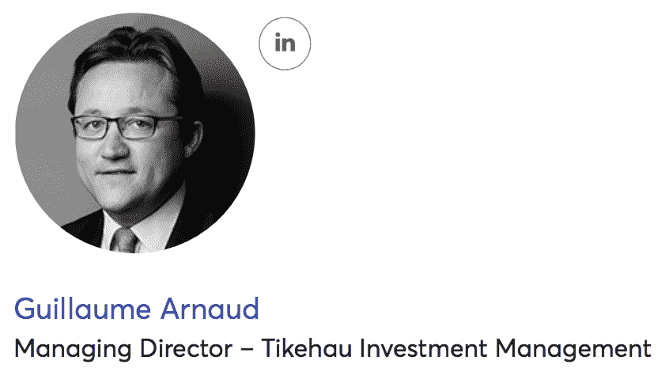

# Blockchain.io 评论:价值互联网的门户

> 原文：<https://medium.com/hackernoon/blockchain-io-review-a-gateway-to-the-internet-of-value-88ef47db0ce6>

比特币的出现让我们可以想象未来会有数千种加密货币存在，每种货币都有独特的用途。在未来，人们将可以自由地无缝交换数字货币，就像今天人们可以通过互联网交换信息一样。

[Blockhain.io](https://blockchain.io/) (BCIO)是下一代加密货币交易所，旨在促进这一过程，利用跨链原子互换、加密协议和支付网络(如 Lightning 和 Raiden)的最新发展，在不同的区块链网络之间建立桥梁。

该公司将举办一场于 10 月 14 日结束的 ICO。他们的目标是筹集 6000 万欧元(6980 万美元)的硬性上限。

BCIO 的加密货币专家团队之前成立了 Paymium(欧元市场的菲亚特/比特币交易所)，旨在利用当今加密货币交易所在监管、可靠性和安全性方面的不足。

**核心功能**

BCIO 提供 3 个核心功能:集中交易、分散结算和流动性服务。

*集中交易所*

BCIO 的中央交易所提供全套功能，包括资产托管服务、订单预订和订单匹配。

对于资产托管，资金被安全地保存在需要多个签名才能访问的冷藏钱包中。交易所使用储备的加密证明，这是它持有的加密资产的数量等于或大于欠客户的数量的证明。

BCIO 还定期进行财务和技术审计，以确保数据库防篡改，硬币库存与债务记录相匹配，并有加密证明。

*分散结算*

BCIO 使用通过“原子互换”实现的分散式“跨链”结算。

原子互换使得来自不同区块链的加密货币的交换不需要集中的中介。这降低了低效率，并为用户提供了更大的灵活性，以真正点对点的方式基于 POW、POS、DAG 和其他协议交换加密货币。

原子互换的工作原理是在交易参与者之间伪造一个哈希时间锁合约(也称为有时间限制的智能合约)。每个参与者必须使用加密哈希函数在指定的时间范围内确认收到资金，否则交易将被取消。

Blockchain.io 利用来自 Lightning network、Tumblebit 和 Rootstock 的 R&D 来提升其原子交换能力并提高可扩展性。

*流动性服务*

BCIO 还根据通过严格尽职调查评估的特定技术和商业模式资质，为代币提供上市服务。公司还可以通过 blockchain.io 策划和执行 ICO 营销活动。

**其他特征**

*放贷*

点对点:

交易员可以从其他用户那里借入资金进行保证金交易。贷方将从贷款中获得利息，而利率是基于需求和供给的。

自营贷款:

BCIO 还将向使用集中订单簿的平台用户/交易商出借加密货币资金。利息将由需求和供给决定。

*合规*

BCIO 雇佣独立审计师来确保平台的完整性。该交易所还符合欧盟法规，包括资产库存、KYC 和反洗钱法规。

**商业模式**

BCIO 通过收取交易费、取款费、电子商务和店内支付交易费、贷款利息、ICO 服务的咨询和交易费以及硬币上市费来创收。

**与付费增值合作**

BCIO 将只作为一个加密货币交易所，但通过与 Paymium 的合作，BCIO 用户将获得一个法定货币网关。

持有法币的投资者(首先是欧元，随后是美元、英镑和日元)将能够使用 Paymium 购买比特币、以太币或 BCIO 代币。这些投资者随后可以成为 BCIO 社区的一部分，并可以在平台之间免费转移硬币/代币。

**路线图**

**团队**

BCIO 的团队由加密货币专家组成，他们在 7 年前创建了 Paymium，这是一个面向服务不足的欧元市场的菲亚特/比特币交易所。

皮埃尔是 Paymium 的首席执行官。他是加密领域公认的专家，在比特币发明之前，他一直致力于将加密技术应用于数字电视服务。他还写了许多书，并在关于比特币和区块链技术的高调会议上发言。Pierre 拥有法国理工学院的理学硕士学位和纽约哥伦比亚大学的 MBA 学位。

Dominique 作为一名技术高超的研究员已经超过 15 年，并且是法国原子能委员会的成员。

他是云计算专家，拥有分布式云计算和安全两项专利。Dominique 毕业于卡尚高等师范学院，并拥有巴黎中央学院的数值模拟和高性能并行计算博士学位。

Pierre 是一名战略规划者，在金融领域拥有咨询和创业经验。Pierre 拥有 EDHEC 商学院的企业融资和金融市场管理硕士学位。

Laetitia 在财务管理和控制方面有 10 年的经验。她在加拿大、美国和法国工作过；是国际商务管理方面的专家。Laetitia 拥有 ESSEC 商学院的财务管理与控制硕士学位。

**顾问**

BCIO 已经招募了一个由经验丰富的企业家和金融专家组成的顾问团队

**优点**

-将集中交换功能与分散结算相结合

-利用原子互换实现来自多个区块链网络的加密货币之间的高效价值交换

-可靠的基础设施:最大限度地减少停机时间，在高容量、高流量或 DDoS 攻击下保持弹性。在添加新的替代硬币或功能之前，进行适当的测试和仔细的软件设计

-法规合规性；与审计人员合作，遵守欧盟法规，包括资产库存、KYC 和反洗钱法规。目前正在与 AMF(相当于 SEC)和其他机构合作，以制定即将出台的加密交换法规。

-贷款和 ICO 咨询服务创造了额外的收入来源，帮助 BCIO 在竞争中脱颖而出

**问题(*由团队解决并更新*)**

*   需要更清楚地说明 BCIO 代币的效用(它们会在其他交易所出售吗？交易者能像币安一样用它们来获得交易费折扣吗？等等)

*(*更新*: BCIO 代币是公用事业硬币。它们旨在促进和激励平台的使用，并提高交易所的流动性。BCIO 代币将放在交易所的钱包里。每个用户将持有一定数量的代币，以便使用某些服务并在交易所上执行操作。代币可以在交易所以几种方式使用:
-费用:用户可以选择以 BCIO 代币或其他加密货币支付任何平台费用。
——打折交易:以 BCIO 代币支付的平台费有折扣。费用会以各种方式打折。有些将取决于用户兑换钱包中持有的 BCIO 代币余额的大小。折扣规模将根据与 BCIO 代币余额规模相关的等级来确定。
-调查参与权:Blockchain.io 意在培育一个充满活力的社区。因此，Blockchain.io 将定期组织关于新功能引入或第三方令牌上市的调查和投票。这些改进建议将提交给 BCIO 令牌持有者群体进行征询。令牌持有者将因此能够为 Blockchain.io 的路线图做出贡献。
-忠诚度&奖励:BCIO 代币将用于激励 Exchange 的使用和奖励外部开发者，以及现有的 Paymium 用户和早期 Blockchain.io 采用者和支持者。*

*   币安、IDEX 和比特币基地等竞争对手正在迅速占领大部分散户投资者市场。BCIO 或许应该为新用户在其平台上交易提供更强有力的激励(交易 X 金额的免费 BCIO 代币，推荐贷款利率折扣等)。
*   6000 万欧元的上限相当高，尤其是考虑到我们目前所处的加密熊市。

*(*更新*: BCIO 有一个强大的用户获取战略，要求硬性规定特别高)。*

*   BCIO 将需要迅速行动，建立一个监管框架，使它们能够在法国全面运营，并向欧洲其它地区扩张。像币安这样的交易所已经在马耳他建立了自己的银行，这给了它们很大的优势来部署符合监管要求的法定到加密的交易所功能。

**结论**

在加密行业中，交换是价值转移的重要组成部分。然而，在保证安全性、合规性、可靠性和效率方面，其中许多都有所欠缺，而所有这些都是确保人们能够有效地驾驭日益复杂的区块链网络所必需的。

BCIO 的目标是通过将集中交易的最重要功能(订单簿、存款/取款、钱包等)与分散的“无信任”跨链结算相结合来解决这些问题。

该公司利用加密领域最新和最先进的技术，包括跨链原子互换、加密协议和支付网络，如 Lightning 和 Raiden。最终结果是一个高度可扩展、安全且经济高效的交易所，能够实现大规模采用。

市场上有超过 1500 种加密货币，来自几十个区块链网络，BCIO 将自己定位为价值互联网的核心。