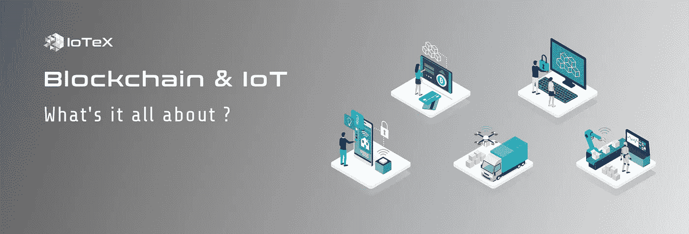
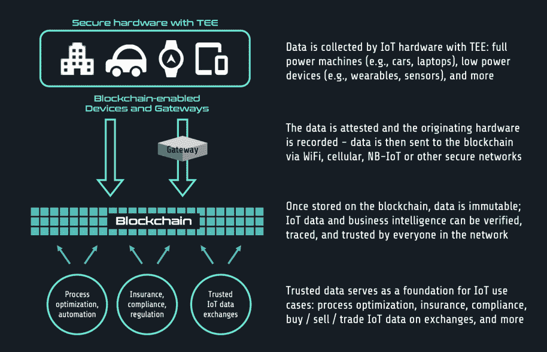
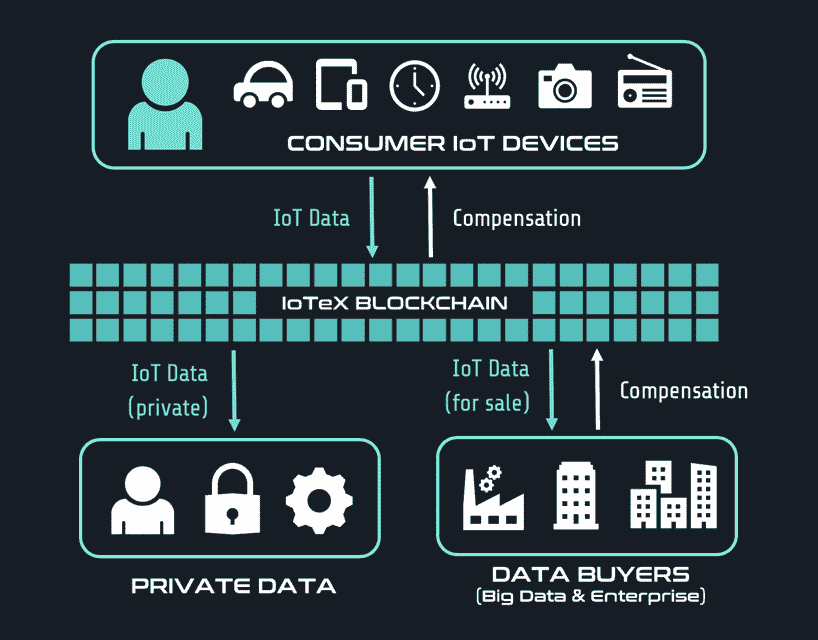
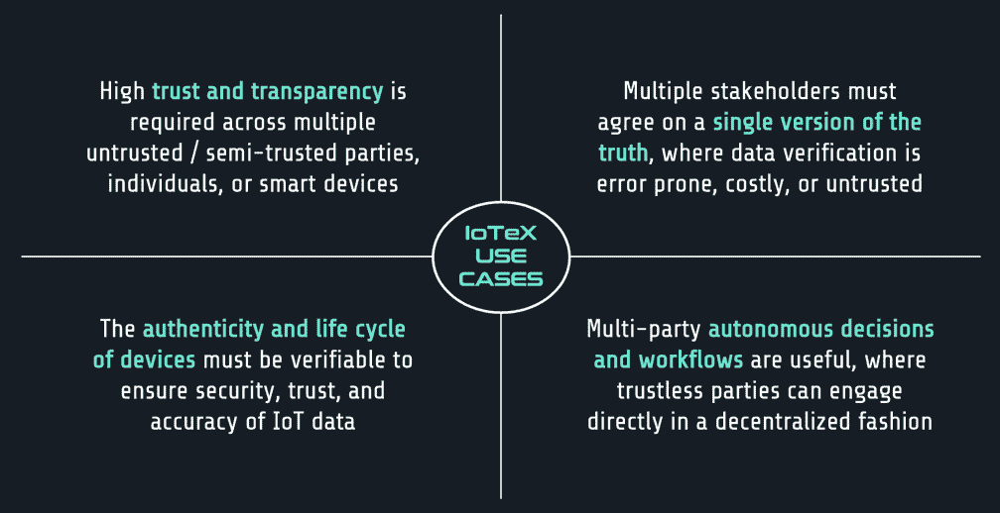

# 区块链&物联网:到底是怎么回事？

> 原文：<https://medium.com/hackernoon/blockchain-iot-whats-it-all-about-f594b3f0da1e>

区块链和物联网(IoT)的交集已经成为区块链最有前景的用例之一。我们经常听说有一天会在区块链上运行的自主机器对机器生态系统，但是在不久的将来我们可以期待什么呢？在过去的几个月里，IoTeX 与我们的战略合作伙伴合作，并进行独立研究，以回答各个行业的这个问题。为了实现短期采用，我们不仅要关注底层区块链技术，还要关注能够推动消费者和企业行为变化的激励结构。我们很高兴在我们新的“区块链和物联网”系列中与您分享我们的观点，从这本关于区块链和物联网的入门书开始。

# ***可信数据***

区块链的基础是分散的信任——真理的永恒源泉。如今，在数据所有者的领域之外，物联网数据不能被完全信任，因为无法验证数据在被发送、出售或被其他方使用之前是否被操纵。例如，自动驾驶汽车创业公司和乘车共享巨头，如优步和 Lyft，没有解决[共享可信地图或乘车数据](https://www.bostonglobe.com/business/2017/03/31/for-sake-safe-self-driving-cars-companies-need-share-data/itF4HUFL6A1HQMSeDaa5zI/story.html)；相反，它们独立收集和存储相似的数据集。我们如何打破这些单一的数据孤岛，实现各方之间的信任？区块链&物联网。

[当今物联网设备中的可信执行环境(TEE)](https://internetofthingsagenda.techtarget.com/blog/IoT-Agenda/Trusted-execution-environments-What-how-and-why) 可以证明数据来自特定设备，并且这些数据一旦存储在区块链上，就不可改变且可追踪。安全物联网设备和区块链的结合引入了一种独特的纯物联网数据源，已知该数据源来自特定的来源且未经操纵。围绕这种可信物联网数据的新商业模式将很快出现——数据可以在其他不受信任的各方之间买卖、共享和使用。消费者和企业的近期用例会有所不同，我们将在下面详细介绍。

# ***消费者用例***

推动消费者采用区块链必须从将数据所有权转移回消费者开始。如今，加密领域的说法是“去中心化和数据隐私将推动消费者采用”。然而，支持隐私的支付 dApps(如 Zcash)并没有吸引大量用户，只有 1%的交易是在完全保密的情况下发送的。消费者为什么不在乎？光是去中心化和隐私还不足以吸引消费者远离传统产品的无缝用户体验。这些好处必须辅之以今天消费者真正关心的东西——对他们的数据的*补偿*。

如果说[“数据是新的黄金”](https://www.economist.com/leaders/2017/05/06/the-worlds-most-valuable-resource-is-no-longer-oil-but-data)，那么物联网设备就是金矿。互联设备(如可穿戴设备、手机、智能家居设备)不断产生数据，是我们物理和数字活动的网关/记录者。尽管消费者拥有这些设备，但潜在的有价值的数据却归设备制造商/科技巨头所有，他们经常[虐待和出售我们的数据](https://lifehacker.com/how-to-protect-yourself-after-facebooks-recent-hack-1829490273)。IoTeX 支持物联网的区块链和精心设计的激励措施相结合，将成为在消费者数据管理方面提供可选性的催化剂，例如是否保留个人数据(如健康、交通/路线)的隐私或将其出售给第三方。让消费者熟悉这个概念是更复杂用例的先决条件。

# ***企业用例***

企业对区块链的采用已经在进行中，尤其是在许可(私有)的区块链。与消费者不同，如今的企业非常关心数据隐私，以保持竞争优势并保护客户的数据。然而，他们也非常重视非专有数据的数据共享，以支持数据分析/模型。适应保护和共享数据这两个相互冲突的目标是许可区块链无法实现的，它迎合了完全信任的各方之间的数据管理。使用来自多个不可信方的可信物联网数据、有选择地向特定方公开专有数据以及保持其他数据完全私有的能力需要像 IoTeX 这样的物联网兼容的公共区块链。

企业最直接的区块链和物联网用例将围绕多方信任和数据共享展开，从而实现各种成本降低和合规/监管用例。例如，使用可信数据来自动化多方工作流并证明[符合规定的规则和法规](https://cryptobriefing.com/blockchain-based-compliance-future/)可能会在明年出现。在企业接受和采用具有象征性经济的公共区块链/dapp 之前，区块链公司必须学会开发解决方案，补充现有的系统/流程，而不是取代现有的系统/流程。我们在下图中概述了非常适合区块链&物联网的用例的四个特征。

# ***不要只告诉我，给我看！***

未来几个月对 IoTeX 来说将是非常令人兴奋的，我们的 Mainnet 预览版将于 2018 年第四季度发布，Mainnet Alpha 版将于 2019 年在 Q1 发布。在区块链研发的同时，我们还投入大量时间和资源进行[概念验证](https://www.bizjournals.com/sanfrancisco/prnewswire/press_releases/California/2018/10/03/UN27537)，以将近期用例融入背景，并为更复杂的用例开发构建模块(例如，机器对机器的交互)。迄今为止，我们已经成功地将几种资源受限的智能设备(如锁、灯、传感器)集成到 IoTeX Testnet，并尝试了各种连接标准(如蜂窝、LoRa、Z-Wave)。敬请关注我们的官方渠道，了解更多 IoTeX 观点，深入了解区块链&物联网用例。

# **关于 IoTeX**

IoTeX 是物联网(IoT)的自动扩展和以隐私为中心的区块链平台。IoTeX 的全球团队由杰出的研究科学家、顶级工程师和经验丰富的生态系统建设者组成。IoTeX 正在开发几项内部创新，以推进区块链 3.0 的前沿，包括用于异构计算的区块链-区块链架构、用于高可扩展性的 Roll-DPoS 共识机制以及轻量级隐私保护技术。IoTeX 通过“一个接一个地连接物理世界”，将自主设备协调带给大众。

与我们保持联系！

> 网址:[https://iotex.io/](https://iotex.io/)
> 推特:[https://twitter.com/iotex_io](https://twitter.com/iotex_io)
> 电报公告频道:[https://t.me/iotexchannel](https://t.me/iotexchannel)
> 电报组:[https://t.me/IoTeXGroup](https://t.me/IoTeXGroup)
> 中:[https://medium.com/@iotex](/@iotex)
> Reddit:[https://www.reddit.com/r/IoTeX/](https://www.reddit.com/r/IoTeX/)
> 加入我们:[https://iotex.io/careers](https://iotex.io/careers)