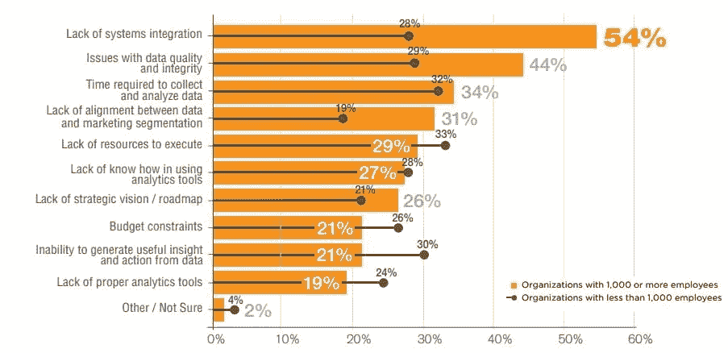

# 区块链正在改善数据格局

> 原文：<https://medium.com/hackernoon/blockchain-is-changing-the-data-landscape-for-the-better-676d13a16e62>

image source: unsplash.com

在当今的数字时代，无论我们是否知道，我们都非常依赖数据，因为许多直接影响我们的决策都是利用数据做出的，从我们的医疗保险计划将包括什么药物，到我们的房子将花费多少钱，以及这之间的一切。

最近，由于物联网、人工智能和机器学习等技术的发展，科学家用来收集、分析和传播数据的系统数据经历了重大中断。

随着技术革命的到来，数据市场出现了[爆炸式增长](https://www.statista.com/statistics/254266/global-big-data-market-forecast/),大数据行业的估计价值目前保持在 420 亿美元，预计到 2027 年将达到 1030 亿美元。国际数据公司[估计](https://www.rdmag.com/article/2018/02/managing-growth-scientific-data)到 2025 年，全球数据量将达到 163 万亿千兆字节。

然而，该行业仍然面临着阻碍其充分发挥潜力的问题，这些问题一旦得到解决，将会导致该领域的进一步发展。

## 数据科学行业的问题是

大多数盈利和非盈利组织缺乏充分利用它们生成的科学数据所需的专门知识和资源，并且这些公司中的大多数不利用其他组织生成的数据，因为它们不知道如何访问和利用这些数据。

根据普华永道和铁山在[的调查，只有 4%的公司能够充分利用他们所拥有的信息。](http://www.ironmountain.com/Knowledge-Center/Reference-Library/View-by-Document-Type/Infographics/I/Information-Value-Index.aspx)

[研究人员](https://files.mtstatic.com/site_3362/31514/0?Expires=1534246358&Signature=EaLTA9Fp3TZJD0-fRE-zc8hloTuJ7wIA1KXUK5bMKwkdekbfawJCW~hBOXXYy6MjJp99wAk5LefTjvUeSLsIpQFm2a9IfYf39TW6xVkv4Zf8plBC4eXQ6p6r3Lz1xFHSBx-JmpA~tHHd-flyMModXmiw51zps7oHJLYUEDpGOYg_&Key-Pair-Id=APKAJ5Y6AV4GI7A555NA)将低使用率归因于几个因素，如高数据整合成本、缺乏基础设施、收集和分析数据所需的时间以及对数据质量的担忧等..

下图显示了阻碍企业将数据转化为有用见解的主要问题。

Source: [Big Data Made Simple](http://bigdata-madesimple.com/96-of-companies-are-failing-when-it-comes-to-marketing-data-insights/)

值得注意的是，这些挑战适用于科学和非科学研究。

## 区块链解决方案

区块链提供了一个去中心化和高度透明的平台，个人研究人员、非营利和营利性组织可以在这里交易科学数据。

首先，区块链提供的透明度确保了只有信誉良好的来源才能共享数据，并且每个人都可以跟踪数据的获取和呈现过程。

其次，消除中间商意味着数据购买者的成本降低，数据销售者的利润最大化。传统上，数据所有者不得不依靠中介在集中式数据市场中出售他们的数据，这不仅成本高，而且对数据的用途也不明确。

第三，研究人员可以利用一个单一的、分散的平台进行数据交易，消除了与传统数据共享方法相关的地理和监管障碍。

区块链的一个名为 [SciDex](https://www.scidex.co/) 的项目是科学数据存储和共享的分散解决方案的一个很好的例子。SciDex 项目利用区块链、人工智能、机器学习和自然语言处理来提供一个平台，数据提供商和研究人员可以在这个平台上交易数据。

因此，如果一家处方药制造商想要为哮喘患者推出一种新药，他们需要进行一项研究，以确定该药物的有效性。为了使研究准确，该公司必须考虑许多变量，如目标地区的天气变化和空气污染。

该公司可以从 SciDex 搜索引擎获取数据，而不是自己进行这些变量的研究，并在研究和员工上花费巨额资金。在那里，他们只需搜索并联系拥有相似数据的列表提供商。如果没有目标领域的相关数据，公司可以在平台上呼吁贡献，这些领域的数据科学家将做出回应。

该平台利用李嘉图自适应智能合约来匹配数据需求和产品，并利用一种称为 SciToken 的加密货币来促进交易。SciToken 可以在平台上重复使用，或者转换成其他密码或法定货币。

对于没有 IT 或法律能力的中小型实体，SciDex 正在开发工具，将它们与其仪表板和索引集成在一起。此外，将有一个工具可以帮助他们与 [COALA IP](https://www.coalaip.org/) 联系，这是一个面向区块链的知识产权许可社区。

同样的情况也适用于对个人或企业数据感兴趣的大学研究人员。研究人员将有机会通过提供数据收集和管理服务来帮助学术领域以外的组织。

尽管 SciDex 解决方案不是唯一一个在区块链实现激励性数据共享的项目，但它是第一个将科学研究和区块链相结合的项目。随着人工智能、机器学习和区块链领域的大数据和前沿技术的发展，更好的事情很有可能会改变数据科学，使其更便宜、更容易获得和更准确，从而为公司和消费者带来更好的决策和更准确的结果。