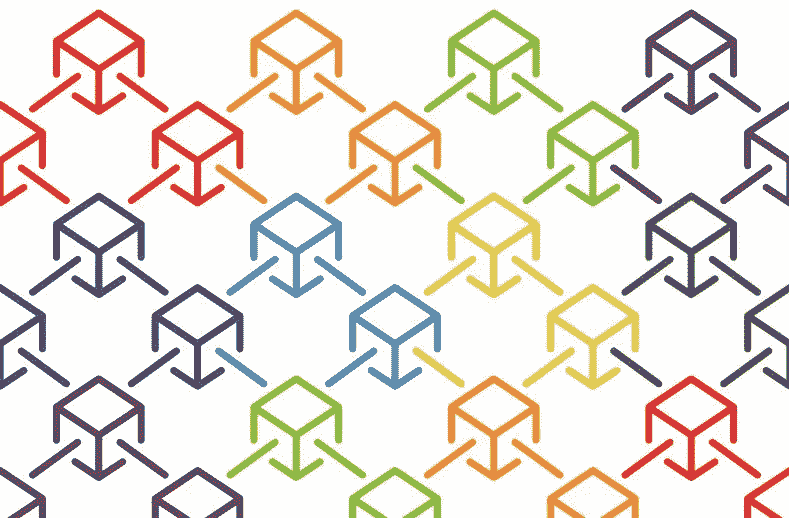
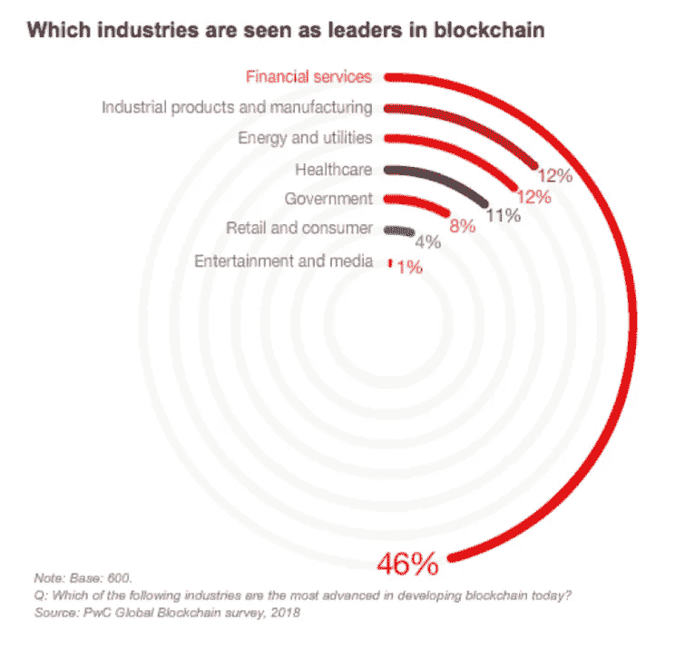
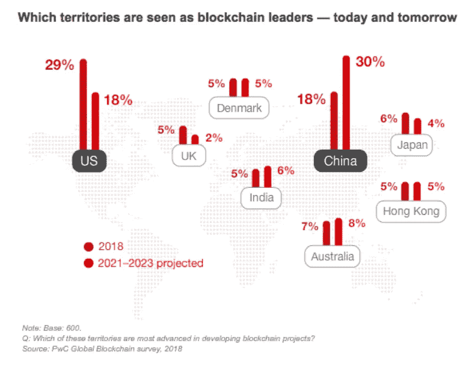

# 区块链无处不在

> 原文：<https://medium.com/hackernoon/blockchain-is-everywhere-46f13be83467>

## 一项新的调查显示，84%的公司正在涉足分布式账本技术和数字令牌。

“每个人都在谈论区块链，没有人想被落下，”根据@PwC 的 2018 年全球区块链调查，包括来自 15 个地区的 600 名高管。而且不仅仅是比特币这样的加密货币。

 [## [概述]执行摘要

### 您的满意体验

explore.pwc.com](http://explore.pwc.com/blockchain/Exec-summary?WT.mc_id=CT11-PL1000-DM2-TR1-LS4-ND30-TTA5-CN_US-GX-xLoSBlockchain-LB-PwCExecSum&eq=CT11-PL1000-DM2-CN_US-GX-xLoSBlockchain-LB-PwCExecSum) 

据普华永道称，生态系统正在巩固:84%的受访者积极参与区块链；45%的人认为信任会推迟采用；30%的人认为中国是正在崛起的区块链领袖；28%的人认为系统的互操作性是成功的关键。

新的调查指出，“很容易看出为什么”。“作为一个分布式的、防篡改的账本，一个设计良好的区块链不仅可以省去中间环节、降低成本、提高速度和覆盖范围。它还为许多业务流程提供了更高的透明度和可追溯性。”

虽然研究和咨询公司 Gartner 预测，到 2030 年，区块链将产生超过 3 万亿美元的年商业价值，但普华永道解释说，“可以想象，到同一年，10%至 20%的全球经济基础设施将运行在区块链的系统上。”

大型科技公司和银行业似乎对区块链非常感兴趣。美国消费者新闻与商业频道强调，包括亚马逊、微软和脸书在内的公司正在探索该技术的用例。例如:脸书在 5 月宣布，它正在进行重组，将包括一个新的区块链努力；IBM、Accenture、Deloitte、JP Morgan 和 HSBC 是其他有类似计划的公司。

普华永道表示:“我们的受访者仍然认为，金融服务是区块链目前和近期的未来领导者，但也看到了工业产品、能源和公用事业以及医疗保健领域的潜力。”。

调查显示，就区块链技术和产品或服务开发的地理领先地位而言，“美国和欧洲的早期重心正在转移”。“我们的调查受访者认为，美国是当今发展区块链最先进的地区，但在三到五年内，领先的将是中国。”

普华永道还确定了一个路线图，以证明区块链在商业和企业方面的优势:

1.  进化，而不是革命:战略清晰将确保你的区块链计划有一个商业目的，你和其他参与者可以围绕这个商业目的进行调整。
2.  朋友还是敌人:区块链可能会要求竞争对手以一种新的方式进行合作，因为他们走到一起解决整个行业的问题。
3.  确定参与规则:每个区块链都需要规则和标准，尤其是关于各种参与者能够访问什么以及他们如何参与的规则和标准。
4.  观察，但不要等待:您需要保持敏捷，以满足未来几年不断发展的法规要求。

事实上，关于监管要求的最后一点似乎是区块链生态系统和进一步采用的最大障碍。近一半的受访者认为，整体监管环境仍不稳定，因为大多数监管机构仍在接受区块链和加密货币。

信任是生态系统的第二大障碍，45%的受访者认为，虽然从设计上来说，区块链可以培养信任，“但在现实中，公司几乎处处都面临信任问题。